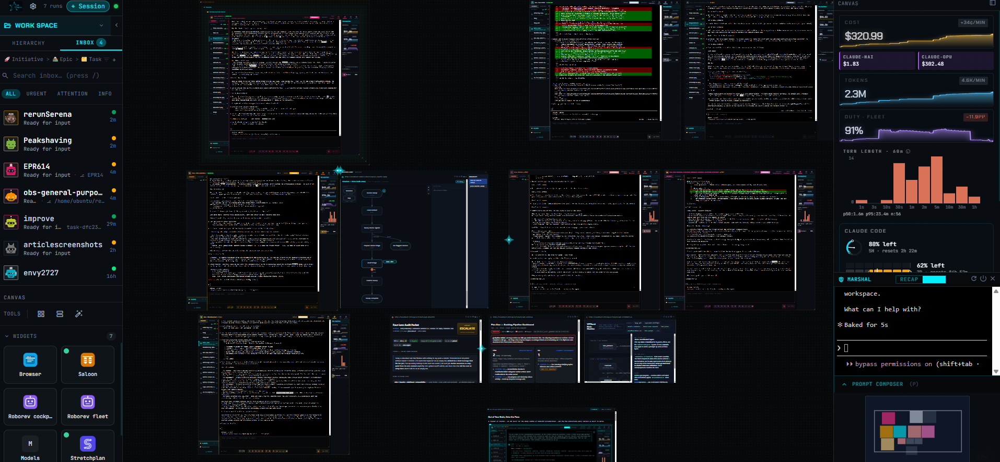

<p align="center">
  
</p>

<h3 align="center">Text is for robots. Pictures are for humans.</h3>

<p align="center">
  Tinstar turns a fleet of AI coding agents — and the endless text they spew — into a canvas you can read at a glance.
</p>

---

IDEs were built for one human typing into one file. But the work has changed: you're not writing code so much as steering a fleet of agents that are — each on a different task, in a different codebase, at a different stage. The bottleneck is no longer compute. It's **you**. Your attention. The finite amount of state you can hold about what every agent is doing, what needs a nudge, what's done and waiting, what quietly died an hour ago.

Tinstar is built for that reality. Everything in it follows from two convictions:

- **Text is for robots, pictures are for humans.** An agent reads and writes text natively — that's its whole world. A human does not; a human reconstructs meaning from a wall of scrollback, line by line, every time. So Tinstar lets the agent keep operating in text and translates that text into structured visual surfaces for you. Same underlying state, two audiences, two representations: the agent gets its stream, you get a status light, a diff, a meter, a badge.
- **Get it out of your brain and onto the pane (of glass).** When you run a fleet, every fact you have to keep in your head is a tax you pay on every glance. So the rule is relentless: anything you'd otherwise have to remember should be visible on screen instead.



The goal is **doneness at a glance** — look at the canvas and immediately know the shape of the work: what's burning, what's waiting, what's done. No context-switching tax. No mental inventory. Just the work, laid out in space.

> For the long-form flyover of the ideas and features below, read the essay: [*Out of Your Brain, Onto the Pane*](docs/essays/out-of-your-brain-onto-the-pane.md).

## Quick Start

### Install with an agent

Paste this into Claude Code:

> Install and launch Tinstar for me. Run `npx tinstar` and fix any missing dependencies it reports until it starts successfully.

### Manual install

```bash
npx tinstar
```

The CLI checks for dependencies (Claude Code, tmux, ttyd), offers to register your current directory as a project, and starts the server. Open **http://localhost:5273** — that's the only port you need. See [Prerequisites](#prerequisites) if the dependency check flags anything.

## The Canvas

Everything in Tinstar lives in space. The canvas is an infinite, Figma-style surface — pan, zoom, and arrange freely; it fills the full height of your screen.

- **Spatial arrangement is meaningful.** Cluster sessions by project, by urgency, by phase. Where a thing sits *is* information.
- **Multi-selection** — marquee select, Ctrl+click, then grid-arrange or swim-lane layout in one shot. Arrange modes are one-shot rearranges; widgets stay free to drag afterward.
- **Spaces** — isolate work into separate canvases, each with its own terminology and layout.
- **It remembers.** Your arrangement persists, so the canvas is a stable map you build intuition around.

## The run workspace

A *run* — one agent doing one task — gets a single card on the canvas, carrying its identity color and a status light you can read from across the room, so a blocked agent and a busy one no longer look identical. Inside, a three-panel workspace:

- **Changed files** — a live diff panel with +/- counters and a file tree: the work the agent is doing, as it does it. Hide viewed-only files to cut clutter.
- **Terminal / recap** — the center toggles between a distilled recap and the raw ttyd scrollback (honesty preserved, not hidden — one click away). Every session is a real Claude Code or Codex terminal on the canvas, with crisp sub-pixel rendering, not a headless process behind a tab.
- **Telemetry** — cost, tokens, and cache-hit sparklines, plus a **context-fullness meter**: a treemap of how the agent's context window is allocated (messages, system prompt, tools, memory, skills) that goes amber at 75% and red at 85%. "How close is this agent to running out of room to think?" used to live in your head, or nowhere until it bit you. Now it's a colored bar.

Run Claude Code and Codex side by side; define reusable launch configs for any agent CLI with **CLI Templates**, surfaced through a unified agent dropdown. Real-time SSE status (`running`, `idle`, `needs_attention`) tells you which agents need you. Full lifecycle — create, stop, resume, delete tmux-backed sessions; `tinstar doctor` validates dependencies. Fire off a prompt, see the state change, move on — switching between ten sessions costs no context, because the context is on the screen.

## Organize Your Work

By default, work nests as **Initiative → Epic → Task → Run**. The left sidebar shows that nesting as a live tree, always in sync with the canvas — click a card and its ancestors expand and highlight; double-click and the canvas flies to it. This is flexible — rename the three upper tiers per space (e.g. Project / Feature / Story) in the **Entity Labels** tab of Space Settings.

The hierarchy isn't bureaucracy — it's the backbone that keeps a growing fleet legible:

- **The canvas and sidebar stay navigable.** You move by structure instead of hunting through a flat list of twenty sessions.
- **Agents inherit context.** A session created under a task belongs to that task; multi-agent NATS channels are scoped along the same hierarchy (`tinstar.<space>.<init>.<epic>.<task>.<agent>`), so agents can talk to siblings and ancestors automatically.
- **"Doneness at a glance" scales.** Containers group related work, so you read progress at the level of an epic, not one session at a time.

Beyond the default tiers: nest sessions into recursive **group** containers, attach an **external URL** to any entity, and use **Quick Draw** hotgroups (assign with Ctrl+1–9, jump with 1–9) to bounce around the canvas at speed. Toggle empty containers off with `H` to cut clutter.

## The inbox

The same sidebar flips from the hierarchy tree to an **inbox**: a flat, triaged list of every session in the space, sorted so the ones needing you float to the top. Each row is an avatar, a name, a breadcrumb back up the hierarchy, a color-coded status dot, and how long ago it last moved. Filter by urgency, hide what you've read, click a row to fly the canvas to it. Instead of scanning four walls of output to reconstruct *where was I*, you read a list that already did the reconstruction for you.

## The saloon

Agents talk to each other over NATS pub/sub, and the **Saloon** widget puts that conversation on screen. Snap it to a session to watch that session's subscribed subjects and live inbound/outbound traffic; leave it floating for the whole `tinstar.>` firehose. Each row is a timestamped from/subject/payload you can click open.

This is where orchestration stops being a black box. When a coordinator fans work out to a team of agents and they report back, that chatter is normally invisible — you infer it from results. The Saloon makes the message-passing *legible*: you watch which agent pinged which, and catch a stalled handoff in the traffic instead of in the silence afterward.

## Everything Is a Plugin

The widgets that make Tinstar an IDE — the browser, the editor, the image viewer, the file tree — are **plugins**. The same public API that ships the built-ins is the API third parties build against. You can disable any built-in from **Settings → Plugins**.

What the plugin system already gives you out of the box:

- **Browser widget** — embed live browser views on the canvas, with a header-injection proxy (inject auth headers, cookies, or custom headers — no extension needed) and a built-in dev console that captures logs without opening DevTools.
- **File editor widget** — drag files onto the canvas to view and edit; double-click to zoom full-screen; `E`/`W` hotkeys.
- **Image viewer widget** — live-updating image display that watches files on disk via SSE and refreshes the instant the agent regenerates them.
- **File tree explorer** — track touched files with live git-diff; hide viewed-only files.

Because the API has no second-class tier, *any* domain can become a native, snappable surface on the canvas. Two sibling-project plugins show the range: **Stretchplan**, a Gantt-style roadmap you drag task bars across — dock a run beside it, point at a task, and tell the agent to start working on it, turning the plan into a control surface; and **Whoachart**, a declarative flow-chart engine for loop engineering, where concurrent units of work flow as "marbles" through a graph of states, sessions linked to the nodes they're working.

### Build your own

Plugins live in your own repo and build against [`@tinstar/plugin-api`](https://www.npmjs.com/package/@tinstar/plugin-api). The host externalizes React and the API at runtime via an importmap, so your bundle stays slim. Load external plugins by listing them in `~/.config/tinstar/plugins.json`.

- **External plugin** — step-by-step in [`docs/plugins/external-quickstart.md`](docs/plugins/external-quickstart.md).
- **Bundled plugin** (inside this repo) — [`docs/plugins/bundled-howto.md`](docs/plugins/bundled-howto.md).
- Full reference and author guides live in [`docs/plugins/`](docs/plugins/).

Any plugin that fails to load surfaces as a top-right banner with the error — so you always know what broke without digging through DevTools.

## Constellations

Snap 2–9 widgets together and they move as one, sharing a numbered slot you jump to with a digit key. Drag a file viewer near a session, a snap-halo appears; drop it and they're bound, with a slot badge to prove it. Alt-drag pops one back out.

Snapping is more than tidy arrangement — it's a **capability bus**. Constellated widgets discover and invoke each other's capabilities without knowing about each other: a task-picker publishes a selection, a detail pane consumes it, all because they're in the same slot. And the gesture language isn't only for you — an agent can spawn a widget and ask for it snapped beside the session that created it. The spatial layout becomes a shared coordinate system for human and agent alike.

## Telemetry & Cost HUD

Tinstar ships with an embedded Prometheus + Alloy stack that's managed for you. On first launch the binaries are downloaded to `~/.config/tinstar/bin/` and run as supervised subprocesses. A live HUD in the upper-right of the canvas shows today's cost, tokens, cache hit rate, and agent-autonomy ratio — press `T` to toggle.

Disable with `TINSTAR_TELEMETRY=0`. For the full Grafana power-user experience: `npm run dev:observability`.

## Prerequisites

- **Node.js 20+** — runtime
- **Claude Code** — installed and authenticated (`claude auth login`)
- **tmux** — session multiplexing (`brew install tmux` / `apt install tmux`)
- **ttyd** — web terminal (`brew install ttyd` / [download binary](https://github.com/tsl0922/ttyd/releases))
- **expect** — auto-accept prompts for multi-agent NATS sessions (`brew install expect` / `apt install expect`)

## Ports

| Port | Service |
|------|---------|
| 5273 | Tinstar (UI + API + session proxy) — **the only port you need** |
| 8681+ | ttyd instances (dynamic, proxied through 5273) |

## Session Status

| Status | Meaning |
|--------|---------|
| `creating` | Session being initialized |
| `running` | Claude actively executing |
| `idle` | Waiting for user input |
| `needs_attention` | No activity for 2+ minutes |
| `stopped` | User stopped the session |
| `terminated` | Process crashed or disappeared |

## Environment Variables

| Variable | Default | Purpose |
|----------|---------|---------|
| `TINSTAR_FAST_SIM` | unset | Set to `1` to auto-start mock data simulator |
| `TINSTAR_NO_SESSIONS` | unset | Set to `1` to skip session management (CI) |
| `TINSTAR_TELEMETRY` | unset | Set to `0` to disable the embedded Prometheus + Alloy stack |

## License

Released under the [MIT License](LICENSE).
