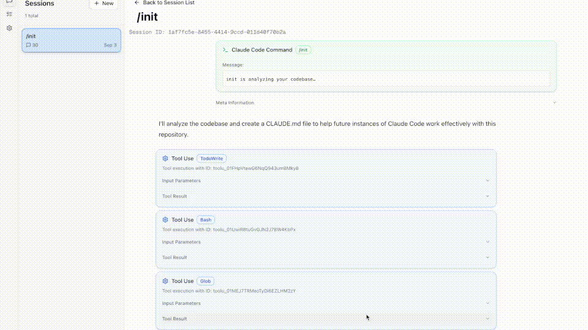

# Tinstar

A full-featured web-based Claude Code client that provides complete interactive functionality for managing Claude Code projects. Start new conversations, resume existing sessions, monitor running tasks in real-time, and browse your conversation history - all through a modern web interface.



## Overview

Tinstar has evolved from a simple conversation viewer into a comprehensive web-based Claude Code client. It provides all essential Claude Code functionality through an intuitive web interface, including creating new sessions, resuming conversations, real-time task management, and live synchronization with your local Claude Code projects.

The application leverages Server-Sent Events (SSE) for real-time bidirectional communication, automatically syncing with JSONL conversation files in `~/.claude/projects/` and providing instant updates as conversations progress.

## Features

### Interactive Claude Code Client

- **New Chat Creation** - Start new Claude sessions directly from the web interface
- **Session Resumption** - Continue paused Claude conversations with full context
- **Real-time Task Management** - Monitor, control, and abort running Claude tasks
- **Command Autocompletion** - Smart completion for both global and project-specific Claude commands
- **Live Status Indicators** - Visual feedback for running, paused, and completed tasks
- **Git Worktree Integration** - Create isolated development environments for each conversation

### Real-time Synchronization

- **Server-Sent Events (SSE)** - Instant bidirectional communication and updates
- **File System Monitoring** - Automatic detection of conversation file changes
- **Live Task Updates** - Real-time progress tracking for active Claude sessions
- **Auto-refresh UI** - Instant updates when conversations are modified externally

### Advanced Conversation Management

- **Project Browser** - View all Claude Code projects with metadata and session counts
- **Smart Session Filtering** - Hide empty sessions, unify duplicates, filter by status
- **Multi-tab Interface** - Sessions, Tasks, and Settings in an organized sidebar
- **Conversation Display** - Human-readable format with syntax highlighting and tool usage
- **Command Detection** - Enhanced display of XML-like command structures
- **Task Controller** - Full lifecycle management of Claude processes
- **Auto-scroll Behavior** - Intelligent scrolling that follows active conversations
- **Session Age Filtering** - Toggle to show/hide sessions older than 24 hours
- **Collapsible Responses** - Collapsed view showing only diffs and final messages

## Installation

Clone and run locally:

```bash
cd tinstar
pnpm i
pnpm build
pnpm start
```
or `pnpm dev`

## Data Source

The application reads Claude Code conversation files from:

- **Location**: `~/.claude/projects/<project>/<session-id>.jsonl`
- **Format**: JSONL files containing conversation entries
- **Auto-detection**: Automatically discovers new projects and sessions

## Usage Guide

### 1. Project List

- Browse all Claude Code projects
- View project metadata (name, path, session count, last modified)
- Click any project to view its sessions

### 2. Session Browser  

- View all conversation sessions within a project
- Filter to hide empty sessions
- Sessions show message counts and timestamps
- Click to view detailed conversation

### 3. Conversation Viewer

- Full conversation history with proper formatting
- Syntax highlighting for code blocks
- Tool usage and results clearly displayed
- Navigation sidebar for jumping between sessions
- Support for different message types (user, assistant, system, tools)
- Worktree badges to identify isolated development environments

### 4. Git Worktree Feature

The worktree feature allows you to create isolated development environments for each conversation, preventing conflicts between different Claude Code sessions working on the same project.

#### How It Works

- **Isolated Environments**: Each worktree creates a separate working directory with its own branch
- **Branch Management**: Automatically creates new branches named `worktree/{uuid}` based on your current branch
- **Visual Indicators**: Sessions running in worktrees display a 🌱 badge for easy identification
- **Automatic Cleanup**: Worktrees are stored in `~/.tinstar/worktrees/` with organized project structure

#### Using Worktrees

1. **Creating a New Worktree Session**:
   - When starting a new chat, check the "🌱 Start in new worktree" option
   - The system will create a new git worktree and branch automatically
   - Your conversation will run in the isolated environment

2. **Worktree Directory Structure**:
   ```
   ~/.tinstar/worktrees/
   └── {project-name}/
       └── {uuid}/  # Each worktree gets a unique directory
   ```

3. **Benefits**:
   - **No Conflicts**: Multiple conversations can modify the same files without interference
   - **Clean Isolation**: Each session has its own git state and working directory
   - **Easy Identification**: Worktree sessions are clearly marked in the UI
   - **Branch Tracking**: Each worktree has its own branch for version control

#### Requirements

- Your project must be a git repository
- Git worktree support (available in Git 2.5+)
- Write permissions in your home directory for worktree storage

## Configuration

### Port Configuration

Set a custom port using the `PORT` environment variable:

```bash
PORT=8080 pnpm dev
```

### Data Directory

The application automatically detects the standard Claude Code directory at `~/.claude/projects/`. No additional configuration is required.


## Contributing

This is a fork of a cool project.  You should contribute to the original. https://github.com/d-kimuson/claude-code-viewer
