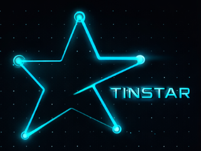
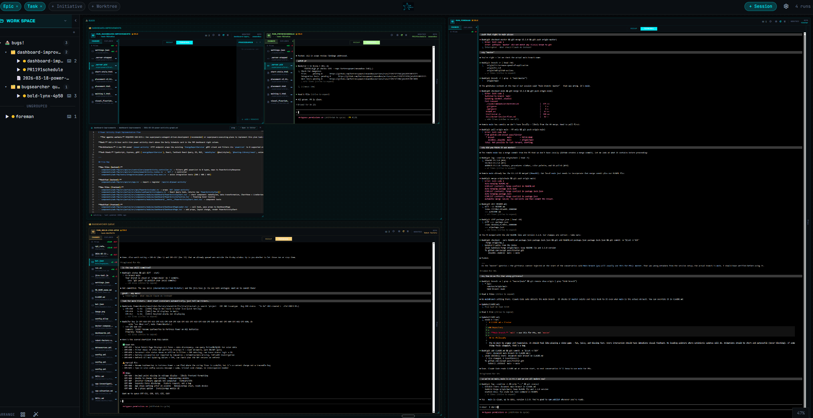

<p align="center">
  
</p>

<h3 align="center">Canvas workspace for managing Claude Code sessions</h3>

<p align="center">
  Sessions appear as interactive widgets on an infinite canvas with live embedded terminals.
</p>

---

## Why

Working with a single AI agent is easy. Working with ten is a different problem entirely.

When you're running multiple Claude Code sessions at once — each on a different task, in a different codebase, at a different stage of completion — the bottleneck isn't compute. It's **you**. Specifically, your attention. Your mental energy. The finite amount of state you can hold in your head about what every agent is doing, what needs a nudge, what's done and waiting for review, what quietly died an hour ago.

The usual tools make this worse. Terminals are headless. Tabs blur together. You find yourself tabbing through sessions, mentally reconstructing context you've already lost.  Tinstar gets that context:

**Out of your brain and on to the pane (of glass)!**

Tinstar puts every session on a spatial canvas — a live memory palace where each agent has a place, a face, and a status. You can see what's running, what's idle, what needs your eyes. Arrangement is meaningful: you can cluster sessions by project, by urgency, by phase. The canvas remembers so you don't have to.



The goal is **doneness at a glance** — you should be able to look at the canvas and immediately know the shape of the work: what's burning, what's waiting, what's done. No context-switching tax. No mental inventory. Just the work, laid out in space.

Attention is the limiting resource. Tinstar is built around that fact.  Easily switch between sessions, color code them, see where they are and what they're doing, fire off a new prompt, and move on.

---

## Quick Start

### Install with an agent

Paste this into Claude Code:

> Install and launch Tinstar for me. Run `npx tinstar` and fix any missing dependencies it reports until it starts successfully.

### Manual install

```bash
npx tinstar
```

The CLI checks for dependencies (Claude Code, tmux, ttyd), offers to register your current directory as a project, and starts the server.

## Features

### Canvas & Navigation
- **Infinite canvas** — Figma-style pan, zoom, and spatial arrangement; canvas now fills full screen height
- **Multi-selection** — Marquee select, Ctrl+click, grid arrange, swim lane layout
- **Spaces** — Organize sessions into isolated workspaces with custom entity label names per space
- **Show/hide empty containers** — Toggle empty entity containers on/off (H hotkey) to reduce visual clutter
- **Drag-and-drop** — Reorder in sidebar, move on canvas, multi-drag

### Sessions & Agents
- **Live terminals** — Embedded ttyd sessions with real-time status updates and crisp sub-pixel rendering
- **CLI Templates** — Define reusable launch configs for any agent backend; unified agent dropdown across tmux, Docker, and custom profiles
- **Multi-agent support** — Run Claude Code and Codex sessions side-by-side; Codex transcript adapter handles discovery, status, and recap parsing
- **Configurable agent icons** — Set per-agent icons on run nodes in the hierarchy sidebar
- **Session lifecycle** — Create, stop, resume, delete sessions with tmux or Docker backends
- **Real-time state** — SSE-powered status updates (running, idle, needs attention)
- **`tinstar doctor`** — Health check command that validates all dependencies and reports actionable errors

### Widgets
- **Browser widget** — Embed live browser views directly on the canvas, with a header injection proxy (inject auth headers, cookies, or custom headers — no browser extension needed) and a built-in dev console panel to capture logs without opening DevTools
- **File editor widget** — Drag files onto the canvas to view and edit; double-click to zoom full-screen; E/W hotkey bindings
- **Image viewer widget** — Live-updating image display on canvas; watches files via SSE and refreshes automatically
- **File tree explorer** — Track touched files with live git-diff; toggle to hide viewed-only files

### Hierarchy & Hotkeys
- **Entity Labels** — Rename Initiative / Epic / Task to any terminology per space (e.g. Project / Feature / Story); configured in the Entity Labels tab of Space Settings
- **Grouping** — Nest sessions into recursive group containers; double-click to expand/collapse in sidebar
- **External URL** — Attach a link to any entity (initiative, epic, task); opens in a new tab from the settings dialog
- **Quick Draw** — Hotgroup badges on all work widgets; assign sessions to groups with Ctrl+1–9, jump with 1–9, remove with Ctrl+Shift+1–9
- **Keyboard shortcuts** — H: toggle empty containers, E: open entity settings, +: create child entity (settings auto-opens), plus full hotkey reference in the sidebar

### Commands
- **`/ship`** — Release workflow command
- **`/tinstar-conventions`** — Project conventions reference

## Telemetry

Tinstar ships with an embedded Prometheus + Alloy stack that's managed for you. On first launch, the binaries are downloaded to `~/.config/tinstar/bin/` and run as supervised subprocesses. A live HUD appears in the upper-right of the canvas showing today's cost, tokens, cache hit rate, and agent-autonomy ratio. Press `T` to toggle.

Disable with `TINSTAR_TELEMETRY=0`. For the full Grafana power-user experience: `npm run dev:observability`.

## Prerequisites

- **Node.js 20+** — runtime
- **Claude Code** — installed and authenticated (`claude auth login`)
- **tmux** — session multiplexing (`brew install tmux` / `apt install tmux`)
- **ttyd** — web terminal (`brew install ttyd` / [download binary](https://github.com/tsl0922/ttyd/releases))
- **expect** — auto-accept prompts for multi-agent NATS sessions (`brew install expect` / `apt install expect`)
- **Docker** (optional) — for isolated container sessions

## Ports

| Port | Service |
|------|---------|
| 5273 | Tinstar (UI + API + session proxy) — **the only port you need** |
| 8681+ | ttyd instances (dynamic, proxied through 5273) |

## Session Status

| Status | Meaning |
|--------|---------|
| `creating` | Session being initialized |
| `running` | Claude actively executing |
| `idle` | Waiting for user input |
| `needs_attention` | No activity for 2+ minutes |
| `stopped` | User stopped the session |
| `terminated` | Process crashed or disappeared |

## Environment Variables

| Variable | Default | Purpose |
|----------|---------|---------|
| `TINSTAR_FAST_SIM` | unset | Set to `1` to auto-start mock data simulator |
| `TINSTAR_NO_SESSIONS` | unset | Set to `1` to skip session management (CI) |
| `TINSTAR_TELEMETRY` | unset | Set to `0` to disable the embedded Prometheus + Alloy stack |

## Development

For contributors working on Tinstar itself:

```bash
git clone <repo> && cd tinstar
npm install
npm run dev          # Vite HMR + backend (hot-reload)
npx tsc --noEmit     # Type check
npx playwright test  # E2E tests (isolated server started automatically)
```

## License

MIT
