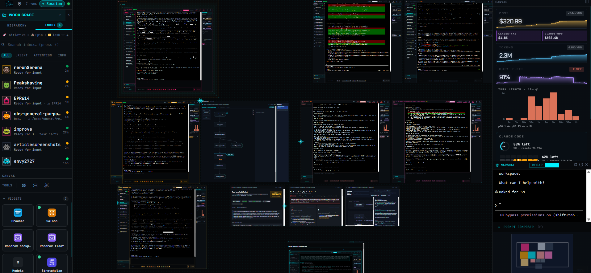

<p align="center">
  
</p>

<h3 align="center">Text is for robots. Pictures are for humans.</h3>

<p align="center">
  Tinstar turns a fleet of AI coding agents — and the endless text they spew — into a canvas you can read at a glance.
</p>

---

IDEs were built for one human typing into one file. But the work has changed: you're not writing code so much as steering a fleet of agents that are — each on a different task, in a different codebase, at a different stage. The bottleneck is no longer compute. It's **you**. Your attention. The finite amount of state you can hold about what every agent is doing, what needs a nudge, what's done and waiting, what quietly died an hour ago.

Tinstar is built for that reality. Everything in it follows from two convictions:

- **Text is for robots, pictures are for humans.** An agent reads and writes text natively — that's its whole world. A human does not; a human reconstructs meaning from a wall of scrollback, line by line, every time. So Tinstar lets the agent keep operating in text and translates that text into structured visual surfaces for you. Same underlying state, two audiences, two representations: the agent gets its stream, you get a status light, a diff, a meter, a badge.
- **Get it out of your brain and onto the pane (of glass).** When you run a fleet, every fact you have to keep in your head is a tax you pay on every glance. So the rule is relentless: anything you'd otherwise have to remember should be visible on screen instead.



The goal is **doneness at a glance** — look at the canvas and immediately know the shape of the work: what's burning, what's waiting, what's done. No context-switching tax. No mental inventory. Just the work, laid out in space.

> For the long-form flyover of the ideas and features below, read the essay: [*Out of Your Brain, Onto the Pane*](docs/essays/out-of-your-brain-onto-the-pane.md).

## Quick Start

### Install with an agent

Paste this into Claude Code:

> Install and launch Tinstar for me. Run `npx tinstar` and fix any missing dependencies it reports until it starts successfully. Say yes when it offers to install the Claude statusline hook. Then run `npx tinstar doctor` and fix anything it flags.

### Manual install

```bash
npx tinstar
```

The CLI **offers to install the Claude Code statusline hook** (say yes — see below) and starts the server. Open **http://localhost:5273** — that's the only port you need. See [Prerequisites](#prerequisites) if the dependency check flags anything.

Verify the install any time with `npx tinstar doctor`, which checks tmux, ttyd, python3 and each configured First Mate home.

### The statusline hook

Claude Code reports its context-window utilization exactly one way: it pipes its session state to whatever command you register under `statusLine`. Tinstar ships a shim that forwards that to the server, and **it is what makes the per-session context meter and the Claude provider quota in the cockpit rail work.** Without it the context meter reads `--` forever and the Claude quota shows "unavailable · no statusline reading".

`npx tinstar` offers to install it during onboarding. To do it yourself, or on a machine that already onboarded:

```bash
npx tinstar install-statusline            # ~/.claude/settings.json
npx tinstar install-statusline --force    # replace an existing statusLine (backed up)
npx tinstar install-statusline --port 5300  # non-default Tinstar port
```

It copies the shim to `~/.config/tinstar/cc-quota-statusline.sh` and adds a `statusLine` key to `~/.claude/settings.json`, preserving every other key. Already-running Claude sessions pick it up on their next render; the meter fills within a couple of seconds. Codex sessions need none of this — their context data is read straight from the rollout files.

Tinstar binds **loopback only** (`127.0.0.1` and `::1`). It has no authentication layer, so an address other than loopback has to be asked for rather than assumed — `tinstar --host <address>` serves that address as well (`127.0.0.1` is always kept alongside it, so host-local hooks and every `tinstar` subcommand keep working). Agent terminals are loopback-only unconditionally and are reachable only through the server. See [release notes v5.4](docs/release-notes-v5-4.md) if you are upgrading and a LAN URL stopped answering.

## The Canvas

Everything in Tinstar lives in space. The canvas is an infinite, Figma-style surface — pan, zoom, and arrange freely; it fills the full height of your screen.

- **Spatial arrangement is meaningful.** Cluster sessions by project, by urgency, by phase. Where a thing sits *is* information.
- **Multi-selection** — marquee select, Ctrl+click, then grid-arrange or swim-lane layout in one shot. Arrange modes are one-shot rearranges; widgets stay free to drag afterward.
- **Spaces** — isolate work into separate canvases, each with its own terminology and layout.
- **It remembers.** Your arrangement persists, so the canvas is a stable map you build intuition around.

## The run workspace

A *run* — one agent doing one task — gets a single card on the canvas, carrying its identity color and a status light you can read from across the room, so a blocked agent and a busy one no longer look identical. Inside, a three-panel workspace:

- **Changed files** — a live diff panel with +/- counters and a file tree: the work the agent is doing, as it does it. Hide viewed-only files to cut clutter.
- **Terminal / recap** — the center toggles between a distilled recap and the raw ttyd scrollback (honesty preserved, not hidden — one click away). Every session is a real Claude Code, Codex, Cursor Agent, or Grok terminal on the canvas, with crisp sub-pixel rendering, not a headless process behind a tab.
- **Telemetry** — cost, tokens, and cache-hit sparklines, plus a **context-fullness meter**: a treemap of how the agent's context window is allocated (messages, system prompt, tools, memory, skills) that goes amber at 75% and red at 85%. "How close is this agent to running out of room to think?" used to live in your head, or nowhere until it bit you. Now it's a colored bar. (For Claude sessions this needs the [statusline hook](#the-statusline-hook) — a meter stuck on `--` means it isn't installed.)

Run Claude Code, Codex, Cursor Agent, and Grok side by side; define reusable launch configs for any other agent CLI with **CLI Templates**, surfaced through a unified agent dropdown. Real-time SSE status (`running`, `idle`, `needs_attention`) tells you which agents need you. Full lifecycle — create, stop, resume, delete tmux-backed sessions; `tinstar doctor` validates dependencies. Fire off a prompt, see the state change, move on — switching between ten sessions costs no context, because the context is on the screen.

## Organize Your Work

Every canvas widget can carry a lightweight organizational scope: **Project → Worktree**. The left sidebar derives a live tree from that scope. Sessions created for a project or worktree are placed correctly from the start, and widgets or hands spawned by a session inherit its full scope.

The hierarchy isn't bureaucracy — it's the backbone that keeps a growing fleet legible:

- **The canvas and sidebar stay navigable.** You move by structure instead of hunting through a flat list of twenty sessions.
- **Placement is cheap.** Drag a hierarchy entry onto a Project or Worktree to assign its scope. The hierarchy updates immediately without moving the canvas widget.
- **Layout stays intentional.** One explicit **Organize** action projects current scope into Project/Worktree containers using the existing reset-layout packing behavior. Unscoped widgets remain standalone peers.

Use **Quick Draw** hotgroups (assign with Ctrl+1–9, jump with 1–9) to bounce around the canvas at speed. Toggle empty scope targets off with `H` to cut clutter.

## The inbox

The same sidebar flips from the hierarchy tree to an **inbox**: a flat, triaged list of every session in the space, sorted so the ones needing you float to the top. Each row is an avatar, a name, a breadcrumb back up the hierarchy, a color-coded status dot, and how long ago it last moved. Filter by urgency, hide what you've read, click a row to fly the canvas to it. Instead of scanning four walls of output to reconstruct *where was I*, you read a list that already did the reconstruction for you.

## Everything Is a Plugin

The widgets that make Tinstar an IDE — the browser, the editor, the image viewer, the file tree — are **plugins**. The same public API that ships the built-ins is the API third parties build against. You can disable any built-in from **Settings → Plugins**.

What the plugin system already gives you out of the box:

- **Browser widget** — embed live browser views on the canvas, with a header-injection proxy (inject auth headers, cookies, or custom headers — no extension needed) and a built-in dev console that captures logs without opening DevTools.
- **File editor widget** — drag files onto the canvas to view and edit; double-click to zoom full-screen; `E`/`W` hotkeys.
- **Image viewer widget** — live-updating image display that watches files on disk via SSE and refreshes the instant the agent regenerates them.
- **File tree explorer** — track touched files with live git-diff; hide viewed-only files.

Because the API has no second-class tier, *any* domain can become a native, snappable surface on the canvas. Two sibling-project plugins show the range: **Stretchplan**, a Gantt-style roadmap you drag task bars across — dock a run beside it, point at a task, and tell the agent to start working on it, turning the plan into a control surface; and **Whoachart**, a declarative flow-chart engine for loop engineering, where concurrent units of work flow as "marbles" through a graph of states, sessions linked to the nodes they're working.

### Build your own

Plugins live in your own repo and build against [`@tinstar/plugin-api`](https://www.npmjs.com/package/@tinstar/plugin-api). The host externalizes React and the API at runtime via an importmap, so your bundle stays slim. Load external plugins by listing them in `~/.config/tinstar/plugins.json`.

- **External plugin** — step-by-step in [`docs/plugins/external-quickstart.md`](docs/plugins/external-quickstart.md).
- **Bundled plugin** (inside this repo) — [`docs/plugins/bundled-howto.md`](docs/plugins/bundled-howto.md).
- Full reference and author guides live in [`docs/plugins/`](docs/plugins/).

Any plugin that fails to load surfaces as a top-right banner with the error — so you always know what broke without digging through DevTools.

## Constellations

Snap 2–9 widgets together and they move as one, sharing a numbered slot you jump to with a digit key. Drag a file viewer near a session, a snap-halo appears; drop it and they're bound, with a slot badge to prove it. Alt-drag pops one back out.

Snapping is more than tidy arrangement — it's a **capability bus**. Constellated widgets discover and invoke each other's capabilities without knowing about each other: a task-picker publishes a selection, a detail pane consumes it, all because they're in the same slot. And the gesture language isn't only for you — an agent can spawn a widget and ask for it snapped beside the session that created it. The spatial layout becomes a shared coordinate system for human and agent alike.

## Telemetry & Cost HUD

Tinstar ships with an embedded Prometheus + Alloy stack that's managed for you. On first launch the binaries are downloaded to `~/.config/tinstar/bin/` and run as supervised subprocesses. A live HUD in the upper-right of the canvas shows today's cost, tokens, cache hit rate, and agent-autonomy ratio — press `T` to toggle.

Disable with `TINSTAR_TELEMETRY=0`. For the full Grafana power-user experience: `npm run dev:observability`.

## Prerequisites

- **Node.js 20+** — runtime
- **Claude Code** — installed and authenticated (`claude auth login`)
- **tmux** — session multiplexing (`brew install tmux` / `apt install tmux`)
- **ttyd** — web terminal (`brew install ttyd` / [download binary](https://github.com/tsl0922/ttyd/releases))
  - Debian/Ubuntu's `apt install ttyd` also enables a standalone `ttyd.service` at boot, which serves a login shell on a fixed port. Tinstar does not use it — it spawns its own ttyd per worker view — so disable it: `sudo systemctl disable --now ttyd.service`.
- **python3** — keeps a worker's terminal view at the worker's own size (`bin/tinstar-fm-fixed-pty`)
- **lsof** — identifies which process owns a port for the embedded telemetry stack (`brew install lsof` / `apt install lsof`)
- **jq** and **curl** — used by the [statusline hook](#the-statusline-hook) that feeds the context meter and Claude provider quota (`brew install jq` / `apt install jq`; curl is usually preinstalled)

## Ports

| Port | Service |
|------|---------|
| 5273 | Tinstar (UI + API + session proxy) — **the only port you need** |
| 8781–8830 | Worker terminal view ttyds (`firstmate.ports`, loopback only, proxied through 5273) |

## Environment Variables

| Variable | Default | Purpose |
|----------|---------|---------|
| `TINSTAR_TELEMETRY` | unset | Set to `0` to disable the embedded Prometheus + Alloy stack |

## License

Released under the [MIT License](LICENSE).
