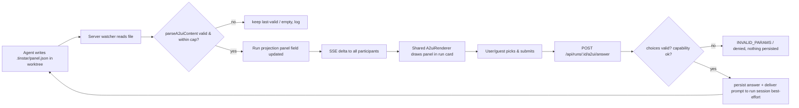

> **SUPERSEDED (2026-07-21)** — merged with
> `docs/brainstorms/2026-07-21-fan-out-surfaces-and-open-points-requirements.md` into
> **`docs/brainstorms/2026-07-21-the-slate-requirements.md`**. Its render/storage
> decisions (R1–R13) are carried forward there. Plan from the merged doc; this is kept
> for history only.

## Summary

Extend the A2UI renderer that today draws only Roundup notice bodies into the **run workspace card itself**, so an agent can render structured panels — forms, buttons, tables, choices, status — as a facet of its own run. This is solo value first (richer run I/O for one user), and it doubles as "more playable parts of the instrument" that make a shared room worth crowding around (couples with the multiplayer units).

## Problem Frame

A2UI (a declarative, agent-authored UI protocol) already lets an agent describe a small component tree — a heading, a list, a choice with radio buttons, a submit button — and have Tinstar draw it in the host theme. But that capability is boxed into one surface: `Notice` bodies on the Roundup board (`src/plugins/roundup/src/a2ui/`). A notice is a *separate* board entry an agent posts *about* its run. The run card itself — the thing the user is actually looking at when they work a run — can only show derived facts (changed files, terminal recap, telemetry). It cannot show a panel the agent authored on purpose: a form to fill in, a table of results, a set of buttons to fire.

That is a missed surface twice over. Solo: the user must leave the run card and go read the Roundup to answer a structured prompt, or drop to the terminal entirely. Multiplayer (the v5.4 through-line — a run workspace becoming a shared room): rich panels are exactly the "facets" that let several people co-play one workspace — one drives the prompt, another fires a button in the agent's panel. Without rich run-card facets there is less for a second person to *do*.

## Key Decisions

**Extend the Roundup A2UI stack, don't fork it.** The rendering machinery in `src/plugins/roundup/src/a2ui/` is already almost host-agnostic: `schema.ts`, `A2uiRenderer.tsx`, `catalog.tsx`, `controls.ts`, and `controlComponents.tsx` import only `domain/types` and `@a2ui/web_core`, not anything notice-specific. The one funnel `parseA2uiContent()`, the renderer's `MAX_DEPTH`/`MAX_NODES` budgets, the degrade fallback, the `safeHref` allowlist, and the host `CATALOG` are all reusable as-is. The run workspace must **call this same code**, not clone a second walker. A second walker would re-introduce both safety traps the Roundup slice already paid to learn (the `.passthrough()` URL-injection trap and the diamond-ref node-explosion trap, documented in `docs/solutions/tooling-decisions/adopting-a2ui-for-agent-authored-ui.md`).

The naming choice that follows: the a2ui module currently lives *under* the roundup plugin. **Tradeoff:** promoting it to a shared location (`src/a2ui/`) over importing it cross-plugin from `roundup`. Gains a clean home for a capability two surfaces now share, and stops the run widget from depending on a plugin's internals. Costs a move-and-reimport churn touching Roundup's imports, and a moment where both surfaces must be re-tested against the moved module. Wrong if the run-workspace variant needs a materially different catalog or control model than notices — then a shared module is a false abstraction and two catalogs sharing only the walker+budgets is the honest shape. The parts that are genuinely universal (the walker, the budgets, the degrade path, `parseA2uiContent`) must be shared regardless of where the file lands; only the *catalog* is a candidate for divergence.

**Author via an observable artifact, not a Tinstar-aware API call.** Notices are authored by the agent calling `POST /api/notices` (via the `roundup-notices` skill) — which requires the agent to know Tinstar exists and hold its URL. The product conviction "observable artifacts over agent cooperation" says the run-workspace path should instead **read what the agent leaves on disk**. The agent writes its A2UI panel as JSON to a known path in its worktree (proposed: `.tinstar/panel.json`); a server-side watcher — mirroring how `status-watcher.ts` already polls each session's worktree for transcript JSONL to derive status/recap — reads that file, validates it through the same `parseA2uiContent()` funnel, and updates a projection on the run. An agent that has never heard of Tinstar can still produce a rich panel by writing a file, the same way it produces a git diff by editing code. **Tradeoff:** file-watch-and-derive over an authored API endpoint. Gains agent-agnosticism and consistency with every other run-derived fact. Costs a poll/validate cycle (latency + a malformed-file surface) and a naming contract for the path. Wrong if a future agent surface genuinely needs synchronous write-confirmation (then an authenticated endpoint is warranted) — so we keep the door open by making the *storage* projection endpoint-writable too, but the *default and documented* authoring path is the file.

**Run-attached content is a server-authoritative projection, parallel to `Notice.content`.** Storage mirrors how `Notice` carries `A2uiContent`, but attached to the run rather than a notice: a new optional field on the run projection (proposed `RunData.panel?: A2uiContent`), populated by the watcher, broadcast as an SSE delta like every other run field, and rendered by the client as a projection of server state. This reuses the existing `A2uiContent`/`A2uiComponent` host types in `domain/types.ts` verbatim.

**Solo value ships independently; multiplayer interactivity rides on it.** The full unit is (a) render an agent's panel in the run card and (b) let interactive controls answer back to that run's agent. Both are complete and useful for a single user. Guest-operated controls are an *additive* capability gated by Unit 4 (Co-drive) — the same submit path, with a capability check in front of it. Nothing here blocks on the multiplayer units landing.

## Requirements

**Rendering A2UI in the run card**

R1. The run workspace card renders a run's A2UI panel content when present, host-themed, by calling the existing shared A2UI renderer (`A2uiRenderer`) — not a re-implemented walker.

R2. Rendering reuses the existing renderer budgets unchanged: `MAX_DEPTH` (recursion bound), `MAX_NODES` (total-visit bound that stops a diamond-ref explosion), and the per-surface React error boundary, so a hostile or malformed panel can never hang or blank the run card.

R3. Rendering reuses the existing host `CATALOG` and the `safeHref` scheme allowlist, so a `javascript:`/`data:` URL in an agent-authored `Link` degrades to plain text exactly as it does in a notice.

R4. When a run has no panel content, the run card shows its existing three-panel layout (changed-files / terminal-recap / telemetry) unchanged — the panel is additive, never displacing the derived facts.

R5. The panel occupies a distinct region of the run card (not interleaved with derived facts) so the user can tell agent-authored content apart from Tinstar-derived content at a glance.

**Content source & storage**

R6. A run's A2UI panel content is stored as an optional field on the run projection, reusing the `A2uiContent` host type from `domain/types.ts`; its presence/change broadcasts an SSE delta like any other run field, and clients render it as a projection of server state.

R7. The default authoring path is an observable artifact: the agent writes A2UI JSON to a known worktree-relative path (`.tinstar/panel.json`); a server-side watcher reads it and updates the run projection.

R8. The watcher validates every read through the same `parseA2uiContent()` funnel used by the notices API. Content that fails validation does not update the projection to a broken value; the last-valid panel (or empty) is retained and the malformed read is logged, not surfaced as a crash.

R9. Panel content is size-capped at read time (reusing the notices content-byte cap posture), so an oversized or runaway file cannot bloat the run projection or the SSE stream.

R10. Clearing the panel is expressible: an empty/absent file (or an explicit empty content) removes the panel from the run card, so an agent can retract a panel the same way it can pull a notice.

R11. The projection field is also writable by an internal endpoint (not the documented default), leaving the door open for a synchronous authoring path later without changing the storage shape.

**Interactive controls answer back to the run**

R12. The run panel supports the same interactive controls a notice does — `Choice` (single/multi), `TextInput`, `Submit` — rendered from the shared `controlComponents`, with host-owned form state (the control value lives in host React state, not web_core's data model).

R13. Submitting a run panel form routes the answer to the **run** (its agent), not to a notice: a new endpoint parallel to `POST /api/notices/:id/answer` (proposed `POST /api/runs/:id/a2ui/answer`).

R14. On submit the server (a) performs the same defense-in-depth validation the notices answer path does — every submitted choice id must be in the panel's declared option set, free text is length-capped — rejecting bad input with `INVALID_PARAMS` and persisting nothing; and (b) delivers a prompt describing the answer to the run's session via the existing prompt-delivery path (`tmuxBackend.sendPrompt`), best-effort.

R15. Delivery is best-effort and decoupled from acknowledgement: if the run's session is unreachable or not prompt-ready, the submit still succeeds at the UI and the response signals `delivered:false`, matching the notices contract (the answer is not lost to an unreachable agent).

R16. A control rendered without an interactive form context (e.g. a preview, or a read-only viewer) shows the disabled/static form the shared controls already provide — nothing is ever half-wired.

**Multiplayer-aware interaction**

R17. Operating a run panel control (selecting a choice, firing a submit) is modeled as one of the run's operable **facets**, so it can be capability-gated per participant by Unit 4 (Co-drive) — a guest with the grant can operate the panel; a watch-only guest sees it rendered but inert.

R18. The submit endpoint carries the acting participant's identity/capability context (supplied by the presence substrate, Unit 1) so a guest submit is authorized the same way any other guest action on the run is, with no separate auth path invented here.

R19. Panel content and submitted-state changes propagate to all participants viewing the run through the existing single SSE stream, so two people looking at the same run see the same panel and the same answered state.

## Key Flows

F1. Agent renders a form in its run card, user submits, agent receives.
- **Trigger:** an agent working a run needs a structured decision from the user (or wants to show a rich status panel).
- **Actors:** the run's agent, the server watcher, the run workspace widget, the user (or a capability-holding guest).
- **Steps:**
  1. The agent writes A2UI JSON — say a `Text` prompt, a `Choice` with two options, and a `Submit` — to `.tinstar/panel.json` in its worktree.
  2. The server watcher reads the file, validates it via `parseA2uiContent()`, and updates the run projection's panel field.
  3. The change broadcasts as an SSE delta; every client viewing the run renders the panel host-themed in the run card via the shared `A2uiRenderer`.
  4. The user picks an option and clicks Submit; the widget POSTs the answer to `POST /api/runs/:id/a2ui/answer`.
  5. The server validates the choice ids against the panel's declared set, persists the answer state, and delivers a prompt describing the answer to the run's session (best-effort).
  6. The agent, reading its own prompt input, receives the answer and continues; if it wants to retract the panel it clears `.tinstar/panel.json`.
- **Outcome:** the user answered a structured prompt without leaving the run card or dropping to the terminal, and the agent got the answer through its normal input channel.

F2. Malformed panel file degrades instead of breaking the card.
- **Trigger:** the agent writes a panel file that fails A2UI validation (wrong envelope keys, a non-string field, a diamond-ref, an oversized blob).
- **Actors:** the watcher, the run card renderer.
- **Steps:** the watcher's `parseA2uiContent()` returns null (or the size cap trips) → the projection is not updated to a broken value → if some invalid content *does* reach the renderer, its degrade fallback + budgets + error boundary contain it to a readable "couldn't render" signal.
- **Outcome:** a bad file is a no-op or a contained readable fallback, never a blank or hung run card.

## Acceptance Examples

AE1. Malformed panel content degrades, reusing existing budgets. **Covers R2, R3, R8, F2.**
- **Given** an agent's `.tinstar/panel.json` describes a diamond reference (`c_i.children = [c_{i+1}, c_{i+1}]`, ~30 deep) or contains a non-string `text` field.
- **When** the watcher reads it and, in the defense-in-depth case, the renderer walks it.
- **Then** the `MAX_NODES` total-visit cap (not depth alone) bounds the walk, the projection is not corrupted, and the run card shows either its prior valid panel or a contained "couldn't render" fallback — never a hung tab or a blank card.

AE2. A `javascript:` URL in a run panel Link cannot execute. **Covers R3.**
- **Given** an agent-authored `Link` with `url: "javascript:alert(1)"`.
- **When** the run card renders the panel.
- **Then** `safeHref` (the shared allowlist) renders the label as a non-link span, exactly as it does for a notice — the run card added no new injection surface.

AE3. A control answer reaches the right run. **Covers R13, R14, R15.**
- **Given** two runs each showing a panel with a `Choice` + `Submit`, sharing option ids.
- **When** the user submits on run A's panel.
- **Then** the answer is validated against run A's declared option set, persisted on run A's state, and delivered as a prompt only to run A's session; run B is untouched; and if run A's session is unreachable the submit still succeeds with `delivered:false`.

AE4. A submitted choice id the panel never declared is rejected. **Covers R14.**
- **Given** a panel declaring options `["keep","discard"]`.
- **When** a submit arrives with `choices: ["rm-rf"]`.
- **Then** the server responds `INVALID_PARAMS` and persists nothing — the run's answer state is unchanged.

AE5. A watch-only guest sees the panel but cannot operate it. **Covers R16, R17, R18.**
- **Given** a guest joined with watch scope (no Co-drive grant) viewing a run whose panel has a `Submit`.
- **When** the guest views the run card.
- **Then** the panel renders host-themed but its controls are the disabled/static form; an attempted submit is denied by the capability check, not by a client-only disable.

## Scope Boundaries

**Deferred for later**
- Adopting web_core's streaming `MessageProcessor` / `ComponentContext` / `GenericBinder` runtime — the live, stateful, data-bound A2UI path. This unit stays on the "schema not runtime" posture the Roundup slice established: validate with the v0_9 zod schema, render with the host walker. The streaming runtime is the same "later slice" the existing code's comments already name.
- A rich control vocabulary beyond `Choice`/`TextInput`/`Submit` (tables with sortable columns, live-updating status meters, multi-step forms). The first cut ships the controls notices already have; new component types are additive to the shared catalog.
- A synchronous, Tinstar-aware authoring endpoint as the *primary* path. The storage stays endpoint-writable (R11) so this is reachable, but the documented default is the observable artifact.

**Outside this product's identity**
- Self-styled, arbitrary-CSS agent UI. The whole point of the host `CATALOG` is that the agent names *components* and Tinstar draws them in its theme; adopting web_core's `basic_catalog` (which ships its own styles) or letting a panel carry raw CSS/HTML would defeat host theming and re-open a styling injection surface. Panels render in the host theme, full stop.
- Panels as a general app-embedding mechanism (arbitrary iframes, scripts). A2UI is a bounded declarative vocabulary, not an escape hatch to run agent-authored code in Tinstar's origin.

## Dependencies / Assumptions

- **Existing Roundup a2ui module** (`src/plugins/roundup/src/a2ui/`) is the substrate this unit extends — `parseA2uiContent`, `A2uiRenderer`, `CATALOG`, the budgets, the degrade path, and the `controlComponents`. This unit's first task is deciding where the shared parts live (see Key Decisions) and wiring the run widget to them.
- **Existing run projection + SSE delta plumbing** (`RunData` in `domain/types.ts`, the run store, the SSE broadcaster) is reused for panel storage and propagation — no new transport.
- **Existing worktree-polling watcher precedent** (`src/server/sessions/status-watcher.ts`) is the model for reading `.tinstar/panel.json`; this unit assumes a similar poll/derive loop is acceptable (it already runs for status/recap).
- **Existing prompt-delivery path** (`tmuxBackend.sendPrompt`, as used by the notices answer endpoint) is reused to deliver answers to the run's agent.
- **Unit 1 (Presence substrate)** supplies the per-participant identity/capability context the submit endpoint reads (R18).
- **Unit 4 (Co-drive)** owns the capability model that gates guest operation of panel controls (R17). This unit renders the facet and enforces the gate; it does not define the capability taxonomy.

## Outstanding Questions

**Resolve before planning**
- Where does the shared a2ui module live — promoted to `src/a2ui/`, or imported cross-plugin from `roundup`? (Key Decisions frames the tradeoff; the answer sets the first implementation task and Roundup's re-import churn.)
- Is `.tinstar/panel.json` the right contract — one file per run, or a small directory allowing multiple named panels per run? One file is the simplest observable artifact; multiple panels is a natural extension but complicates the projection shape and the answer-routing (which panel did a submit come from?).
- Poll cadence and change detection for the panel file: reuse the status-watcher's interval, or watch the file for lower latency? A form the user is waiting on wants tighter latency than a 3s status poll.

**Deferred to planning**
- Exact projection field name and shape on `RunData` (`panel` vs `a2ui` vs a small sub-object with metadata like `authoredAt`).
- Whether answered-state on a run panel is a single latest-answer (like a notice's `answer`) or a small history, and how re-authoring the panel file interacts with a prior answer (does writing a new panel clear the old answered state?).
- The precise size cap value for run panels (reuse the notice content cap, or a different budget given a run card has more room than a notice).
- How the run card visually distinguishes an agent-authored panel from derived facts (R5) — a titled region, a subtle "authored by the agent" affordance, placement relative to the telemetry rail.
