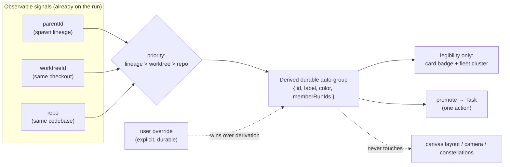

# Auto-organize: Durable Grouping

## Summary

Give every run a durable, legible group it is slotted into automatically — derived from signals the server already observes (who spawned it, which repo it lives in, which worktree it checks out) — so a fleet of ten open runs reads as a handful of meaningful clusters without anyone opening a create-entity modal. Grouping is a membership fact that travels with the run and survives restarts. It never moves, tiles, or repacks a single widget on the canvas.

## Problem Frame

The user routinely has around ten run workspaces open at once and spawns hands off them. There is real structure in that fleet — this hand belongs to that run's line of work, these three runs are all editing the same repo, that pair shares one worktree — but today that structure is invisible unless the user declares it by hand.

Declaring it by hand means the taxonomy: `Initiative → Epic → Task → Worktree → Run`, created one entity at a time through the parent-scoped `CreateEntityDialog` modal (`src/components/CreateEntityDialog.tsx`), with reparenting available only as a foreign-key PATCH. It is too fiddly to bother with mid-flight, so the user doesn't, and the fleet stays a flat wall of runs whose relationships live only in the user's head.

The frustrating part is that the machine already knows most of the answer. A hand already inherits its parent's task (`Run.parentId`, `Run.taskId`). Every run already carries `repo` and `worktree` fields. The grouping the user would have typed is sitting in observable fields the server populates at create time — it just is not surfaced as a group. This unit closes that gap: derive the grouping that already exists instead of asking the user to re-state it.

## Key Decisions

**Auto-organize categorizes; it does not arrange.** This is the decision the whole unit turns on, because on its face "auto-organize" sounds like the thing the product forbids. The essay `docs/essays/the-tmux-grid-problem.md` (decision #2) is explicit: "Space is a first-class information channel. Arrangement is meaningful, persistent, and never auto-managed." A stable canvas is what lets spatial memory do the work the user's attention would otherwise spend. The reconciliation is a clean split of two things that "organize" conflates. *Spatial layout* — where a widget sits, how big it is, what it snaps to — stays exactly as it is today: owned by the user, moved only by the user (or by the existing reset-layout button and the constellation snap gestures the user initiates). *Membership* — which group a run belongs to — is a separate, non-spatial fact, and that is the only thing this unit derives. Auto-organize assigns a run to a group the way a tag assigns a color; it does not decide the run's coordinates. Nothing in this unit reads or writes `config.ui.layouts`, calls `tidyArrange`, reflows a constellation, or touches the camera. If a change in this unit would move a pixel the user placed, that change is out of scope by definition.

**Membership is derived from observable signals, never declared through a modal.** Mirroring the product's "observable artifacts over agent cooperation" stance, grouping is computed from what the server can already see, not from a form the user fills in. Three signals, in priority order: (1) **spawn lineage** — a hand's `parentId`, which already carries the parent's task; (2) **worktree** — runs sharing a `worktreeId` are working the same checkout; (3) **repo** — runs sharing a `repo` are working the same codebase. These are populated at run-create time and require no cooperation from the agent, no hook, and no new user gesture. The user can still override (see below), but the default requires zero clicks.

**Groups are durable and legible, not a layout.** A group must (a) stay attached to its member runs across sessions and server restarts — the same durability bar the friendly-name and background-session fields already meet by living in the docstore — and (b) be visible *as a group*: a run's card shows which group it is in, and the fleet/sidebar can show runs clustered by group. Legibility is a label-and-badge concern (color, name, a count), not a positioning concern. Two runs in the same group need not sit next to each other on the canvas, and putting them in a group must not make them move to sit next to each other.

**Prefer a lightweight derived "auto-group" that can promote to a Task, over auto-populating the existing Task entity.** The apparent shortcut is to reuse the existing taxonomy: when signals cohere, silently create/assign an `Epic` or `Task` and hang runs off it. We recommend against that as the default. Auto-writing into the same entity tree the user hand-curates blurs "the machine guessed this" with "the user declared this," makes every wrong guess a destructive edit to the user's taxonomy, and drags in the FK-reparent and modal machinery this unit exists to escape. Instead, derive a **separate, lightweight auto-group** — a first-class but clearly-machine-owned grouping that carries an id, a derived label, a color, and its member run ids, and that can be **promoted** to a real `Task` in one action when the user decides the guess is worth keeping. This keeps the derived layer non-destructive and reversible, and preserves the existing taxonomy as the place for *declared* structure. The alternative (auto-populate Task) stays open in Outstanding Questions because it has a real pull: it needs no new entity type and it makes derived groups immediately reparentable with existing tools.

## Requirements

**Membership derivation**

R1. The server derives a group for every non-background run from observable fields already on the run: `parentId` (spawn lineage), `worktreeId`, and `repo`. No new user input and no agent cooperation is required for a run to receive a group.

R2. A spawned hand joins its spawning run's group. Because a hand already inherits its parent's `taskId` and carries `parentId`, this is a derivation over existing fields, not a new write path at spawn time.

R3. When two or more runs share the same `worktreeId`, they resolve to the same group. Sharing a worktree is the strongest same-work signal because it means the runs edit one checkout.

R4. When runs share a `repo` but not a worktree, they may resolve to the same repo-level group. Repo is a weaker signal than worktree and lineage, and its grouping is coarser; it groups siblings that are plausibly related, not provably the same work.

R5. Signals are applied in a fixed priority order — lineage, then worktree, then repo — so a run with a `parentId` is grouped by its lineage even if its repo differs from its parent's, and the derivation is deterministic given the same run fields.

R6. Derivation runs whenever the inputs change: a run is created, a hand is spawned, a run's worktree/repo is set, or a run is deleted. It does not run on a spatial event (drag, snap, camera move) — those carry no membership signal.

**Group durability and identity**

R7. A group has a stable id, a derived display label, an accent color, and a set of member run ids. The label and color derive from the group's anchor (the parent run for a lineage group; the repo/worktree name otherwise), reusing the existing color-inheritance the taxonomy already provides via `EntitySettings.defaultRunColor`.

R8. Group membership persists in the config-root docstore and survives a server restart and the boot rehydrate that reconstructs runs from sessions. A run that was in a group before a restart is in the same group after it.

R9. A run belongs to exactly one auto-group at a time. If two signals would place it in different groups, the priority order in R5 decides; the losing signal does not create a second membership.

R10. A user override is durable and wins over derivation. If the user moves a run into a different group (or out of its derived one), that choice is recorded and the derivation does not silently reassign it on the next recompute. Derivation fills the default; it never overrides an explicit human choice (mirroring the friendly-name "never override a human choice" stance).

R11. An auto-group can be promoted to a real `Task` in one action, carrying its members and color across, after which it behaves as a declared taxonomy entity. Promotion is the one-way bridge from "machine guessed" to "user declared."

**Legibility without movement**

R12. A run's card shows which group it belongs to — a small named, colored badge — so group membership is readable at a glance from the card the user already looks at.

R13. The fleet/sidebar can present runs clustered by their derived group (a grouped list or sectioned view), giving the "how do these ten runs group" answer without the user arranging anything on the canvas.

R14. Rendering a group's membership must not read, write, or depend on `config.ui.layouts`, canvas coordinates, or constellation state. Legibility is achieved with labels, badges, and list grouping only.

R15. Assigning, changing, or promoting a group never moves, resizes, reflows, tiles, or re-snaps any widget, and never moves the camera. The canvas after a grouping change is pixel-identical to the canvas before it.

**Escape the modal**

R16. A run receives its group with zero user interaction — no `CreateEntityDialog`, no parent-scoped modal, no form. The default path is fully automatic.

R17. Any explicit user grouping action (override a run's group, rename an auto-group, promote to Task) is a single inline gesture — not a walk through the multi-step entity-creation modal.

## Key Flows

F1. **A hand spawns and auto-joins its parent's group.**
- **Trigger:** The user (or an agent) spawns a hand off an existing run.
- **Actors:** Spawning run (parent), new hand run (child), server derivation.
- **Steps:** (1) The hand is created with `parentId` set to the spawning run and `taskId` inherited from it, exactly as today. (2) Derivation (R1, R2) resolves the hand into the parent's group by lineage. (3) The hand's card renders the group badge (R12); the fleet clusters it under the same group as its parent (R13). (4) No widget on the canvas moves; the hand's spawn placement is governed entirely by the existing snap/`focusOnCreate` behavior, untouched by this unit.
- **Outcome:** The hand is legibly part of its parent's line of work the instant it appears, and nothing the user placed has shifted.

F2. **A run starts in repo X and groups with its siblings.**
- **Trigger:** A new run is created in a repo where the user already has other runs.
- **Actors:** New run, sibling runs in the same repo/worktree, server derivation.
- **Steps:** (1) The run is created with `repo` and `worktreeId` populated. (2) Derivation checks worktree first (R3): if a sibling shares the worktree, they resolve to one group; otherwise it falls to repo (R4). (3) The group's label and color derive from the shared anchor (R7). (4) Cards and the fleet reflect the shared group (R12, R13); no widget moves (R15).
- **Outcome:** The user sees the new run cluster with its siblings in the fleet without having created any entity or arranged anything.

## Acceptance Examples

AE1. **Spawning a hand does not move existing widgets.** *Given* a canvas with runs A, B, and C placed by the user, *When* the user spawns a hand off run A, *Then* the hand joins A's group and shows A's group badge, *And* the positions and sizes of A, B, C, and every other widget are unchanged. **Covers R2, R12, R15.**

AE2. **Membership persists across a restart.** *Given* run H is in run A's lineage group, *When* the server restarts and rehydrates runs from sessions, *Then* run H is still in the same group as A with the same label and color. **Covers R8, R7.**

AE3. **Grouping needs no modal.** *Given* a fresh run created in a repo that already has sibling runs, *When* the run is created, *Then* it receives a group with no dialog shown and no user click required, *And* the fleet clusters it with its siblings. **Covers R16, R4, R13.**

AE4. **Worktree beats repo.** *Given* runs P and Q share a worktree and run R is in the same repo but a different worktree, *When* derivation runs, *Then* P and Q are in one group and R is not in that group. **Covers R3, R4, R5.**

AE5. **A user override survives recompute.** *Given* the user moved run S out of its derived repo group into group T, *When* a new sibling is created in S's repo and derivation recomputes, *Then* run S stays in group T and is not silently pulled back. **Covers R9, R10.**

AE6. **Promotion carries members.** *Given* an auto-group with members X, Y, Z, *When* the user promotes it to a Task, *Then* X, Y, Z belong to the new Task with the group's color, *And* no widget on the canvas moves as a result. **Covers R11, R15.**

## Group-derivation data shape

## Scope Boundaries

**Deferred for later**
- **Relationship and collision visualization is Unit 8 (Auto-organize: relationship & collision viz).** Showing *how* grouped runs relate — and especially the same-worktree "stepping on each other" collision warning — builds on the durable grouping this unit establishes but is out of scope here. This unit only slots runs into groups and makes membership legible; it does not draw the relationships between them.
- Cross-repo or semantic grouping (grouping by inferred topic, prompt similarity, or an LLM summary) is not attempted here. Derivation stays on cheap, observable, deterministic fields.

**Outside this product's identity**
- **Any spatial auto-arrange is out — permanently, not deferred.** Auto-tiling, reflow, repacking, auto-snapping runs of a group together, or moving the camera to a group are forbidden by the essay's decision #2. The existing reset-layout button owns deliberate, user-initiated re-layout; constellations own user-initiated spatial grouping. This unit must never move a widget the user placed.
- Membership is not a permission or visibility boundary. A group does not gate who can see or act on a run; that is the presence/room model (Units 1–4), not this.

## Dependencies / Assumptions

- Assumes `Run.parentId`, `Run.taskId`, `Run.repo`, `Run.worktree`/`worktreeId` are populated at create time as they are today (`src/domain/types.ts`), and that hands already inherit their parent's task. This unit reads those fields; it does not add new create-time writes for the default path.
- Assumes durable group state can live in the config-root docstore alongside the taxonomy and survive boot rehydrate, reached via `getConfigRoot()` per conventions.
- Assumes color inheritance via `EntitySettings.defaultRunColor` (already used across initiative/epic/task in `src/domain/grouping.ts`) is available to color derived groups.
- Independent of the multiplayer units (Presence substrate, Rooms, Co-drive) — grouping is solo value that ships without any of them. It does compound with Unit 8, which consumes this unit's groups.
- New group state changes emit BusEvents to the event bus and forward through the SSE bridge, per the "adding a BusEvent" convention, so clients project group membership without polling.

## Outstanding Questions

**Resolve before planning**
- **Auto-group entity vs auto-populated Task.** Recommended: a separate lightweight auto-group that can promote to a Task (Key Decision 4). The live alternative is to auto-populate the existing `Task`/`Epic` entity directly — no new entity type, immediate reparent-with-existing-tools — at the cost of blurring guessed vs declared structure and coupling every wrong guess to a destructive taxonomy edit. Pick one before planning, because R7–R11 and the promotion story change shape depending on the answer.
- **Conflict when signals disagree.** R5 sets a fixed priority (lineage > worktree > repo). Confirm that order holds for the real cases: is a hand spawned into a *different* repo than its parent still a lineage-group member (recommended yes — the human intent that spawned it is the strongest signal), or should a repo mismatch demote it? Nail the tie-break rule before it becomes implicit in code.
- **Does a lone run get a group?** Whether a single run with no siblings and no children is "in a group of one" (uniform model, every run always grouped) or "ungrouped until a second signal appears" (groups only exist when there's something to group) affects R1's universality and the fleet's empty-state.

**Deferred to planning**
- Exact recompute trigger surface and debounce (how derivation hooks the create/spawn/delete paths without firing on spatial events).
- Where the group badge sits on the run card and how the fleet's grouped view is toggled vs. the existing flat list.
- Promotion mechanics: does promoting to a Task consume the auto-group, or leave a derived shadow that re-forms if new siblings appear.
