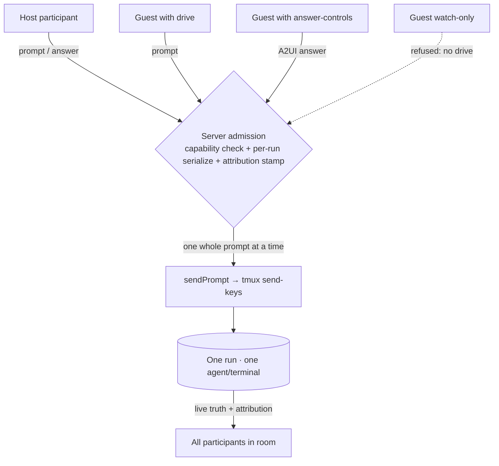

# Co-drive — Guest Capability Grants

## Summary

Let a guest who joined a shared room **act** on the room's runs, not just watch — starting with submitting a prompt to a run, and, where the surface allows, operating other playable facets (answering an A2UI control, opening a file the agent touched, firing a check). A guest's ability to act is a **capability grant** the host toggles live, not a role baked in at join. When two participants can drive one run, their input is serialized into the single underlying agent and every prompt carries **who sent it**, so the room reads as many hands on one instrument rather than a private prompt box per person.

## Problem Frame

Unit 2 lands guests in a shared room as identified participants, but scoped to **watch** — they see the same live truth as the host and can do nothing to it. That is the right first cut, and it is also the boring one. The through-line for v5.4 is "six guys playing one piano": one shared workspace where different people operate different facets of the *same* runs at the same time. A guest who spots the fix should be able to type the prompt, not narrate it to the host over Teams and wait.

Two things stand in the way, and they are the whole of this unit.

The first is a **permission model**: today there is no notion of "this participant may do this thing." Unit 1 gives participants identity and a place to hold capabilities; this unit is the first to actually gate a real action on one and let the host flip it. It has to do that in a way where watch-only, drive, and the finer permissions we will want later are all the *same* mechanism — a grant you toggle — so that full symmetric co-presence is additive on top, never a rewrite.

The second is **shared-action safety**. The prompt path that exists today was written for a single local operator. The run card's composer posts to `POST /api/sessions/:id/prompt` (body `{ text, force }`); the agent-facing curl path is `POST /api/sessions/:name/enter-prompt` (body `{ prompt }`); both funnel into `tmuxBackend.sendPrompt` in `src/server/sessions/backends/tmux.ts`. That backend exits any tmux copy-mode, sends the prompt text with `send-keys`, waits 300ms, then sends `Enter`. Nothing serializes two of those against each other — there is no lock or input queue (the one `ReadyQueue` in the sessions layer tracks *focus* navigation between ready sessions, not input). Two people submitting at the same moment would interleave their `send-keys` calls and hand the agent a corrupted, spliced line. And nothing records who submitted a prompt — the terminal only ever saw one operator, so attribution never had to exist. Co-drive cannot ship until both are solved.

## Key Decisions

**Capabilities are grants a participant holds, not roles baked in.** Building on Unit 1's participant model, a participant carries a set of capabilities — at minimum `watch`, `drive`, and (already earmarked by later units) `move-widgets`. v5.4 does exactly one new thing on top of Unit 2: it lets the host flip `drive` on for a guest. The point is not the `drive` bit specifically — it is that watch-only, drive, and every finer permission we add later (`answer-controls`, `open-files`, `spawn-hands`) are the *same* toggle mechanism. A role is a named preset bundle of grants at most; the grant is the primitive. This is what keeps the door to full symmetric co-presence open: adding a capability is adding a checkbox, not a new authorization system.

**One shared instrument, not a prompt box per guest.** A guest who drives a run is not given a private session or a private composer whose output goes somewhere else. The guest's input flows into the *same* run the host is watching, through the *same* prompt path. This is the "six guys, one piano" conviction made literal: everyone crowds the one instrument. The rejected alternative — everyone gets their own prompt box — is the boring symmetric shape the release narrative explicitly discards. It is also architecturally cheaper: we reuse `enter-prompt`, we do not invent per-guest session forks.

**Concurrent input is serialized to the one agent, and every submission is attributed.** Because many hands share one instrument, the server must be the single point that admits input to a run — it takes concurrent submissions, orders them, and delivers them one at a time so a `send-keys` sequence never interleaves with another. Each delivered prompt is stamped with the participant who sent it, and that attribution is visible to everyone in the room. Serialization prevents the cacophony (corrupted terminal lines); attribution prevents the confusion (who just told the agent to `rm -rf`).

**Drive reuses the existing run-input path; it does not invent a parallel one.** A guest driving is a participant's input reaching `enter-prompt` for the run they are looking at. The delta from today is a capability check at the front of that path and an attribution stamp on the way through — not a new endpoint, not a new delivery mechanism, not a new terminal. Everything downstream of admission (the tmux backend, the recap, the telemetry) is unchanged.

## Requirements

**Capability model**

R1. A participant (Unit 1) holds a set of capabilities. At minimum the set is `watch` and `drive`; the model must accept additional named capabilities without a schema change to the participant record.
R2. Capabilities are per-participant and scoped to the room. A participant's grants in one room say nothing about any other room, and the host of a room always holds the full set for that room.
R3. `drive` gates the ability to submit input to any run in the room. A participant without `drive` can observe a run's every surface exactly as Unit 2's watch scope allows, and can submit nothing to it.
R4. A capability the product does not yet gate on is inert, not an error: an unknown or future capability on a participant record is ignored by v5.4 code paths, so later units can seed grants ahead of the code that reads them.
R5. The default grant for a guest on join is watch-only — a guest arrives with `watch` and without `drive`. `drive` is only ever present because the host granted it (R14).

**Guest driving a run**

R6. A guest holding `drive` can submit a prompt to a run in the room, and that prompt reaches the same underlying agent/terminal the host sees. There is no per-guest session, fork, or private composer.
R7. The submission goes through the existing run-input path (the composer's `POST /api/sessions/:id/prompt`, and/or the agent-facing `/enter-prompt`, both reaching `sendPrompt`), extended with a capability check and an attribution stamp — not a new endpoint or a new delivery mechanism.
R8. The server refuses any input submission from a participant lacking `drive` for that room, and the refusal is authoritative on the server. A guest cannot drive by forging a client-side flag, replaying a captured request, or calling the endpoint directly.
R9. Input from all drivers of one run is serialized on the server: concurrent submissions are ordered and delivered to the agent one complete prompt at a time, so no two `send-keys` sequences interleave. A driver's submission is either delivered whole or rejected whole — never spliced.
R10. When one driver's submission is waiting behind another's, the waiting driver gets immediate optimistic feedback that their input is queued, consistent with the UI-philosophy rule against dead air. The run's live truth (the terminal, the recap) still shows the single authoritative order in which prompts landed.
R11. Which facets beyond the prompt are drivable is capability-gated the same way. Where Unit 5 renders an A2UI control in the run card, answering it is an action gated by a capability (a distinct grant, e.g. `answer-controls`, defaulting off for guests in v5.4); the co-drive machinery — server admission, serialization, attribution — is what that answer flows through.

**Attribution**

R12. Every prompt delivered to a run records which participant submitted it. This holds for the host's own prompts too — the host is a participant, not an unlabeled default.
R13. Attribution is visible to every participant in the room, on the surfaces that show what was submitted (at minimum the prompt/recap history). A participant reading the room can always answer "who told the agent to do that" without asking.

**Host grant and revoke**

R14. The host can grant `drive` to a specific guest live, from within the room, and the guest gains the ability to drive without rejoining or reloading.
R15. The host can revoke a guest's `drive` live. After revocation the guest can no longer submit input to any run in the room; a revoked guest falls back to watch-only.
R16. Revocation takes effect on the server before the host is told it succeeded. A submission already accepted and queued before revocation may complete; a submission arriving after revocation is refused. There is no window in which a just-revoked guest can still drive.
R17. Grant and revoke are visible in the room: participants can see who currently holds `drive`, so the host is not silently changing the room's capabilities from everyone else's point of view.

## Key Flows

F1. **Guest submits a prompt to the shared run**
- **Trigger:** A guest holding `drive` types a prompt into the run card's composer (`src/components/PromptComposer/`, as hosted in `src/components/RunWorkspaceWidget/RunSessionPanel.tsx`) and submits.
- **Actors:** Guest participant, server (admission + serialization + attribution), the run's single agent/terminal, all other participants watching the run.
- **Steps:** (1) The client submits through the run-input path for that run. (2) The server checks the participant holds `drive` for the room; if not, it refuses (F-see R8). (3) The server enqueues the submission on the run's single input queue, stamped with the participant id. (4) The server delivers queued prompts to `sendPrompt` one whole prompt at a time. (5) The delivered prompt, with its attribution, appears in the run's live truth for every participant.
- **Outcome:** The guest's input reached the same agent the host sees, ordered safely against any concurrent input, labeled with the guest's identity for the whole room.

F2. **Host revokes drive mid-incident**
- **Trigger:** During a shared incident, the host decides a guest should stop driving (wrong instinct, wrong run, or just handing the piano back).
- **Actors:** Host, server, the revoked guest, other participants.
- **Steps:** (1) The host revokes `drive` from that guest in the room. (2) The server clears the grant and acknowledges only after it is cleared. (3) Any submission the guest already had queued may finish; any new submission from the guest is refused. (4) The room's participant view updates to show the guest is now watch-only.
- **Outcome:** The guest is back to watching with no reload and no race window; the room sees the capability change.

F3. **Two guests act on different facets at once**
- **Trigger:** In one run card, one guest drives the prompt while another answers an A2UI control the agent posted (Unit 5), and a third opens a file the agent touched.
- **Actors:** Three guests with different grants, the server, the one run.
- **Steps:** (1) Each action is gated by its own capability (`drive`, `answer-controls`, `open-files`). (2) Each mutating action that reaches the agent flows through the same server admission + serialization, so the prompt and the control-answer do not corrupt each other's delivery. (3) Read-only facets (opening/reading a file) need no serialization but still respect their capability grant.
- **Outcome:** Asymmetric co-play on one workspace — different people operating different facets of one shared instrument simultaneously, without cacophony.

## Acceptance Examples

AE1. **Covers R9, R6.** Two participants both hold `drive` on run `srv-incident`. Within the same 300ms window, one submits `tail the error log` and the other submits `restart the service`. The agent receives two complete, well-formed prompts in some order. Neither prompt is truncated, spliced into the other, or interleaved character-by-character. The terminal is not left in copy-mode or a half-typed line.

AE2. **Covers R8, R15, R16.** The host revokes `drive` from guest `dana`. Immediately after, Dana's client submits a prompt to `srv-incident`. The server refuses it; nothing reaches the agent. Dana's run card shows the input was rejected, and Dana's participant entry reads watch-only.

AE3. **Covers R12, R13.** Guest `raj` (holding `drive`) submits `redeploy the worker`. Every participant's view of the run's prompt/recap history shows that prompt attributed to Raj, not to an anonymous or host-default author. The host's own subsequent prompt is attributed to the host, not left unlabeled.

AE4. **Covers R3, R5.** A guest joins the room via the Unit 2 invite link and, without the host doing anything, holds `watch` only. The guest can read the run's changed-files, terminal recap, and telemetry, and the composer submit is unavailable to them. No prompt from this guest can reach the agent.

AE5. **Covers R14.** The host grants `drive` to that guest. Without rejoining or reloading, the guest's composer becomes usable and their next submission reaches the shared run.

AE6. **Covers R11, R4.** Unit 5 renders an A2UI Choice control in the run card. A guest with `watch` but not `answer-controls` sees the control rendered but cannot answer it; a participant granted `answer-controls` can, and that answer flows through the same server admission and appears attributed. A participant record that also carries a not-yet-implemented `spawn-hands` capability behaves identically to one without it — the unknown grant is inert.

## Scope Boundaries

**Deferred for later (reachable on this substrate, not built in v5.4)**

- **Live cursors and shared selection.** Seeing where another participant's pointer is, or what text they have selected, is the Figma-style co-presence the release keeps the door open for. It rides on Unit 1's per-participant viewport + bidirectional channel and is explicitly additive — not part of co-drive.
- **Finer capability grants beyond `drive`.** `answer-controls`, `open-files`, `trigger-check`, `move-widgets`, `spawn-hands` as independently-toggleable grants. The *model* must accommodate them now (R1, R4, R11); shipping each gated action and its host toggle is later work. v5.4 flips exactly one new grant — `drive`.
- **Role presets.** Named bundles of grants ("co-pilot", "observer") the host applies in one click. The grant primitive comes first; presets are sugar on top.
- **Per-participant undo / rate-limiting / turn-taking policy.** Fair-scheduling niceties beyond "serialize and attribute."

**Outside this product's identity**

- **Per-guest private forks of a run.** A guest driving does *not* get their own session, their own worktree, or their own composer whose output diverges from the host's view. The entire point is one shared instrument. A guest who wants a private run makes a normal run of their own — that is not co-drive.
- **Symmetric "everyone gets a prompt box" multiplayer.** Explicitly rejected in the release narrative as the boring shape. Co-drive is asymmetric co-play of one workspace, not N private workspaces sharing a wall.
- **Account-based permissions.** No usernames, no passwords, no persistent per-user roles across sessions. Capabilities live on the room's participants (invite-link identity from Unit 2), not on accounts.

## Dependencies / Assumptions

- **Unit 1 (Presence substrate)** — provides the participant identity a capability attaches to, the per-participant channel a grant/revoke is pushed over, and the place capabilities are stored on the participant record. Co-drive gates actions on that identity; without it there is no "who" to grant to or attribute to.
- **Unit 2 (Shared rooms + invite links)** — provides the room a capability is scoped to and the guest-join that seeds the default watch-only grant (R5). Co-drive is the first unit to give a room's guests a capability beyond watch.
- **Unit 5 (A2UI in the run workspace)** — synergy, not a hard dependency. Co-drive ships meaningful value with prompt-driving alone; when Unit 5 lands interactive controls in the run card, answering them becomes another capability-gated facet flowing through co-drive's admission + serialization + attribution (R11). The A2UI answer path already exists for Roundup notices (`POST /api/notices/:id/answer`), which is the shape a run-card facet answer follows.
- **Assumption — server is the single authority on input admission.** Both prompt routes run server-side and are the only ways input reaches `sendPrompt`; there is no client-direct path to the tmux backend. Capability enforcement (R8) and serialization (R9) therefore have a small, known set of chokepoints to guard — ideally consolidated so the check and the queue live in one place, not duplicated per route. **Verified** against `routes.ts` (`POST /api/sessions/:id/prompt` and `/enter-prompt`) and `tmux.ts` (`sendPrompt`).
- **Assumption — the prompt path today has no serialization and no attribution.** Two `sendPrompt` calls can interleave, and nothing records a submitter. This unit *adds* both. **Verified**: `sendPrompt` is a bare `exitAnyMode` → `send-keys` → 300ms → `Enter` with no lock; the run-input callers (the `PromptComposer`, `src/core/pluginApi/terminalHandle.ts`, the file-editor and browser plugins) pass only prompt text, no author; the only queue in the sessions layer (`ReadyQueue`) is focus navigation, not input buffering.
- **Assumption — server-authoritative state, clients are projections.** A grant lives on the server and is projected to every participant; revocation is a server fact the clients reflect. Consistent with the release's state model.

## Outstanding Questions

**Resolve before planning**

- **Input serialization model.** Is it a per-run FIFO queue in the server, an advisory lock that rejects concurrent submissions outright, or a soft-lock ("someone is typing")? The tradeoff: a queue never drops a submission but can deliver a stale prompt after the situation moved on; a reject-on-conflict is simpler and more honest about "one at a time" but loses the loser's input. The image is one piano — do two hands queue, or does one wait for the other to lift?
- **Attribution surface.** Where does "who sent this" render — inline in the terminal recap, in a separate submitted-prompts log, on the composer as a ghost byline? The terminal itself only ever saw one operator, so attribution likely lives in a Tinstar-derived layer beside the raw pane, consistent with "derive facts and put them on the glass."
- **Does the run's underlying agent see the submitter identity, or only Tinstar?** If attribution is Tinstar-only, the agent's transcript stays clean but the agent can't say "Dana asked me to." If we prefix the delivered prompt with the submitter, the agent knows — at the cost of mutating the prompt the user typed.

**Deferred to planning**

- **Whether guests can spawn hands.** Spawning a hand is a heavier action than a prompt (it creates a session, a worktree, a branch). It is a natural future capability (`spawn-hands`) but need not ship in v5.4; the model must merely not preclude it (R4).
- **Granularity of the drive grant.** Room-wide `drive` (drive any run in the room) vs. per-run drive. v5.4 can ship room-wide; per-run is a later refinement the participant model should not foreclose.
- **Feedback affordance for a queued-behind submission** (R10) — exact optimistic treatment, and whether a driver can cancel a still-queued submission.

## Input-admission fan-in

