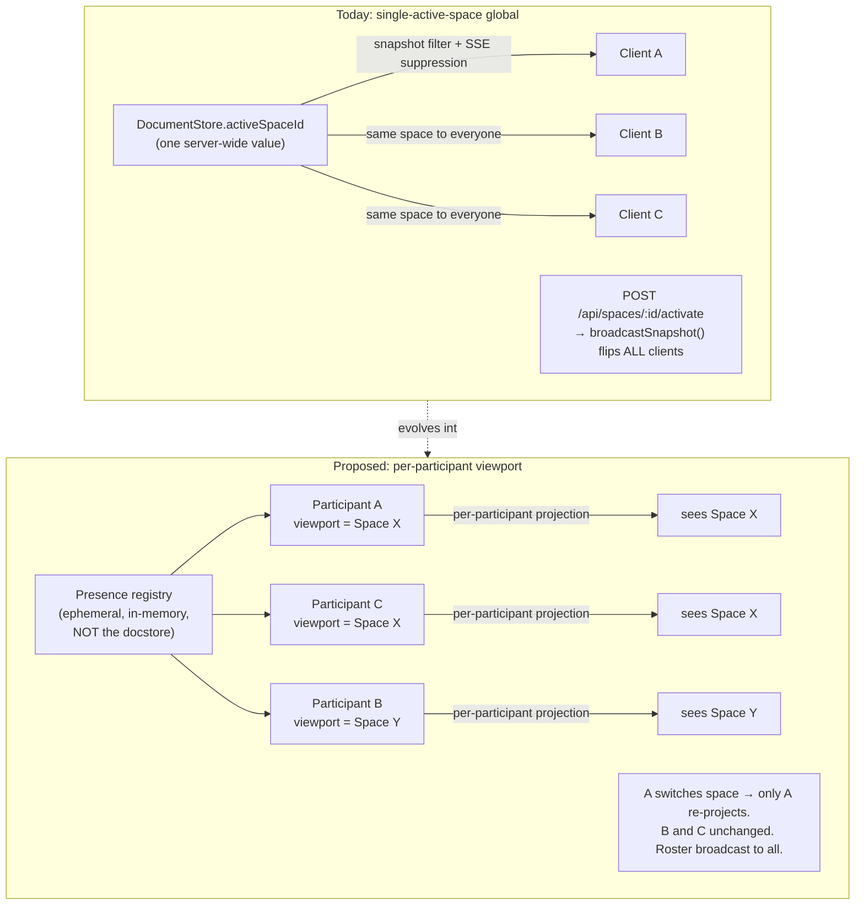

## Summary

Give Tinstar a first-class **participant** concept: every connected client is an identified presence with an ephemeral display name and accent color (Figma-style, assigned on connect — no accounts, no login). Move "which space am I looking at" off the single server-wide global and onto the participant, so two browser tabs can watch two different spaces at once. Add a bidirectional channel so a participant can tell the server things (I joined, later: my cursor is here) that the server never persists. This unit builds nothing user-facing beyond a presence chip — it is the substrate every other v5.4 unit stands on, and it is where we decide the one-way doors that keep full Figma co-presence reachable.

## Problem Frame

Today Tinstar has no notion of *who* is connected. The server keeps a bare `Set<ServerResponse>` of SSE (server-sent events — a one-way server→client stream) connections in `src/server/api/sse.ts`; a connection is an anonymous pipe, not a person. There is no identity, no roster, no way for the server to say "three people are here."

Worse for the multiplayer goal, **which space is active is one server-wide value**. `DocumentStore.activeSpaceId` (`src/server/stores/document-store.ts`) is a single string. It filters the snapshot every client receives (`snapshot()`), it drives SSE delta suppression (non-active-space deltas are dropped in `sse.ts`), and it is flipped globally by `POST /api/spaces/:id/activate` (`src/server/api/routes.ts`), which then calls `broadcastSnapshot()` — pushing the *same* newly-active space to *every* connected client at once. If a teammate joins the incident room and switches to a different space, everyone's viewport lurches with them. That is the exact opposite of "six people around one instrument, each looking where they need to."

The communication path is also one-directional. Clients receive state over the single shared `EventSource` (`src/hooks/useServerEvents.ts`) and mutate state through REST (`apiFetch`). There is no lightweight path for a client to emit *ephemeral* signals — "I'm here," and later "my cursor moved" — without either persisting to the document store (wrong: presence is not durable state) or spamming REST.

The user's hard constraint: **don't close any one-way doors toward full Figma co-presence.** The decisions in this unit are precisely the doors. Get participant identity and per-participant viewport right here, and live cursors, selection sync, and concurrent editing become *additive* features layered on this substrate later — not a rewrite of how state fans out.

## Key Decisions

**Viewport becomes per-participant, not a server global.** This is the load-bearing, hard-to-reverse decision of the whole release. "Which space/room am I looking at" moves from `DocumentStore.activeSpaceId` (one value shared by all) to a property of the participant's connection. The server keeps projecting state per the VISION pillar ("server-authoritative state; clients are projections"), but it now projects *per participant* — each connection is filtered and delta-suppressed against *that participant's* viewport, not one global. We are choosing this now, before any invite/room/co-drive work, because retrofitting it later would mean touching every code path that reads `activeSpaceId` after those units were built on top of it. Doing it first makes full Figma co-presence additive.

> **Tradeoff:** choosing per-participant viewport over the single-active-space global. Gains: two tabs (later, two people) can watch different spaces simultaneously; live cursors/selection become additive. Costs: the snapshot/delta path must be filtered per-connection instead of once globally, and `activeSpaceId` as a persisted single-space concept must be retired or demoted to a per-participant default. Wrong if v5.4 were the *last* multiplayer step (then the global would be cheaper) — but VISION Pillar 1 makes it the first of many, so the door must stay open.

**Ephemeral identity, assigned on connect — never an account.** A participant gets a generated display name (e.g. an adjective-animal handle) and an accent color the moment they connect, with no login, no username/password, no persisted user record. This matches the release headline ("no accounts, invite-link only") and Figma's guest model. Identity lives only as long as the connection (plus a short grace window for reconnects). A participant may later be *offered* a name they type on join (that is Unit 2's "name-on-join"); this unit only guarantees that *something* identifies every connection from the first byte.

**A bidirectional channel carries participant→server ephemeral events.** Presence (join/leave now; cursor/selection later) needs the client to *tell* the server things, which today's one-way SSE + REST cannot do cleanly. We decide *that* a back-channel exists and *what it must carry* (per-participant ephemeral state that is broadcast to others but **never written to the document store or persisted to disk**). We deliberately leave the exact transport — WebSocket, POST-beacon, or SSE-plus-POST — to planning (see Outstanding Questions), because that choice is reversible and shouldn't block the shape.

**Presence is ephemeral state, structurally separate from the document store.** The roster of live participants and their viewports lives in a dedicated in-memory presence registry, *not* in `DocumentStore`. The docstore persists durable entities to disk (`snapshotAll()`); presence must never land there — a participant who closes their tab must vanish, and a server restart must start with an empty roster. Keeping presence out of the docstore also keeps the docstore's mutator/equality/persist contracts (documented at the top of `document-store.ts`) untouched.

**The roster is server-authoritative and broadcast as a projection.** The server owns the true set of live participants and pushes the roster to clients the same way it pushes entity state. Clients render it; they never assert it. This is the VISION model ("clients are projections") applied to presence.

## Requirements

**Participant identity**

R1. On every new client connection, the server MUST create a participant with a stable-for-the-session id, an ephemeral display name, and an accent color. No credentials, account, or persisted user record is created.

R2. The participant id MUST identify the connection for its lifetime and MUST NOT be reused for a different connection. It is not correlated to any human across sessions.

R3. Display name and accent color MUST be assigned automatically at connect so a participant is fully identified from its first frame, even if the participant never types anything. (A participant-chosen name is a later enhancement owned by Shared rooms + invite links; this unit only guarantees a default identity exists.)

R4. Participant identity MUST NOT be written to the document store or persisted to disk. It exists only in the in-memory presence registry for the life of the connection (plus a short reconnect grace window, R15).

R5. Accent colors SHOULD be assigned to minimize collisions across the currently-live roster so participants are visually distinguishable.

**Per-participant viewport**

R6. Each participant MUST have its own viewport — at minimum "which space am I looking at" — held on the participant/connection, not as a single server-wide value.

R7. The server MUST project state (initial snapshot and subsequent deltas) filtered against the requesting participant's viewport, replacing the single-global filtering in `DocumentStore.snapshot()` and the delta suppression in `src/server/api/sse.ts`.

R8. Changing one participant's viewport MUST NOT change any other participant's viewport, and MUST NOT cause any other participant to receive a snapshot or deltas for the newly-viewed space.

R9. A participant MUST be able to change its own viewport (e.g. switch spaces) and receive the corresponding space's state, without a global `activate` side effect on other clients.

R10. The server-wide `DocumentStore.activeSpaceId` global and the `POST /api/spaces/:id/activate` → `broadcastSnapshot()` broadcast MUST be retired as the mechanism that decides what a client sees. `activeSpaceId` MAY survive only as a per-participant *default* (the space a fresh participant lands in), never as the thing that switches every client at once.

R11. Entity-creation endpoints that currently stamp `docStore.activeSpaceId` onto new entities (many call sites in `src/server/api/routes.ts`) MUST instead resolve the space from the acting participant's viewport (or an explicit request parameter), so creating an entity while viewing space X never mis-stamps it into a global-active space Y.

**Presence roster**

R12. The server MUST maintain the live set of participants (id, display name, accent color, current viewport) in an in-memory registry separate from `DocumentStore`.

R13. The server MUST broadcast the roster as a projection so every participant can see who else is present. Roster updates MUST be pushed on join and leave.

R14. When a participant disconnects, the server MUST remove it from the roster and broadcast the removal, so a closed tab stops appearing as present.

R15. A brief reconnect grace window MAY be applied before a dropped participant is removed, so a transient network blip or SSE reconnect does not flicker the participant out and back into the roster. The window MUST be short enough that a genuinely-gone participant disappears promptly.

R16. On server restart the roster MUST start empty; presence MUST NOT be rehydrated from disk.

R17. The roster entry for the requesting participant MUST be identifiable as "you," so the UI can render the local participant's own chip distinctly.

**Bidirectional channel**

R18. There MUST be a channel over which a participant sends events to the server (at minimum: an implicit or explicit "joined" and the "leave" signaled by disconnect) and over which the server broadcasts presence to participants.

R19. The channel MUST be able to carry per-participant ephemeral state (starting with viewport/presence, extensible to cursor position and selection) without writing any of it to the document store or to disk.

R20. Ephemeral channel events MUST NOT flow through the docstore `change` event path, so they never trigger a persist, never hit the docstore equality/short-circuit contract, and never appear in `snapshotAll()`.

R21. The channel's payload shape for presence MUST be designed so that adding cursor and selection fields later is an additive change (new optional fields / new event kinds), not a breaking reshape — this is the concrete "keep the Figma door open" requirement.

R22. Frontend use of the channel MUST go through the app's HTTP/SSE conventions (`apiFetch`/`apiUrl` from `src/apiClient.ts` for any POST leg; the shared `EventSource` in `src/hooks/useServerEvents.ts` for any SSE leg) rather than bare `fetch` or a second raw connection, per `docs/conventions.md`.

**Solo-demoable presence**

R23. With a single user and one tab open, that user MUST appear as a participant with a visible presence chip (their name + accent color) — presence is proven even before a second person joins.

R24. Opening a second browser tab against the same server MUST show two participants in the roster, and switching the space in one tab MUST change only that tab's viewport while the other tab continues to display its own space — the behavior the single-active-space global forbids today.

## Key Flows

F1. **A participant connects and is identified.**
- **Trigger:** a browser opens Tinstar and establishes its event connection to the server.
- **Actors:** the connecting client, the server's presence registry, all already-connected participants.
- **Steps:** (1) the server accepts the connection; (2) it mints a participant with an id, ephemeral display name, and accent color; (3) it sends that participant its initial state snapshot, filtered by the participant's default viewport, plus the current roster with its own entry flagged as "you"; (4) it adds the participant to the roster and broadcasts the updated roster to everyone.
- **Outcome:** the new participant sees itself and any others as presence chips; existing participants see the newcomer appear. Nothing was persisted to disk.

F2. **Two tabs view two different spaces at once.**
- **Trigger:** a user has two tabs open (or two teammates are connected); one switches to a different space.
- **Actors:** the switching participant, the server, the non-switching participant(s).
- **Steps:** (1) the switching participant sends a viewport-change to the server for its connection only; (2) the server updates *that* participant's viewport in the registry and re-projects a snapshot/deltas for the new space to *that connection*; (3) no snapshot or delta for the new space is sent to any other participant; (4) the roster broadcast reflects each participant's current viewport if the roster carries viewport.
- **Outcome:** the switching tab shows the new space; every other tab is unchanged. This is impossible under the current global `activate` + `broadcastSnapshot()` path.

F3. **A participant leaves.**
- **Trigger:** a tab closes, navigates away, or its connection drops.
- **Actors:** the departing client, the server, remaining participants.
- **Steps:** (1) the server detects the disconnect (connection close, or grace-window expiry after a missed heartbeat, R15); (2) it removes the participant from the roster; (3) it broadcasts the removal.
- **Outcome:** the departed participant's chip disappears for everyone; no residue in persisted state.

## Acceptance Examples

AE1. **Solo presence chip.** Given a fresh server and a single user opening one tab, When the connection is established, Then the user sees exactly one presence chip showing a generated name and accent color identified as themselves. **Covers R1, R3, R17, R23.**

AE2. **Two tabs, two spaces.** Given two tabs (A and B) connected to the same server, each showing space X, When tab A switches to space Y, Then tab A displays space Y and tab B still displays space X, and tab B receives no snapshot or delta for space Y. **Covers R6, R7, R8, R9, R24.**

AE3. **No global lurch.** Given tabs A and B on different spaces, When tab A creates a task while viewing space Y, Then the task is stamped into space Y (tab A's viewport), and tab B — viewing space X — does not see the new task appear. **Covers R8, R11.**

AE4. **Disconnect clears presence.** Given two participants in the roster, When one closes its tab, Then within the reconnect grace window the other participant's roster no longer lists the departed participant. **Covers R14, R15.**

AE5. **Presence never persists.** Given participants are connected and then the server is restarted, When the server comes back up, Then the roster is empty until clients reconnect, and no participant identity or viewport appears in the persisted on-disk snapshot. **Covers R4, R16, R20.**

AE6. **Ephemeral, not docstore.** Given a participant changes its viewport repeatedly, When those events are processed, Then no docstore `change` event fires, no persist is scheduled, and nothing about the viewport appears in `snapshotAll()`. **Covers R19, R20.**

## Scope Boundaries

**Deferred for later (reachable on this substrate, not built in v5.4):**
- Live shared cursors (each participant's pointer rendered on others' canvases).
- Selection sync (seeing what another participant has selected/focused).
- Concurrent multi-participant editing of the same widget/entity with conflict handling.
- Persona-projected views of presence (VISION Pillar 2). These are *additive* — the per-participant viewport, ephemeral channel, and extensible presence payload (R19, R21) are the hooks they hang on. This unit's job is to make them additive, not to build them.

**Outside this product's identity:**
- Accounts, login, username/password, persisted user records, or cross-session identity. Presence is ephemeral and account-free by design (release headline: "no accounts, invite-link only"). Any durable-identity ask is out of scope permanently, not merely deferred.
- Authorization / capability grants for what a participant may *do*. Presence identifies *who is here and where they look*; gating *actions* is Co-drive's job (Unit 4). This unit models participants and viewports only.

## Dependencies / Assumptions

- **Depends on nothing upstream.** This is the foundation unit; it can be built first.
- **Shared rooms + invite links (Unit 2)** builds on the participant concept: a "room" scopes a set of participants, and "name-on-join" replaces the auto-assigned display name with a typed one. This unit must expose participant identity and viewport as the seam Unit 2 attaches to.
- **Co-drive (Unit 4)** builds on participant identity to attach capability grants — "identified participants holding capability grants." This unit provides the identified participant; Co-drive adds the grants.
- **Tailscale reach (Unit 3)** and **Mobile mode (Unit 6)** assume participants work identically regardless of transport/device; nothing here may bake in a LAN-only or desktop-only assumption.
- **Assumption:** the server remains the single-process Node `http.createServer` in `src/server/standalone.ts`; presence is a per-server in-memory registry (no external store, no cross-server sharing) for v5.4.
- **Assumption:** current SSE reconnect behavior (the shared `EventSource` auto-reconnects on error) means a participant may briefly reconnect under a *new* connection; the reconnect grace window (R15) and id handling must tolerate this without duplicating or orphaning roster entries.

## Outstanding Questions

**Resolve before planning:**
- **Transport of the bidirectional channel.** WebSocket (one full-duplex socket), SSE-for-downstream + POST-beacon-for-upstream (keeps today's `EventSource`, adds a small POST leg), or something else? The decision is reversible and doesn't change this unit's *shape*, but planning needs it fixed before implementation. Constraints to weigh: must not blow the browser's 6-connection HTTP/1.1 cap that the shared-EventSource singleton in `useServerEvents.ts` exists to protect; must carry high-frequency cursor updates *later* without a REST round-trip per move; must route through `apiFetch`/`apiUrl` conventions (R22).
- **Fate of `activeSpaceId` persistence.** Does the persisted `activeSpaceId` (saved via `saveActiveSpaceId`, loaded in `enablePersistence`) become a per-participant *default landing space*, or is it dropped entirely? Decide before touching the persist path so we don't strand a half-migrated global.

**Deferred to planning:**
- Exact display-name generator (wordlist vs. animal-adjective vs. numbered guest) and accent-color palette + collision-avoidance strategy (R5).
- Reconnect grace-window duration (R15) and how it interacts with the 15s SSE heartbeat already in `sse.ts`.
- Whether the roster carries each participant's viewport publicly (nice for "who's looking at what") or keeps viewport private to each connection for v5.4.
- Wire shape of the roster projection (dedicated SSE event kind vs. folding into the existing snapshot/delta envelope in `useServerEvents.ts`).

## Diagram

