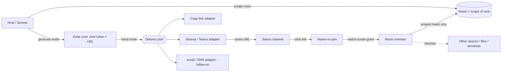

# Shared Rooms + Invite Links

## Summary

Turn a Tinstar workspace into a **room** — a scoped shared surface a teammate can join from a link, with no account and no password. The host generates an **invite link** for one room; a guest opens it, types a name (the ephemeral identity from the presence substrate), and lands in that room in **watch scope**. The room is the unit of sharing *and* the unit of access: a guest reaches only that room's runs, never the host's other spaces, file tree, terminals, or other people's work. Delivery of the link — pasting it, or having Serena post it to Teams — sits behind a small port so the core never has to know how a link travels.

## Problem Frame

Today the server has zero auth. There is no user, no session token, no invite, no membership — a grep of the codebase confirms only false positives. Every client that can reach the port sees everything: the single shared `/api/events` stream, every space (subject to the single-active-space filter), every REST route. That was fine when Tinstar was one person's dashboard on their own machine.

It stops being fine the moment a teammate joins. The host machine runs real production infrastructure. The runs on it can open files across the disk, drive terminals, and touch live systems. "Come look at this incident with me" cannot mean "here is my whole machine." The blast radius of an invite has to be *one room*, enforced on the server, not by asking the guest to be polite about which URLs they visit.

So this unit does two things at once. It introduces the **room** as a boundary that scopes what a participant can reach. And it introduces the **first access-control check the server has ever had** — room membership backed by a link token — sized so an unauthenticated caller poking at `/api/events` or a REST route cannot pull data from a room they were never invited to.

## Key Decisions

**A room is the unit of access scope, and its scope is a hard boundary — not a filter.** A room wraps a bounded set of runs: a space, or a session with the runs it owns. A guest who joins reaches those runs and nothing else. This is deliberately *not* "show the guest everything and hide the rest in the UI." Hiding in the client is not a boundary; anyone can open dev tools. The server must be able to answer, for every event it would push and every route it would serve, "is this participant a member of a room that contains this data?" — and refuse when the answer is no. The room is what makes that question answerable, because it is the thing membership is granted *to*. Blast radius equals one room by construction.

**Link, not login.** Access is granted by holding an unguessable link, not by proving who you are. There is no account, no directory, no password to reset. This is the release's headline promise and it is a real security decision: the link token *is* the credential. That forces the token to be unguessable, revocable, and optionally time-limited — the properties a bearer credential must have when there is nothing else standing behind it. It also means possession is the whole story: anyone the link reaches can walk in as themselves-by-name, which is exactly the low-friction join we want and exactly why the token must be easy to revoke the moment it leaks.

**Delivery is an adapter behind a port; the core only mints invites.** The core's job ends at "here is a room, here is a fresh token, here is the URL that carries it." *How that URL reaches a human* — copied to a clipboard, posted to a Teams channel by Serena, emailed, texted — is a delivery concern, and it varies per environment. We model delivery as a **port** (a named interface the core calls) with **adapters** behind it (concrete channels). v5.4 ships the port and a "copy link" adapter, plus a design that lets Serena's existing Teams/Jira channels and later email/SMS drop in as adapters without the core learning about any of them. The anchor scenario — Serena posting the incident link to Teams — must be an *adapter*, not a special case wired into invite generation. The alternative, letting the invite generator call Teams directly, was rejected: it welds the core to one channel and makes every new channel a change to the core.

**Guests watch here; co-driving is a later unit.** A guest who joins in v5.4 gets **watch scope** — they see the room's runs update live, they navigate their own viewport, they are present as a named participant. They do not drive prompts or fire actions. Letting guests *act* on the room's runs is capability-gated co-drive (Unit 4) and is explicitly out of scope here. Keeping v5.4 watch-only shrinks the security surface to "can this participant *read* this room" and defers "can this participant *act*" to the unit built to reason about it. The presence substrate (Unit 1) already models a guest as an identified participant holding capability grants, so watch-only is simply the grant set a join hands out today; co-drive widens that set later without re-architecting the join.

**LAN/localhost-first.** A room is reachable over the local network and loopback. Making the same link safe to click from the public internet is Tailscale reach (Unit 3) and is not required here. This unit assumes the network is already trusted-ish (a LAN, or a machine you can already reach) and focuses on the *room* boundary within it. Token security is still real work even on a LAN — a LAN is not a trust boundary — but we do not build tunneling or public exposure here.

## Requirements

**Room model**

R1. A room is a first-class server entity with a stable id. It names a bounded scope of runs: either a space (all runs in it) or a session together with the runs it owns. The room, not the guest's good behavior, defines what a member of it can reach.
R2. A room has a membership set: the participants (from Unit 1's presence model) currently granted access to it. The host who owns the workspace is implicitly a member of every room carved from it.
R3. A room's scope resolves to a concrete set of reachable runs (and the entities those runs need — their space, their transcripts, their status) at any moment. When a run enters or leaves the room's scope, membership does not have to be re-granted; scope is evaluated live, not frozen at join time.
R4. A room's scope explicitly excludes everything outside it: other spaces, the host's file tree, terminals not owned by the room's runs, and other rooms' runs. There is no route or event through which a room member reaches non-room data by virtue of that membership.
R5. Creating a room from an existing space or session must not move, mutate, or reparent the underlying runs. A room is an access wrapper over runs that already exist, not a new place they live.
R6. Room membership and the room→scope mapping are server-authoritative. Clients are projections of it (per the release's server-authoritative principle); a client cannot grant itself membership or widen its own scope.

**Invite link + token lifecycle**

R7. The host can generate an invite for a specific room. Generating an invite produces a token and a URL that carries it; it does not itself deliver the URL anywhere (see the delivery port).
R8. The token is unguessable — long and random enough that it cannot be brute-forced or predicted from another token. (The exact scheme is a planning detail; the requirement is the property.)
R9. An invite token grants access to exactly one room. A token never widens to other rooms, and the room it grants is fixed at generation.
R10. An invite is revocable. The host can revoke it, and after revocation the token no longer admits anyone; a guest already in the room on a revoked token loses access on their next server interaction (they are not silently left with a stale open stream).
R11. An invite may optionally expire at a host-chosen time. An expired token behaves like a revoked one: it admits no one.
R12. A room may have more than one live invite at once (e.g. a broad team link and a narrow one), and each is independently revocable and independently expirable, so revoking one does not evict guests admitted by another.
R13. The host can see a room's live invites and their state (active / expired / revoked) and revoke any of them. Invites are not fire-and-forget; the host stays in control of the credential after it leaves their hands.
R14. Token validation is enforced server-side on every room-scoped read — both the `/api/events` stream a guest subscribes to and any REST route that would return room data. A request bearing no valid, unrevoked, unexpired token for a room gets nothing from that room.

**Guest join (name-on-join, watch scope)**

R15. Opening a valid invite URL brings the guest to a name-on-join step (Unit 1's ephemeral identity): they enter a display name and become an identified participant. No account, no email, no password.
R16. On join, the guest is added to the room's membership set with **watch-scope** capability grants only — enough to read the room's runs and be present, not to drive prompts or fire actions.
R17. A joined guest sees the room's runs update live, over the bidirectional channel from Unit 1, scoped to the room. They do not receive deltas for anything outside the room's scope.
R18. A guest has their own per-participant viewport (Unit 1): where they look in the room does not move the host's view or any other participant's. Joining does not hijack the single-active-space server global.
R19. A guest opening an invalid, expired, or revoked link is refused with a clear, non-leaking message — refusal reveals nothing about the room, its runs, or whether the token was ever valid.
R20. A guest's presence in the room is visible to the host and other members (they can see who is watching), consistent with Unit 1's participant presence.

**Delivery port**

R21. Link delivery is defined by a **port**: a named interface the core calls to hand a freshly minted invite (room reference + URL, plus enough human-readable context to introduce it) to some channel. The core depends on the port, never on a concrete channel.
R22. The port interface is defined at the decision level — what any adapter must implement to satisfy it — so a new channel is a new adapter, not a change to invite generation. At minimum an adapter accepts an invite (room label + URL + optional message) and reports whether delivery succeeded.
R23. v5.4 ships at least a **"copy link" adapter**: the host copies the invite URL to the clipboard to share by whatever means they like. This adapter is the proof that the port works with zero external dependencies.
R24. The abstraction must not assume a single channel or a single recipient. It must be shaped so that Serena's existing Teams/Jira publishing, and later email and SMS, can each be an adapter — the anchor scenario (Serena posts the invite to a Teams channel) is served by a Serena/Teams adapter calling the same port the copy-link adapter uses, not by special-casing Teams in the core.
R25. Concrete non-clipboard adapters (Teams, Jira, email, SMS) may be follow-on work. The requirement for v5.4 is the port plus the copy-link adapter plus a design demonstrably able to host the Serena/Teams adapter — not the shipped Teams adapter itself.

## Key Flows

F1. **Serena posts an incident link; the team joins the room.**
   **Trigger:** A server is down. The host (or Serena on the host's behalf) has an incident workspace — a space, or the incident session and its runs — and wants the team in it.
   **Actors:** Host, Serena (delivery adapter over Teams), teammates joining as guests.
   **Steps:**
   1. The host creates (or already has) a room scoped to the incident workspace.
   2. The host generates an invite for that room → core mints an unguessable token and the carrying URL.
   3. The invite is handed to the **delivery port**; the **Serena/Teams adapter** posts the URL, with a short human-readable intro, to the incident Teams channel.
   4. Teammates click the link, hit name-on-join, and enter a name.
   5. Each becomes a room member with watch-scope grants and lands in the room, seeing the incident runs update live in their own viewport.
   **Outcome:** The whole team is in one shared live room working the same casefile — no message-passing back and forth — and every one of them can reach only that room's runs. Nothing else on the host machine is exposed.

F2. **Host revokes a link.**
   **Trigger:** A link leaked, the incident is over, or the host wants to cut off a specific invite.
   **Actors:** Host, guests currently in the room on that token.
   **Steps:**
   1. The host opens the room's invite list and revokes the target invite.
   2. The server marks the token revoked; validation for it now fails.
   3. Guests admitted by that token lose access on their next server interaction — their stream stops delivering room data and they are informed access ended.
   4. Guests admitted by *other* still-live invites to the same room are unaffected.
   **Outcome:** The revoked link admits no one, present or future, without disturbing legitimately-invited members.

## Acceptance Examples

AE1. **A guest cannot reach non-room data.** *(Covers R4, R14, R17)*
   Given a host machine running several spaces, a file tree, and terminals, and a room scoped to just the incident space,
   When a guest joins that room via a valid invite and then requests `/api/events` and any REST route that would return another space's runs, files, or terminals,
   Then they receive only the incident room's data and are refused everything outside it — with no leakage through the event stream or any route.

AE2. **An expired link admits no one.** *(Covers R11, R19)*
   Given an invite the host set to expire at a time now passed,
   When a teammate opens the link,
   Then they are refused with a non-leaking message and never reach name-on-join or the room.

AE3. **A revoked link evicts on next interaction.** *(Covers R10, R14)*
   Given a guest currently watching a room on a token the host then revokes,
   When the guest's client next interacts with the server (next stream event, next request),
   Then room data stops flowing to them and they are told access ended — they are not left holding a live stream on a dead token.

AE4. **Revoking one invite does not evict guests on another.** *(Covers R12)*
   Given a room with two live invites and guests admitted by each,
   When the host revokes the first invite,
   Then guests admitted by the first lose access and guests admitted by the second keep watching uninterrupted.

AE5. **Watch-only guests cannot act.** *(Covers R16)*
   Given a guest joined in watch scope,
   When they attempt to drive a prompt or fire an action on a room run,
   Then the server refuses — acting requires co-drive grants this unit does not hand out.

AE6. **Serena's Teams post is an adapter, not a core dependency.** *(Covers R21, R22, R24)*
   Given the Serena/Teams adapter registered behind the delivery port,
   When the host generates an invite and routes it through that adapter,
   Then the link is posted to Teams by the adapter calling the same port the copy-link adapter uses — and disabling or swapping the adapter changes nothing in invite generation.

AE7. **Name-on-join needs no account.** *(Covers R15)*
   Given a valid invite,
   When a teammate opens it,
   Then they reach the room by entering only a display name — no email, no password, no account creation.

## Scope Boundaries

**Deferred for later (reachable on this substrate):**
- **Co-drive** — guests acting on the room's runs, capability-gated — is **Unit 4**. v5.4 guests are watch-only; the presence model already carries capability grants so co-drive widens the grant set without re-architecting join.
- **Tailscale reach** — making the room link safe over the public internet — is **Unit 3**. This unit is LAN/localhost-first and builds no tunneling or public-exposure code.
- **Concrete non-clipboard delivery adapters** (Teams, Jira, email, SMS) may be **follow-on** work. v5.4 ships the port + the copy-link adapter + a design that can host the Serena/Teams adapter; the shipped Teams adapter itself can land after.

**Outside this product's identity:**
- **Accounts, passwords, user directories, roles.** Access is by link token and name-on-join, full stop. Any persistent-identity or login system is the "Outside identity" line the release does not cross — identity is ephemeral and possession-based by design.

## Dependencies / Assumptions

- **Unit 1 (Presence substrate)** is a hard dependency. This unit builds membership, invites, and scoped reads *on top of* Unit 1's per-participant identity, per-participant viewport, and bidirectional channel. Name-on-join, "a guest is an identified participant holding capability grants," and per-guest viewport all come from Unit 1; a room grants membership to those participants and hands them the watch-scope grant set.
- Assumes the current single-process server (`src/server/standalone.ts`), single shared SSE stream (`src/server/api/sse.ts`), and REST routes (`src/server/api/routes.ts`) are the surfaces the room boundary must be enforced across — this unit adds the **first server-side access check** to those surfaces.
- Assumes the single-active-space global (`activeSpaceId` in `src/server/stores/document-store.ts`, and the space filter in the SSE broadcaster) is being broken by Unit 1's per-participant viewport; room scoping composes with that per-participant model rather than the server global.
- Assumes no change to how runs, spaces, or sessions are created or stored — a room is an access wrapper, not a new entity in the `Initiative → Epic → Task → Worktree → Run` taxonomy.

## Outstanding Questions

**Resolve before planning:**
- **What can a room be scoped to in v5.4 — space only, session-with-runs only, or both?** The doc allows both; planning should confirm whether shipping one shape first (likely space) reduces the enforcement surface enough to be worth narrowing.
- **Where does token validation live so it covers both the SSE stream and REST uniformly?** A guest reaches room data through two doors (`/api/events` and REST routes); the check must be one boundary both pass through, or the two drift and one leaks. This is the load-bearing enforcement decision.
- **How does a revoked token evict a guest holding an open SSE connection?** "Loses access on next interaction" needs a concrete mechanism — server tears the stream, or the stream re-validates per delta. Planning must pick one; the acceptance example (AE3) depends on it.

**Deferred to planning:**
- Exact token format, length, and how it rides the URL (path segment vs query vs fragment) — crypto and encoding specifics.
- Whether invites persist across server restarts (via `getConfigRoot()`-rooted config) or are memory-only for v5.4.
- The precise shape of the delivery port interface (method names, invite payload fields, sync vs async, success/failure reporting) — decided at the interface-definition level here, detailed in planning.
- Host-facing UI for generating, listing, and revoking invites — where it lives on the canvas/room chrome and how it renders invite state.
- Whether a guest's watch presence should be rate-limited or connection-capped per room to bound resource use from a widely-shared link.
