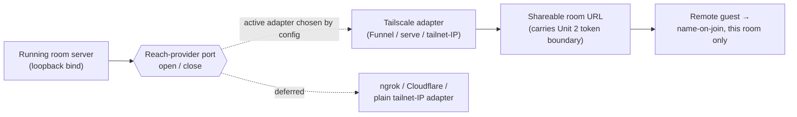

# Tailscale reach — a room link that works over the public internet, safely

## Summary

A per-room, opt-in way to make a shared room's invite link reachable by a remote teammate over the public internet, without exposing the whole machine to the LAN or the internet. Reach is expressed as a port-and-adapter abstraction: a "reach provider" takes a running room server and returns a shareable URL plus a teardown handle. Tailscale is the first adapter behind that port; other tunnel providers can follow without the room or invite code learning which one is in play. Reaching the URL is not authorization — it still lands the visitor at name-on-join, scoped to that one room.

---

## Problem Frame

Today the server binds all interfaces by default and accepts `--host` / `TINSTAR_HOST` (`src/server/standalone.ts`), and Tailscale is mentioned only in a JSDoc hint on the `host` option — there is no tunnel or proxy code anywhere. So the only way a remote teammate reaches a room is for the operator to hand-widen the bind surface, which exposes the entire dashboard on whatever interface they opened, to everyone who can route to it. That is exactly the wrong shape for the anchor scenario: Serena posts an incident-room invite link to Teams, the team clicks it from wherever they are, and they should land in that one room — not on a machine-wide open port.

The move this unit makes is to give a room a first-class, revocable, per-room way to be reachable from outside, decoupled from how the process binds its sockets. Reachability becomes a property the host grants to a specific room and can take back, not a global network posture.

---

## Key Decisions

- **A reach-provider port, not Tailscale-specific glue.** The room and invite code (Unit 2) must never call Tailscale directly. They depend on an interface — given a running room server, produce a shareable URL reachable by invited remote participants, and a teardown that revokes it. This keeps the door open for an ngrok-style tunnel, a Cloudflare tunnel, or a plain tailnet-IP address later, chosen by config, with zero change to room/invite logic. It mirrors the invite-abstraction port already introduced in Unit 2 — same shape, one layer down the stack (invites decide *who is allowed in*; reach decides *how the bytes arrive*).
- **Tailscale is the first and only shipped adapter.** We build the port and exactly one real implementation. Tailscale is chosen because the host machine plausibly already runs it, it gives an authenticated network layer (tailnet) plus an optional public front (Funnel), and it needs no third-party account signup in the common case. Shipping one adapter proves the port without paying for breadth we do not need yet.
- **Reachability is not authorization.** This is the load-bearing security decision. Making a URL routable from the public internet must not widen the access scope one inch beyond the room. A reach URL carries the same room-scoped token boundary from Unit 2: reaching it still drops the visitor at name-on-join for that room only, with the room's watch/co-drive scope, and no path to other rooms, other spaces, or the machine. The mental model is a semi-public Teams meeting link — functionally shareable, forwardable, and therefore assumed to leak — so the room-scope boundary, not link secrecy, is what contains the blast radius.
- **Opt-in per room, never always-on.** Public reach is a deliberate act on a specific room, not a machine mode. A room is LAN-only until a host turns reach on for it, and turning it on for one room grants nothing to any other room. Closing the room, or toggling reach off, revokes reachability cleanly.

---

## Requirements

**Reach provider port**

R1. A reach provider is an interface with two operations: open — given a handle to a running room server (its local bind/URL and room id), return a shareable URL reachable by invited remote participants; and close — tear down whatever the open established and revoke the URL.
R2. Room and invite code depend only on the reach-provider interface, never on a concrete provider. Which provider is active is resolved from configuration, not hardcoded at any room/invite call site.
R3. The shareable URL a provider returns is a normal room URL — it carries the room's Unit 2 invite/token boundary in the same form a LAN room URL does, so nothing downstream of the URL needs to know reach is involved.
R4. Opening reach for a room is idempotent and reentrant: asking twice for the same room yields the same shareable URL rather than stacking tunnels, and closing a room that never opened reach is a no-op.
R5. A provider reports its own availability (for example, "Tailscale not installed / not authed") so the host gets a clear reason rather than a silent failure when reach cannot be granted.

**Tailscale adapter**

R6. The Tailscale adapter implements the reach-provider port using Tailscale's own sharing surface (Funnel / serve, or a tailnet-scoped address — see Outstanding Questions) to front the room's local server.
R7. The adapter never re-binds the room server to a wider interface to achieve reach; it fronts the existing local (loopback) bind. Widening the process bind surface stays out of the reach path entirely.
R8. Any adapter state (tunnel handles, chosen mode, per-room reach records) that must persist is written under `getConfigRoot()`, never `homedir()`, honoring `TINSTAR_CONFIG_HOME` so a second backend does not stomp the primary's reach state.
R9. When Tailscale is unavailable or unauthed on the host, the adapter surfaces that condition through R5 rather than throwing an opaque error, and the room stays LAN-only.

**Security boundary**

R10. A reach URL grants no more than a LAN room URL: it lands the visitor at name-on-join for exactly one room, with that room's watch/co-drive scope, and exposes no route to other rooms, other spaces, or machine-level surfaces.
R11. Turning on reach for one room grants nothing to any other room; each room's reachability is independent.
R12. The token/scope check that gates room entry (Unit 2) runs identically whether the request arrived over LAN or over a reach URL — the reach path adds no bypass and removes no check.
R13. Reach exposes only the room-serving HTTP surface, not machine-level or cross-room API surface; a request over the reach URL that targets outside-the-room scope is refused the same way it would be on LAN.

**Lifecycle & visibility**

R14. Public reach is opt-in per room: a room is LAN-only until a host explicitly enables reach for it.
R15. A room that is publicly reachable shows a visible, persistent indicator saying so, distinguishable from a LAN-only room, so the host is never unaware a room is exposed.
R16. A host can turn reach off for a room without closing the room; doing so revokes the shareable URL and returns the room to LAN-only.
R17. Closing a room tears down its reach automatically (close is called), so no room outlives its own reachability and no tunnel is orphaned.
R18. Enabling and disabling reach emit state changes onto the event bus / SSE bridge like other room state, so every connected client's reach indicator reflects the true current state.

---

## Key Flows

F1. **Host enables public reach on a room**
  - **Trigger:** a host toggles reach on for one room.
  - **Actors:** the host; the active reach provider (Tailscale adapter); the room server.
  - **Steps:** the room resolves the configured provider and calls open with the running room server; the Tailscale adapter fronts the room's local bind and returns a shareable URL; the room records reach-on and flips its visible reachability indicator; the state change broadcasts over SSE.
  - **Outcome:** the host holds a shareable URL for that room, sees the room marked publicly reachable, and no other room or machine surface has been exposed. **Covers R1, R3, R6, R7, R14, R15, R18.**

F2. **Remote guest joins over the reach URL**
  - **Trigger:** a remote teammate opens the shared URL (for example from a Teams post).
  - **Actors:** the remote guest; the reach layer; the room's Unit 2 join/token gate.
  - **Steps:** the request arrives over the reach URL; the same room-scoped token/scope check runs as on LAN; the guest lands at name-on-join for that one room and enters with the room's watch scope.
  - **Outcome:** the guest is inside one room only, with no route out of it — reachability got them to the door, room-scope authorization decided what is behind it. **Covers R3, R10, R12, R13.**

F3. **Reach revoked (toggle off or room closes)**
  - **Trigger:** the host turns reach off, or the room closes.
  - **Actors:** the host or room-close path; the reach provider.
  - **Steps:** close is called on the provider; the tunnel/serve front is torn down; the shareable URL stops resolving; the room returns to LAN-only (or is gone) and the indicator clears; the state change broadcasts.
  - **Outcome:** the previously shared URL no longer reaches anything; no orphaned tunnel remains. **Covers R16, R17, R18.**

---

## Acceptance Examples

AE1. **Covers R10, R12, R13.** Given a room with reach enabled, when a remote guest opens the reach URL, then they land at name-on-join for that room only, and any request over that URL aimed at another room or a machine-level API is refused exactly as it would be on LAN.

AE2. **Covers R16, R17.** Given a reachable room, when the host toggles reach off (or closes the room), then the shareable URL stops resolving and the room's Tailscale front is torn down, with no orphaned tunnel left behind.

AE3. **Covers R11, R14.** Given two rooms where only room A has reach enabled, when someone tries the reach front, then only room A is reachable from outside and room B remains LAN-only.

AE4. **Covers R5, R9.** Given a host without Tailscale installed or authed, when the host tries to enable reach, then they get a clear "Tailscale not available" reason and the room stays LAN-only rather than failing silently.

AE5. **Covers R4.** Given a room that already has reach enabled, when reach is requested again for that room, then the same shareable URL is returned rather than a second tunnel being stacked.

---

## Scope Boundaries

**Deferred for later**

- Additional reach adapters (ngrok-style tunnel, Cloudflare tunnel, plain tailnet-IP as a distinct provider). The port must accommodate them; we ship only the Tailscale adapter now.
- Custom domains, vanity URLs, or link-shortening on top of the provider's URL.
- Per-URL expiry or rotation of the reach URL itself (the room-scope token from Unit 2 is the security boundary; URL rotation is an additive hardening, not required here).

**Outside this product's identity**

- Self-hosted TURN/STUN/relay infrastructure, or building our own tunneling transport. Reach delegates to an existing provider (Tailscale); we do not run network relay infrastructure.
- Accounts, SSO, or any password-based auth. The access model stays invite-link + name-on-join (Unit 2); reach only changes how the bytes arrive, never who is allowed in.
- Machine-wide public exposure or a global "expose everything" mode. Reach is per-room and opt-in by construction.

---

## Dependencies / Assumptions

- **Unit 2 (Shared rooms + invite links)** — provides the room concept, the invite-link/token boundary, and name-on-join. This unit makes that room link reachable from outside and depends on its token/scope gate being the thing that authorizes entry. Reach reuses Unit 2's invite abstraction pattern one layer down.
- **Unit 1 (Presence substrate)** — indirectly, via Unit 2; reach does not touch the presence channel directly.
- **Assumption: Tailscale is installed and authenticated on the host.** The Tailscale adapter assumes a working, logged-in `tailscale` on the machine. When that assumption does not hold, R5/R9 govern the behavior (clear reason, room stays LAN-only) rather than this unit provisioning or authing Tailscale.
- **Assumption: the room server already binds loopback locally.** The adapter fronts that existing local bind (`src/server/standalone.ts` always co-binds `127.0.0.1`); it does not widen the process bind surface to achieve reach (R7).

---

## Outstanding Questions

**Resolve before planning**

- **Which Tailscale surface: Funnel vs serve vs tailnet-IP.** Funnel exposes to the full public internet (matches the "Teams link anyone can click" scenario but is the widest surface); serve / a tailnet-scoped address keeps reach inside the tailnet (safer, but the remote teammate must be on the tailnet, which breaks the click-from-anywhere anchor scenario). The choice sets how "public" public reach actually is and should be settled before building the adapter — possibly configurable per room, defaulting to the narrower option.
- **How the host's Tailscale auth/availability is detected.** What signal the adapter reads to satisfy R5/R9 (CLI presence, `tailscale status`, socket probe) and how fresh that check must be at enable-time.

**Deferred to planning**

- Exact placement and visual form of the "publicly reachable" room indicator (R15) and the reach on/off toggle.
- Whether reach state persisted under `getConfigRoot()` should re-establish the tunnel on backend restart, or whether reach is intentionally ephemeral and must be re-enabled after a restart.
- How a reach-enabled room surfaces to agents/CLI (if at all) versus staying a purely host-facing control.
