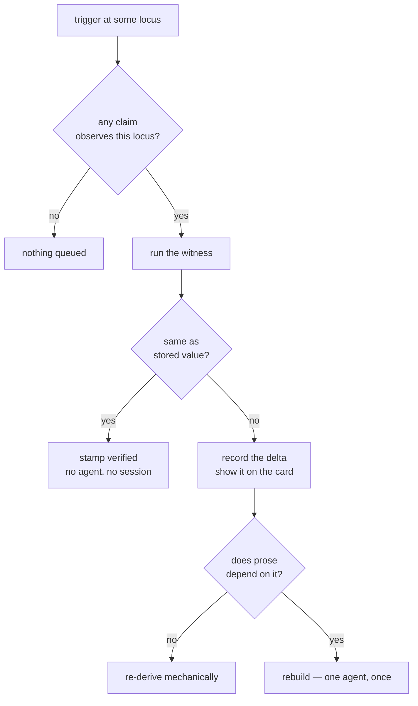

# Slate claims and witnesses

## Summary

Give a Slate surface a way to declare what would prove it wrong, and give the host a way to check
that declaration cheaply and continuously without waking an agent. Ship it as two surfaces: a
roadmap card whose truth lives in the repo, and a small card whose truth lives in deployed infra.

---

## Problem Frame

The Slate is meant to replace the conversation scroll, and it does not, because it is not trusted.
The stated reason is staleness. Two distinct failures produce that impression, and they pull in
opposite directions.

**Rot.** A surface that declares no refresh recipe receives an empty trigger list, therefore no
deadline, therefore `overdue` can never rise and its phase stays `current` forever. Nothing in the
system is capable of doubting it. The roadmap surface sat in exactly this state and asserted that
shipped work was still pending. Measured on the live Slate: seven of seven real surfaces have no
recipe, all seven report `current`, and all seven render no freshness mark at all — including one
that has never been verified in its life.

**Storm.** A commit fires every surface bound to that worktree, and owner delivery is exempt from
the concurrency cap on the grounds that it "costs no port and no session." Ten surfaces became ten
prompts into one working session. In one measured session 57 refresh jobs fired, 45 of them
commit-triggered and 12 periodic, and essentially all reported "no change"; across the current job
table 110 of 121 completed refreshes reported no change and 6 reported a real change. The trigger
firing most of them was a commit against surfaces whose sources are AWS security groups, HTTP
endpoints, and pull request states — none of which a commit can move.

Every approach floated so far tunes the trigger, which is a single dial with rot at one end and
storm at the other. The two failures cannot both be fixed by moving it.

The named prior art is exact. The storm is a cache stampede. The rot is Bazel's undeclared-input
problem — an action whose inputs are not declared cannot be correctly invalidated, and the fix is
not better guessing but making undeclared inputs impossible to ignore.

---

## Key Decisions

**Detection and repair are separately typed.** Today a trigger goes straight to an agent session.
The model splits that into revalidation (run a witness, compare a value, stamp verified — no model,
no session) and rebuild (an agent rewrites prose, only when a value actually moved). The measured
corpus says revalidation covers roughly nine refreshes in ten — 110 of 121 completed refreshes
changed nothing — so the rebuild path is a real branch rather than an empty one.

**Semantics are paid at authoring, not at refresh.** "Has U4 shipped?" is only a semantic question
as phrased. Rephrased as evidence — a merged commit carrying the unit tag — it becomes a shell
command. The author does the interpretive work once, when it knows most, instead of on every
invalidation when it knows least.

**Witnesses observe predicates, not pointers.** At the time a roadmap step is written its pull
request does not exist, so the claim cannot name one. It names the shape of the evidence instead.
This also makes a not-yet-started step *verified as pending* rather than unverifiable, so a roadmap
has no unverifiable half.

**A closed witness registry, not free-form commands.** An agent names a witness kind and its
parameters; the host owns the code that runs it. This is the A2UI trade applied to observation —
closed vocabulary, open composition — and the project already accepted that trade once. It makes
validation real and it removes the whole class of mis-scoped witnesses for covered kinds. A marked
escape hatch for raw commands is the expected end state, but shipping it before the registry has
anything in it guarantees the hatch wins.

**Claims live beside the body, not inside it.** A surface carries a list of claims that components
reference by id. A2UI stays a rendering vocabulary, revalidation runs without parsing or rendering a
body, and the reconciler never needs to understand components. The accepted cost is drift: a claim
and the component displaying it can disagree, and nothing structural prevents it.

**Claim loci are the only trigger narrowing.** Declared source paths are not pursued, so a claim's
locus is the single thing deciding whether a trigger reaches a surface, rather than a third mechanism
beside the rebuild recipe and a declared source list. It also keeps the storm criterion honest: on
`main` today a commit reaches every surface bound to its worktree, so zero jobs on the infra card is
an observation rather than a property of already-written code. The cost is that the storm continues
at current rates until claims ship.

**Two surfaces, not one.** The roadmap is the surface where the commit trigger is genuinely
correct, so a roadmap-only slice cannot demonstrate the storm fix, and with other surfaces disabled
the storm disappears by construction. A second card bound to a different locus is what converts the
storm fix from an assertion into an observation.

**`unwitnessed` is a label, and it lands with the slice.** A surface with no claims reports
`unwitnessed` rather than `current`. It gates nothing. Landed before the slice it would mark seven
of seven cards and carry no information; landed with the slice it discriminates immediately.

**Surfaces are semi-ephemeral.** Slate content is disposable and cheap to re-author, so the claim
model needs no migration path. Existing surfaces are wiped rather than converted. The durable
artifact is the witness registry, not the cards — which is why the registry is worth building before
anything that composes it.

---

## Actors

- A1. **Authoring agent** — writes a surface into its worktree, including the claims it believes
  would falsify the content, and runs each witness once to record the value it was correct against.
- A2. **Host refresh coordinator** — owns the registry, runs witnesses on their locus schedule,
  compares against stored values, and stamps verification. Runs with no live owner session.
- A3. **User** — reads the surface and needs to distinguish "checked ninety seconds ago" from
  "nobody has ever checked this."

---

## Requirements

**The claim model**

- R1. A surface may declare zero or more claims. Each claim names a witness kind, the parameters
  that witness needs, and the locus it observes. Claims live in a list beside the A2UI body and are
  referenced from components by id.
- R2. Witness kinds resolve against a closed host-owned registry. A surface naming an unknown kind is
  refused; because the file-ingress path drops an invalid entry and leaves the prior record's content
  on screen, the refusal is reported on the affected card rather than only logged.
- R3. Each claim records the value its witness returned at authoring time. That value is the fixed
  point the surface was correct against.
- R4. A claim's locus determines which trigger kinds can invalidate it. A trigger at a locus no
  claim on that surface observes advances nothing and queues no work.
- R5. A witness returns one narrow value — a status word, an exit code, a count, or a digest. An
  oversized return is a defect in the witness, not in the claim.
- R18. A surface that declares one or more claims acquires a verification deadline and the trigger
  kinds its claim loci imply, whether or not it declares a rebuild recipe.
- R19. A claim's declaration — kind, parameters, locus — is author-owned content. Its last observed
  value and its authoring-time fixed point are host-owned freshness state, excluded from the source
  watermark basis.
- R20. Each witness kind declares a parameter schema. A claim whose parameters do not conform to its
  kind's schema is refused the same way an unknown kind is.
- R22. Every newly authored surface declares at least one claim. This is authoring convention rather
  than boundary enforcement: R2 checks that a witness kind exists, never that a claim is present.

**Revalidation**

- R6. The host revalidates a claim by running its witness and comparing the result to the stored
  value.
- R7. A revalidation in which every claim matches stamps the surface verified and changes nothing
  else. No agent session is involved.
- R8. A revalidation in which a value moved records which claim moved and both the old and new
  values.
- R9. Revalidation runs without a live owner session and survives a server restart.
- R10. A moved value is reported on the surface before any rebuild runs.
- R17. Rebuild dispatch counts against the concurrency cap regardless of dispatch kind, so one locus
  event cannot fan out into unbounded prompts against a single owner session.

**Honest reporting**

- R11. A surface that declares no claims reports `unwitnessed` rather than `current`.
- R12. `unwitnessed` gates no controls and changes no scheduling. It is a label.
- R13. The visible age of a surface reflects its last successful verification, not only the last
  time its content changed.
- R21. A surface with no successful verification shows no age, rather than falling back to the time
  its content was last edited.

**The first slice**

- R14. Two surfaces ship: a roadmap card whose claims are all repo-locus, and a small card whose
  claims are all infra-locus.
- R15. The registry ships two kinds and no others: one that reports whether a named unit has landed,
  taking a plan document path plus a unit id and resolving through the merged pull request that names
  both; and one that reports the status code returned by a URL.
- R16. The roadmap's step statuses derive from claim values without an agent.

---

## The revalidate / rebuild split

The left path is the one the measured corpus needs in roughly nine cases out of ten, and the system
has never been able to take it.

---

## Key Flows

- F1. Revalidation with no change
  - **Trigger:** A claim's locus schedule comes due.
  - **Actors:** A2
  - **Steps:** The host runs each witness; every value matches its stored value; the surface is
    stamped verified and its visible age resets.
  - **Outcome:** The card shows it was checked, seconds of cost, no session touched.
  - **Covers:** R6, R7, R13

- F2. A witness value moves
  - **Trigger:** A witness returns a value different from the stored one.
  - **Actors:** A2, then A1 only if prose depends on the claim.
  - **Steps:** The host records which claim moved and both values; the card reports the change; a
    mechanically-derived component re-derives from the new value; a rebuild is queued only where
    prose depends on the claim.
  - **Outcome:** The user sees what changed immediately; at most one agent session results.
  - **Covers:** R8, R10, R16

- F3. A commit lands and the infra card ignores it
  - **Trigger:** The worktree moves to a new revision.
  - **Actors:** A2
  - **Steps:** The host matches the trigger's locus against each surface's claims; the roadmap's
    repo-locus claims match and revalidate; the infra card's claims do not match and nothing is
    queued.
  - **Outcome:** One commit produces work on one surface instead of all of them.
  - **Covers:** R4

---

## Acceptance Examples

- AE1. A pending step is verified, not unverifiable
  - **Covers R3, R16.**
  - **Given** a roadmap step whose claim is that a unit has landed, and the unit has not landed
  - **When** the host revalidates
  - **Then** the witness returns no match, that absence matches the stored value, and the step is
    reported as verified and pending — not as unknown or overdue

- AE2. A trigger at the wrong locus queues nothing
  - **Covers R4.**
  - **Given** a surface whose claims are all infra-locus
  - **When** the worktree moves to a new revision
  - **Then** no job is created for that surface and its verification state is unchanged

- AE3. A claimless surface stops reporting currency
  - **Covers R11, R12.**
  - **Given** a surface that declares no claims
  - **When** it is rendered
  - **Then** it reports `unwitnessed`, its controls remain usable, and no refresh is scheduled

- AE4. Successful verification clears the age signal
  - **Covers R13.**
  - **Given** a surface whose content last changed four hours ago
  - **When** a revalidation matches every claim
  - **Then** the visible age reflects the verification and not the four-hour-old content change

- AE5. An unknown witness kind is refused
  - **Covers R2.**
  - **Given** a surface file naming a witness kind absent from the registry
  - **When** the host validates it
  - **Then** the surface is refused, no partially-claimed surface is stored, and a re-authored surface
    whose prior version is still on screen reports the refusal on the card

- AE6. A never-verified surface shows no age
  - **Covers R21.**
  - **Given** a surface that has never been successfully verified
  - **When** it is rendered
  - **Then** it shows no age at all, rather than the time its content was last edited

---

## Success Criteria

- The roadmap surface does not assert a wrong unit status at any point during the observation
  window.
- A commit against the worktree produces zero refresh jobs for the infra-locus card.
- Revalidation across the observation window spawns zero agent sessions.
- A claimless surface is visually distinguishable from a verified one at a glance.

The slice cannot test whether the Slate replaces the conversation scroll. The roadmap is a tracking
surface, not a decision surface, and scroll abandonment is a property of decision surfaces. Success
here means rot and storm are fixed, not that the product goal is met.

---

## Scope Boundaries

- The witness registry beyond the kinds the two slice surfaces need.
- The escape hatch for raw commands. Registry-only for the slice; the marked lower-confidence
  witness is the expected end state, deferred until the registry has coverage worth defaulting to.
- Missing UI components — Markdown, Table, a dedicated Claim component, sparkline, timeline.
- Card templates and any library of pre-defined surfaces. The reusable unit is the witness, not the
  card.
- The authoring skill, apart from the single line R22 states. The rest waits until the model is
  proven.
- The execution gate that requires a witness to have run at authoring time.
- Slate-locus claims, in which one surface's state invalidates another. Real and cheap, but not
  needed to prove rot or storm with two surfaces.
- Refresh-on-read, in which a human looking at the Slate is itself a trigger.
- Re-purposing the periodic tick as a semantic audit of whether a witness still asks the right
  question.
- Request coalescing and single-flight. The slice's storm fix is locus matching, not deduplication.
- Migration of existing surfaces. They are wiped, along with the replies and status accumulated on
  them. An agent can re-author a body, so what is actually lost is the prior user rulings; that loss
  is accepted deliberately.

---

## Dependencies / Assumptions

- Slate content is semi-ephemeral, so no migration path is required and breaking the surface
  contract is acceptable.
- Unit ids are not repo-unique. Eighteen plan documents under `docs/plans/` each number their units
  `U1..Un`, and tags on `main` already vary — `(U6)`, `(U1e)`, `(U1, part 1)`, and follow-ups with no
  tag at all. A witness that substring-matches commit subjects therefore returns false positives as
  well as false negatives, which is why the unit witness keys on a plan path plus a unit id.
- The repo-locus witness must advance the remote ref itself before reading it. Feature PRs
  squash-merge remotely and nothing in the host fetches — the existing git trigger reads local HEAD
  only — so a merged unit reads as pending until something fetches.
- The two witness kinds in this slice observe none of the surfaces that produced the measurements.
  Those surfaces need AWS-API, HTTP-body, and issue-tracker observations, so they stay recipe-driven
  and unwitnessed until the registry grows. The slice demonstrates the model; it does not retire the
  measured rot or storm.
- The host may execute registry-owned commands against the worktree and against live infrastructure.
  The first release is trusted-local, so this is a scheduling and timeout concern rather than an
  isolation one.
- PR #164's declared-source-path narrowing is not pursued. It is unmerged, so `main` carries no
  path-glob filter today. The same branch's periodic-interval floor and its handling of a source that
  has disappeared are unaffected and still wanted; only the path narrowing is dropped.
- The periodic interval fix in commit `f5f0226e` raises the default from 30 minutes to 6 hours but
  is not present in the running build. Measurements taken before it is deployed overstate periodic
  volume by roughly an order of magnitude.

---

## Outstanding Questions

- How a witness that hangs or times out is distinguished from one that returns a changed value.
- Whether the existing `recipe` field remains the rebuild instruction unchanged, with claims purely
  additive.
- How `unwitnessed` renders. The requirement is that it is distinguishable; the visual treatment is
  a design decision downstream.

---

## Sources / Research

- `docs/plans/2026-07-24-001-feat-recursive-collaborative-surfaces-plan.md` — lines 38-39 state the
  problem this work exists to solve, four days before the freshness engine landed. U1, U2, U3 and
  U6 are merged; U4, U5, U7 and U8 are not.
- `src/server/surfaces/surface-trigger-matcher.ts` — `effectiveDeclaration` gives a recipe-less
  surface an empty trigger list, and `deriveDueAt` returns undefined without a periodic trigger.
  Together these are the mechanism behind the rot.
- `src/server/surfaces/surface-refresh-coordinator.ts` — owner delivery is exempt from the
  concurrency cap, which is the mechanism behind the storm.
- `src/components/RunWorkspaceWidget/FreshnessBadge.tsx` — a `current` surface renders no badge.
- `src/components/RunWorkspaceWidget/SurfaceAge.tsx` — the visible age reads `amendedAt`, so a
  successful no-change verification never clears it.
- `src/domain/types.ts` — `SurfaceSourceBinding.adapter` is an open string so a new adapter is a
  registry entry rather than a schema migration. `SurfaceFreshness.lastReasonKeys` is a hand-rolled
  per-kind version vector, added after a single-slot reason field caused two triggers to overwrite
  each other.
- `CONCEPTS.md` — Surface, Addressable point, A2UI, and the dismissed-versus-deleted distinction.
- Prior art for the vocabulary: HTTP caching (RFC 9111 and 5861) for fresh, stale, validator,
  revalidation, `stale-while-revalidate` and `must-revalidate`; TanStack Query for the stale-but-shown
  interaction states and window-focus refetching; Oracle materialized views for the `FRESH` /
  `STALE` / `UNKNOWN` / `UNUSABLE` staleness states; Bazel for hermeticity and declared inputs.
