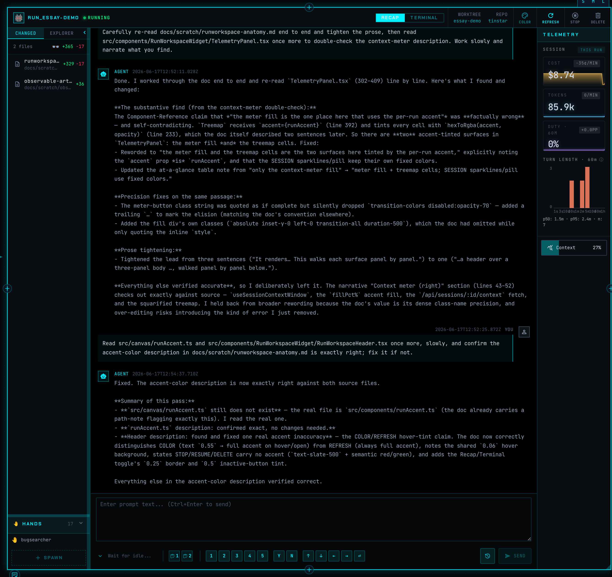
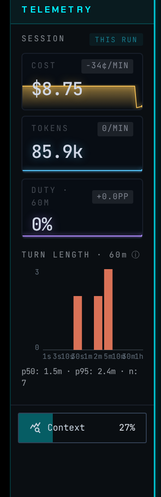

# Out of Your Brain, Onto the Pane

*A flyover of Tinstar — an IDE built for the messy middle of human/AI collaboration — and the two convictions every feature is built to serve.*

*One agent, one card. Everything you'd otherwise be holding in your head — what it's working on, what it's changed, how full its context is, whether it's alive — sitting on the glass instead.*

---

Most tools for working with AI agents are chat windows. Tinstar isn't. It's a human-facing workspace built on top of the agent-facing text control plane — an IDE for the moment when you're not writing code yourself so much as steering a fleet of agents that are.

Everything in it follows from two convictions.

**The first: text is for robots, pictures are for humans.** An agent reads and writes text natively — that's its whole world. A human does not; a human reads a wall of scrollback and *reconstructs* meaning from it, line by line, every time. So Tinstar lets the agent keep operating in text, and translates that text into structured visual surfaces for you. Same underlying state, two audiences, two representations. The agent gets its stream; you get a status light, a diff, a meter, a badge.

**The second: get it out of your brain and onto the pane.** When you run a fleet, the scarce resource isn't compute — it's *you*. The finite amount of state you can hold about what every agent is doing, what's blocked, what's done, what quietly died an hour ago. Every fact you have to keep in your head is a tax you pay on every glance. So the design rule is relentless: anything you'd otherwise have to remember should be visible on the screen instead. Out of your brain, onto the pane of glass.

What follows is a flyover of the major features, each one an answer to those two ideas.

## The run workspace

A *run* — one agent doing one task — gets a single card on the canvas. The card carries its identity color and a status light you can read from across the room, so a blocked agent and a busy one no longer look identical. Inside, a three-panel workspace: a live **changed-files** panel with +/- counters and a file tree on the left, a **terminal / recap** toggle in the center (the raw ttyd scrollback is still one click away — honesty preserved, not hidden), and a **telemetry** rail on the right.

That telemetry rail is the thesis in miniature. It shows cost, tokens, and cache-hit sparklines, and a **context-fullness meter** — a treemap of how the agent's context window is allocated (messages, system prompt, tools, memory, skills) that goes amber at 75% and red at 85%. "How close is this agent to running out of room to think?" is exactly the kind of fact you used to track in your head, or not at all until it bit you. Now it's a colored bar. 

## The hierarchy view

Work nests: **Initiative → Epic → Task → Run**. The left sidebar shows that nesting as a live tree, always in sync with the canvas — click a card and its ancestors expand and highlight; double-click and the canvas flies to it. You can reorder with the keyboard, nest with Tab, add children from a kebab menu. The point is that the *organizational structure of your work* — which agent belongs to which task belongs to which goal — lives on screen as a navigable map, not in your memory as a thing you hope you've kept straight.

## The inbox

The same sidebar flips to an **inbox**: a flat, triaged list of every session in the space, sorted so the ones needing you float to the top. Each row is an avatar, a name, a breadcrumb back up the hierarchy, a color-coded status dot, and how long ago it last moved. Filter by urgency, hide what you've read, click a row to fly the canvas to it. This is "doneness at a glance" made literal — instead of scanning four walls of output to reconstruct *where was I*, you read a list that already did the reconstruction for you.

## Built-in browser, file viewer, image viewer

An agent's work spills outside the terminal, so the workspace has first-class viewers for it. The **browser widget** embeds live web pages right on the canvas (with a header-injecting proxy so authed pages just work, and a captured dev console for local debugging). The **file editor** opens any file — dragged from the tree or onto the canvas — with Monaco syntax highlighting and a full-screen zoom. The **image viewer** shows an image from a session's workspace and *watches the file on disk*, auto-refreshing the instant the agent regenerates it. You don't go fetch the artifact and you don't wonder if it's stale; it's on the glass, current, next to the agent that made it.

## The saloon

Agents talk to each other over NATS pub/sub, and the **Saloon** widget puts that conversation on screen. Snap it to a session and it shows that session's subscribed subjects and the live inbound/outbound message traffic; leave it floating and it shows the whole `tinstar.>` firehose. Each row is a timestamped from/subject/payload you can click open in full.

This is where orchestration stops being a black box. When a wrangler agent fans work out to a team of hands and they report back, that coordination chatter is normally invisible — you infer it from results. The Saloon makes the message-passing *legible*: you watch the orchestration happen, see which agent pinged which, and catch a stalled handoff in the traffic instead of in the silence afterward. Multi-agent coordination, lifted out of the wire and onto the pane.

## The plugin system

Tinstar's surface is extensible through an in-process **plugin system** (v5). A plugin ships a manifest and an `activate(api)` function, registers its own widgets and commands through the host API, and can declare a backend server the host will health-check and start for it. Bundled and external plugins use the exact same API — no second-class tier — and a failed plugin shows a banner instead of taking down the app. The reason this matters for the two goals: it means *any* domain — a roadmap, a chart, a dashboard, a sibling project's UI — can become a native visual surface on the canvas, snappable and addressable like everything else.

Two examples make the case. **Stretchplan** is a Gantt-style timeline planner — you drag task bars across month columns, assign teams, draw dependencies, and track progress, all autosaved to a single JSON file. On the canvas it's a browser widget showing the live plan plus a bridge widget that follows whatever task you're focused on and publishes it (`plan.task`) to the rest of the constellation. Because it can invoke `session.prompt` on a run docked beside it, you can point at a task in the plan and tell the agent next to it to *start working on this one* — the roadmap becomes a control surface, not a doc you re-read.

**Whoachart** is the other end of the spectrum: a declarative flow-chart engine. You author a graph of states and transitions, and watch concurrent units of work — "marbles" — flow through it on the canvas, with agent sessions linked visually to the nodes they're working. Think a manufacturing line for agents rather than a chart of past data. Both plugins make the same move the whole product makes — take something you'd otherwise track in your head or in a separate tab, and put it on the glass beside the work it describes.

## The constellation

Finally, the feature that ties the spatial model together. A **constellation** is a group of 2–9 widgets that snap together, move as one, and share a numbered slot you can jump to with a digit key. Drag a file viewer near a session and a snap-halo appears; drop it and they're bound, with a slot badge to prove it. Alt-drag pops one back out.

Snapping is more than tidy arrangement — it's a *capability bus*. Constellated widgets can discover and invoke each other's capabilities without knowing about each other: a task-picker publishes a selection, a detail pane consumes it, all because they're in the same slot. And the gesture language isn't only for you — an agent can spawn a widget and ask for it snapped beside the session that created it. The spatial layout becomes a shared coordinate system for human and agent alike, which is the whole project in a sentence: a workspace where what's in your head, and what's in the agents', ends up out where you can both see it.

---

None of these features is the product. The *conviction* is the product: that the human's attention is the thing worth conserving, and the way you conserve it is to stop making people hold state in their heads. Text for the robots. Pictures for the humans. Out of your brain, onto the pane.
