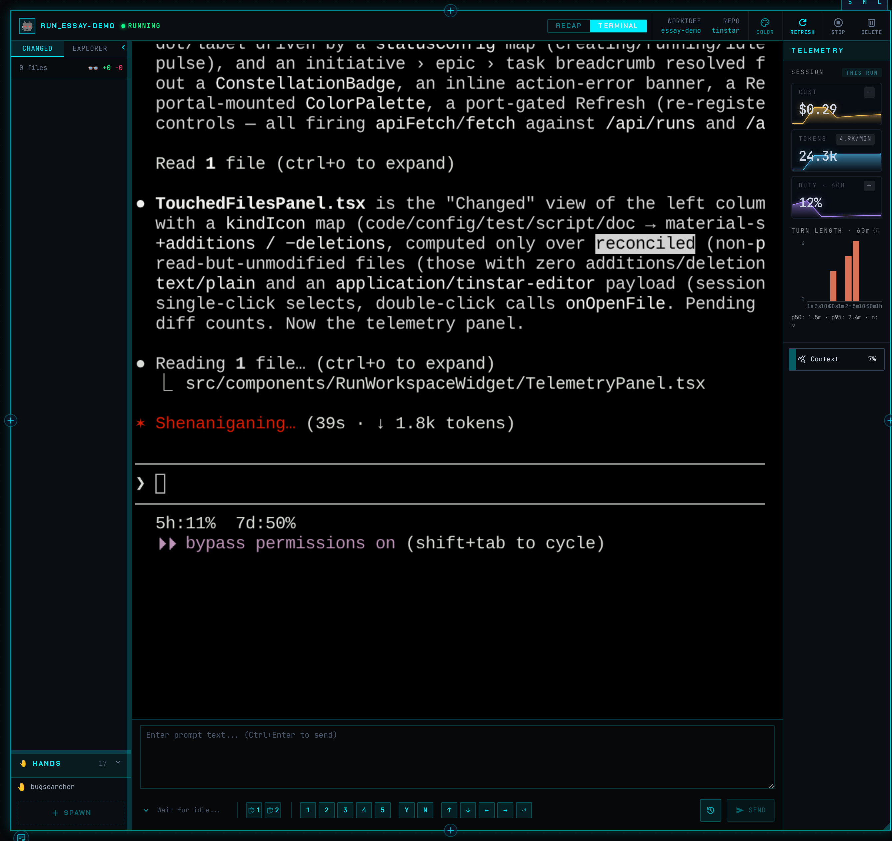
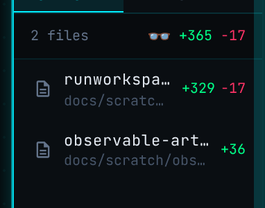
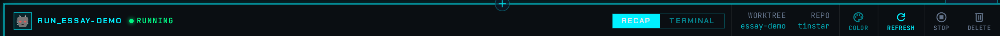

# The Tmux Grid Problem

*Why managing a fleet of AI agents needs more than a wall of terminals — and the three design decisions Tinstar made instead.*

*One agent, one card. The same run a tmux pane would show as an anonymous rectangle of scrollback — here with an identity color, its repo and worktree, a live diff, a context meter, and a status light you can read from across the room. The rest of this essay is about why it looks like this.*

*The same card, Terminal tab. The grid's raw scrollback isn't thrown away — it's one toggle inside the card, sitting next to the derived status, diff, and context meter. You get the grid's honesty (look at exactly what's there) without losing the dashboard's leverage (everything else, already parsed for you).*

---

There's a moment every heavy agent user arrives at. You've got Claude Code refactoring one service, Codex writing tests in another repo, a third agent chasing a flaky CI failure, and a fourth you started an hour ago and have honestly forgotten about. So you do the obvious thing. You tile them. A 2x2 of tmux panes, or four iTerm splits, or a grid of browser tabs. One glance, all four agents, problem solved.

Except it isn't. Give it twenty minutes and the grid betrays you. Pane two has scrolled three thousand lines past the thing you cared about. Pane four is sitting at a `Do you want to proceed?` prompt that's been blocking for ten minutes, and you have no idea, because from across the room a blocked agent and a busy agent look identical: a rectangle full of text. You start each morning by squinting at four walls of output trying to reconstruct *where was I*.

The tmux grid is the null hypothesis for multi-agent work. It's the thing you build by reflex before you build anything better. And it's worth taking seriously as a baseline, because every design decision in Tinstar is, in some sense, an answer to a specific way the grid fails.

This is an introduction to three of those decisions. Not the plumbing — the convictions underneath it.

## 1. The bottleneck is you, not the machine

Here's the thing the grid gets wrong at the most basic level: it optimizes for the wrong scarce resource.

A tmux grid is a layout optimized for *output density*. It assumes the constraint is screen real estate — fit as many live streams as possible into the pixels you have. That was the right assumption when the scarce thing was the program running in the pane. When you were the one typing into one terminal, the terminal's job was to show you as much of *your own work* as it could.

But the work changed. Now it's you plus a fleet, each agent on a different task, in a different codebase, at a different stage. Compute got cheap and parallel. What didn't scale is **you** — your attention, the finite amount of state you can hold about what every agent is doing, what needs a nudge, what's done and waiting, and what quietly died an hour ago.

Once you name attention as the bottleneck, the grid's whole premise inverts. The problem was never *showing you more output*. You don't want more output; you're drowning in output. The problem is **doneness at a glance** — looking at the screen and immediately knowing the *shape* of the work without reading a single line. What's burning. What's waiting on you. What's finished. The grid makes you do that reconstruction manually, every time, with your eyes and your short-term memory. That's the context-switching tax, and you pay it on every glance.

This is also why Tinstar treats "the UI must feel like a video game" as a hard requirement rather than a nice-to-have. It sounds like a vibe statement; it's actually a consequence of the bottleneck. If your attention is the scarce resource, then *every interaction that makes you wait is spending the one thing you can't get back*. Lag, blocking spinners, animations that you have to sit through — these aren't cosmetic annoyances. They're taxes on the exact resource the whole system exists to protect. Agent work is a tight loop: nudge, observe, nudge again. Anything that adds friction to that loop breaks it. So state updates are pushed, not polled; updates are optimistic; feedback is immediate. The interface has to disappear so your attention can stay on the work.

> **The decision:** Treat the human's attention as the scarce resource the entire product is built to conserve. Optimize for *doneness at a glance*, not output density. Snappy is correctness, not polish.

The grid optimizes pixels. Tinstar optimizes you.

## 2. Where a thing sits is information

Now look at how a tmux grid arranges itself. It tiles. You split a pane and the geometry rearranges to fit; you close one and everything reflows. The *position* of a pane carries no meaning — it's just wherever the tiling algorithm put it this second. Pane three isn't pane three because it's related to pane two. It's pane three because it's third.

That throws away one of the most powerful things a human brain does for free: spatial memory. You can remember where you left your keys, where a shop is on a street you walked once, where a paragraph sat on a page. We navigate space without conscious effort. A layout that reshuffles itself can't tap any of that, because nothing is ever in the same place twice.

Tinstar's second decision is to make **arrangement meaningful and stable**. The canvas is an infinite, Figma-style surface, and where you put a thing is *yours*. Cluster sessions by project. Put the urgent work top-left where your eye lands first. Group a session with the file editor and the browser tab that belong to it. Nothing auto-tiles, nothing reflows, nothing repacks behind your back. The canvas remembers, so it becomes a stable map you build intuition around — a memory palace for your work instead of a stream you re-read.

And because position is information, *shape* becomes information too. A tight cluster reads as cohesive work; things spread out read as loosely related. You learn the topography of your own canvas the way you learn a neighborhood, and after a few days you stop *searching* for sessions and start just *knowing* where they are. The grid can never give you that, because it never lets anything stay put.

The flip side of "freedom to arrange" is that arranging shouldn't be tedious, so widgets snap to each other magnetically as you drag — with anchor points, so a viewer can attach to a session's right edge and stay there. That snapping turns out to be more than a convenience. It's a *gesture language* that agents themselves can speak: an agent can spawn a widget and ask for it snapped beside the session that created it, and the canvas arranges it without a human touching anything. The spatial model isn't just for you. It's a shared coordinate system for you and your agents both.

> **The decision:** Space is a first-class information channel. Arrangement is meaningful, persistent, and never auto-managed — because a stable map is what lets spatial memory do the work your conscious attention would otherwise have to.

The grid puts panes where the tiler wants them. Tinstar puts them where *you* will remember them.

## 3. Assume the agent doesn't know you exist

The third decision is the least obvious and, I'd argue, the most important. It's about how the dashboard learns what the agents are doing.

The tempting approach — the one most integrations reach for first — is cooperation. Ask the agent to tell you. Install a hook that fires when it starts a tool. Wire up a callback on completion. Have the agent emit a status event you can subscribe to. If the agent reports its own state, the dashboard's job is easy: just listen.

Tinstar tried this and ripped it out. The principle that replaced it is blunt:

> **Observable artifacts over agent cooperation — assume the agent doesn't know Tinstar exists.**

The reason is durability. Agent-specific hooks are a contract with a moving target. Every agent reports differently, and every agent *upgrades* — and when it does, your hook is the thing that silently breaks. You end up maintaining a fragile integration per agent, and the failure mode is the worst kind: the agent is fine, the dashboard just quietly goes blind and tells you everything is `idle` while real work is happening. A status board you can't trust is worse than no status board, because now you're double-checking it against the grid you were trying to escape.

So Tinstar derives everything from what the agent *leaves behind* in the operating system, whether or not the agent ever heard of Tinstar:

- **Is it actually working right now?** Tinstar walks the process tree. It asks tmux for the pane's shell PID, finds the agent process running under it, and checks whether *that* process has children. An agent mid-tool-call — running a build, a grep, a test — has spawned child processes. Children present means genuinely working; children gone means idle. It debounces across a couple of polls so a quick command doesn't flicker the state. This is an OS-level signal. It works for Claude Code and Codex and, crucially, for an agent that doesn't exist yet, because every one of them runs *subprocesses* and the kernel tracks them whether the agent likes it or not.

- **What is it doing?** Tinstar tails the agent's transcript file — the JSONL log it writes anyway — reading the last several lines rather than the whole thing. The last assistant entry tells you whether a tool call is pending. It tracks the file's byte offset to notice rotation or truncation. The agent isn't reporting to Tinstar; Tinstar is reading the diary the agent keeps for its own reasons.

- **What changed on disk?** A loop runs `git diff --numstat` and `git ls-files` against each session's working directory and reports the real, current file changes. Not what the agent *claims* it touched — what git can *see* it touched.

These loops run on plain intervals — process status every few seconds, file changes every ten, a liveness reconcile against tmux every thirty — and they cross-check each other. If the agent dies, gets killed in another terminal, or a signal is missed, the reconcile loop notices the tmux session is gone and corrects the record. The system is designed to be eventually correct even when individual sensors lie or miss, because it never depended on any single one of them being honest.

Here's the contrast with the grid, and it's sharper than it first looks. The grid is *also* "observable" — it shows you the raw output, the ground truth, nothing filtered. But it pushes the entire interpretation burden onto you. The bytes are all there; *you* are the parser. You read the scrollback and decide "okay, that one's waiting on input." Tinstar makes the same observation the grid does — it watches the same artifacts — but it does the parsing *for* you, continuously, and renders the conclusion as a status you can read at a glance. It's the grid's honesty (look at what's really there, don't trust self-reports) married to the dashboard's leverage (don't make the human do the reading).

*(An honest footnote, since this doubles as documentation: the codebase today derives `running` and `idle` from these signals and reconciles liveness against tmux. A finer-grained "needs attention after N minutes idle" state is described in the docs but is still aspirational — the escalation logic isn't wired up yet. The observation machinery is real; one rung of the interpretation ladder is still a TODO.)*

## 4. What it all looks like in one card

The three principles above are abstract until you see where they converge. So here's the payoff object: the **run workspace**, the widget that represents a single agent run on the canvas. It's worth walking through field by field, because each one is a tmux pane's missing answer to a question you ask constantly.

**Color.** Every run gets an accent color — cyan by default, but settable, and inheritable from the task, epic, or initiative it belongs to (set a project's color once and every run under it is born wearing it). That color isn't decoration. It's identity. The run's border, its title, the fill on its changed-files bar, its status — all tinted with it. And critically, it *propagates*: open a file editor or a browser from a run and that satellite widget inherits the same accent, so across a busy canvas you can see at a glance which scattered widgets belong to which agent. The color is the thread that ties a run's whole workspace together in space. A tmux pane has no identity; it's the same monochrome rectangle as the one next to it, and a file you opened "for that agent" has no visible connection to it at all.

**Repo and worktree.** The header carries two small mono labels: `REPO` and `WORKTREE`. The repo is where the work lives; the worktree is *which checkout* — if the run was given its own git worktree, the field shows it, and if it's working in the main checkout, the field is blank. Two glances tell you something you'd otherwise reconstruct by reading a shell prompt: is this agent isolated, or is it editing the same working tree as that other one? In a grid, that's a `git rev-parse` and a `pwd` away — per pane, every time you wonder.

**Changed files.** Down the left panel is the live diff: a count, a green `+N` and red `-N` summary, and a per-file list — each with its own additions and deletions. Files the agent *read but didn't modify* show an eye (👁) instead of a number; files still being reconciled show a quiet `...`. This is observable artifacts made visible. The data is the same `git diff --numstat` (plus staged and untracked) the loop runs every ten seconds against the run's working directory — git's ground truth, not the agent's account of itself. The grid can show you a diff too, of course. You just have to type it, in the right pane, and re-type it every time you want to know if anything moved.

**Context meter.** The right panel has a horizontal bar — filled in the run's accent, labeled with a percentage — showing how full the agent's context window is. It polls a couple of times a second, and when there's no reading yet it shows `--`, not a fake `0%`. Click it and the bar expands into a treemap that breaks the window down by category: conversation messages, system prompt, built-in tools, MCP tools, memory files, skills, the autocompact buffer, and the free space left before compaction. This is the one signal the grid can't show you *at all*, no matter how hard you squint at the scrollback — how close an agent is to running out of room to think. (It's also the one place Tinstar leans on an agent-emitted artifact: it reads Claude Code's statusline push rather than an OS signal. Same philosophy — read what the agent already writes down — just a softer surface than a process tree.)

**Status.** And in the header corner, the thing the whole essay is about: a colored dot with a glow, pulsing when the agent is active, beside an uppercase label — `RUNNING`, `IDLE`. That dot is the rendered conclusion of the process-tree and transcript inspection from the last section. You don't read the pane to learn the state. The state is a light you can see from across the room.

Put them together and the run workspace is a single card that answers, without you doing any work: *whose is this, where is it, what has it changed, how much room does it have left, and is it waiting on me right now.* The tmux grid can surface every one of those facts. It just makes you go get each of them, one command at a time, for every agent, forever. That difference — facts pushed to you versus facts you fetch — is the whole game.

## The three decisions are one decision

It's tempting to read these as three separate features — a nice UI, a spatial canvas, a clever status detector. They're not. They're three faces of a single stance, and they only work because they reinforce each other.

Start from *attention is the bottleneck*. That immediately demands **doneness at a glance**, which is impossible if you have to read output to know status — so you need status *derived for you*, which is **observable artifacts**. And glance-ability collapses the moment things move around, because a glance relies on muscle memory for *where* to look — so you need **stable, meaningful space**. Pull any one out and the other two lose their point. Observable status with no spatial map is just a list of badges. A beautiful canvas that can't tell you what's blocked is a prettier grid. Speed in service of nothing is a tech demo.

The tmux grid is what you get when you optimize for the machine: dense output, automatic tiling, raw streams, no opinion. It's a perfectly reasonable answer to the question *how do I see all my agents at once*. Tinstar is what you get when you change the question to *how do I spend the least attention staying oriented across all my agents* — and then take that question seriously enough to let it reshape the UI speed, the spatial model, and the status pipeline all at once.

The grid shows you everything and asks you to make sense of it. The bet behind Tinstar is that, with a fleet of agents and one of you, *making sense of it* is the whole job — and that's exactly the part the tool should be doing.
