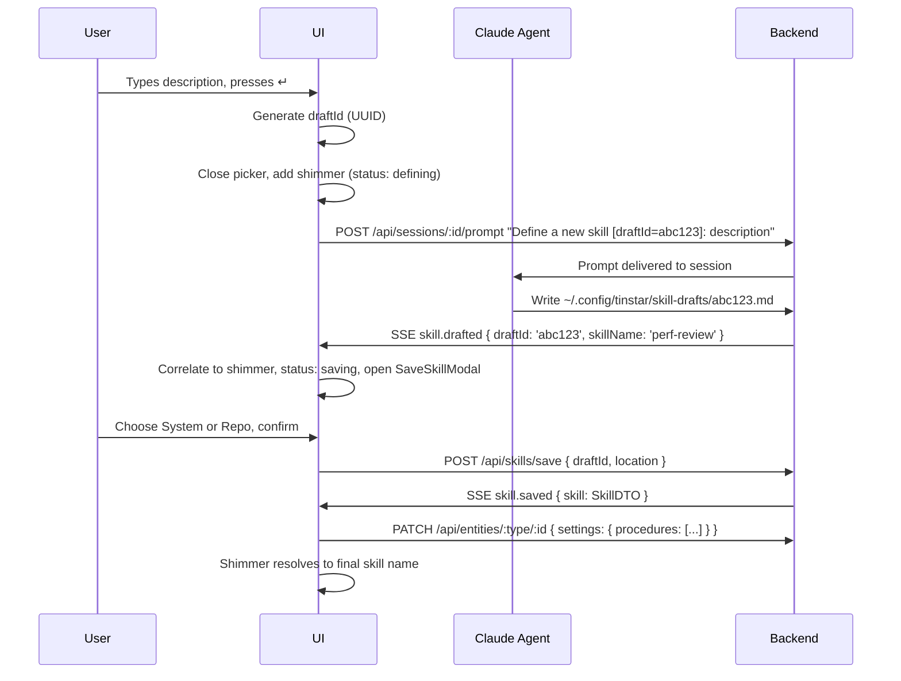

# Procedures Sidebar

A contextual shortcut bar inside each `RunWorkspaceWidget` that lets users pin Claude Code skills to their project hierarchy (Initiative / Epic / Task) and fire them as slash commands into the active session.

**Mental model:**
- **Skills** — reusable patterns discovered from the Claude Code filesystem. Timeless, global.
- **Procedures** — curated shortcuts into the skill library, scoped to a specific entity. Contextual, project-specific.

---

## Data Model

### `Skill` (runtime, never persisted)

Discovered from the filesystem on demand. `path` is server-side only and never sent to the client.

```typescript
// API response shape
interface SkillDTO {
  name: string
  description?: string
  source: 'system' | 'repo' | 'plugin'
}
```

Source badges: `sys` for `'system'` and `'plugin'`; `repo` for `'repo'`.

### `StoredProcedure` / `ResolvedProcedure`

A procedure is a reference to a skill, persisted inside `EntitySettings.procedures` on the owning entity. `entityId` and `entityType` are **not** stored — they exist only as runtime conveniences after hierarchy resolution.

```typescript
// Stored inside EntitySettings.procedures
interface StoredProcedure {
  id: string
  skillName: string   // matches SkillDTO.name
}

// Runtime shape after resolving the hierarchy
interface ResolvedProcedure extends StoredProcedure {
  entityId: string
  entityType: 'task' | 'epic' | 'initiative'
}
```

### `PendingSkill` (runtime shimmer state)

Tracks in-progress skill definitions. The `draftId` is generated client-side and included in the message fired to the agent (`"Define a new skill [draftId=abc123]: ..."`). When the backend emits `skill.drafted { draftId }`, the UI correlates it to the matching shimmer entry.

```typescript
interface PendingSkill {
  id: string               // client-generated UUID = draftId
  placeholderName: string  // typed description, shown while agent works
  status: 'defining' | 'saving' | 'error'
  entityId: string
  entityType: 'task' | 'epic' | 'initiative'
}
```

---

## Procedure Inheritance

When a run is active, the UI calls `resolveEntityProcedures(taskId, taxRepo)` which merges procedures from Task → Epic → Initiative:

```
Task.settings.procedures      → entityType: 'task'
+ Epic.settings.procedures    → entityType: 'epic'
+ Initiative.settings.procedures → entityType: 'initiative'
```

The sidebar renders task-own procedures first, then a labeled divider for inherited procedures (labeled by entity name). Only ancestor levels that actually exist are shown.

---

## Skill Discovery

Skills are discovered by scanning these directories on every picker open, with a **7s in-memory TTL cache**. Scanning is lazy — triggered by picker open, not on mount.

| Source | Directory | `source` value | Badge |
|--------|-----------|----------------|-------|
| System commands | `~/.claude/commands/` | `'system'` | `sys` |
| System skills | `~/.claude/skills/` (subdirs) | `'system'` | `sys` |
| Repo | `.claude/commands/` (project root) | `'repo'` | `repo` |
| Plugins | `~/.claude/plugins/cache/**/skills/*/` | `'plugin'` | `sys` |

Each location is scanned for `.md` files. Frontmatter `name` and `description` fields are parsed. Missing directories are silently skipped. The cache is explicitly busted when a new skill is saved via `bustSkillCache()`.

Plugin skill lookup priority within a skill directory: `<skillName>.md` → `SKILL.md` → `skill.md` → `index.md`. Duplicate names across versions are deduplicated (first encountered wins).

---

## UI Components

### `ProceduresPanel`

Fixed 160px sidebar panel inside `RunWorkspaceWidget`.

- **Inherited group**: procedures from Epic/Initiative, shown above a divider with entity name label
- **Task group**: task-own procedures
- Each row: icon + skill name + `▶` run button (visible on hover). `▶` is disabled and shows "Session is busy" tooltip when session status is `running`
- **Shimmer rows**: optimistic entries for in-progress skill definitions — pulse animation with typed placeholder name
- **`+ New` button**: opens `SkillPickerModal`

### `SkillPickerModal`

Full-screen overlay with centered command picker (480px wide).

- Input placeholder: `"Search or define skill…"` — dual-purpose search/define
- Typing filters skills by name
- Each skill row shows: icon, name, description, source badge, star button
- **Star button** → inline entity popover showing ancestor levels that exist for the current session's task (missing ancestors hidden, not greyed out). Selecting an entity adds the procedure optimistically.
- **No match state**: list collapses to a single define row: `Define "[typed text]" as new skill… ↵`
- **Partial match state**: filtered results + define row at bottom
- `↵` on define row: closes picker, fires to agent, adds shimmer entry

### `SaveSkillModal`

Small modal appearing after the agent drafts a new skill (triggered by `skill.drafted` SSE event).

- Shows skill name preview from draft frontmatter
- **System** (`~/.claude/commands/`) or **Repo** (`.claude/commands/`) save location
- Confirm → `POST /api/skills/save` → file written, procedure persisted, shimmer resolves
- Cancel → `POST /api/skills/discard` → draft deleted, shimmer fades out

### `SkillsProvider` + `useSkills`

`SkillsProvider` is mounted once globally (wrapping `WorkspaceShell`) to ensure only one SSE listener handles `skill.drafted` events — preventing duplicate `SaveSkillModal` renders.

`useSkills` is **lazy** (exposes `fetchSkills()`, does not fetch on mount). It subscribes to `skill.drafted` and `skill.saved` SSE events and exposes `pendingSkills: PendingSkill[]` for shimmer state.

---

## API

```
GET    /api/skills
  Returns: { skills: SkillDTO[] }
  Cache: 7s in-memory TTL, busted on save

POST   /api/skills/save
  Body:    { draftId: string, location: 'system' | 'repo' }
  Returns: { skill: Skill }
  Errors:  409 { error: 'skill-name-conflict', existingPath: string }

POST   /api/skills/discard
  Body:    { draftId: string }
  Returns: { ok: true }

POST   /api/sessions/:id/prompt
  Body:    { text: string }   // e.g. "/design"
  Returns: { ok: true }
  Errors:  400 session-not-ready (not idle), 503 input-unavailable

PATCH  /api/tasks/:id         (existing route)
PATCH  /api/epics/:id         (existing route)
PATCH  /api/initiatives/:id   (existing route)
  Body:  { settings: { procedures: StoredProcedure[] } }
  — procedures are persisted via the standard entity PATCH routes
```

**`POST /api/sessions/:id/prompt`** only accepts sessions in `'idle'` state. All other states return `400 session-not-ready`. The frontend run button is disabled for non-idle states; the 400 guard is a safety net.

---

## Define-New-Skill Flow



**Staging directory:** `~/.config/tinstar/skill-drafts/` — backend watches with `fs.watch`. On new file, parses frontmatter for `name` field (fallback: `draftId`), emits `skill.drafted`.

**Timeout:** If no `skill.drafted` arrives within 30s, shimmer transitions to `'error'` state (red tint + retry button). Retry re-fires the prompt.

---

## SSE Events

Two event types added to the `BusEvent` discriminated union:

```typescript
{ type: 'skill.drafted'; draftId: string; skillName: string }
{ type: 'skill.saved';   skill: SkillDTO }
```

---

## Known Limitations

- **Custom prompts per procedure**: not supported (post-MVP)
- **Procedure reordering**: not supported (post-MVP)
- **Procedure hotbar** (keyboard shortcuts 1–8): not supported (post-MVP)
- **`POST /api/sessions/:id/prompt`** only works when the session is `idle` — cannot queue prompts for a busy session
