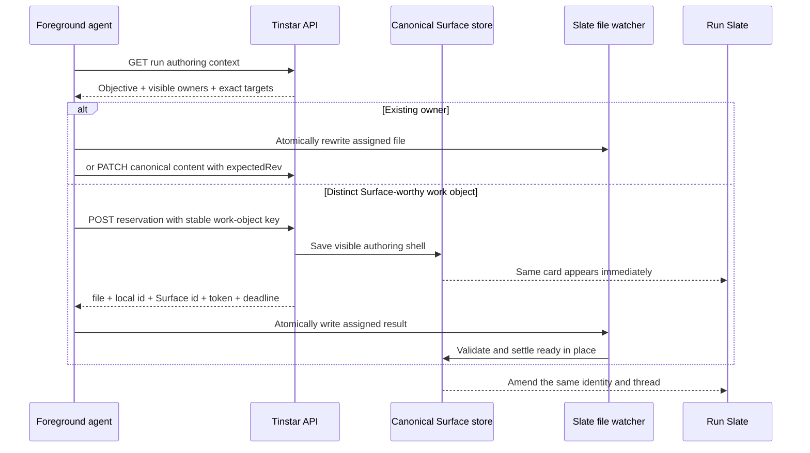

# Slate-first live authoring

The Slate is the primary workspace for a managed session. The transcript remains
available as supporting history, but a user should be able to understand the goal,
make required choices, and judge the result from the Slate.

This guide is the source of truth for the product behavior. The exact A2UI file shape
and copy-paste authoring commands live beside the agent in
[`agent-skills/skills/slate-surface/SKILL.md`](../../agent-skills/skills/slate-surface/SKILL.md).
The reasoning and rejected alternatives remain in the
[`Slate-First Live Authoring plan`](../plans/2026-08-07-002-feat-slate-first-live-authoring-plan.md).

## Session start

When a person creates a session with an explicit prompt, Tinstar uses the same trimmed
text for two things:

1. the prompt delivered to the foreground agent; and
2. the session's reserved, user-owned Objective on the Slate.

The browser draws that Objective optimistically before provisioning finishes. The
server then persists it under the reserved `objective` identity. Persona text, Marshal
introductions, and other host-authored launch prose never become the Objective. Prompt
and Objective share a 32 KiB character limit and are rejected before provisioning
rather than truncated or summarized.

The Objective can later be edited in place. Pressing Apply persists the edit and nudges
the agent to realign; typing alone does not interrupt it.

## What earns a Surface

Surfaces represent work objects, not conversation turns.

- Always show an explicitly requested Surface, something the user must act on, the
  primary result needed to judge the Objective, or a blocker needing intervention.
- Never show raw logs, tool output, private reasoning, transient working pulses, tiny
  completed steps, turn receipts, or a duplicate of an existing Surface.
- Use judgment for evolving plans, progress, research, comparisons, explainers, risks,
  assumptions, and side threads. Prefer a Surface when it stands alone outside the
  transcript, will be revisited, evolves meaningfully, or supports action or evaluation.

New information about an existing work object amends its current Surface. Surface count
has no prescribed relationship to turn count.

## Layout and reflow

The Slate is a resizable working surface. Its cards form one column below 420 pixels, two
columns from 420 through 699 pixels, and three columns at 700 pixels or wider. Cards keep
their natural height and pack upward independently, so a short Surface does not leave a
row-sized hole beneath a tall neighbor. Grouped open points and other full-width work
objects remain section breaks across every column.

Reflow is local presentation state. Resizing, searching, hiding, minimizing, or amending
a Surface may move cards, but never changes their identities, canonical order, threads,
or refresh state. Keyboard traversal follows canonical order rather than the temporary
visual position. The Slate width remains a per-browser preference; individual card
coordinates are neither stored nor user-managed. The layout decision and rejected
alternatives are recorded in [ADR 0003](../adrs/0003-slate-masonry-reflow.md).

## Foreground authoring flow

Every supported managed agent receives the same versioned standing contract through
its provider's durable instruction mechanism. Claude, Codex, and Cursor are supported;
generic launch templates cannot promise delivery and are rejected for new sessions.
Existing running sessions adopt the contract on their next managed restart rather than
receiving a surprise mid-task prompt.



The run-scoped context endpoint is:

```text
GET /api/runs/:id/slate/authoring/context
```

It returns the Objective separately from visible work objects. Each work object includes
its canonical and run-local identity, authority, lifecycle and freshness state,
effective capabilities, and one amendment target:

- an absolute Slate file plus local id and current attempt token when applicable;
- a revision-gated canonical content endpoint; or
- an explicit unavailable reason.

For a distinct work object, the agent reserves one visible card through:

```text
POST /api/runs/:id/slate/authoring/reservations
```

The request carries a stable work-object key, label, and authoring request. Retrying the
same key after a lost response returns the same destination with `replayed: true`; a new
key means a genuinely new card. Reservation reuses the user composer's durable card
lifecycle but does not prompt the foreground agent, dispatch another author, or invoke
refresh.

Both endpoints require `x-tinstar-actor-kind: session` and an `x-tinstar-actor` equal to
the target run. This prevents accidental cross-run writes in Tinstar's trusted-local
model; it is routing consistency, not authentication against a malicious local process.

Direct unreserved `.tinstar/slate/*.json` files remain supported for scripts and older
automation. They do not have a saved shell before the first valid write, so interactive
foreground work uses reservation first.

## Interactions return to their owner

User replies and control answers persist before Tinstar attempts delivery. The injected
note names the owning canonical Surface, its run-local id, and its current file or
revision-gated content target. After acting, the agent amends that owner unless the
interaction introduces a distinct work object.

Delivery remains best-effort and generation-leased. If the foreground session is gone
or replaced, the reply remains on the Surface and the response reports
`delivered: false`; content and thread are never rolled back. Agent and process replies
do not deliver back into the session, preventing self-loops.

## Creation failures and recovery

The visible shell is the receipt that work was accepted.

- Invalid or missing assigned output fails the same card in place.
- A missed deadline becomes a visible timeout failure.
- Server restart re-observes assigned files before failing interrupted attempts.
- Retry keeps the Surface identity and position but issues a new attempt token.
- Output from an older attempt cannot replace a newer retry.
- Once ready, later writes to the same local identity amend content while preserving
  the thread and lifecycle; they do not re-enter authoring.

## Live authoring is not refresh

Foreground authoring writes useful work promptly. Refresh recipes synchronize an
already-authored Surface after its source drifts.

Live authoring never schedules refresh work or spawns ambient workers. Existing refresh
rules remain unchanged: prose agent recipes require deliberate human intent and use the
foreground owner; host recipes are closed, bounded machine checks; dirty last-known
content stays visible until an authorized replacement succeeds.

## Verification

Deterministic tests cover Objective bootstrap, standing-instruction delivery, context
and reservation admission, idempotent replay, creation recovery, owner-aware interaction
prompts, and the refresh boundary. The browser journey in
[`e2e/slate-first-live-authoring.spec.ts`](../../e2e/slate-first-live-authoring.spec.ts)
captures the Objective, authoring shell, ready card, and repeated interaction amendments
under one identity.

Model behavior is a separate dogfood gate: use the
[`Slate-first provider behavior matrix`](../examples/slate/slate-first-behavior-matrix.md)
against configured Claude, Codex, and Cursor sessions. A provider without a runnable
credentialed session is reported as skipped, never counted as passed.
