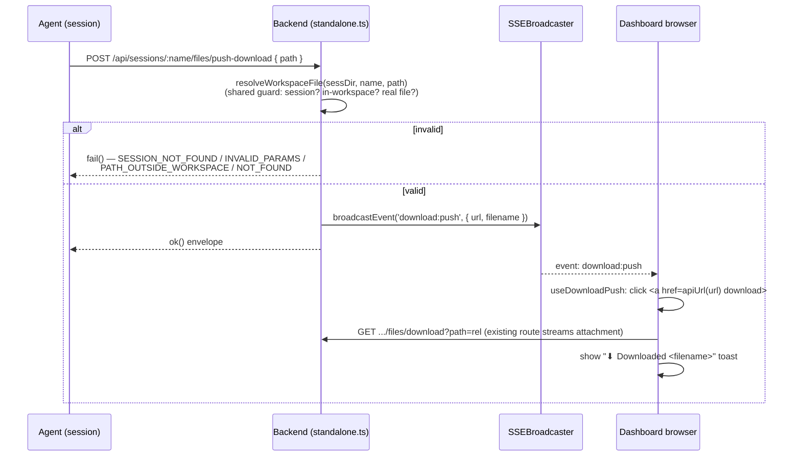

# feat: Agent-pushed browser downloads

## Summary

Let a Tinstar session agent push a workspace file straight to the user's open
dashboard browser so it downloads with no manual steps. Today the user asks an
agent to make a file, then hunts for it in the tree and clicks download. After
this change the agent makes the file and calls one endpoint; the open dashboard
auto-saves it to Downloads and flashes a short toast.

**Mechanism:** agent `POST`s to a new session-scoped endpoint → the server
validates the path is inside the session workspace and broadcasts an SSE
`download:push` event carrying the existing download URL + filename → every
connected dashboard receives it, clicks an invisible `<a download>` (same-origin
attachment, no dialog), and shows a "⬇ Downloaded `<name>`" toast.

The actual bytes still flow over the proven `GET .../files/download` route. The
new endpoint only *announces* — it never streams file content itself.

---

## Problem Frame

The agent's output lands on disk in its session workspace, but getting it into
the user's browser is a four-step manual chore (ask → click into tree → find
file → click download). The plumbing to fix this already exists but isn't
connected: a download route that forces an attachment, and an SSE broadcaster
that can push named events to every open dashboard. This plan wires those two
together behind a small endpoint and a thin agent-facing skill.

**In scope:** session-scoped push of one workspace-relative file to all
connected dashboards, with a toast confirmation.

**Explicitly out of scope (YAGNI):**
- Inline-view mode — always a forced download, matching today's behavior.
- Cross-session push (an agent pushing another session's file).
- Per-space or per-browser targeting — every connected dashboard tab downloads.
  Acceptable for the single-user case; documented in the skill.
- Arbitrary absolute disk paths — the path must resolve inside the workspace.

---

## Requirements

- **R1.** A new endpoint `POST /api/sessions/:name/files/push-download` accepts
  `{ path }` (workspace-relative), validates it, and broadcasts a `download:push`
  SSE event with `{ url, filename }`.
- **R2.** Path validation reuses the *exact* containment guard that
  `fileDownloadRoute.ts` uses today — extracted into a shared helper so the two
  routes cannot drift. Error codes mirror `fileDownloadRoute`'s `fail()` codes:
  `SESSION_NOT_FOUND`, `INVALID_PARAMS`, `PATH_OUTSIDE_WORKSPACE`, `NOT_FOUND`.
- **R3.** The endpoint returns the standard `ok()` envelope on success so the
  calling agent gets synchronous success/failure (not fire-and-forget).
- **R4.** The open dashboard receives `download:push`, triggers a browser
  download of `url` via a detached `<a download>`, and shows a transient toast
  naming the file.
- **R5.** A new agent-facing skill `tinstar-push-file` documents the one-curl
  workflow using `$TINSTAR_SESSION_NAME`, defaulting the base URL to
  `http://localhost:5273` and honoring `$TINSTAR_BACKEND_PORT` when set.
- **R6.** Unit tests cover the endpoint's success and every rejection path, plus
  the extracted shared helper.

---

## Key Technical Decisions

- **Dedicated endpoint over NATS or a generic broadcast endpoint.** A synchronous
  HTTP `POST` gives the agent a real 200/4xx it can report ("path escapes
  workspace"), validates the file server-side, and avoids opening a generic
  "broadcast any SSE event" hole that any process could abuse. (Approach A from
  the approved design.)

- **Reuse the existing download route for the actual transfer.** The
  `download:push` event carries a URL pointing at the proven
  `GET /api/sessions/<name>/files/download?path=<rel>` route. The new code only
  validates + announces; the streaming/`Content-Disposition` path is untouched.

- **Extract `resolveWorkspaceFile(sessDir, name, rel)` as a shared helper.**
  `handleFileDownload` currently inlines workspace resolution + the
  `resolve()` + `startsWith(wsRoot + '/')` containment check. Both routes must
  use identical logic or a future tweak to one silently weakens the other's
  security boundary. Extracting it once, imported by both, removes that drift
  risk and is independently unit-tested.

- **The push handler is wired ahead of `handleRequest`, like `handleFileDownload`,
  and receives `{ sessDir, sse }`.** `handleFileDownload` is invoked in
  `standalone.ts` before `handleRequest` with `{ sessDir }`. The push handler
  follows the same shape but additionally needs the `SSEBroadcaster`; it is
  reachable in `standalone.ts` as `ctx.sse` (the same instance `handleRequest`
  hands to route handlers as `ctx.sse`, e.g. the `projects_changed` and
  `canvas:viewport` broadcasts). Pass `sse: ctx.sse` into the handler.

- **No generic toast system exists — add a small purpose-built one.** The
  codebase has only `NoTasksToast` (a specific component) and
  `PluginFailedBanner`, not a reusable toast/snackbar. Rather than invent a
  general toast framework (out of scope), add a minimal self-contained download
  toast driven by the new hook's local state. Short, auto-dismissing, matching
  the "juicy, fast, non-blocking" UI philosophy.

- **Forward the event through the existing SSE → window-event bridge.** Add
  `'download:push'` to the `forwardedEvents` list in `useServerEvents.ts` and a
  `'tinstar:download:push'` entry (with payload type) to `windowEvents.ts`,
  exactly mirroring how `file_watch`, `canvas:viewport`, etc. already flow. The
  consuming hook subscribes via `useWindowEvent`.

- **Build the absolute download URL with `apiUrl` from `src/apiClient.ts`.** The
  event's `url` is server-relative; bare same-origin navigation 404s under
  Tauri. `apiUrl` is the project convention for resolving the backend base.

---

## High-Level Technical Design



The dashed half (SSE → UI) reaches **every** connected dashboard; the request
half is one agent. If no dashboard is open the broadcast is a no-op.

---

## Implementation Units

### U1. Extract shared `resolveWorkspaceFile` helper

**Goal:** Pull the workspace-resolution + containment guard out of
`fileDownloadRoute.ts` into a single shared function both routes import, so the
security boundary can't drift.

**Requirements:** R2.

**Dependencies:** none.

**Files:**
- `src/server/api/workspaceFile.ts` (new) — `resolveWorkspaceFile(sessDir, name, rel)`.
- `src/server/api/fileDownloadRoute.ts` (modify) — call the helper instead of
  inlining the logic.
- `src/server/api/__tests__/workspaceFile.test.ts` (new).

**Approach:** The helper takes `(sessDir, sessionName, rel)` and returns a
discriminated result — either `{ ok: true, abs, wsRoot, filename }` or
`{ ok: false, code }` where `code` is one of `SESSION_NOT_FOUND`,
`INVALID_PARAMS` (rel missing), `PATH_OUTSIDE_WORKSPACE`, `NOT_FOUND` (no such
file), `NOT_A_FILE` (exists but not a regular file). It encapsulates: look up
the session workspace (`getSession(...).workspace?.path`), `resolve(rawWsRoot)`
to normalize the trailing slash, `resolve(wsRoot, rel)`, the
`abs.startsWith(wsRoot + '/') || abs === wsRoot` containment check, and the
`statSync` + `isFile()` check. `fileDownloadRoute` maps the result back onto its
existing `fail()` codes / stream, with byte-identical external behavior.

**Patterns to follow:** the current body of `handleFileDownload` in
`src/server/api/fileDownloadRoute.ts` is the source of truth for the logic being
extracted — preserve its normalization comment about the trailing-slash 403.

**Test scenarios** (`workspaceFile.test.ts`):
- Valid relative path inside workspace → `{ ok: true }` with `abs`, `wsRoot`,
  and `filename` (basename) correct.
- Unknown session name → `{ ok: false, code: 'SESSION_NOT_FOUND' }`.
- Missing/empty `rel` → `{ ok: false, code: 'INVALID_PARAMS' }`.
- Path traversal (`../../etc/passwd`, absolute path) → `PATH_OUTSIDE_WORKSPACE`.
- Path equal to workspace root → treated as not-a-file (`NOT_A_FILE`), not a
  containment failure.
- Nonexistent file inside workspace → `NOT_FOUND`.
- Directory inside workspace → `NOT_A_FILE`.
- Workspace path with a trailing slash → containment check still passes for a
  real child file (regression for the `//` 403 bug the comment calls out).

**Verification:** `fileDownloadRoute.test.ts` still passes unchanged; new helper
tests pass; `tsc` clean.

### U2. Add `filePushRoute` + wire it in `standalone.ts`

**Goal:** New `POST /api/sessions/:name/files/push-download` handler that
validates via the shared helper and broadcasts `download:push`.

**Requirements:** R1, R2, R3.

**Dependencies:** U1.

**Files:**
- `src/server/api/filePushRoute.ts` (new) — `handleFilePush(req, res, { sessDir, sse })`.
- `src/server/standalone.ts` (modify) — wire ahead of `handleRequest`, after the
  existing `handleFileDownload` line, passing `{ sessDir: ctx.sessionConfig?.dirs.sessions ?? '', sse: ctx.sse }`.
- `src/server/api/__tests__/filePushRoute.test.ts` (new).

**Approach:** Mirror `handleFileDownload`'s structure: guard
`req.method !== 'POST'` and a URL regex
`^/api/sessions/([^/]+)/files/push-download/?$` → return `false` on no-match so
other routes still get a chance. Read+parse the JSON body (`{ path }`); reuse the
project's existing body-reading helper if one exists (check
`fileUploadRoute.ts`), otherwise read the stream and `JSON.parse`. Call
`resolveWorkspaceFile(sessDir, name, path)`. On `{ ok: false }`, map the `code`
to the matching `fail()` call (same wording family as `fileDownloadRoute`). On
success, compute `rel` (the validated workspace-relative path) and
`url = /api/sessions/<encoded name>/files/download?path=<encoded rel>`, call
`sse.broadcastEvent('download:push', { url, filename })`, and return `ok(res, { pushed: true, filename })`.

Use `encodeURIComponent` on the session name and `path` when composing `url` so
names/paths with spaces or special chars produce a valid link (the download
route already `decodeURIComponent`s both).

**Patterns to follow:**
- `src/server/api/fileDownloadRoute.ts` — handler shape, URL-regex-returns-false
  routing, `fail()` usage.
- `src/server/api/routes.ts` `canvas:viewport` / `projects_changed` handlers —
  `sse.broadcastEvent(name, payload)` usage.
- `src/server/api/fileUploadRoute.ts` — JSON/stream body reading and the
  `{ sessDir }` ctx shape passed from `standalone.ts`.
- `src/server/api/envelope.ts` — `ok()` / `fail()`.

**Test scenarios** (`filePushRoute.test.ts`, mirroring `fileDownloadRoute.test.ts`):
- Valid push → handler returns `true`, `sse.broadcastEvent` called once with
  `'download:push'` and `{ url, filename }` where `url` is the correctly-encoded
  download URL and `filename` is the basename. Response is the `ok()` envelope.
- Unknown session → `SESSION_NOT_FOUND`, no broadcast.
- Missing `path` in body → `INVALID_PARAMS`, no broadcast.
- Path traversal / absolute path → `PATH_OUTSIDE_WORKSPACE`, no broadcast.
- Nonexistent file → `NOT_FOUND`, no broadcast.
- Directory (non-file) path → `INVALID_PARAMS` (not a file), no broadcast.
- Wrong method (GET) or non-matching URL → returns `false` (lets routing fall
  through).
- Session name / path containing a space → `url` is percent-encoded.
- Use a fake `sse` with a spy `broadcastEvent`, as the telemetry tests do
  (`makeFakeSSE` pattern in `telemetry.test.ts`).

**Verification:** new tests pass; `tsc -p tsconfig.app.json` clean; existing
download tests untouched.

### U3. Frontend: forward the event + `useDownloadPush` hook + toast

**Goal:** The open dashboard receives `download:push`, downloads the file, and
shows a short toast.

**Requirements:** R4.

**Dependencies:** U2 (event contract).

**Files:**
- `src/lib/windowEvents.ts` (modify) — add `'tinstar:download:push'` to
  `TinstarWindowEventMap` (payload type `{ url: string; filename: string }`) and
  a `downloadPush` entry to `EV`.
- `src/hooks/useServerEvents.ts` (modify) — add `'download:push'` to the
  `forwardedEvents` tuple.
- `src/hooks/useDownloadPush.ts` (new) — subscribe via `useWindowEvent`, trigger
  download, manage toast state.
- `src/components/DownloadPushToast.tsx` (new) — minimal transient toast.
- `src/components/WorkspaceShell.tsx` (modify) — mount the hook + toast once.

**Approach:** `forwardedEvents` already re-dispatches each named SSE event to
`tinstar:<evt>` via `dispatchWindowEvent`, so adding `'download:push'` to that
tuple is the only SSE-side change — the bridge JSON-parses the payload
automatically. The payload arrives at `'tinstar:download:push'`.

`useDownloadPush` (mounted once at the top of `WorkspaceShell`):
- `useWindowEvent('tinstar:download:push', ({ url, filename }) => { ... })`.
- Build `href = apiUrl(url)` (from `src/apiClient.ts`).
- Create a detached `<a>`, set `href` + `download = filename`, append to
  `document.body`, `.click()`, then remove it. Same-origin + `Content-Disposition:
  attachment` means the browser saves to Downloads with no dialog.
- Set local toast state `{ filename }`; auto-clear after a short timeout
  (~2.5s). Return the current toast value (or render the toast itself — keep the
  component small).

`DownloadPushToast`: a small fixed-position element ("⬇ Downloaded `<filename>`")
that animates in/out; non-blocking, no buttons. Reuse existing Tailwind theme
tokens (see `tailwind.theme.js` — avoid phantom classes, `npm run lint` catches
them). Portal to `document.body` if it must escape the canvas transform (see the
`position:fixed` + canvas-transform gotcha — `feedback_fixed_menu_canvas_transform`).

**Patterns to follow:**
- `src/hooks/useImageWatch.ts` / `src/hooks/useFileWatch.ts` — `useWindowEvent`
  subscription shape and how a top-level hook consumes a forwarded SSE event.
- `src/components/NoTasksToast.tsx` — existing transient-UI styling reference.
- `src/apiClient.ts` — `apiUrl`.

**Test scenarios:** none automated — frontend hook left to manual verification,
matching how `useImageWatch` is covered (`Test expectation: none — manual
verification, mirrors useImageWatch coverage policy`). Manual check: with the
dashboard open, an agent push downloads the file and flashes the toast.

**Verification:** `tsc -p tsconfig.app.json` clean; `npm run lint` clean
(no phantom Tailwind classes); manual smoke once a dashboard build is loaded.

### U4. Agent-facing skill `tinstar-push-file`

**Goal:** Document the one-curl push workflow for agents.

**Requirements:** R5.

**Dependencies:** U2 (endpoint contract).

**Files:**
- `agent-skills/skills/tinstar-push-file/SKILL.md` (new).

**Approach:** Follow the sibling layout exactly — skills live at
`agent-skills/skills/<name>/SKILL.md` with YAML frontmatter (`name`,
`description`) like `agent-skills/skills/tinstar-hand/SKILL.md`. Skill only, no
slash command. Body:
- One copy-pasteable `curl`:
  ```
  curl -sS -X POST \
    "http://localhost:${TINSTAR_BACKEND_PORT:-5273}/api/sessions/${TINSTAR_SESSION_NAME}/files/push-download" \
    -H 'content-type: application/json' \
    -d '{"path":"<workspace-relative-path>"}'
  ```
- Note: `$TINSTAR_SESSION_NAME` is injected into every session; the path is
  relative to the session workspace.
- Note: the dashboard must be open in a browser for the push to land (no open
  client → no-op). Every open dashboard tab downloads — fine for single-user.
- Note: report the JSON envelope back (success → `{ ok: true, ... }`; failure →
  the `fail()` code so the user knows what went wrong).

**Patterns to follow:** `agent-skills/skills/tinstar-hand/SKILL.md` frontmatter
and tone; the install mechanism is `tinstar install-skills` (symlink), so no
extra wiring is needed — the file going live is sufficient.

**Test scenarios:** none — documentation file. `Test expectation: none — skill
doc, no behavior.`

**Verification:** frontmatter parses; curl matches the U2 endpoint exactly
(method, path, body key, env vars).

---

## System-Wide Impact

- **Security boundary:** the only new attack surface is the push endpoint. It is
  bounded to the session workspace by the same guard as the download route (now
  shared), and broadcasts only a URL that already requires the same containment
  to actually serve bytes. No arbitrary-path or cross-session capability is
  added.
- **Standalone vs dev:** the new `/api` route is not live on the user's `:5273`
  standalone until a `dist` rebuild + restart (see
  `reference_standalone_backend_route_rebuild`). Do **not** restart the user's
  server — unit tests are the smoke test; defer live route verification to the
  user.
- **No event-bus / BusEvent change:** `download:push` is a transient SSE
  broadcast, not a persisted document mutation, so it needs no `managed_session.*`
  bus event or docstore change.

---

## Risks & Mitigations

- **`ctx.sse` not actually present in `standalone.ts` scope.** Mitigation: U2
  verifies `ctx.sse` is the live `SSEBroadcaster` (it's the same instance passed
  into `handleRequest` and used by `routes.ts` as `ctx.sse`). If the field name
  differs, follow the value `handleRequest(ctx, ...)` threads through.
- **Body parsing differs from `fileUploadRoute`.** Mitigation: U2 explicitly
  reuses whatever body-reading helper that route uses rather than hand-rolling.
- **Toast escaping the canvas transform mis-positions.** Mitigation: portal to
  `document.body` per the documented `position:fixed`-in-canvas gotcha.
- **Phantom Tailwind classes.** Mitigation: `npm run lint` before done; source
  palette from `tailwind.theme.js`.

---

## Verification Strategy

- `env -u NODE_ENV npx tsc --noEmit -p tsconfig.app.json` — clean.
- `env -u NODE_ENV npx vitest run --exclude='e2e/**'` — all pass, including the
  new `workspaceFile` and `filePushRoute` suites and the unchanged
  `fileDownloadRoute` suite.
- `npm run lint` — clean (frontend Tailwind).
- Manual (deferred to user, needs dist rebuild + restart on `:5273`): with a
  dashboard open, run the skill's curl against a real session and confirm the
  file downloads and the toast flashes.

---

## Deferred to Follow-Up Work

- Inline-view (open-in-browser instead of download) mode.
- Cross-session / arbitrary-path push.
- Per-space or per-browser targeting (today: all connected tabs download).
- A general-purpose toast/notification framework (this plan adds only the
  download toast it needs).
