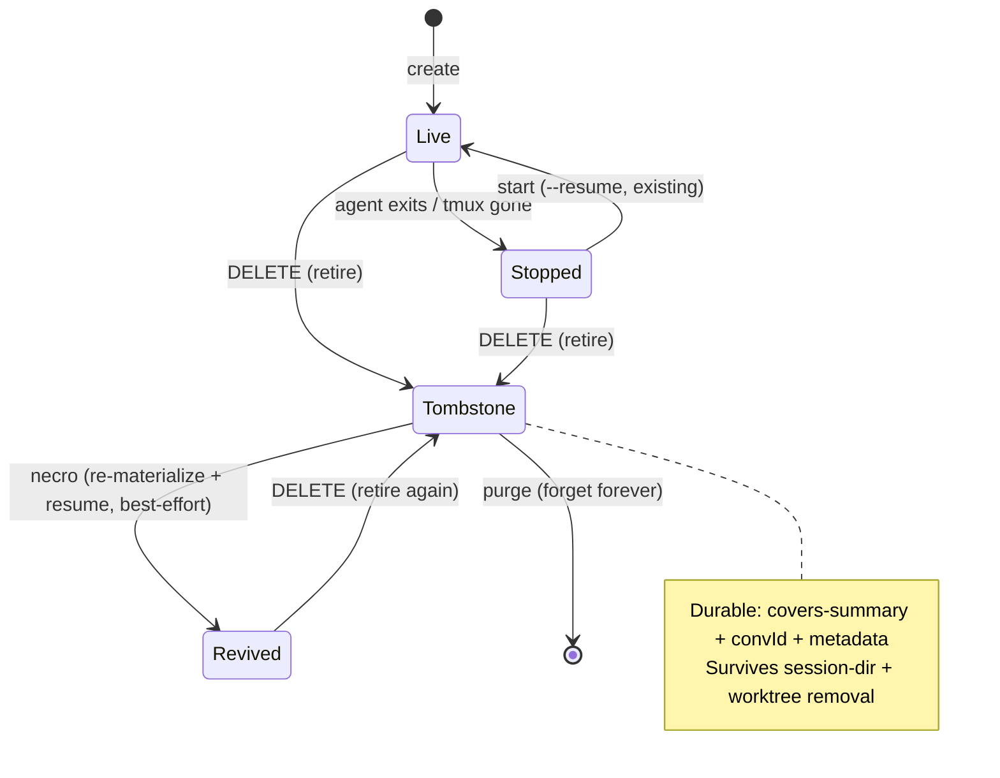
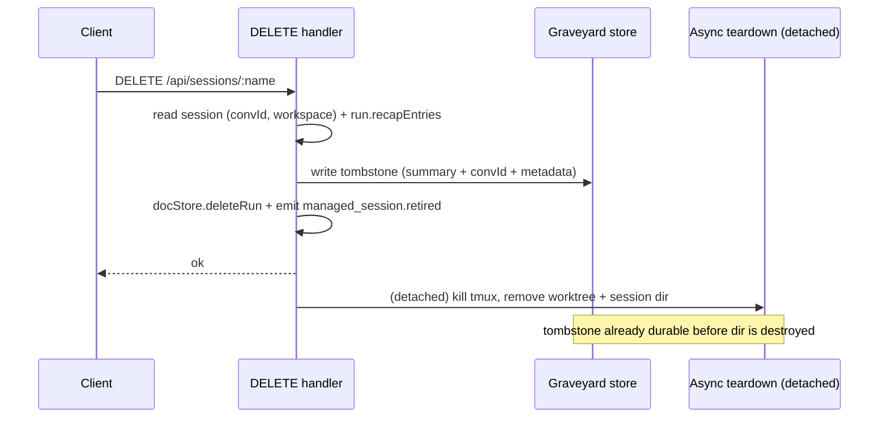

# feat: The Graveyard — necro dead sessions to ask them questions

## Summary

Make deleting a Tinstar session non-destructive to recall: on delete, retire it into a durable, searchable **Graveyard** (a tombstone holding a covers-summary, the session's `conversation.id`, and metadata) instead of purging it. A human can search the Graveyard from a canvas widget and an agent can query it over HTTP; either can **necro** an entry — re-materialize the session from its stored convId and resume the real agent to ask questions, best-effort against Claude Code's retained transcript. A separate purge truly forgets.

---

## Problem Frame

A session that leaves the canvas is effectively gone: nothing records what it covered and there is no way to ask it anything. The only workaround is keeping a session alive indefinitely to preserve reachability — the origin's "askviktor kept alive for hours" case. The deeper gap is cross-time discoverability: an agent working today has no way to know a relevant session worked the same ground yesterday. The remedy is a durable index of what dead sessions covered plus a cheap path back to the real agent (see origin: `docs/brainstorms/2026-07-01-session-graveyard-necro-requirements.md`).

---

## Key Technical Decisions

- **Index lives as a `graveyard` collection in the existing `DocumentStore` (`docstore.json`), not a new file.** `docstore.json` is anchored at the config root (`dirs.root` via `getConfigRoot()`) and already survives per-session-dir deletion — DELETE only removes `sessions/<name>/`. Reusing it inherits debounced persistence + SSE deltas and avoids a scattered `graveyard.json` (Will treats parallel config stores as rot; see origin dependencies and `docs/conventions.md` config-paths rule). *Alternative rejected:* standalone sibling store — cleaner blast-radius isolation but a new scattered file and no free SSE.

- **Necro resolves the transcript by the stored `conversation.id`, never by newest-mtime.** `src/server/sessions/resume.ts` `detectConversationId()`/`findNewestConversationId()` pick the newest transcript by modification time — the exact antipattern behind the shared-worktree transcript misattribution bug. The tombstone persists the session's `conversation.id` at retire-time; revive looks up the transcript by that id (via `findTranscriptByConvId`). Do **not** reuse the mtime path for necro.

- **Covers-summary is a deterministic roll-up of existing recap turns — no LLM call.** There is no server-side model-invocation helper, and the team's recap convention is deliberately zero-token. The summary is built at retire-time from `run.recapEntries` already in the docstore (first user turn + last agent turn + turn/tool counts + task/persona metadata). Reading the parsed recap at retire-time also sidesteps re-reading raw JSONL later, which may be gone once the dir is removed.

- **Retire is a state transition on the existing DELETE path, not a bespoke route.** The `DELETE /api/sessions/:name` handler writes the tombstone and emits a typed `managed_session.retired` BusEvent **synchronously**, before the detached async teardown destroys the dir — so a crash mid-teardown cannot leave a deleted-but-unindexed session. No new "retire" endpoint.

- **Revive re-materializes a session from the tombstone, best-effort.** Because delete removes the dir, necro re-creates a minimal session record from the tombstone's convId + stored workspace, then resumes it via the existing `startTmuxSession(resume)` machinery. When the Claude Code transcript is gone (pruned, or worktree/project-dir moved), revive is unavailable and the entry still surfaces its covers-summary. No transcript snapshotting in v1 (accepted per origin).

- **Agent recall ships as the `GET /api/graveyard` HTTP endpoint, documented for agents to curl via `$TINSTAR_DASHBOARD_URL`.** There is no native MCP tool registry and the NATS bridge is observe-only, so a first-class MCP recall tool is deferred. The recall snippet uses `TINSTAR_URL="${TINSTAR_DASHBOARD_URL:-http://localhost:5273}"` — never `TINSTAR_BACKEND_PORT` (never injected).

---

## High-Level Technical Design

Session lifecycle with the Graveyard (new states/edges in **bold** conceptually):

Retire ordering on the DELETE path (why the tombstone write is synchronous):

---

## Requirements Traceability

Requirements carried from the origin (see origin doc for full text). R-IDs map to units below.

- R1, R3 (index + entry shape) → U1, U3
- R2 (delete retires, non-destructive) → U3
- R4 (purge) → U5
- R5, R6, R7 (covers-summary) → U2, U3
- R8 (agent recall) → U5, U7
- R9 (human search) → U5, U6
- R10, R11, R12 (revive, best-effort, degrade) → U4, U5
- Flows F1 (human necro) → U4, U6; F2 (agent recall) → U5, U7; F3 (retire on delete) → U3
- Acceptance Examples AE1 (worktree gone) → U4; AE2 (transcript pruned) → U4, U5; AE3 (delete vs purge) → U3, U5

---

## Implementation Units

### U1. Tombstone model and Graveyard store collection

- **Goal:** A durable, config-root-anchored store of tombstones that survives session-dir and worktree removal.
- **Requirements:** R1, R3
- **Dependencies:** none
- **Files:**
  - `src/domain/types.ts` (add `Tombstone` type)
  - `src/server/stores/document-store.ts` (add `graveyard` Map, load/snapshot/mutators)
  - `src/server/stores/__tests__/document-store-graveyard.test.ts` (new)
- **Approach:** Add a `Tombstone` type: `{ convId, sessionName, coversSummary, task?, epic?, initiative?, workspacePath?, model?, created, retiredAt }`. Add a `graveyard: Map<convId, Tombstone>` collection to `DocumentStore`, wired into the persistence load block and `snapshotAll()` so it round-trips through `docstore.json`. Add `upsertTombstone`, `getTombstone`, `listTombstones`, `deleteTombstone`. Mutators must equality-short-circuit before emitting `change` (mirror the existing `runShallowEqual` pattern) to avoid a persist/SSE storm.
- **Patterns to follow:** the run collection in `src/server/stores/document-store.ts` (load block, `snapshotAll`, debounced `schedulePersist`); equality-short-circuit convention in `docs/conventions.md`.
- **Test scenarios:**
  - Happy path: `upsertTombstone` then `getTombstone` returns the entry; `listTombstones` includes it.
  - Persistence round-trip: enable persistence on a tmp root, upsert, force persist, construct a fresh store on the same file → tombstone loads.
  - Survives dir deletion (integration): tombstone written to a store at a tmp `dirs.root`; simulate removing `sessions/<name>/` → tombstone still present (proves index location is independent of the session dir).
  - Equality short-circuit: upserting an identical tombstone does not emit a `change`.
  - Defensive load: a corrupt tombstone entry in the JSON is skipped without throwing.
- **Verification:** store tests green; a tombstone written before a simulated session-dir removal is still retrievable.

### U2. Covers-summary builder

- **Goal:** A pure function that turns a session's recap entries + metadata into a short, searchable covers-summary — zero-token.
- **Requirements:** R5, R6, R7
- **Dependencies:** none
- **Files:**
  - `src/server/sessions/covers-summary.ts` (new)
  - `src/server/sessions/__tests__/covers-summary.test.ts` (new)
- **Approach:** `buildCoversSummary(recapEntries, meta)` returns a compact string/struct: first user turn, last agent turn, turn count, distinct tools touched, plus task/epic/initiative and persona when present. When `recapEntries` is empty, fall back to derived signals only (task hierarchy + persona prompt). Deterministic; no model call. Regeneratable — callable again on demand from the same inputs.
- **Patterns to follow:** `RecapEntry` shape in `src/domain/types.ts`; recap extraction semantics in `src/server/sessions/transcript-parser.ts`.
- **Test scenarios:**
  - Happy path: recap with several turns → summary includes first user prompt and last agent turn and a turn count.
  - Covers R6: empty recap + task/persona metadata → summary is built from derived signals, non-empty.
  - Edge: recap with only status entries (no user/agent turns) → summary degrades gracefully, no crash.
  - Determinism: same inputs produce byte-identical output (regeneration stability).
- **Verification:** builder tests green; output is non-empty for every non-degenerate input.

### U3. Entomb on delete (retire state transition)

- **Goal:** Deleting a session writes its tombstone and emits `managed_session.retired` before the dir is destroyed.
- **Requirements:** R2, R3, R5; F3; AE3
- **Dependencies:** U1, U2
- **Files:**
  - `src/server/types.ts` (add `ManagedSessionRetiredPayload` + `BusEvent` union variant)
  - `src/server/api/routes.ts` (DELETE handler retire hook)
  - `src/server/<sse-bridge>` (add `managed_session.retired` to the forwarded-events set — locate via the existing `managed_session.deleted` forward)
  - `src/server/api/__tests__/graveyard-route.test.ts` (new; covers the retire emit)
- **Approach:** In `DELETE /api/sessions/:name`, on the **synchronous** path (before `docStore.deleteRun` and the async teardown IIFE): read `session.conversation.id`, `session.workspace`, model/task metadata, and `run.recapEntries`; call `buildCoversSummary` (U2); `upsertTombstone` (U1); then emit `managed_session.retired` via the typed `emitSessionEvent`. Declare the payload interface and add the `BusEvent` union variant first (compile-enforced — no casts). Add the event to the SSE bridge forwarded set with a typed window-event name so the widget updates live.
- **Patterns to follow:** BusEvent recipe in `docs/conventions.md` + the `ManagedSessionDeletedPayload`/`managed_session.deleted` emit already in the DELETE handler; `readBody` for any body access.
- **Test scenarios:**
  - Covers F3/AE3: DELETE on a session with a convId and recap → a tombstone exists in the store afterward with the right convId and a non-empty covers-summary.
  - Ordering: tombstone is present even when the async teardown is stubbed to throw (proves synchronous write precedes teardown).
  - Event: DELETE emits exactly one `managed_session.retired` with the convId in its payload.
  - Edge: DELETE on a session with no convId → no tombstone written, no retired event, delete still succeeds (nothing to necro).
- **Verification:** route test green; deleting a session yields a retrievable tombstone and one retired event.

### U4. Revive from tombstone (necro)

- **Goal:** Re-materialize a session from a tombstone and resume the real agent, best-effort; degrade cleanly when the transcript is gone.
- **Requirements:** R10, R11, R12; F1, F2; AE1, AE2
- **Dependencies:** U1
- **Files:**
  - `src/server/sessions/necro.ts` (new — `reviveFromTombstone`)
  - `src/server/sessions/__tests__/necro.test.ts` (new)
- **Approach:** Given a convId, look up the tombstone (U1). Resolve the transcript by that convId via `findTranscriptByConvId` — **never** the mtime path. If absent → return `{ revivable: false }` (caller surfaces the covers-summary). If present → re-create a minimal session via the existing create path (stored convId as the resume id, stored `workspacePath` as cwd, falling back to `workspace.basePath`/repo root when the worktree is gone) and start it with `startTmuxSession(resume)`. The revived session appears as a live card; the user deletes it again to re-tombstone (R11, reuses U3). Resolve project via task-settings inheritance (`GET /api/tasks/:id/settings` → `.data.resolved`) when a task id is on the tombstone; else default session values.
- **Execution note:** Start with a failing test for the transcript-absent branch (`revivable: false`) — it's the AE2 contract and the cheapest to pin first.
- **Patterns to follow:** `createSession` + `startTmuxSession(resume:true)` in `src/server/sessions/backends/tmux.ts`; `findTranscriptByConvId` in `src/server/sessions/transcript-parser.ts`; task-settings inheritance per `docs/conventions.md`.
- **Test scenarios:**
  - Covers AE2: tombstone whose transcript is absent → `reviveFromTombstone` returns not-revivable and does not create a session.
  - Happy path: tombstone whose transcript exists → a session is created with the stored convId as resume id and started in resume mode.
  - Covers AE1: tombstone whose `workspacePath` no longer exists → revive falls back to a valid cwd and still resumes (degraded — code context absent, conversation intact).
  - convId fidelity: revive uses the tombstone's stored convId, not a newest-mtime scan (assert the resume id equals the stored convId even when other transcripts are newer in the project dir).
  - Idempotency: reviving the same tombstone twice does not create two conflicting live sessions (name collision handled).
- **Verification:** necro tests green; revive resolves by stored convId and degrades to not-revivable without throwing.

### U5. Graveyard API routes (search, revive, purge)

- **Goal:** HTTP surface for the human widget and agent recall.
- **Requirements:** R4, R8, R9; AE3
- **Dependencies:** U1, U2, U4
- **Files:**
  - `src/server/api/routes.ts` (three route blocks)
  - `src/server/api/__tests__/graveyard-route.test.ts` (extend from U3)
- **Approach:** Add inside the `ctx.sessionConfig` block: `GET /api/graveyard?q=<query>` → server-side filtered `listTombstones` (case-insensitive over covers-summary + names + task) returning the tombstone list; `POST /api/graveyard/:convId/revive` → `reviveFromTombstone` (U4), returning the revived session name or a not-revivable status; `POST /api/graveyard/:convId/purge` → `deleteTombstone` (U1) — graveyard-index-only, since the dir/worktree were already removed at delete-time. Use `readBody`/`withBody` for bodies, `ok`/`fail` envelopes, and `extractSessionName`-style parsing with an anchored regex to avoid route shadowing.
- **Patterns to follow:** the `/start` and `/model` route blocks in `src/server/api/routes.ts`; envelope helpers in `src/server/api/envelope.ts`; route-test harness `src/server/api/__tests__/runs-route.test.ts`.
- **Test scenarios:**
  - Search happy path: three tombstones, `?q=` matching one → response contains only that entry.
  - Search empty query: returns all tombstones.
  - Revive route: `POST /revive` on a revivable tombstone → ok with a session name; on a not-revivable one → ok with a not-revivable status (not a 500).
  - Covers AE3 (purge): `POST /purge` removes the tombstone → subsequent search no longer returns it.
  - Bad input: revive/purge on an unknown convId → `fail` with `NOT_FOUND`, no throw.
- **Verification:** route tests green for search/revive/purge; unknown convId returns a typed error, not a crash. (Live curl deferred — a new route only serves after a dist rebuild+restart; do not restart the user's server.)

### U6. Graveyard search widget (canvas)

- **Goal:** A canvas surface to search the dead and act on an entry (necro / purge).
- **Requirements:** R9; F1
- **Dependencies:** U5
- **Files:**
  - `src/components/Graveyard/GraveyardWidget.tsx` (new; adjust dir to match widget conventions)
  - `src/widgets/index.ts` / `src/widgets/widgetComponentRegistry.ts` (register)
  - `src/lib/uiPrefs.ts` (persist last query/filters if needed)
- **Approach:** A list-with-detail widget: fetch tombstones via `apiFetch(apiUrl('/api/graveyard'))`, client-side fuzzy filter with `fuse.js` (already a dep) over covers-summary/name/task, and a detail view showing the full covers-summary + a **Necro** action (`POST /revive`) and **Purge** action (`POST /purge`, with confirm). Reflect the not-revivable state explicitly (revive disabled + "transcript no longer available — summary only", per AE2). Live-update on the `managed_session.retired` window event from the SSE bridge (U3). Never render missing counts as `0` — use `--`.
- **Patterns to follow:** fuzzy filtering in `src/components/HierarchySidebar.tsx` (`fuse.js`); list+detail shape in `src/plugins/nats-traffic/src/Saloon.tsx`; `apiFetch`/`apiUrl` from `src/apiClient.ts`; UI prefs via `src/lib/uiPrefs.ts`.
- **Test scenarios:** `Test expectation: light` — component-level: typing a query filters the list; selecting an entry shows its summary; a not-revivable entry disables Necro and shows the summary-only note; purge asks for confirmation. (Heavy interaction coverage deferred to manual QA / e2e; frontend needs a `vite build --outDir dist/client` + hard reload on :5273 to verify live.)
- **Verification:** widget renders, filters, and fires revive/purge against the API; not-revivable entries are visibly distinct.

### U7. Agent recall documentation

- **Goal:** Agents can discover and necro past sessions without a human.
- **Requirements:** R8; F2
- **Dependencies:** U5
- **Files:**
  - `agent-skills/tinstar/` (the `tinstar` skill — add a "recall past sessions" section)
- **Approach:** Document the recall flow for agents: `TINSTAR_URL="${TINSTAR_DASHBOARD_URL:-http://localhost:5273}"`, `curl "$TINSTAR_URL/api/graveyard?q=<topic>"` to find relevant dead sessions by covers-summary, then `POST "$TINSTAR_URL/api/graveyard/<convId>/revive"` to necro one and ask it questions (submitting the ask via the `/prompt` endpoint, not tmux send-keys). Emphasize: never build the URL from `TINSTAR_BACKEND_PORT`.
- **Patterns to follow:** `agent-skill-backend-url-env-var` convention in `docs/solutions/`; existing HTTP-capability docs in the `tinstar` skill.
- **Test scenarios:** `Test expectation: none — documentation only.`
- **Verification:** the `tinstar` skill documents the recall + necro curl flow with the correct env var; edits go live via the symlinked skills install.

---

## Scope Boundaries

### Deferred for later (from origin)

- Proactive surfacing — the system automatically noticing current work overlaps a dead session and offering to revive it.
- Transcript snapshotting into Tinstar's own store (would make revive bulletproof against Claude Code pruning). Revive stays best-effort on CC retention.
- Semantic / embedding-based recall and LLM-generated summaries (`@xenova/transformers` exists frontend-only; server summarization stays deterministic).

Note: reconstructing a runnable session from a convId was listed as deferred in the origin but is **pulled into v1** (U4) — necro of a *deleted* session requires it.

### Outside this scope (from origin)

- Indexing or reviving non-Tinstar `claude` sessions run in a bare terminal — overlaps `/ce-sessions`.

### Deferred to Follow-Up Work

- A first-class MCP / NATS request-reply recall tool (v1 recall is the documented HTTP endpoint; the NATS bridge is observe-only today, so a responder is net-new).
- Unified search over live + stopped + deleted in one surface (v1 Graveyard search is deleted tombstones only; live/stopped stay discoverable via the existing sidebar).

---

## Risks & Mitigations

- **Silent revive failure.** If the CC transcript was pruned or the project dir moved, revive can't bring the agent back. *Mitigation:* U4 returns an explicit not-revivable status and U6 shows "summary only" — never a dead spinner (AE2).
- **Degraded revive is misread as broken.** A revived session whose worktree is gone remembers the conversation but can't re-inspect files. *Mitigation:* the widget/skill frame necro as "ask questions," and U4 resumes in a fallback cwd (AE1); the limitation is documented, not hidden.
- **Crash mid-retire loses the entry.** *Mitigation:* the tombstone write is synchronous, ordered before the detached teardown (U3 ordering test).
- **Persist/SSE storm.** A hot mutator without equality short-circuit re-triggers debounced persistence and SSE deltas. *Mitigation:* equality-short-circuit in U1 mutators, mirroring the run collection.
- **convId misattribution.** Reusing the mtime detection path would bind necro to a stranger's transcript in a shared worktree. *Mitigation:* KTD — resolve strictly by stored convId (U4 fidelity test).

---

## Sources & Research

- Session lifecycle, resume, and delete: `src/server/sessions/session.ts`, `src/server/sessions/backends/tmux.ts`, `src/server/sessions/resume.ts`, `src/server/api/routes.ts` (`DELETE`/`start` handlers), `src/server/sessions/transcript-parser.ts` (`findTranscriptByConvId`).
- Persistence: `src/server/stores/document-store.ts`, `src/server/index.ts` (`enablePersistence(join(dirs.root, 'docstore.json'))`), `src/server/sessions/config.ts` (`dirs.root`/`dirs.sessions`).
- Conventions: `docs/conventions.md` (config paths, BusEvent recipe, envelopes, equality short-circuit, apiFetch, uiPrefs); `docs/solutions/conventions/reuse-readbody-for-request-bodies.md`, `docs/solutions/conventions/agent-skill-backend-url-env-var.md`, `docs/solutions/developer-experience/node-env-production-prunes-devdependencies.md`.
- Institutional learnings: transcript misattribution (newest-by-mtime is the bug) and single-config/`getConfigRoot()` — both load-bearing, reflected in KTDs.
- Test harnesses: `src/server/api/__tests__/runs-route.test.ts`, `src/server/stores/__tests__/`, `src/server/sessions/__tests__/`. Typecheck with `tsc -p tsconfig.app.json`; run vitest with `--exclude='e2e/**'`; prefix toolchain with `env -u NODE_ENV`.
- UI to mirror: `src/components/HierarchySidebar.tsx` (fuse.js), `src/plugins/nats-traffic/src/Saloon.tsx` (list+detail).
