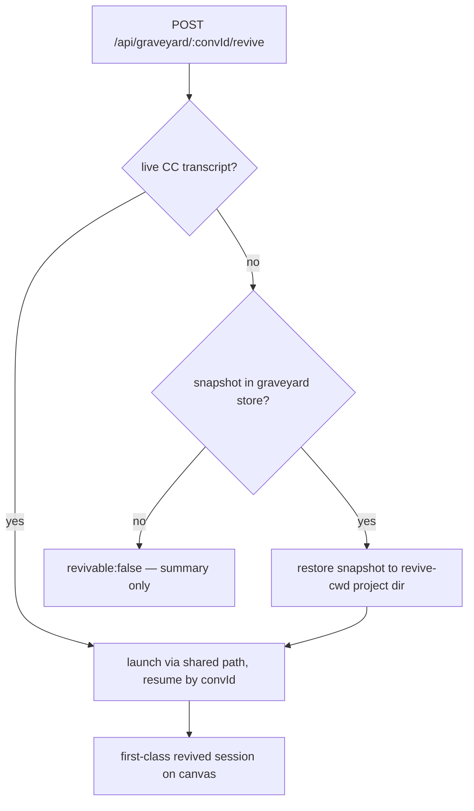
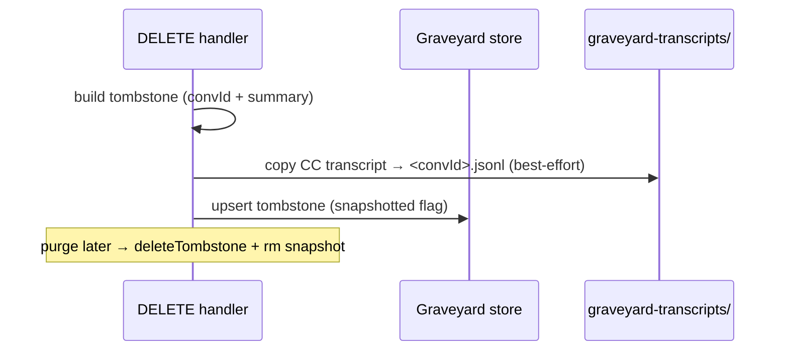

# feat: Graveyard v1.1 — first-class revive + durable transcript snapshots

## Summary

Finish the Graveyard revive path properly and harden it. Today a necro'd session is re-materialized by a hand-rolled block in the revive route that skips NATS registration, the ready queue, and most Run fields — so a revived agent is a second-class canvas citizen. Route revive through the same launch path a normal session uses (with a resume option) so a revived session is a first-class citizen by construction. Then upgrade revive from best-effort to **durable**: snapshot each session's transcript into Tinstar's own store at retire-time, and restore it at revive when Claude Code has pruned the original — so even a long-dead grave can still be necro'd.

Builds on the v1 feature in PR #100 (see origin: `docs/brainstorms/2026-07-01-session-graveyard-necro-requirements.md`, plan `docs/plans/2026-07-01-001-feat-session-graveyard-necro-plan.md`). Targets the same branch `feat/session-graveyard-necro`.

---

## Problem Frame

Two gaps remain after v1:

1. **Revive diverges from normal launch.** The revive route in `src/server/api/routes.ts` hand-rolls session materialization: `createSession` + `setConversationId` + `startTmuxSession` + a minimal `upsertRun`. It omits what `createSessionInternal` does after launch — `registerSaloonSubs`, `natsHealth.trackSession`, `readyQueue.onStatusChange`, and Run fields (`color`, `agentIcon`, `natsSubject`, `natsSubscriptions`). A revived agent therefore can't use NATS (`reply`, breakout rooms), never enters the ready queue, and renders without its color/icon. The divergence is also a maintenance trap: future launch changes won't reach revive.

2. **Revive is best-effort and silently decays.** Revive depends on Claude Code's retained transcript, which Tinstar doesn't own. Once CC prunes it (or the project dir moves), the grave becomes summary-only — exactly the graves most worth reviving are the oldest, which are the most likely pruned. v1 accepted this; v1.1 closes it for graves retired from now on.

---

## Requirements

- R1. A revived session is a first-class citizen: it has NATS subscriptions (so `reply`/breakout work), appears in the ready queue, and its Run carries the same display fields a freshly-created session gets.
- R2. Revive reuses the shared session launch/finalize path rather than a parallel hand-rolled block; the two cannot silently diverge again.
- R3. At retire-time, the session's transcript is snapshotted into a config-root store that survives session-dir and worktree removal.
- R4. At revive-time, when the live Claude Code transcript is absent but a snapshot exists, the snapshot is restored into the revive cwd's project dir so `--resume` succeeds.
- R5. Purge deletes the snapshot along with the tombstone; no orphaned transcript copies survive a forget-forever.
- R6. Revive of a grave with neither a live transcript nor a snapshot still degrades to summary-only (unchanged v1 behavior for pre-v1.1 graves).

---

## Key Technical Decisions

- **Revive routes through the shared launch path, not a parallel block.** Add a resume option to the session-creation/launch path (`createSessionInternal` or an extracted finalize helper) so revive gets NATS + ready-queue + full-Run wiring for free. Rationale: the v1 divergence is the root cause of every loose end in item 1; eliminating it fixes them all at once and prevents recurrence. *Alternative rejected:* incrementally copy each missing call into the hand-rolled block — fixes the symptoms but keeps two launch paths that will diverge again.

- **Revived sessions get fresh NATS subscriptions, not the dead session's old subtree.** The original subject tree (`tinstar.<space>.<init>.<epic>.<task>.<agent>`) was tied to the retired session's epoch and is gone. A revived session resolves subscriptions the same way a new session does from its (possibly fallback) task context. Rationale: reviving is a new launch of an old conversation, not a resurrection of dead NATS durables.

- **Snapshot lives in a config-root `graveyard-transcripts/` dir, keyed by convId.** Path built from `getConfigRoot()`/`dirs.root` (never `homedir()`), sibling to `docstore.json`, so it survives session-dir deletion. Rationale: same durability argument as the tombstone index; consistent with the single-config-root rule.

- **Restore writes the snapshot to the revive cwd's CC transcript path, then `--resume`.** Claude Code locates a transcript by the cwd-encoded project dir (`getTranscriptPath(workdir, convId)`). Restoring the snapshot to `getTranscriptPath(reviveCwd, convId)` before launch makes `--resume` find it even when the original workdir is gone. Rationale: this is what makes a fully-pruned grave revivable — the snapshot is authoritative, restored into whatever cwd the revive runs in.

- **Snapshotting applies to graves retired from v1.1 onward.** Pre-v1.1 tombstones have no snapshot and stay best-effort (R6). No backfill — we can't snapshot transcripts that may already be pruned.

---

## High-Level Technical Design

Revive decision with snapshot restore (the new branch is the dashed path):

Retire + purge snapshot lifecycle:

---

## Implementation Units

### U1. Revive as a first-class session launch

- **Goal:** A necro'd session is wired exactly like a normal launch (NATS, ready queue, full Run), via the shared path instead of the hand-rolled revive block.
- **Requirements:** R1, R2
- **Dependencies:** none
- **Files:**
  - `src/server/api/routes.ts` (revive block in the `/api/graveyard/:convId/revive` route; the `createSessionInternal` launch/finalize tail)
  - `src/server/api/__tests__/graveyard-route.test.ts`
  - `src/server/sessions/__tests__/necro.test.ts` (deps contract unchanged; adjust if the resume dep shape changes)
- **Approach:** Introduce a resume option on the shared launch path — either a `resume?: { convId: string }` parameter to `createSessionInternal`, or extract the post-`createTmuxSession` finalize tail (Run upsert + `registerSaloonSubs` + `bootstrapHierarchicalTopicMetadata` + `natsHealth.trackSession` + `readyQueue.onStatusChange` + ready-queue SSE + `managed_session.created`) into a helper both paths call. When resuming, use `startTmuxSession` with the stored convId instead of `createTmuxSession`, and skip minting a fresh convId. The `necro.ts` `materialize`/`resume` deps in the route are replaced by a single call into this shared path; `reviveFromTombstone`'s decision logic (transcript-present check, name collision, workspace fallback) stays as-is.
- **Execution note:** Characterize first — before refactoring, add a test asserting the revived Run carries NATS subscriptions + ready-queue entry, so the refactor is proven to add the missing wiring rather than just move code.
- **Patterns to follow:** `createSessionInternal` launch/finalize tail in `src/server/api/routes.ts`; the `/start` resume handler for the `startTmuxSession(resume)` shape.
- **Test scenarios:**
  - A revived session's Run has non-empty `natsSubscriptions` and a resolved `natsSubject` (when NATS is enabled for its context).
  - A revived session is registered with the ready queue (appears in `getQueue()`).
  - The revived Run carries `color` and `backendInfo` (first-class display fields), not just the minimal set.
  - Revive still resolves the transcript by the stored convId (fidelity preserved through the refactor).
  - Not-revivable path (no transcript) still returns `{revivable:false}` without launching — unchanged.
- **Verification:** revive produces a Run indistinguishable from a normal launch except that it resumed an existing conversation; no hand-rolled launch block remains in the route.

### U2. Durable transcript snapshot + restore-on-revive + purge cleanup

- **Goal:** Retire-time snapshot of the transcript into a config-root store; restore it at revive when the live transcript is gone; purge removes it.
- **Requirements:** R3, R4, R5, R6
- **Dependencies:** U1
- **Files:**
  - `src/server/sessions/graveyard-snapshot.ts` (new — snapshot/restore/delete helpers + path builder)
  - `src/server/api/routes.ts` (DELETE handler: snapshot after tombstone write; revive: restore branch; purge: delete snapshot)
  - `src/server/sessions/necro.ts` (revive decision: treat a restorable snapshot as revivable)
  - `src/domain/types.ts` (`Tombstone`: add a `snapshotted?: boolean`)
  - `src/server/sessions/__tests__/graveyard-snapshot.test.ts` (new)
  - `src/server/api/__tests__/graveyard-route.test.ts`
- **Approach:** Snapshot store path = `join(dirs.root, 'graveyard-transcripts')`, file `<convId>.jsonl`. At retire (DELETE handler, right after the tombstone write on the synchronous path), resolve the source transcript via `findTranscriptByConvId(convId)` and copy it into the store (best-effort; set `snapshotted:true` on the tombstone when it succeeds). At revive, extend the decision: revivable when a live transcript exists OR a snapshot exists; when only the snapshot exists, restore it to `getTranscriptPath(reviveCwd, convId)` (creating the project dir) before the shared launch resumes. At purge, delete the snapshot file alongside the tombstone. Keep the copy bounded and failure-tolerant (a snapshot failure must not block delete).
- **Patterns to follow:** config-root pathing via `dirs.root` (never `homedir()`); `getTranscriptPath`/`getProjectDir`/`findTranscriptByConvId` in `src/server/sessions/transcript-parser.ts`; the synchronous-before-teardown ordering already used for the tombstone write.
- **Test scenarios:**
  - Retire copies the transcript into `graveyard-transcripts/<convId>.jsonl` and marks the tombstone `snapshotted`.
  - Retire with no source transcript present does not throw and leaves `snapshotted` false (delete still succeeds).
  - Revive with the live transcript gone but a snapshot present restores it to the revive cwd's project dir and reports revivable.
  - Covers AE2 supersede: a snapshotted grave whose live transcript is pruned is revivable (was not in v1).
  - R6: a grave with neither live transcript nor snapshot still returns summary-only.
  - Purge deletes the snapshot file; a second purge/absent file is a no-op, no throw.
  - Snapshot survives a simulated session-dir removal (it lives under `dirs.root`, not the session dir).
- **Verification:** a session retired under v1.1, then with its `~/.claude` transcript deleted, still revives from the snapshot; purge leaves no `graveyard-transcripts` file behind.

### U3. Reflect durable revive in the widget and agent docs

- **Goal:** The UI and agent-facing docs stop implying revive is always a coin-flip once snapshots exist.
- **Requirements:** R4, R6
- **Dependencies:** U2
- **Files:**
  - `src/plugins/graveyard/src/GraveyardWidget.tsx` (surface a "durable / summary-only" distinction using the tombstone `snapshotted` flag)
  - `src/plugins/graveyard/src/types.ts` (add `snapshotted?` to the local Tombstone mirror)
  - `agent-skills/skills/tinstar/SKILL.md` (note that snapshotted graves revive even after Claude Code prunes)
- **Approach:** In the detail pane, when `snapshotted` is true, indicate the grave is durably revivable; when false (pre-v1.1), keep the "best-effort — may be summary-only" wording. Update the skill's Graveyard section to reflect that graves retired after v1.1 survive CC pruning.
- **Test scenarios:** `Test expectation: light` — component test: a `snapshotted:true` grave renders the durable affordance; a `snapshotted:false` grave renders the best-effort note. Docs change needs no test.
- **Verification:** the widget visibly distinguishes durable from best-effort graves; the skill copy matches the new guarantee.

---

## Scope Boundaries

### Still deferred (assessed, kept out of this increment)

- **Proactive surfacing** — noticing current work overlaps a dead session and offering revive. Needs a trigger point + matching heuristic; higher cost, fuzzier value. Stays deferred (origin "Deferred for later").
- **First-class MCP / NATS request-reply recall tool** — the NATS bridge is observe-only; a responder is net-new surface. HTTP recall already serves agents. Deferred.
- **Semantic / embedding recall** over covers-summaries — `@xenova/transformers` is frontend-only; server-side embeddings are new infra. Deferred.

### Outside this scope

- Indexing or reviving non-Tinstar `claude` sessions (overlaps `/ce-sessions`).
- Backfilling snapshots for graves retired before v1.1 (their transcripts may already be pruned — nothing to copy).

---

## Risks & Mitigations

- **Refactoring the shared launch path regresses normal session creation.** *Mitigation:* U1 is characterization-first; the existing `sessions-create-route` and `runs-route` tests must stay green, plus new assertions on the revived Run.
- **Snapshot storage grows unbounded / privacy.** Every retired session's transcript is copied and lingers until purge. *Mitigation:* purge deletes snapshots (R5); document that delete-then-purge is the forget path; a retention/GC policy is a follow-up, not v1.1.
- **Restore writes to the wrong project dir.** If the encoded-cwd derivation diverges from what `--resume` expects, restore silently fails. *Mitigation:* reuse `getTranscriptPath` (the same helper CC-path logic derives from) rather than re-deriving; test the restore-then-revivable path end to end.
- **Snapshot copy on the synchronous delete path adds latency.** *Mitigation:* keep it a bounded file copy, failure-tolerant; if it proves heavy, move the copy just after the `ok(res)` response but before dir teardown (still ordered before the transcript could vanish).

---

## Sources & Research

- v1 implementation under review: `src/server/api/routes.ts` (revive/entomb/DELETE blocks), `src/server/sessions/necro.ts`, `src/server/sessions/covers-summary.ts`, `src/server/stores/document-store.ts` (graveyard collection), `src/plugins/graveyard/`.
- Launch/finalize tail to share: `createSessionInternal` in `src/server/api/routes.ts` (Run upsert + NATS + ready-queue + emit).
- Transcript path logic: `src/server/sessions/transcript-parser.ts` (`getProjectDir`, `getTranscriptPath`, `findTranscriptByConvId`).
- Institutional learnings already applied in v1 and still binding here: resolve transcripts by stored convId (never mtime); config paths via `getConfigRoot()`/`dirs.root`; synchronous tombstone/snapshot write before teardown; `env -u NODE_ENV` + `tsconfig.app.json` for the toolchain.
- Origin brainstorm scope boundaries (the deferred list this increment draws from): `docs/brainstorms/2026-07-01-session-graveyard-necro-requirements.md`.
