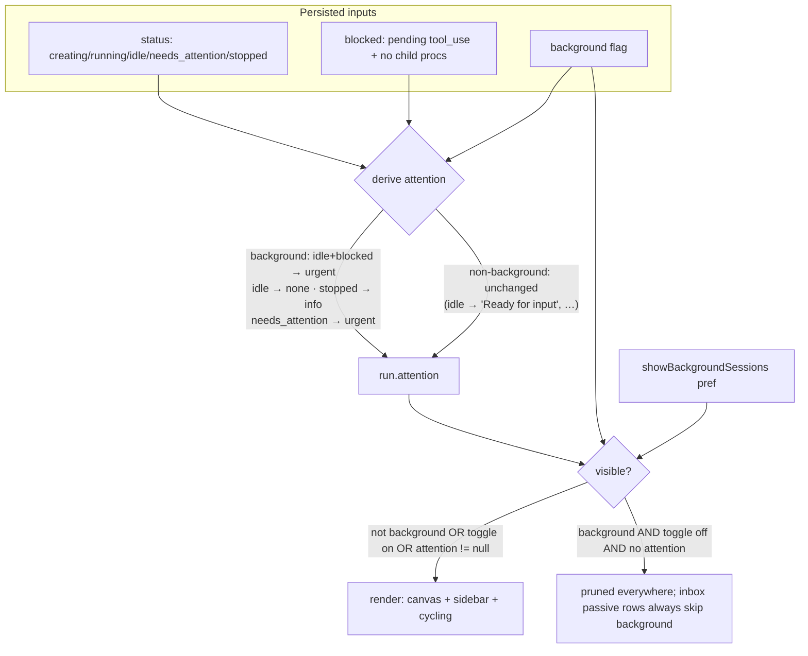

# feat: Background sessions — hidden-by-default agents that wait for commands

## Summary

Add a server-side `background` boolean to managed sessions, settable at creation via the API and mutable both directions, that keeps a session fully alive and commandable (NATS + prompt endpoint) while hiding it from the canvas, hierarchy sidebar, inbox, and session cycling. A "show background (N)" toggle in the hierarchy reveals them. Needs-attention states break through everywhere until handled. Alongside `background`, persist a `blocked` field (agent stuck on a pending tool_use) so attention becomes a pure derivation of `(status, blocked, background)` that survives restarts and flag flips.

---

## Problem Frame

Some agents are machinery, not collaborators — the motivating case is whoachart spawning an agent per run that listens for transition hooks and exits itself when done. Today every managed session renders on every surface, so running this pattern costs canvas clutter for agents nobody looks at. The existing hidden-runs eyeball can't cover it: it is per-browser localStorage applied after the fact, so a programmatically created session cannot be born hidden. See origin doc for full product framing.

Planning surfaced a second problem the feature depends on: a permission-blocked agent and an ordinarily idle agent both surface as status `idle` today (`StatusWatcher` detects the blocked case internally via `processTreeOverride` but reports both as `idle`). A background agent idles by design, so idle-derived "Ready for input" attention would pin it in the inbox forever — while suppressing idle attention entirely would let a permission-stuck agent wedge silently, violating the feature's core safety promise.

---

## Requirements

R1–R12 carry from the origin doc (see origin for full text). Grouped here with plan-level additions R13–R16.

**Creation and the property**

- R1. `POST /api/sessions` accepts `background?: boolean`; the field persists on the session record and is carried on the Run projection in state payloads.
- R2. A background session is a managed session in every other respect (lifecycle, workspace, NATS auto-subscriptions, prompt endpoint, status watching, telemetry).
- R3. The property is mutable after creation in both directions via `PATCH /api/runs/:id`.

**Default invisibility**

- R4. A background session does not render on the canvas by default.
- R5. A background session does not appear in the hierarchy sidebar by default.
- R6. A background session produces no passive (listed-for-visibility) inbox rows.
- R7. Session cycling skips background sessions while they are hidden.

**Reveal affordance**

- R8. A "show background" toggle in the hierarchy header reveals background sessions in the hierarchy and on the canvas, visually marked as background.
- R9. The toggle shows a count of background sessions in the active space even when off.
- R10. The toggle is a client-side view preference (per-browser via uiPrefs) and does not change any session's `background` property.

**Attention and lifecycle**

- R11. A background session in a needs-attention state (permission-blocked, dead harness, explicit attention) surfaces in the inbox until handled, despite R6.
- R12. Stop and delete behave exactly as for visible sessions, including the Graveyard tombstone on delete.
- R13. Attention derivation is correct across restarts and flag flips: a permission-blocked background session shows urgent attention even if blocking began while already idle, persists across server restart, and re-derives when `background` is toggled.
- R14. `background: true` at creation forces `focusOnCreate: false` server-side — a background session never steals camera focus.
- R15. Demoting the currently selected run clears selection and focus path so no UI state dangles on an unmounted card.
- R16. A background session's breakthrough inbox row is actionable: while attention is pending, the run is exempt from pruning on all surfaces, so clicking the row flash-focuses a real card; it returns to invisibility when attention clears.

---

## Key Technical Decisions

- **`background` lives on the Session record, mirrored onto the Run projection; filtering happens at consumers.** The marshal precedent (`src/domain/system-sessions.ts`) filters at SSE ingress, which makes revealing impossible; the hidden-runs precedent is client-only, which makes born-hidden impossible. Background sits between them: server-persisted truth, consumer-side predicates.
- **`blocked` becomes a persisted first-class field, and attention is a pure function of `(status, blocked, background)` re-derived whenever any input changes.** A transient event flag would silently fail on three verified paths: StatusWatcher skips the transition when the session is already `idle` (`src/server/sessions/status-watcher.ts:352`), `updateRunStatus` early-returns on equal status (`src/server/stores/document-store.ts:441`), and in-memory override state dies on restart. Persisting `blocked` and re-deriving on any input change fixes all three plus PATCH-flip staleness with one mechanism.
- **Breakthrough exempts the run from pruning on every surface, not just the inbox.** The inbox row's click handler flash-focuses a canvas node; a pruned card would make the row a dead end. Attention-pending background runs render (marked) on canvas and sidebar, and disappear again when attention clears — matching the origin flow's "returns to invisibility without touching the toggle".
- **Background attention mapping: `idle+blocked` → urgent "Waiting on permission"; `idle` → none; `stopped` → info "Run stopped"; `needs_attention` → urgent. Non-background sessions keep today's mappings exactly** (idle → "Ready for input", etc.). Making normal sessions blocked-aware is a follow-up, not this plan — it would change ready-queue and inbox semantics for every existing session.
- **Clean self-exit and a crashed harness are both `stopped` and both break through as info.** Machinery that wants zero inbox residue deletes its own session on clean exit (delete → tombstone, no row). This is a stated contract for background-agent authors (whoachart), not enforced by Tinstar — the origin's "run happens without the session ever appearing" outcome holds only when the delete contract is honored; a background agent that merely exits leaves a transient info row until deleted. U2 documents the contract in the API description so agent authors see it where they find the flag.
- **`background: true` forces `focusOnCreate: false`** at `createSessionInternal` rather than trusting callers to pass `focus: false`.
- **Spawn takes an explicit `background` param with no inheritance from the parent; graveyard revive always creates visible.** Surprise-hidden sessions are worse than surprise-visible ones; revive-as-live-card is pinned by the graveyard requirements.
- **The reveal toggle is a global uiPrefs singleton (`showBackgroundSessions`), with the count computed per active space.** Per-browser scope is acceptable for a view preference (matches `minimapVisible` et al.); the session truth stays server-side.
- **Tombstones carry `background`** so machinery tombstones are distinguishable later without a migration; the graveyard UI ignores it in v1.

---

## High-Level Technical Design

Attention derivation and visibility predicate (authoritative shape; prose above governs details):

Re-derivation triggers: StatusWatcher status change, StatusWatcher `blocked` add/remove (even when status is unchanged), `PATCH /api/runs/:id` background flip, boot rehydrate/reconcile.

---

## Implementation Units

### U1. Data model: `background` and `blocked` on Session and Run

- **Goal**: Both fields persisted, projected, delta-emitting, and restart-safe.
- **Requirements**: R1, R2, R13 (foundation), R12.
- **Dependencies**: none.
- **Files**: `src/server/sessions/session.ts`, `src/domain/types.ts`, `src/server/stores/document-store.ts`, `src/server/index.ts`, `src/server/api/routes.ts` (DELETE handler's `upsertTombstone` call), `src/server/sessions/__tests__/`, `src/server/stores/__tests__/document-store.test.ts` (or sibling).
- **Approach**: Add `background: boolean` and `blocked: boolean` to the `Session` interface, `CreateSessionOpts` (default false), and `createSession`; backfill both in `getSession` (`?? false`, mirroring `natsControlOrphanedAt`). Add both to `RunData` and to `runShallowEqual` — missing the comparator entry means flips never emit an SSE delta. Project both in the boot-rehydrate refresh spread in `src/server/index.ts` (the "fields that mirror live session state" block) and in the fresh-create Run object. Add `background` to the `Tombstone` interface in `src/domain/types.ts`, to the DELETE handler's `upsertTombstone` call, and to `tombstoneEqual` in document-store.ts (same comparator discipline as `runShallowEqual`).
- **Patterns to follow**: `natsControlOrphanedAt` (backfill + rehydrate refresh + comparator entry), `oneshot`/`skipPermissions` (creation defaults).
- **Test scenarios**:
  - `getSession` on a pre-existing `session.json` without the fields returns `background: false`, `blocked: false`.
  - `upsertRun` with a `background` flip emits exactly one change event; re-asserting the same value emits none (comparator short-circuit).
  - Boot rehydrate projects `background: true` from `session.json` onto the refreshed Run.
  - Delete of a background session writes a tombstone carrying `background: true`.
- **Verification**: Unit tests pass; a background flip observed as a single `run.updated` SSE delta in the docstore test harness.

### U2. Create and spawn API: `background` param

- **Goal**: Sessions can be born background via `POST /api/sessions` and `POST /api/sessions/:name/spawn`; revive stays visible.
- **Requirements**: R1, R14. Covers origin F1 (creation leg), AE1.
- **Dependencies**: U1.
- **Files**: `src/server/api/routes.ts`, `src/server/api/openapi.ts`, `src/server/api/__tests__/sessions-create-route.test.ts`.
- **Approach**: Add doc-commented `background?: boolean` to `CreateSessionParams` (mirror the `focus` field's comment style), destructure with default false, pass to `createSession` and onto `docStore.upsertRun`. When `background` is true, force `focusOnCreate: false` regardless of the `focus` param (the conditional spread at the existing `focus` hook point). Spawn route builds its own `createSession` call — accept the same param there, defaulting false, never inheriting from the parent session. Leave `registerLaunchedSession`/revive paths defaulting visible. Document the field in `openapi.ts`, including the delete-on-clean-exit contract in the field description (background agents that want zero inbox residue delete their own session when done; a bare exit leaves a "Run stopped" info row).
- **Patterns to follow**: `focus`/`focusOnCreate` plumbing (`CreateSessionParams` doc comment, conditional spread); `readBody` + `ok`/`fail` envelope conventions.
- **Test scenarios**:
  - Covers AE1. Create with `background: true` → run in docstore has `background: true` and `focusOnCreate: false`; session.json persists it.
  - Create without the param → `background: false`, focus behavior unchanged.
  - Create with `background: true, focus: true` → `focusOnCreate` still false.
  - Spawn from a background parent without the param → child is visible.
- **Verification**: Route tests green through the real `handleRequest` harness.

### U3. Blocked plumbing and attention derivation

- **Goal**: Attention is derived from `(status, blocked, background)` and re-derives on every input change; permission-blocked background sessions surface urgent, ordinary idle background sessions surface nothing, non-background behavior is byte-for-byte unchanged.
- **Requirements**: R11, R13. Covers origin F3, AE2.
- **Dependencies**: U1.
- **Files**: `src/server/sessions/status-watcher.ts`, `src/server/stores/document-store.ts`, `src/server/index.ts` (the `onStateChanged` handler wired to the watcher and the boot-rehydrate guard), `src/server/sessions/__tests__/status-watcher*.test.ts`, `src/server/stores/__tests__/document-store-run-attention.test.ts`.
- **Approach**: StatusWatcher reports blocked-state changes: when `processTreeOverride` is added or removed, emit through the status callback even if the derived state string is unchanged (today it skips when already `idle` — the verified silent-failure path). Extend the callback payload with `blocked: boolean` and persist it to the session record (`updateSession`) so restarts re-derive instead of wiping. The callback consumer is `onStateChanged` in `src/server/index.ts` (shared by the watcher, boot reconcile, and the periodic reconcile — all inherit the change), not routes.ts. In the docstore, change `updateRunStatus`'s no-op check to compare `(status, blocked)` and replace `attentionForRunStatus(status)` with a derivation over `(status, blocked, background)` per the KTD mapping. Widen the boot-rehydrate correction guard in `src/server/index.ts` (currently fires only on `existingRun.status !== sess.state`) to also fire when the persisted `blocked` differs from the run's, so restart re-derivation comes from the rehydrate path rather than waiting on the watcher's in-memory re-detection. Reconcile/rehydrate paths pass the persisted `blocked` through rather than defaulting it away.
- **Execution note**: Write the failing tests for the three silent-failure paths (already-idle block, restart, override-clear) before changing StatusWatcher.
- **Test scenarios**:
  - Covers AE2. Background run flips to `idle` with `blocked: true` → attention urgent "Waiting on permission"; inbox hook would render it.
  - Background run `idle`, `blocked: false` → attention null (no "Ready for input").
  - Block begins while the session is already `idle` → attention still becomes urgent (the status-string-unchanged path).
  - Override clears while status stays `idle` → urgent attention clears.
  - Covers new AE4. Restart simulation: rehydrate a session persisted with `blocked: true`, `background: true`, status idle → attention re-derives to urgent, not null.
  - Background run `stopped` → attention info "Run stopped".
  - Non-background run: every existing mapping asserts unchanged (idle → attention "Ready for input", stopped → info, needs_attention → urgent, running/creating → null), with `blocked` exercised both ways to prove it does not alter non-background derivation.
- **Verification**: Full docstore attention suite + new status-watcher tests green; no changes to any existing test expectation for non-background sessions.

### U4. Mutation endpoint: PATCH `background`

- **Goal**: Promote/demote via `PATCH /api/runs/:id { background }`, with attention re-derived on flip.
- **Requirements**: R3, R13. Covers origin F2 (promote leg).
- **Dependencies**: U1, U3.
- **Files**: `src/server/api/routes.ts`, `src/server/api/__tests__/runs-route.test.ts`, `src/server/api/openapi.ts`.
- **Approach**: Extend the PATCH handler mirroring the taskId-reparent branch: validate the field is boolean (`fail(res, 'BAD_REQUEST', …)` otherwise), write session.json via `updateSession`, mirror onto the run via `upsertRun`, and re-derive attention from the persisted `(status, blocked, background)` triple in the same mutation. `updateSession` returning null is expected for runs with no backing session record (simulator and plugin-created runs) — mirror onto the run and re-derive attention regardless, do not fail. Respond with the envelope-wrapped updated run.
- **Patterns to follow**: taskId-reparent branch in the same handler; attention-shape validation above it.
- **Test scenarios**:
  - Covers AE5. Demote a visible idle run → `background: true` and its "Ready for input" attention clears (no lingering inbox row).
  - PATCH `background` on a run with no session.json succeeds and emits the delta (the U7 e2e drives simulator runs through this path).
  - Demote a visible run persisted as blocked → attention becomes urgent "Waiting on permission".
  - Promote an idle background run → attention becomes "Ready for input".
  - Non-boolean `background` → 400 via `fail`.
- **Verification**: Route tests green; SSE delta observed for the flip (comparator entry from U1).

### U5. Frontend visibility: prune, cycling, inbox, selection

- **Goal**: Background runs invisible by default on canvas, sidebar, cycling, and passive inbox rows; attention exempts from all pruning; demote clears selection.
- **Requirements**: R4–R7, R15, R16. Covers origin AE3.
- **Dependencies**: U1 (Run fields). This unit adds the `showBackgroundSessions` uiPrefs accessor; U6 builds the toggle UI on top of it.
- **Files**: `src/lib/uiPrefs.ts`, `src/components/WorkspaceShell.tsx`, `src/hooks/useInbox.ts`, `src/hooks/useReadyQueue.ts` (only if the candidate filter lands there), `src/hooks/__tests__/useInbox.test.tsx`, `src/hooks/__tests__/useReadyQueue.test.ts`.
- **Approach**: Add `showBackgroundSessions?: boolean` to the `UiPrefs` interface with getter/setter (singleton pattern, like `minimapVisible`; no new localStorage keys). Prune predicate: drop a run node when `run.background && !showBackgroundSessions && !run.attention`. Apply it to the tree **before** it forks to the sidebar and canvas — unlike hidden runs, which are dimmed in the sidebar and pruned only from the canvas; the two mechanisms coexist in this code and must not be merged. Sidebar pruning removes background runs from `onVisibleRunOrder`, covering cycling structurally; also add the explicit predicate to the cycle candidate filters alongside the existing `isRunHidden` checks, including the `hasReported === false` fallback path in `visibleCycleQueue` which bypasses sidebar ordering. In `useInbox`, skip background runs in the passive listing loop; runs with non-null attention flow through unchanged (breakthrough). Clear selection and focus path whenever the currently selected run transitions from prune-exempt to prune-eligible — this covers both an explicit demote (`background` flips true) and attention clearing on an already-background run whose breakthrough card the user had selected. Card appear/disappear on breakthrough uses the existing mechanisms: mount via the `widget-spawning` animation (same as a freshly created card), unmount via the standard opacity-transition path — no abrupt cuts. When the toggle is on, revealed background runs are cyclable (they're in the visible order) but still produce no passive inbox rows.
- **Patterns to follow**: `visibleCanvasTree` prune memo; `hiddenSessionIds` cycle filters; the `useInbox` space guard as the insertion point.
- **Test scenarios**:
  - `useInbox`: background run without attention → no row; background run with urgent attention → row present, sorted by level; attention cleared → row gone.
  - Covers AE3. Cycle queue: background run excluded from candidates while hidden, included when revealed (pref on).
  - `visibleCycleQueue` fallback path (no sidebar report yet) excludes hidden background runs.
  - Prune memo: background run with attention present in the tree despite toggle off (R16).
  - Selection clears when attention clears on a selected background run (prune-eligibility transition), and on demote of a selected visible run.
- **Verification**: Hook tests green; manual check that hidden-runs eyeball behavior is unchanged (dimmed in sidebar, pruned from canvas).

### U6. Reveal toggle and background marking

- **Goal**: "Show background (N)" toggle in the hierarchy header; revealed background sessions visually marked on sidebar rows and canvas cards.
- **Requirements**: R8, R9, R10. Covers origin F2.
- **Dependencies**: U1, U5 (provides the pref accessor).
- **Files**: `src/components/HierarchySidebar.tsx`, `src/components/RunWorkspaceWidget/RunWorkspaceHeader.tsx` (or `src/components/RunNodeCapabilities.tsx`), component tests under `src/components/__tests__/`.
- **Approach**: Toggle button in the sidebar header next to the `showEmpty` filter button, label/tooltip carrying the count of background runs in the active space (computed from `state.runs`; count shown even when off, R9). The toggle is always interactive regardless of count — "(0)" is informational, not a disabled state (consistent with the `showEmpty` filter). Marking: sidebar rows get the dim treatment plus a small badge following the `sidebar-*-${node.id}` testid convention (mirror `ConstellationBadge`); canvas cards get a header chip mirroring the status-chip map in `RunWorkspaceHeader`, and toggle-revealed background cards without attention also use `CanvasWidgetShell`'s existing `isDimmed` treatment so both surfaces read the same — full opacity is reserved for attention-pending background cards, which inherit the standard needs-attention styling. Toggle flips are optimistic — pure client state, no server round-trip.
- **Test scenarios**:
  - Toggle button renders the count from runs in the active space; count updates when a background run is created in-space (via state change).
  - Toggle on → background row visible with badge testid; toggle off → row absent.
  - Test expectation: chip visual itself — covered by the e2e in U7, not unit-tested.
- **Verification**: Component tests green; toggle round-trips through uiPrefs (persists across reload).

### U7. End-to-end coverage

- **Goal**: The full flows proven in a real browser against the simulator.
- **Requirements**: R4–R9, R16 integration. Covers origin F1/F2/F3 end-to-end.
- **Dependencies**: U1–U6.
- **Files**: `e2e/background-sessions.spec.ts` (new), possibly a simulator fixture touch.
- **Approach**: Mirror `e2e/run-visibility.spec.ts`. Drive state via the API (PATCH a simulator run to `background: true`) rather than UI-only, since creation UI is out of scope. Assert: canvas widget count 0 and no sidebar row while hidden; cycling never lands on it; reveal toggle shows row + badge and card + chip; PATCH attention non-null → inbox row appears and the card renders despite toggle off; clearing attention returns it to invisibility. Condition-based waits only (CI runner is slower than local).
- **Test scenarios**: as listed in Approach — each assert is a scenario.
- **Verification**: `TINSTAR_FAST_SIM=1 npx playwright test e2e/background-sessions.spec.ts` green locally.

---

## Acceptance Examples

- AE1. **Covers R1, R4–R6.** Given a session created with `background: true`, when the dashboard loads in any browser, then it appears on no surface while the session API and tmux both show it running.
- AE2. **Covers R11, R13.** Given a background session that becomes permission-blocked while already idle, when the inbox renders, then an urgent "Waiting on permission" row appears and remains until the prompt is answered.
- AE3. **Covers R7.** Given one visible and one hidden background session, when the user cycles sessions, then focus never lands on the background session.
- AE4. **Covers R13.** Given a permission-blocked background session, when the server restarts, then the urgent attention re-derives from the persisted `blocked` field rather than clearing.
- AE5. **Covers R3, R13.** Given a visible idle run with "Ready for input" attention, when it is demoted to background, then that attention clears and no inbox row lingers.

---

## Scope Boundaries

- Whoachart-side integration (hook delivery, exit-condition logic, delete-on-clean-exit) is whoachart's own work; this plan only guarantees the API surface and documents the delete contract.
- Creation UI (spawn dialog checkbox) is out — creation is API-only in v1.
- The existing hidden-runs eyeball is untouched; the two mechanisms coexist with different semantics (dim-in-sidebar vs pruned).
- Ops surfaces (fleet/cockpit widgets, Saloon, telemetry HUD, graveyard widget) intentionally still show background sessions — machinery stays visible to operators.

### Deferred to Follow-Up Work

- Blocked-aware attention for non-background sessions (permission prompts as urgent instead of "Ready for input") — same derivation, wider blast radius.
- Graveyard UI treatment of `background` tombstones (filter or badge machinery tombstones).
- Agent-skill documentation (`agent-skills/`) teaching agents to create/demote background sessions, including the `TINSTAR_DASHBOARD_URL` convention.
- Expected-exit signal to suppress the transient stopped→info row for clean machinery exits, if the delete contract proves noisy in practice.

---

## Assumptions

- The stopped→info breakthrough plus a delete-on-clean-exit contract for machinery authors is an acceptable reading of the origin's "dead harness breaks through"; clean exits and crashes are indistinguishable in v1.
- Rendering attention-pending background runs on the canvas and sidebar (not only the inbox) is an acceptable extension of "breaks through to the inbox" — it is what makes the inbox row actionable.
- A global (not per-space) reveal toggle with a per-space count is the right granularity.
- Non-background attention behavior must not change in v1; tests pin this.

---

## Risks

- **Attention derivation touches every session's code path.** Mitigated by pinning non-background mappings with explicit tests (U3) and keeping the derivation change additive.
- **StatusWatcher emit-on-override-change could increase event churn.** Mitigated by the `(status, blocked)` dedupe in `updateRunStatus` and the existing comparator short-circuit.
- **The sidebar/canvas tree fork is subtle** (hidden runs dim in sidebar; background runs prune from both). Getting the prune layer wrong either leaks background rows into the sidebar or starts pruning hidden runs from it. U5 names the layering; the e2e in U7 asserts both mechanisms side by side.
- **New routes are dead on the running :5273 standalone until rebuild + restart** — verify via unit tests, not live curl; do not restart the user's server.

---

## Sources

- Origin: `docs/brainstorms/2026-07-02-background-sessions-requirements.md`.
- Prior art: `src/hooks/useHiddenRuns.ts` (client-side hide), `src/domain/system-sessions.ts` (ingress-filtered marshal), `focus`/`focusOnCreate` plumbing in `src/server/api/routes.ts`.
- Blocked-detection machinery: `src/server/sessions/status-watcher.ts` (`processTreeOverride`, idle-streak debounce); attention mapping `attentionForRunStatus` in `src/server/stores/document-store.ts`.
- Conventions: `docs/conventions.md` (docstore mutator short-circuit, BusEvent recipe, uiPrefs, apiFetch, envelopes); `docs/solutions/conventions/reuse-readbody-for-request-bodies.md`; `env -u NODE_ENV` toolchain trap in `docs/solutions/developer-experience/`.
- Test templates: `src/server/api/__tests__/sessions-create-route.test.ts`, `e2e/run-visibility.spec.ts`.
