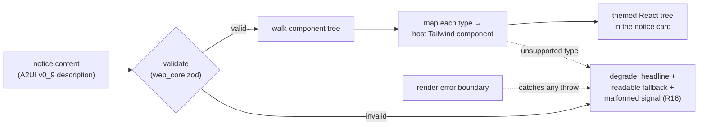

# feat: Roundup — A2UI rendering layer (read-only)

## Summary

Replace the Roundup notice's plain-markdown content with an **A2UI component description** that renders in the host's own theme. Notices carry an A2UI v0_9 component tree; a custom host-themed React walker renders it read-only, degrading to something readable when the description is malformed. This is a deliberate de-risking slice — it proves the emerging A2UI dependency installs, builds on React 18, and renders themed — before interactivity is built on top of it.

---

## Problem Frame

Slice 1 (merged, PRs #115/#116) shipped the Roundup end to end, rendering a notice's `background` as plain markdown. The brainstorm's real intent (origin R14–R16) is that agents describe notices as **A2UI** — a declarative component protocol — so the UI is agent-authored yet renders natively in Tinstar's theme, the same "out of your head, onto the pane" move the telemetry rail makes for machine state.

A2UI is an emerging spec on an unfrozen version track (its React renderer dropped React 18 in a *patch* release). The user chose to de-risk that dependency first, on a read-only slice, rather than discover it fighting us mid-interactivity. This slice answers: does `@a2ui/web_core` install and build in this repo, and can its component model render themed inside the widget? If yes, the risk is retired and interactivity becomes a straightforward next slice; if no, we learn it cheaply, and slice 1's foundation still stands.

---

## Requirements

Traceability is to the origin brainstorm. This slice covers R14–R16; other deferred requirements stay out of scope (see Scope Boundaries).

- R14. A notice's content is described as an A2UI component description, not markup or markdown. *(origin R14)*
- R15. Content renders through the host's own components and inherits the host theme. *(origin R15)*
- R16. An invalid or unrenderable description degrades to something readable — the headline always shows, plus a signal that the content was malformed. Never a blank card, never a crash. *(origin R16)*

---

## Key Technical Decisions

**KTD1 — Adopt A2UI's schema (the protocol), not its runtime.** Use `@a2ui/web_core`'s v0_9 zod schemas (`common-types`, `server-to-client`) to define and validate a notice's component description. Render it with a **custom host-themed React walker** that maps each A2UI component type to a Tailwind host component. Do NOT use web_core's `MessageProcessor` / `ComponentContext` / `GenericBinder` runtime, and do NOT use its `basic_catalog` (it ships its own styles, which defeats R15). Rationale: that runtime exists for live, stateful, interactive UI (streaming `createSurface` messages, a data model, an action path). Read-only static rendering exercises none of it, and its integration risk is coupled to interactivity — it gets de-risked in the next slice, where it is actually used. Adopting the schema now is genuine A2UI adoption; the schema *is* the protocol.

**KTD2 — Replace the content field; no back-compat.** The notice's `background: string` (markdown) is replaced by a structured A2UI content field. This is a brand-new feature with zero real notices, so there is nothing to preserve — no dual field, no markdown fallback path (per user decision). The graceful-degrade path (R16) is degrade-on-error, a distinct concern from back-compat.

**KTD3 — Pin `@a2ui/web_core` exactly.** Pin to an exact version (`0.10.4`), against the repo's caret-range convention. The package family dropped React 18 support in a patch release (`@a2ui/react` 0.10.0→0.10.1), so treat it as volatile and never let a range float it forward. Do NOT add `@a2ui/react`, do NOT upgrade React, never use `--legacy-peer-deps`.

**KTD4 — Validate at the API boundary AND degrade at render (defense in depth).** Reject a malformed component description on post/amend (server-side zod validation), and *also* render defensively so a description that somehow reaches the widget still can't blank or crash the board. Slice 1's lesson: a single non-string field crashed every card on the board, not just the bad one — so both boundaries harden.

**KTD5 — Build against v0_9.** `web_core` ships `v0_8` (legacy) and `v0_9` (current) namespaces side by side. Build against v0_9. The interactive `client-to-server` action schema exists in v0_9 but is out of scope here — only `server-to-client` / component schemas are adopted this slice.

---

## High-Level Technical Design

The render pipeline for one notice's content:



Validation runs twice with different jobs: once server-side on post/amend (reject bad input early), once at the render boundary (defense in depth). The walker maps a bounded initial catalog of static-content component types to host components; an unsupported or malformed type falls to the same degrade path as a validation failure, so there is exactly one "readable fallback" behavior to reason about.

---

## Output Structure

New A2UI rendering code lives beside the widget:

```
src/plugins/roundup/src/a2ui/
  schema.ts          # re-export / narrow the web_core v0_9 schemas this slice uses
  A2uiRenderer.tsx   # the host-themed walker: description → React tree, with degrade
  catalog.tsx        # component-type → host Tailwind component map
  __tests__/
    A2uiRenderer.test.tsx
```

Modified: `package.json`, `src/domain/types.ts`, `src/server/stores/document-store.ts`, `src/server/api/routes.ts`, `src/plugins/roundup/src/RoundupWidget.tsx`, `agent-skills/skills/roundup-notices/SKILL.md`, and the slice-1 notice tests.

---

## Implementation Units

### U1. Add the pinned dependency and reshape the notice content field

**Goal:** Bring in `@a2ui/web_core` (pinned), and replace the notice's markdown `background` with a structured A2UI content field end to end (type, docstore equality, API validation).

**Requirements:** R14.

**Dependencies:** none.

**Files:**
- `package.json` (add `@a2ui/web_core` exact-pinned; add `zod` as a direct dep if the validation code imports it directly, pinned to web_core's range)
- `src/domain/types.ts` (`Notice`: replace `background: string` with the A2UI content field)
- `src/server/stores/document-store.ts` (`noticeEqual` — compare the new field)
- `src/server/api/routes.ts` (POST/PATCH: validate the content against the v0_9 schema; reject invalid with a 4xx, mirroring the existing `INVALID_PARAMS` shape)
- `src/plugins/roundup/src/a2ui/schema.ts` (re-export/narrow the web_core v0_9 schemas used)
- `src/server/stores/__tests__/document-store.notices.test.ts` and `src/server/api/__tests__/routes.notices.test.ts` (update to the new field)

**Approach:**
- Field shape: the notice stores an A2UI component description (the component list + root reference that a `createSurface` would carry). Name it `content`. Validate it with web_core's v0_9 zod schema at the API.
- `noticeEqual` must compare the new field by value; if it's an object, a structural compare (or a cheap serialized compare) — the equality-short-circuit contract still holds (slice-1 lesson: the contract test guards it).
- Server-side validation (KTD4): on post/amend, parse `content` through the v0_9 schema; on failure return `INVALID_PARAMS`. This replaces slice 1's headline/background string checks for the content portion; `headline` validation is unchanged.
- Confirm `zod` availability: web_core depends on `zod` but the repo does not list it directly today — add it as a direct dep if imported directly, to avoid a floating transitive.

**Patterns to follow:** slice-1 route validation in `src/server/api/routes.ts` (the `/api/notices` POST/PATCH handlers), the `noticeEqual` comparator and short-circuit contract in `document-store.ts`.

**Test scenarios** (`document-store.notices.test.ts`, `routes.notices.test.ts`):
- Post with a valid A2UI `content` stores it and returns it.
- Post with malformed `content` (fails v0_9 schema) returns `INVALID_PARAMS` (400) and stores nothing.
- Amend `content` emits exactly one change; an amend to an equal `content` short-circuits to **zero** change events (the contract test, updated for the new field).
- Run-end cascade still drops the notice (unchanged from slice 1 — guard it survives the field change).

**Verification:** typecheck clean; the updated slice-1 tests pass; the short-circuit contract test still fails if the guard is removed.

### U2. Host-themed A2UI renderer (the walker + catalog)

**Goal:** A read-only React renderer that walks a validated A2UI component description and renders each supported type as a host Tailwind component (R15).

**Requirements:** R14, R15.

**Dependencies:** U1.

**Files:**
- `src/plugins/roundup/src/a2ui/A2uiRenderer.tsx`
- `src/plugins/roundup/src/a2ui/catalog.tsx`
- `src/plugins/roundup/src/a2ui/__tests__/A2uiRenderer.test.tsx`

**Approach:**
- The catalog maps a bounded initial set of static-content A2UI component types — text/paragraph, heading, list (ordered/unordered) + list items, link, code/pre, and a container (column/section) for grouping — to host Tailwind components styled to match the current notice card (reuse the Tailwind classes the slice-1 widget already applies to markdown output, e.g. links `text-sky-300 underline`, lists `list-disc pl-5`).
- The renderer resolves child references per the A2UI model (flat component list with id references) and recurses. No data-model binding, no actions (read-only) — if a component carries a data binding or action, render its static/label form and ignore the dynamic part this slice.
- An unsupported component type routes to the degrade path (U3), not a thrown error.

**Patterns to follow:** the existing markdown styling block in `src/plugins/roundup/src/RoundupWidget.tsx` (the `[&_a]:… [&_ul]:…` classes) for visual parity; the A2UI v0_9 component schema in `web_core` for the type set and child-reference model.

**Test scenarios:**
- Renders a text component to themed host markup.
- Renders a nested list (container → list → items) with correct structure and host classes.
- Renders a link with the host link styling and the correct href/label.
- An unsupported component type renders the degrade fallback rather than throwing (integration with U3).
- A component carrying a data binding renders its static form without error (dynamic part ignored this slice).

**Verification:** the renderer produces themed markup for the supported catalog; visually matches the card styling; no crash on unsupported types.

### U3. Graceful degrade (R16)

**Goal:** Guarantee a notice always shows its headline and something readable, with a malformed signal, no matter how broken its content is — never blank, never a crashed board.

**Requirements:** R16.

**Dependencies:** U2.

**Files:**
- `src/plugins/roundup/src/a2ui/A2uiRenderer.tsx` (the degrade wrapper + a render error boundary)
- `src/plugins/roundup/src/a2ui/__tests__/A2uiRenderer.test.tsx`

**Approach:**
- Two degrade triggers converge on one behavior: (a) content that fails v0_9 validation at render, and (b) an unexpected throw during the walk (React error boundary around the renderer). Both show a small "this notice's content couldn't be rendered" line plus, where safe, a readable text extraction of the description — and the notice's headline (rendered by the widget, outside the renderer) is always present.
- The error boundary is per-notice, so one bad notice degrades only itself — directly the slice-1 lesson (a bad field crashed *every* card).

**Test scenarios:**
- **Covers AE7 (origin).** Content that fails schema validation renders the malformed signal + readable fallback, not a blank card.
- A component tree that throws mid-render is caught by the per-notice boundary; sibling notices render normally.
- The headline is present in the degrade case (assert it renders regardless of content validity).

**Verification:** no content shape produces a blank card or a board-wide crash; the malformed signal is visible; siblings are isolated.

### U4. Wire the renderer into the widget

**Goal:** Replace the widget's `ReactMarkdown(background)` call with the A2UI renderer on `content`.

**Requirements:** R14, R15.

**Dependencies:** U2, U3.

**Files:**
- `src/plugins/roundup/src/RoundupWidget.tsx`

**Approach:**
- Swap the expandable body: where it currently renders `<ReactMarkdown>{n.background}</ReactMarkdown>`, render `<A2uiRenderer content={n.content} />` wrapped in the per-notice error boundary. Keep the surrounding card, kind badge, headline, expand toggle, and timestamps exactly as they are.
- Remove `react-markdown` usage from this widget. Leave the dependency in `package.json` (it may be used elsewhere — verify with a repo search; only remove the dep if this was its sole consumer, and treat that as a separate cleanup, not part of this slice).

**Patterns to follow:** the current expandable-body block in `RoundupWidget.tsx`.

**Test scenarios:** `Test expectation: none — presentational wiring; covered by U2/U3 renderer tests and the route/store tests. If a content-extraction helper is added, unit-test it.`

**Verification:** `npm run build:all` bundles the widget with web_core; at runtime a notice with A2UI content renders themed, and a malformed one degrades — confirmed after redeploy (see Verification Strategy).

### U5. Update the agent skill to emit A2UI

**Goal:** Teach agents to author notice content as A2UI v0_9 component descriptions, at the de-nerd depth bar.

**Requirements:** R14 (and the de-nerd standard carried from origin R9).

**Dependencies:** U1.

**Files:**
- `agent-skills/skills/roundup-notices/SKILL.md`

**Approach:** Replace the "background is markdown" guidance with the A2UI component shape: the supported component types (U2's catalog), a worked `curl` example posting a notice whose `content` is a small component tree (a heading + paragraph + list + link), and the note that unsupported/malformed content degrades rather than renders. Keep the depth-bar guidance — plenty of plain-language context — since the whole value is the user orienting cold.

**Test scenarios:** `Test expectation: none — documentation. Verify the curl example's content validates against the v0_9 schema.`

**Verification:** the skill's example content passes the same v0_9 validation the API enforces.

---

## Scope Boundaries

### Deferred to Follow-Up Work
- **Interactivity** (origin R10, R11): choice controls (radio/checkbox) and free-text input. This is where web_core's `MessageProcessor`, data model, and the `client-to-server` action schema get adopted and de-risked.
- **Answer-back + dissent** (origin R13, R22, R23): submitting a choice/text to the agent; the FYI "disagree" affordance.
- **Auto-posting** (origin R19): posting/retracting on session block/unblock.
- **Removing `react-markdown`** if the Roundup was its only consumer — a separate cleanup, only if the repo search in U4 confirms no other use.

### Non-goals (this slice)
- `@a2ui/react` and any React upgrade.
- web_core's `basic_catalog` styled components (they defeat R15).
- The A2UI data-model / binding / action runtime (read-only needs none of it).

---

## Risks & Dependencies

- **The core de-risk itself: does `@a2ui/web_core` install and build here?** It brings `zod` and preact signals; it must survive `npm ci`, the vite client build, and the esbuild server bundle on React 18. This is unverified until U1/U4 build. If it fails (bundling, ESM/CJS interop, a transitive peer), *that is the slice's finding* — surface it, do not force it with overrides. The fallback (schema types only, hand-rolled validation) would itself be the de-risk answer.
- **zod is not currently a direct repo dependency.** web_core depends on it; if validation imports zod directly, add it as a direct, pinned dep to avoid a floating transitive that could drift.
- **The v0_9 component schema may be richer than static-content needs.** We support a bounded catalog and degrade on the rest (R16), rather than mapping the whole schema this slice.
- **Volatile dependency (KTD3).** Exact-pin and never float.
- **Deploy trap (carried from slice 1):** the standalone serves prebuilt `dist/`; a change here needs `build:all` + a `systemctl --user restart tinstar.service`, and the palette/registry is served, not client-cached — see `docs/solutions/conventions/adding-a-docstore-entity-and-plugin-widget.md`.

---

## Verification Strategy

Pre-merge gate (matches CI `typecheck-and-test`):
- `npm run typecheck` — 3 tsconfigs, zero errors.
- `npm run build:all` — **the load-bearing check this slice**: it proves web_core bundles into both the vite client and the esbuild server. A build failure here is the de-risk finding, not a step to force past.
- `npx vitest run --exclude='e2e/**'` — the new renderer/degrade tests plus the updated slice-1 notice tests.
- `npm run check:case`.

Runtime spot-check after redeploy (per the deploy trap above, and without disturbing a running server the agent doesn't own): post a notice with a small A2UI `content` tree via `curl`, confirm it renders themed in the widget; post a deliberately malformed `content`, confirm the card degrades to headline + malformed signal and its siblings are unaffected.

---

## Sources & Research

- `docs/brainstorms/2026-07-17-roundup-requirements.md` — origin; R14–R16, the A2UI dependency analysis, and the v0_9-vs-react finding.
- `docs/plans/2026-07-17-001-feat-roundup-notice-board-plan.md` — slice 1 (the shipped foundation this builds on).
- `@a2ui/web_core` v0.10.4 (installed and inspected): v0_9 namespace exposes `schema/common-types` (`AnyComponent`, `Action`, `ChildList`, `ComponentId`), `schema/server-to-client` (`CreateSurfaceMessage`), `schema/client-to-server` (the action path — deferred), `processing/message-processor` (`MessageProcessor` — deferred), `rendering/{component-context,generic-binder}` (deferred), and `basic_catalog` (own-styled — not used). Confirms the "adopt schema, not runtime" decision.
- `src/plugins/roundup/src/RoundupWidget.tsx` — the current markdown render block and card styling to preserve for visual parity.
- `docs/solutions/conventions/adding-a-docstore-entity-and-plugin-widget.md` — the deploy trap and the two-place-registration lesson (widget registration is unchanged this slice, but the deploy mechanics recur).
- https://www.npmjs.com/package/@a2ui/web_core — the framework-agnostic protocol layer.
