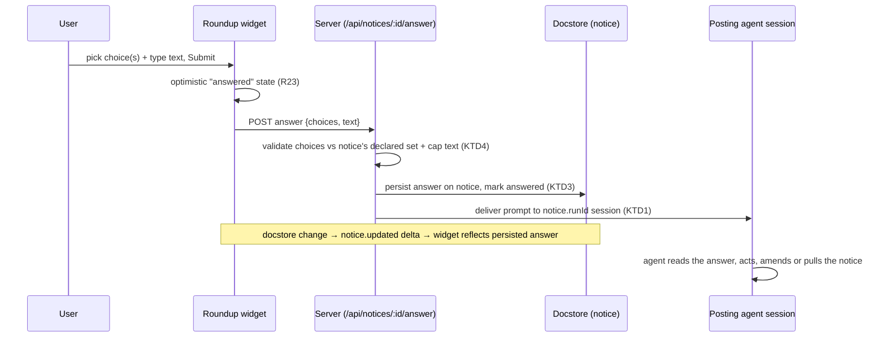

# feat: Roundup — interactivity (answer decisions from the widget)

## Summary

Make a needs-you notice answerable from the widget: it can carry a choice set (single- or multi-select) and a free-text field with a submit button; submitting delivers the answer to the posting agent and persists it on the notice, with immediate optimistic feedback. FYI notices gain a dissent affordance. Each notice also gets a "jump to this session" link that pans the canvas to the posting run's card. This closes the loop the read-only slices left open — resolving a decision without switching to the terminal.

---

## Problem Frame

Slices 1–2 (merged) gave the Roundup a durable, live, themed, agent-authored surface — but read-only. You can see what an agent needs; you still go to the terminal to answer, which is the exact context-switch the Roundup exists to remove. This slice adds the answer-back loop so the Roundup becomes actionable, not just informative.

Tinstar already has the two-way pattern this needs: notes/pins deliver a user reply to an agent by baking a `curl` into a prompt (`src/pins/replyPrompt.ts`, `POST /api/notes/:id/replies`) and persisting the reply on the note, threaded and live. This slice applies that proven mechanism to notices.

---

## Requirements

Covers the deferred interactivity requirements from the origin brainstorm.

- R10. A needs-you notice may carry a choice set, rendered single-select or multi-select. *(origin R10)*
- R11. A needs-you notice may carry a free-text field, available with or without a choice set. *(origin R11)*
- R13. An FYI carries a dissent affordance; without one, "nothing needed unless I disagree" has no mechanism. *(origin R13)*
- R22. Submitting delivers the choice(s) + free text to the posting agent. *(origin R22)*
- R23. The user gets immediate visual feedback on submit, without waiting for the agent to acknowledge. *(origin R23)*
- R12. A notice's viewport link moves the canvas to the posting run's card — the "links that move the viewport to those agents" idea, applied to a notice's own session. *(origin R12, extending the brainstorm's delegation-link intent)*

---

## Key Technical Decisions

**KTD1 — Answer-back reuses the notes/pins prompt-delivery pattern, not a new channel.** On submit, the server (a) persists the answer on the notice and (b) delivers it to the posting session as a prompt, mirroring how a note reply reaches its agent (`src/pins/replyPrompt.ts` + `POST /api/sessions/:id/enter-prompt`). The notice already carries `runId` (the run id = session name), so the target session is known. Rejected alternatives: NATS reply (only reaches NATS-enabled sessions; notes' prompt-delivery is the universal channel) and a bare `/prompt` with no persistence (loses the durable record the widget needs to show "answered").

**KTD2 — Controls stay a custom model over the A2UI schema; the web_core runtime stays deferred.** Extend the slice-2 custom walker (`src/plugins/roundup/src/a2ui/`) with a small set of interactive control component types (single-select, multi-select, text input, submit) rendered as host Tailwind controls with host-managed form state. Do NOT adopt web_core's `MessageProcessor` / `ActionListener` / surface-data-model runtime or the `client-to-server` action path. Rationale: that runtime is built for live, streaming, self-updating surfaces with a data model; a notice is a fixed form submitted once, so the runtime is overkill — and it is the unfrozen v1.0-candidate surface (per origin Dependencies). This keeps slice 2's schema-not-runtime posture: the controls are still A2UI *component types* the agent describes; only the rendering + submit is host-owned. (see origin: docs/brainstorms/2026-07-17-roundup-requirements.md)

**KTD3 — The answer persists on the notice; the agent decides the notice's fate.** Submitting writes an answer record onto the notice (selected choice(s), free text, timestamp, and whether it was a dissent) and marks it answered. The agent, on receiving the prompt, decides whether to amend or pull the notice — the widget does not force-remove it. The widget shows "answered" optimistically on submit (R23), independent of the agent.

**KTD4 — Defense in depth on submitted input, matching slice 2.** Validate the answer server-side (choice ids must match the notice's declared choices; text length capped) and render defensively. A malformed control definition degrades via the existing per-notice error boundary (R16 discipline) rather than crashing the board. Agent-authored control definitions get the same passthrough-schema caution slice 2 established (validate what the renderer trusts).

**KTD5 — The viewport link uses the existing plugin API.** `api.canvas.fitWidget('run-' + notice.runId)` pans the canvas to the posting run's card — the same flash-focus mechanism the Inbox uses (`src/canvas/flashAndFocus.ts`). No new host capability needed.

---

## High-Level Technical Design

The answer-back flow for a needs-you notice:

Dissent on an FYI is the same flow with a smaller payload (an objection text, no choice set). The `notice.updated` delta already wires live refresh (slice 1), so the persisted answer reaches the widget the same way agent edits do.

---

## Implementation Units

### U1. Notice answer model + the answer endpoint

**Goal:** Give a notice an answer record and a server endpoint that persists the answer and delivers it to the posting agent.

**Requirements:** R22, R23 (persistence half), R13 (dissent payload).

**Dependencies:** none.

**Files:**
- `src/domain/types.ts` (add an `answer` shape to `Notice`: selected choice ids, free text, answered timestamp, dissent flag)
- `src/server/api/routes.ts` (`POST /api/notices/:id/answer`)
- `src/server/stores/document-store.ts` (`noticeEqual` compares the answer; the mutator short-circuit still holds)
- `src/pins/replyPrompt.ts` or a sibling (the prompt text an agent receives — reuse the pattern, not necessarily the file)
- `src/server/api/__tests__/routes.notices.test.ts`, `src/server/stores/__tests__/document-store.notices.test.ts`

**Approach:**
- Endpoint body: `{ choices?: string[], text?: string, dissent?: boolean }`. Validate: each `choices` id must exist in the notice's declared choice set (U2 defines where that lives); `text` capped like slice 1's caps; reject with `INVALID_PARAMS` otherwise.
- Persist: write the answer onto the notice via `upsertNotice`, set an `answeredAt`. Emits `notice.updated` (live refresh for free).
- Deliver: resolve the posting session from `notice.runId` and deliver a prompt describing the answer (headline + chosen option(s) + text), mirroring the note-reply instruction block. Use the same session-prompt path notes use (`/enter-prompt`), honoring its existing not-ready handling.
- Decide the not-ready case: if the session can't take a prompt right now, the answer still persists (durable) and delivery is best-effort — surface that in the response rather than failing the whole submit.

**Patterns to follow:** `POST /api/notes/:id/replies` (`routes.ts:2738`), `src/pins/replyPrompt.ts`, the slice-1 `/api/notices` handlers and `noticeEqual`.

**Test scenarios:**
- Submit with a valid choice + text: persists the answer, marks answered, returns ok; a `notice.updated` change fires.
- Submit a choice id not in the notice's declared set: `INVALID_PARAMS` (400), nothing persisted.
- Submit oversized text: 413/`INVALID_PARAMS`.
- Dissent submit (dissent:true, text, no choices): persists as a dissent answer.
- **Covers AE2 (origin).** A dissent on an FYI delivers the objection toward the posting session; absent dissent, nothing is delivered.
- Answer to a notice whose session isn't prompt-ready: answer still persists; response signals delivery was deferred.

**Verification:** vitest green; the short-circuit contract test still fails if the guard is removed.

### U2. Interactive control components in the A2UI catalog

**Goal:** Add single-select, multi-select, text-input, and submit control types to the renderer, as A2UI component types rendered with host controls.

**Requirements:** R10, R11.

**Dependencies:** none (renderer-side; pairs with U1 at U3).

**Files:**
- `src/plugins/roundup/src/a2ui/catalog.tsx` (control component entries)
- `src/plugins/roundup/src/a2ui/schema.ts` (extend the accepted component types / narrow control props)
- `src/plugins/roundup/src/a2ui/__tests__/A2uiRenderer.test.tsx`

**Approach:**
- Define control component types (e.g. a choice component with a mode discriminator for single vs multi, a text-input component, a submit component), each mapping to host Tailwind form controls, matching the card styling.
- Controls read their options/labels from the A2UI node (the agent declares them); the *value/state* is host-owned (U3), not in the A2UI data model — this is the custom-model boundary (KTD2).
- Unknown/malformed control definitions degrade via the existing fallback (KTD4), never throw.
- These render only inside an interactive form context (U3); a control rendered read-only (no form context) shows a disabled/static form for safety.

**Patterns to follow:** the slice-2 catalog entries and walker (`catalog.tsx`, `A2uiRenderer.tsx`), the host form-control styling already used elsewhere (`src/components/PromptComposer` for input styling cues).

**Test scenarios:**
- A single-select choice renders radio controls with the declared options.
- A multi-select choice renders checkboxes.
- A text-input renders a textarea.
- A malformed control (missing options) degrades to the fallback, not a throw.
- The declared choice ids are exposed so U1's server validation has a source of truth (assert the parsed choice set).

**Verification:** controls render themed; malformed controls degrade.

### U3. Form state + submit wiring (optimistic)

**Goal:** Collect control state per notice, submit it to U1's endpoint, and show immediate optimistic feedback.

**Requirements:** R22 (submit half), R23.

**Dependencies:** U1, U2.

**Files:**
- `src/plugins/roundup/src/a2ui/A2uiRenderer.tsx` or a new form container in `src/plugins/roundup/src/`
- `src/plugins/roundup/src/RoundupWidget.tsx` (wire the submit handler via `api.http`)
- `src/plugins/roundup/src/a2ui/__tests__/` (form/submit tests)

**Approach:**
- A per-notice form context holds control state (selected choices, text). Submit collects it and POSTs to `/api/notices/:id/answer` via `api.http`.
- Optimistic (R23): on submit, immediately show the notice as answered (disable controls, show a confirmation) without waiting for the response; reconcile on the `notice.updated` delta or on an error (revert + show the failure).
- One submit per notice; guard against double-submit.

**Patterns to follow:** the slice-1 optimistic patterns and `api.http` usage in the Roundup widget; `PromptComposer` submit semantics.

**Test scenarios:**
- Filling controls + submit POSTs the collected choices + text.
- Submit shows the answered state immediately (before the server responds).
- A failed submit reverts the optimistic state and surfaces an error.
- Double-submit is prevented.

**Verification:** submitting a needs-you notice answers it in the widget instantly; the answer reaches the endpoint.

### U4. FYI dissent affordance

**Goal:** Let the user disagree with an FYI, delivering the objection to the posting agent.

**Requirements:** R13, R22.

**Dependencies:** U1, U3.

**Files:**
- `src/plugins/roundup/src/RoundupWidget.tsx` (dissent control on FYI notices)
- `src/plugins/roundup/src/a2ui/__tests__/` or the widget test

**Approach:**
- FYI notices show a small "disagree" affordance that opens a text field and submits via the same answer endpoint with `dissent: true`. Silence stays consent (no affordance interaction = nothing delivered).
- Reuses U3's submit path and U1's endpoint; no separate mechanism.

**Test scenarios:**
- **Covers AE2 (origin).** Dissenting on an FYI delivers the objection; doing nothing delivers nothing.
- The dissent affordance appears only on FYI notices, not needs-you.

**Verification:** an FYI can be dissented from; the objection reaches the agent.

### U5. Viewport-jump link

**Goal:** A per-notice link that pans the canvas to the posting run's card.

**Requirements:** R12.

**Dependencies:** none.

**Files:**
- `src/plugins/roundup/src/RoundupWidget.tsx`

**Approach:** Add a small "jump to session" affordance per notice (or per run-section header) calling `api.canvas.fitWidget('run-' + notice.runId)`. No-op safe if the run's card isn't in the layout (fitWidget is documented no-op).

**Test scenarios:** `Test expectation: none — thin call into the plugin API; if a helper resolves the node id, unit-test that it prefixes 'run-'.`

**Verification:** clicking the link moves the viewport to the posting run's card.

### U6. Agent skill update

**Goal:** Teach agents to author answerable notices and to consume the answer.

**Requirements:** R10, R11, R13, R22.

**Dependencies:** U1, U2.

**Files:**
- `agent-skills/skills/roundup-notices/SKILL.md`

**Approach:** Document the control component types (choice/text/submit) in an A2UI `content` tree, the answer prompt the agent will receive when the user submits, the dissent shape, and the expectation that the agent amends or pulls the notice after acting. Keep the de-nerd depth bar.

**Test scenarios:** `Test expectation: none — documentation. Verify the example content validates against the schema.`

**Verification:** the skill's example validates; the described answer-prompt matches U1's delivery.

---

## Scope Boundaries

### Deferred to Follow-Up Work
- **web_core's `MessageProcessor` / action runtime** — deferred indefinitely unless notices become live, self-updating surfaces (KTD2). Not a v-next commitment.
- **Auto-posting on session block/unblock** (origin R19) — still a separate slice.
- **Swimlanes** (origin) — branched-conversation view remains out of scope.
- **Threaded back-and-forth on a notice** — this slice is one answer per notice; multi-turn threads (like note replies) are a possible future extension, not built here.

### Non-goals (this slice)
- Adopting the A2UI client-to-server action schema or a React upgrade.
- Changing how agents author read-only content (slices 1–2 unchanged).

---

## Risks & Dependencies

- **Prompt delivery to a busy/blocked session.** The target session may not be prompt-ready. Mitigation (KTD1/U1): persist the answer regardless; deliver best-effort; signal deferred delivery rather than failing the submit. The agent can also poll its own notices.
- **Agent-authored control definitions are an input surface.** Same passthrough-schema caution as slice 2 — validate choice ids and text server-side (KTD4), degrade malformed controls, never trust the client.
- **Optimistic UI divergence.** If the server rejects a submit after the optimistic "answered" state, the widget must revert cleanly (U3) — tested explicitly.
- **Deploy trap (carried):** standalone serves prebuilt `dist/`; needs `build:all` + `systemctl --user restart tinstar.service`, and a cache-bypassing reload for the new client bundle — see `docs/solutions/conventions/adding-a-docstore-entity-and-plugin-widget.md`.

---

## Verification Strategy

Pre-merge gate (matches CI): `npm run typecheck` (3 tsconfigs), `npm run build:all`, `npx vitest run --exclude='e2e/**'` (new answer/route/control/form tests + updated slice-1/2 tests), `npm run check:case`. Prefix with `env -u NODE_ENV`.

Runtime spot-check after redeploy (without disturbing a running server the agent doesn't own): post a needs-you notice with a choice set + text field via `curl`; in the widget, pick an option, type, submit; confirm the notice shows answered immediately and the posting session receives a prompt with the answer. Dissent an FYI and confirm the objection is delivered. Click the viewport link and confirm the canvas pans to the run's card.

---

## Sources & Research

- `docs/brainstorms/2026-07-17-roundup-requirements.md` — origin (R10–R13, R22–R23, the answer-back and dissent intent).
- `docs/plans/2026-07-17-001-...`, `docs/plans/2026-07-17-002-...` — the shipped foundation (entity/API/widget; A2UI read-only rendering).
- `src/pins/replyPrompt.ts`, `POST /api/notes/:id/replies` (`routes.ts:2738`), `docs/features/2026-06-13-note-replies-design.md` — the answer-back precedent this slice reuses.
- `@a2ui/web_core` v0_9 `schema/client-to-server` (`A2uiClientActionSchema`) + `processing/message-processor` (`MessageProcessor`, `actionHandler`) — the runtime action path this slice deliberately defers (KTD2), grounded in the installed package.
- `packages/plugin-api/src/index.ts` — `api.canvas.fitWidget` (KTD5); `src/canvas/flashAndFocus.ts` and `src/components/InboxList.tsx` — the same pan-to-card the Inbox uses.
- `docs/solutions/conventions/adding-a-docstore-entity-and-plugin-widget.md`, `docs/solutions/tooling-decisions/adopting-a2ui-for-agent-authored-ui.md` — the deploy trap, two-place registration, and the agent-authored-UI safety traps (validate passthrough props, bound node counts).
