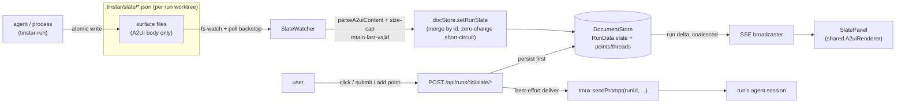
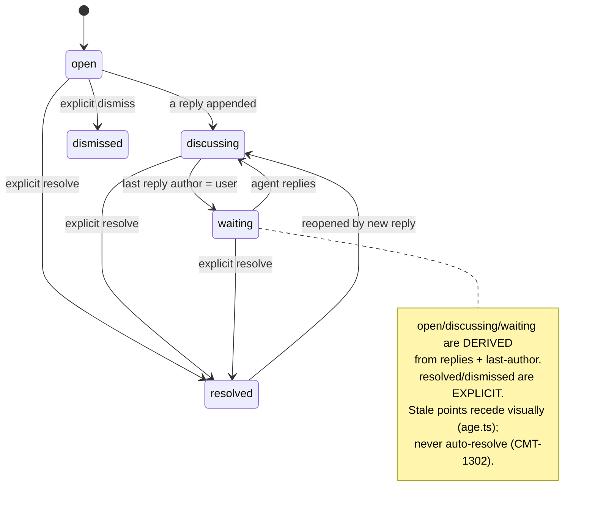

# feat: The Slate — per-run A2UI surfaces

## Summary

Add **The Slate**: a new region of the run workspace card where an agent, the user, or
any local process paints small interactive A2UI surfaces scoped to one run — an
open-points list, diagram surfaces with per-surface threads, forms, and live progress
cards. Surfaces are authored **file-in** (a process writes `.tinstar/slate/*.json`; a
server watcher validates and projects onto the run) and answered **HTTP-out** (a control
submit persists to the store and delivers a prompt to the run's agent). Points, threads,
and lifecycle status are **store-backed**; the file authors only a surface's A2UI body.

---

## Problem Frame

An agent talks through a single linear transcript, a poor interface when the user runs
~10 sessions at once. Open questions, decisions, follow-up work, and the status of
long-running commands evaporate into the scroll (origins: CMT-1302 — an agent believed it
was done while a human decision was unresolved; vppOps — a long deploy with no live status
surface, so the user had to ask). The Roundup is a *global* aggregate and can't visualize
per-session detail at 10-up, so the rich surface belongs inside each run's own workspace.

---

## High-Level Technical Design

### Dataflow — file-in authoring, HTTP-out answering



### Field ownership — the central correctness invariant (KTD1)

A file re-projection must **merge, not replace**. The watcher overwrites only the
presentational body; everything a human or the store produced is preserved by id.

| Field | Owner | Who writes it |
|---|---|---|
| A2UI `content` (surface body) | **file** | agent/process file write → watcher |
| `headline`, surface `order` | **file** | file write → watcher |
| `replies` (thread) | **store** | HTTP reply endpoint (user/agent/process) |
| `status` (lifecycle), `resolvedAt`, `dismissedAt` | **store** | derived + explicit HTTP resolve |
| `answer` (control submit) | **store** | HTTP answer endpoint |
| `id`, `runId`, `createdAt` | **store** | server on first projection |

A file write that omits `id` cannot be diffed and loses its thread; **point/surface
identity is an id inside the file**, filename incidental.

### Point lifecycle (soft, never auto-resolved)



---

## Requirements

Carried from `docs/brainstorms/2026-07-21-the-slate-requirements.md` (its R1–R16),
regrouped by build concern.

### Rendering
- R1. The Slate renders A2UI content by calling the existing shared renderer
  (`A2uiRenderer`), never a re-implemented walker. (origin R1)
- R2. Reuse the renderer budgets unchanged — `MAX_DEPTH`, `MAX_NODES`, and the
  per-surface error boundary — so a hostile/malformed surface can't hang or blank the
  card; budgets are per-surface, not per-card. (origin R2)
- R3. Reuse the host `CATALOG` and `safeHref` allowlist so a `javascript:`/`data:` URL
  degrades to plain text. (origin R3)
- R4. Promote the a2ui module to `src/a2ui/`; share the universal parts (walker, budgets,
  degrade path, `parseA2uiContent`); the catalog may diverge for Slate-specific bricks.
  (origin R4)

### Storage & projection
- R5. Points, threads, and lifecycle status are **store-backed** docstore state; a
  surface's A2UI body is a projection on the run. (origin §14 resolved)
- R6. The run projection field follows the 3-place `RunData` contract (type,
  `runShallowEqual`, `mergeRun`); the equality check uses a by-value compare and the
  client merge reads the field explicitly so a retract clears. (origin R6)
- R7. The Slate mutator equality-short-circuits on unchanged content (zero `change`
  events on a no-op re-projection) — the file-watch storm guard. (origin R6)
- R8. A run's Slate is pruned when the run is deleted. (origin, deleteRun cascade)

### Authoring (file-in)
- R9. Default authoring is an observable artifact: `.tinstar/slate/*.json` per surface;
  a server watcher reads, validates through `parseA2uiContent`, and projects. (origin R5)
- R10. Every read is validated and size-capped; invalid/oversized content **retains the
  last-valid surface** and logs on transition-into-invalid, never crashes the tick.
  (origin R7/R8)
- R11. Clear semantics are unambiguous: `unlink` or an explicit empty array retracts a
  surface; a zero-byte or unparseable file retains the last-valid (torn-write safety).
  Writers use atomic temp-file + rename. (origin R8)
- R12. Merge-by-id: a re-projection preserves store-owned `replies`/`status`/`answer`
  and overwrites only the file-owned body. (KTD1)

### Answering & delivery (HTTP-out)
- R13. Interactive controls (`Choice`, `TextInput`, `Submit`) render from the shared
  control components with host-owned form state, keyed per control-component id. (origin R10)
- R14. A control submit / reply / added point routes over HTTP to a run-scoped endpoint:
  persist first, then best-effort deliver a prompt to the run's session; return
  `delivered:false` (not an error) when the session is gone. Submitted choices validate
  against the current surface content. (origin R10/R11)
- R15. A user reply/point is delivered immediately by injection; an agent or process
  reply is not delivered. The agent skill carries the guardrail: an injected comment is a
  note, not a command to drop in-flight work. (origin R15/R16)

### The two hero surfaces
- R16. The open-points list renders points with status, author, a visual state track, an
  expandable thread, soft resolve, and add-a-point — agent- and user-authored share the
  list. (origin R12)
- R17. Diagram surfaces render an A2UI picture and carry a per-surface thread anchored to
  the surface. (origin R13)

### Process-authored surfaces
- R18. A `tinstar-run <cmd>` wrapper writes a live progress surface on start, amends it
  during the run, and on exit finalizes it and delivers a completion prompt to the run's
  agent — via file writes, no Tinstar URL. (origin R14/§7)
- R19. A server-side staleness sweep marks a "running…" surface stalled when no update
  arrives for N minutes, so a `kill -9`'d wrapper can't leave a permanent fake-live
  spinner. (research E1/H5)

---

## Key Technical Decisions

- **KTD1 — File owns the body; store owns threads/status/answers; merge by id.** The
  watcher's projection preserves store-owned fields and overwrites only the A2UI body.
  Without this, a `tinstar-run` amend every 200ms wipes a reply the user just typed. This
  is the feature's central correctness risk. (see origin §14; research H2)
- **KTD2 — Store-backed points, file as one authoring input.** Points/threads/lifecycle
  are docstore state; a file write is one way to author a point's body. Threads and
  user-added points require a real store. (origin §14 resolved)
- **KTD3 — Reuse the shared A2UI stack; promote, don't fork.** Move
  `src/plugins/roundup/src/a2ui/` to `src/a2ui/`; the module imports only `domain/types`
  + `@a2ui/web_core`, so promotion is a move + re-export. Preserve the server/client
  split (`schema.ts`/`controls.ts`/`followUps.ts` are React-free and ride the server
  bundle). The two shipped safety traps (URL-scheme allowlist, total-node budget) come
  for free. (see origin: docs/solutions/tooling-decisions/adopting-a2ui-for-agent-authored-ui.md)
- **KTD4 — Watcher = fs-watch + poll backstop, mirroring the git-diff reconcile loop.**
  The existing `status-watcher.ts` is a 3s interval poll; live progress needs fs-watch
  (inotify) for latency, with a slow poll floor as a backstop for missed events
  (network mounts, container overlayfs). The watcher reads+validates and calls a docstore
  mutator; it never touches the store directly. (research seam 3)
- **KTD5 — Answer endpoint clones the notices answer route.** Persist-first, best-effort
  `sendPrompt(config, runId, ...)` (runId is the tmux session name), `delivered` flag,
  choice+length validation, body via `readBody`. Match sub-resource routes with an
  **anchored regex placed before** any greedy `/:id` handler. Name the route for the
  run/capability, not the plugin. (research seam 4; docs/solutions sub-resource-routes,
  widget-to-agent-answer-back, reuse-readbody, no-bespoke-per-plugin-server-routes)
- **KTD6 — Injection guardrail ships prompt-only.** Deliver user input immediately; the
  agent skill instructs "finish/checkpoint in-flight work first." Do not build the
  "hold until end of turn" gate now; add an observability log of injected-comment-during-
  tool-use so the wrong-if is measurable. (origin R16; research Q3)
- **KTD7 — The Slate is a panel inside the core `RunWorkspaceWidget`.** No bundled-plugin
  registration (that two-place `bundled.ts` + `builtinPluginManifests.ts` change applies
  only to separately-placeable plugin widgets). (research seam 5)

---

## Output Structure

New and moved files (per-unit `Files` are authoritative):

```
src/
  a2ui/                         # U1: promoted from src/plugins/roundup/src/a2ui/
    schema.ts  controls.ts  followUps.ts        # shared (server+client), React-free
    catalog.tsx  controlComponents.tsx  A2uiRenderer.tsx   # client
  server/
    sessions/slate-watcher.ts   # U4: fs-watch + poll backstop
    stores/slate.ts             # U3: point/surface store model + merge-by-id
    api/routes.ts               # U7: run-scoped slate endpoints (edited)
  components/RunWorkspaceWidget/
    SlatePanel.tsx              # U5: the Slate column
    OpenPointsSurface.tsx       # U6: open-points hero surface
    DiagramSurface.tsx          # U8: diagram + per-surface thread
bin/
  tinstar-run                   # U9: self-reporting command wrapper
```

---

## Implementation Units

### Phase 1 — Foundation

### U1. Promote the A2UI module to a shared home

**Goal:** Move `src/plugins/roundup/src/a2ui/` to `src/a2ui/` so the run widget can reuse
it without depending on the Roundup plugin's internals.
**Requirements:** R1, R2, R3, R4.
**Dependencies:** none.
**Files:** move `src/plugins/roundup/src/a2ui/*` → `src/a2ui/*`; update imports in
`src/server/api/routes.ts` (~L56–58) and `src/plugins/roundup/src/RoundupWidget.tsx`
(~L31–34); `src/a2ui/__tests__/*` (moved).
**Approach:** Relative import paths collapse `../../../../domain/types` → `../domain/types`.
Preserve the `.ts` (shared, server+client, React-free) vs `.tsx` (client) split — the
server esbuild bundle imports `schema.ts`/`controls.ts`/`followUps.ts`. Optionally leave a
re-export barrel at the old path for a smaller diff. Consider renaming `NoticeFormState`
to a neutral name only if the Slate reuses the form context (defer if not).
**Patterns to follow:** existing module structure; header comments already document the
server-safe constraint.
**Test scenarios:** move the existing `a2ui/__tests__` suite unchanged and confirm green;
`Covers R2.` a malformed tree still degrades via the error boundary and the node-budget
fallback fires. Add a build assertion that the server bundle still compiles the shared
`.ts` files.
**Verification:** `env -u NODE_ENV npm run typecheck` green; existing a2ui + roundup tests
pass; Roundup notice rendering unchanged at runtime.

### U2. Add the Slate projection to `RunData` (the 3-place change)

**Goal:** Carry per-run Slate surfaces on the run projection so they fan out over SSE.
**Requirements:** R5, R6, R7.
**Dependencies:** U1.
**Files:** `src/domain/types.ts` (RunData); `src/server/stores/document-store.ts`
(`runShallowEqual`, new `setRunSlate` mutator); `src/hooks/useServerEvents.ts` (`mergeRun`);
`src/server/stores/__tests__/document-store.slate.test.ts`;
`src/hooks/__tests__/useServerEvents.slate.test.ts`.
**Approach:** Add `slate?: SlateSurface[]` next to `attention?`. In `runShallowEqual`, add a
**by-value** compare (`JSON.stringify(a.slate ?? null) === JSON.stringify(b.slate ?? null)`)
— mirror `noticeEqual`, not `attentionShallowEqual` (the watcher rebuilds a fresh
projection each read, so reference compare never short-circuits). In `mergeRun`, add
`slate: next.slate` explicitly so a retract clears (run deltas are full snapshots;
`JSON.stringify` drops `undefined`). `setRunSlate` short-circuits on by-value equality
before emitting the `run` change.
**Execution note:** Add the guard tests first — each backs out one of the three sites.
**Patterns to follow:** the `attention` field across the same three files; `noticeEqual`;
`upsertRun`/`reconcileFiles` short-circuit.
**Test scenarios:**
- `Covers R6.` Set `slate`, serialize a run delta round-trip, assert the client merges it;
  then clear it and assert the client clears — back out the `mergeRun` line and this test
  goes red (undefined-drop inherits stale).
- `Covers R7.` Re-`setRunSlate` with identical content emits **zero** `change` events;
  back out the `runShallowEqual` slate compare and a changed-only-slate update emits no
  delta (panel never updates).
- Slate survives a `snapshotAll()` round-trip (persistence is free via the snapshot).
**Verification:** all three guard tests pass and each fails when its site is backed out.

### Phase 2 — Store and watcher (authoring, file-in)

### U3. Point/surface store model with merge-by-id

**Goal:** Store-backed points and per-surface threads, with the merge rule that preserves
store-owned fields across a file re-projection.
**Requirements:** R5, R8, R12, R16.
**Dependencies:** U2.
**Files:** `src/server/stores/slate.ts` (or extend `document-store.ts`);
`src/domain/types.ts` (`SlateSurface`, `Point`, reuse `Reply` from `src/domain/pinSet.ts`);
`src/server/stores/__tests__/slate.test.ts`.
**Approach:** A `Point` carries `{ id, runId, author: 'agent'|'user'|'process', anchor?,
headline, content?, status, replies?, createdAt, amendedAt, resolvedAt?, dismissedAt? }`.
`applyProjection(runId, fileSurfaces)` merges by id: overwrite file-owned body/headline/
order, **preserve** store-owned `replies`/`status`/`answer` for surfaces that already
exist; add new, drop absent (retract). Derive `status` from replies + last-author
(open/discussing/waiting); `resolved`/`dismissed` are set only by explicit HTTP calls and
survive re-projection. Prune a run's points in `deleteRun` (both branches + `clear`).
**Patterns to follow:** `addReply`/`mergePreservingReplies` in `src/domain/pinSet.ts`; the
notices prune in `deleteRun`; the per-control-component-id form-state rule.
**Test scenarios:**
- `Covers R12.` A re-projection that changes a surface body preserves its existing thread
  and `resolved` status; a point present in the store but absent from the file is retracted.
- Status derivation: no replies → open; user reply → waiting; agent reply → discussing;
  explicit resolve survives a subsequent file re-projection (does not revert to derived).
- A point with no `id` in the file is rejected/synthesized deterministically, and a file
  rename does not orphan the thread. (research B5/H1)
- `deleteRun` prunes the run's points (both code paths).
**Verification:** merge-by-id table (KTD1) holds under a file-body change colliding with a
live thread.

### U4. SlateWatcher — fs-watch + poll backstop

**Goal:** Read `.tinstar/slate/*.json` per run, validate, and project onto the store.
**Requirements:** R9, R10, R11.
**Dependencies:** U3.
**Files:** `src/server/sessions/slate-watcher.ts`; wire in `src/server/index.ts` (near the
status-watcher / git-diff reconcile wiring); `src/server/sessions/__tests__/slate-watcher.test.ts`.
**Approach:** For each live run (from the sessions list), watch `<workspace.path>/.tinstar/slate/`
via `fs.watch` (dir-level, lazily created when the dir appears) with a slow poll floor
(reuse the ~3s cadence) as a backstop. On change: `stat().size > CAP` → skip+retain; read;
`JSON.parse` guard (`null`/non-object); `parseA2uiContent` each surface; invalid → retain
last-valid, log on transition-into-invalid only. Debounce/coalesce events so a burst of
progress writes yields one `applyProjection` per run per tick. Clear semantics per R11.
Tear down watches for runs no longer listed (reuse the sessions-listed hook); resolve paths
within the worktree, ignore non-regular files/symlink escapes.
**Execution note:** fs-watch is net-new (diverges from the poll-only status-watcher) — start
with a failing test for the retain-last-valid and clear-vs-torn behaviors.
**Patterns to follow:** `status-watcher.ts` structure and error isolation; the git-diff
reconcile loop in `src/server/index.ts` (per-run, read files, call a short-circuiting mutator).
**Test scenarios:**
- `Covers R10.` Invalid JSON / schema-invalid A2UI retains the prior projection and does not
  crash the tick; logs once on transition, not every poll.
- `Covers R11.` `unlink` and explicit `[]` clear the surface; a zero-byte file retains the
  last-valid (torn-write not treated as clear).
- Oversized file is skipped by `stat` without reading into memory.
- A run whose session ended stops being watched (no descriptor leak); its last Slate
  behavior matches the decided rule (Open Questions).
- Debounce: N writes within one tick yield one projection call.
**Verification:** a `tinstar-run`-style rapid amend sequence produces coalesced SSE deltas,
not one per write.

### Phase 3 — Rendering and hero surface 1

### U5. The Slate panel (run workspace column)

**Goal:** Render a run's Slate surfaces in a new, additive column of the run card.
**Requirements:** R1, R2, R3.
**Dependencies:** U1, U2.
**Files:** `src/components/RunWorkspaceWidget/SlatePanel.tsx`;
`src/components/RunWorkspaceWidget/index.tsx` (insert column, extend `ZONES`);
`src/components/RunWorkspaceWidget/__tests__/SlatePanel.test.tsx`.
**Approach:** Insert a flex child between the center session panel and the `w-40` telemetry
panel; make the session panel skinnier. Render nothing (layout unchanged) when `run.slate`
is empty (additive). Add `'slate'` to the `ZONES` arrays, wrap in
`data-testid="focus-zone-slate"` with the focus-ring pattern, and give the scroll body
`data-scrollable` (so the canvas wheel handler yields — the bug just fixed in Roundup).
Each surface renders through the shared `A2uiRenderer` inside `A2uiErrorBoundary` (per-surface).
**Patterns to follow:** `TelemetryPanel`/`TouchedFilesPanel` wrappers; `data-scrollable`
usages in `TouchedFilesPanel.tsx`/`HandsPanel.tsx`; the Roundup `A2uiRenderer` embedding.
**Test scenarios:**
- Empty `slate` → the card renders its existing three-panel layout unchanged.
- A malformed surface degrades to the readable fallback without affecting sibling surfaces
  (per-surface boundary).
- The scroll body carries `data-scrollable`.
**Verification:** wheel over the Slate scrolls it, not the canvas; at 10-up the column is
present and compact.

### U6. Open-points hero surface

**Goal:** The open-points list — the addressable point in its standalone frame.
**Requirements:** R13, R16.
**Dependencies:** U3, U5.
**Files:** `src/components/RunWorkspaceWidget/OpenPointsSurface.tsx`;
`src/components/RunWorkspaceWidget/__tests__/OpenPointsSurface.test.tsx`.
**Approach:** Render store-backed points with status pill, author badge, a visual state
track (open→discuss→waiting→resolved), an expandable thread, a soft resolve (checkbox as
the resolve affordance, not the point's identity), and an add-a-point input. Reuse the
shared control components for any interactive body. Optimistic add/resolve via the U7
endpoints; keep form state per control-component id.
**Patterns to follow:** the prototype pane (this session's artifact) for the surface shape;
Roundup's optimistic answer/dismiss handling.
**Test scenarios:**
- A point renders its derived state on the track; resolving flips it and the track goes
  terminal.
- Adding a point round-trips to the store and appears without reload (SSE).
- A thread appends a user reply optimistically and reconciles on response.
**Verification:** agent- and user-authored points share one list; resolve is soft (thread
stays readable).

### Phase 4 — Answering (HTTP-out) and hero surface 2

### U7. Run-scoped Slate endpoints + delivery

**Goal:** Persist point/thread/answer mutations and deliver user input to the run's agent.
**Requirements:** R12, R13, R14, R15.
**Dependencies:** U3.
**Files:** `src/server/api/routes.ts` (new anchored-regex routes); `src/server/api/__tests__/routes.slate.test.ts`.
**Approach:** Add `POST /api/runs/:id/slate/points` (create/amend), `POST /api/runs/:id/slate/points/:pid/replies`,
`POST /api/runs/:id/slate/points/:pid/resolve` (+ reopen/dismiss), and
`POST /api/runs/:id/slate/points/:pid/answer`. Read bodies via `readBody`. Persist first,
then best-effort `sendPrompt(ctx.sessionConfig!, runId, slatePromptText(...))`; return
`delivered:false` on an unreachable session. Deliver only for `author:'user'`. Validate
submitted choices against the **current** surface content (`collectChoiceOptionIds`); reject
a stale choice with a "surface changed, reload" `INVALID_PARAMS`. Guard against an agent's
own answer prompting its own session forever. Log injected-comment-during-tool-use (KTD6
observability).
**Execution note:** Start with a failing test that a sub-resource route added after a greedy
`/:id` handler is matched correctly (anchored regex, placed first).
**Patterns to follow:** notices `POST /:id/answer` and `/:id/replies` in `routes.ts`;
`src/pins/replyPrompt.ts`; `readBody.ts`; the route-ordering solution doc.
**Test scenarios:**
- `Covers R14.` Answer persists then delivers; an ended session returns `delivered:false`
  with 200 and the answer still persisted.
- A choice id absent from current content → `INVALID_PARAMS`, nothing persisted; oversize
  text → 413; empty submit → `INVALID_PARAMS`.
- Route ordering: the destructive generic handler does **not** eat `/slate/points/:pid/answer`
  (break the ordering and this test goes red).
- An agent-authored reply does not deliver; a user reply does.
- Uses `pluginTest` fixture (session-scoped routes 404 to SPA HTML under the default fixture).
**Verification:** answering a Slate control from the widget delivers a prompt to the run's
session; the persisted record survives a subsequent file re-projection (KTD1).

### U8. Diagram surfaces with per-surface threads

**Goal:** The second hero surface — an agent-authored A2UI picture with its own scoped thread.
**Requirements:** R17.
**Dependencies:** U5, U7.
**Files:** `src/components/RunWorkspaceWidget/DiagramSurface.tsx`;
`src/components/RunWorkspaceWidget/__tests__/DiagramSurface.test.tsx`.
**Approach:** Render the surface's A2UI body (file-authored) and attach a thread anchored to
the surface id (store-backed, via U7 reply endpoint). Thin layer over U5 rendering + U7
threads; the anchor `kind:'surface'` distinguishes it from a standalone point.
**Patterns to follow:** U5 rendering; U6 thread UI.
**Test scenarios:**
- A file-authored diagram renders as a picture; a user comment on it posts to the surface's
  thread and delivers to the agent.
- A file re-projection of the diagram body preserves the thread (KTD1).
**Verification:** commenting on one surface is scoped to that surface, not the whole run.

### Phase 5 — Process-authored surfaces and agent guidance

### U9. `tinstar-run` wrapper + stalled-surface sweep

**Goal:** Make any long-running command self-reporting via file writes, and never leave a
fake-live spinner.
**Requirements:** R18, R19.
**Dependencies:** U4.
**Files:** `bin/tinstar-run` (shell); `src/server/sessions/slate-watcher.ts` (staleness
sweep) or a small sweep in `src/server/index.ts`; `src/server/sessions/__tests__/slate-staleness.test.ts`;
`bin/__tests__/` or a shell test harness.
**Approach:** The wrapper resolves the worktree root (walk up for `.tinstar/`), writes a
pid-namespaced surface file (`run-<pid>.json`) atomically: a "running…" surface on start,
amends (step/elapsed/last-log-line/progress brick) during, and finalizes to ✓/✗ in a
`trap`/`finally` so a SIGKILL of the *command* still finalizes. Slate-write failures never
break the wrapped command (best-effort). On exit, drop a delivery so the agent gets a
completion prompt. Server-side: a low-frequency sweep marks a "running…" surface with no
update in N minutes as stalled (only server mtime can detect a `kill -9`'d wrapper).
**Patterns to follow:** atomic temp-file+rename; `age.ts` recede styling (client) vs.
server-side stalled detection.
**Test scenarios:**
- A wrapped command that exits non-zero finalizes the surface to ✗ via the trap.
- A Slate-write failure (worktree removed mid-run) does not crash the wrapped command.
- The staleness sweep marks a "running…" surface stalled after the threshold; a normal
  in-progress surface is not marked.
- Concurrent wrapped commands write distinct files and render as distinct surfaces.
**Verification:** a real long command shows live progress on the run card and notifies the
agent on exit without an agent turn spent watching.

### U10. Agent authoring guidance

**Goal:** Teach agents to author Slate surfaces by writing files, and carry the injection
guardrail.
**Requirements:** R9, R15.
**Dependencies:** U4, U7.
**Files:** `agent-skills/` (a Slate authoring skill, sibling to `roundup-notices`);
`docs/` timeless doc for the Slate; `CONCEPTS.md` (add "The Slate", "addressable point").
**Approach:** Document the `.tinstar/slate/` file schema (id-inside-file, A2UI body,
`order`), atomic-write discipline, clear-by-unlink, and the file-first/HTTP-answer split.
Carry the guardrail verbatim (KTD6). Note the relationship to `roundup-notices` (Roundup
stays as-is; the Slate is the per-run surface).
**Test scenarios:** `Test expectation: none — documentation + skill text; the file schema
it documents is exercised by U4's tests.`
**Verification:** an agent following the skill can make a surface appear by writing a file,
with no Tinstar URL.

---

## Scope Boundaries

### Deferred to Follow-Up Work
- The "hold until end of turn" injection gate (KTD6 ships the prompt guardrail + an
  observability log; build the gate only if lost work is observed).
- A `.tinstar/slate/` manifest for cross-surface ordering beyond a per-surface `order`
  field (Open Questions).
- Capturing the file-watch → RunData projection pattern in `docs/solutions/` via
  `/ce-compound` after it lands (no prior art exists).

### Non-goals (from origin §11)
- Roundup rework — out of scope; Roundup stays as-is, the Slate is net-new.
- A2UI's stateful runtime (option B).
- An auth/identity model on the file or endpoint (local-trust); a generic job scheduler.
- Changes to canvas pins.
- Secondary surfaces (decisions log, idea shelf, graveyard) to production polish.

---

## Open Questions

- **Ended-run Slate:** does a deleted/ended run keep rendering its last Slate (read-only,
  historical) or drop it? (research A7) — resolve in U4.
- **Surface ordering:** a per-surface `order` field with `createdAt` tiebreak, or a
  manifest file? (origin §14) — default to the `order` field; manifest deferred.
- **Staleness threshold N** for the stalled-surface sweep (U9/R19).
- **fs-watch budget at 10 worktrees** in containers/network mounts — confirm the poll
  backstop cadence covers missed-event filesystems (U4).

---

## Risks & Dependencies

- **The 3-place silent-fail trap (R6).** `runShallowEqual` miss = dropped SSE; `mergeRun`
  miss = stale-never-clears. Guard tests that fail on backout (U2).
- **File-watch storm.** A watcher re-projecting on every event hammers the docstore/SSE
  unless the mutator short-circuits on unchanged content (R7) and the watcher debounces
  (U4). SSE already coalesces run deltas.
- **Merge collision (KTD1).** The load-bearing correctness risk — a progress write wiping a
  reply. Enforced by the U3 merge-by-id tests.
- **Injection derail (KTD6).** Watched, not pre-solved; the observability log makes the
  wrong-if measurable.
- **`@a2ui/web_core` is exact-pinned (0.10.4).** Do not float; `@a2ui/react` is unusable on
  React 18.
- **Build/env.** New `/api` routes and server changes are not live on the `:5273` standalone
  until `npm run build:all` + restart; do not restart the user's dev server. Prefix every
  `tsc`/`vitest`/`vite`/`npm install` with `env -u NODE_ENV` (this machine exports
  `NODE_ENV=production`, which prunes devDeps and throws spurious vitest failures). Run full
  `npm run typecheck` (three tsconfigs) before pushing.

---

## System-Wide Impact

- **Data lifecycle:** a new store-backed entity (points/threads) and a run projection
  (`slate`); both must prune on `deleteRun` and ride `snapshotAll` persistence.
- **Security posture:** agent-authored A2UI is an adversarial-by-accident surface; the
  shared renderer's URL-scheme allowlist and total-node budget already cover it (reused,
  not rebuilt). The `.tinstar/slate/` reader must resolve within the worktree and ignore
  symlink escapes / non-regular files.
- **Performance:** per-surface render budgets (not per-card); SSE debounce for live
  progress; virtualize/collapse off-screen Slates at 10-up.
- **Boundary:** the a2ui module moves out of the Roundup plugin into a shared host home —
  Roundup now imports it from `src/a2ui/` (or a left-behind barrel).

---

## Sources / Research

- Origin: `docs/brainstorms/2026-07-21-the-slate-requirements.md`.
- `docs/solutions/tooling-decisions/adopting-a2ui-for-agent-authored-ui.md` — schema-not-
  runtime, exact pin, the two safety traps.
- `docs/solutions/integration-issues/sse-delta-drops-undefined-keys-stale-client-state.md`
  — the `mergeRun` clear (R6).
- `docs/solutions/conventions/adding-a-docstore-entity-and-plugin-widget.md` — mutator
  equality contract, prune cascade, defensive body validation.
- `docs/solutions/conventions/widget-to-agent-answer-back.md` — persist-then-deliver.
- `docs/solutions/conventions/sub-resource-routes-under-prefix-matched-handlers.md` — the
  route-ordering trap (KTD5).
- `docs/solutions/conventions/reuse-readbody-for-request-bodies.md`,
  `docs/solutions/conventions/no-bespoke-per-plugin-server-routes.md`,
  `docs/solutions/test-failures/e2e-session-scoped-api-routes-return-spa-html.md`,
  `docs/solutions/developer-experience/node-env-production-prunes-devdependencies.md`.
- Code: `src/server/sessions/status-watcher.ts` and the git-diff reconcile loop in
  `src/server/index.ts` (watcher template); `src/server/api/routes.ts` notices
  answer/replies (2112–2434); `src/domain/pinSet.ts` (`Reply`, `mergePreservingReplies`);
  `src/server/stores/document-store.ts` (`runShallowEqual`, `noticeEqual`, `deleteRun`);
  `src/hooks/useServerEvents.ts` (`mergeRun`); `src/components/RunWorkspaceWidget/index.tsx`.
