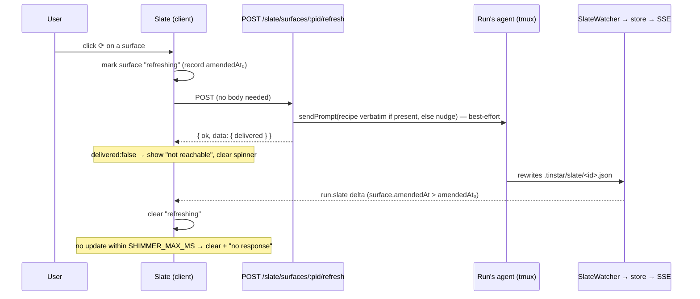
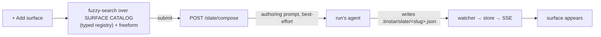

# feat: The Slate v2 — resize, hide, refresh, and a surface composer

## Summary

Grow the per-run Slate (shipped in #126) from a fixed read-mostly column into a workspace
you operate: **drag-resize** it with surfaces that **reflow** 1→2 columns, **hide** a
surface you're done with, **refresh** a surface by re-running the agent that authored it,
and **add a surface** by fuzzy-searching a catalog of reusable templates (or describing
one freeform). A surface is the unit on the Slate (the A2UI term — not "widget").

---

## Problem Frame

The Slate renders agent/user/process-authored surfaces but you can't yet *tend* them: the
column is a fixed width, a stale surface has no way to regenerate, a done surface can't be
tucked away, and authoring a new one means the agent inventing the A2UI from scratch every
time. v2 adds the operate-the-board affordances the design brainstorm called for.

---

## High-Level Technical Design

### Refresh — re-run the author (U3)

Refresh is a **nudge, not a mutation**: it delivers a prompt to the run's agent and the
surface regenerates through the normal file → watcher → projection path. The client shows
a spinner until a newer version lands.

### Compose — author a surface from the catalog (U4)

---

## Requirements

### Layout (client)
- R1. The Slate column is horizontally drag-resizable; the width persists per-browser and
  is restored on reload.
- R2. Surfaces reflow responsively — one column below a breakpoint width, two above it.
- R3. Resize and reflow never break the existing column-overlap / no-clip invariant the
  e2e guard asserts (`columnsOverlapPx === 0`, no horizontal overflow).

### Hide (client)
- R4. Each surface has a hide (✕) affordance; hiding is a per-browser view preference,
  non-destructive, and survives a file re-projection. A header toggle reveals hidden
  surfaces with a count.

### Refresh (server + client)
- R5. A surface may carry an optional `refresh` recipe string (file-owned), carried from
  the file through the store to `run.slate`.
- R6. `POST /api/runs/:id/slate/surfaces/:pid/refresh` delivers the recipe verbatim when
  present, else a bare regenerate-nudge, to the run's agent, best-effort; it returns
  `{ ok, data: { delivered } }` and persists nothing.
- R7. The client marks a surface refreshing, clears it when a newer version arrives over
  SSE or after a timeout, and disables/annotates the control when the session is
  unreachable (`delivered:false`).
- R8. A "Refresh all" control fans out over refreshable surfaces with a Slate-level
  loading state.

### Compose (server + client)
- R9. A typed **surface catalog** registry seeds reusable templates (PR review, Dataflow,
  Open points, Checklist), each with a name, description, and authoring-prompt template.
- R10. An "+ Add surface" composer offers fuzzy search over the catalog (matching name +
  description) plus a freeform field; submitting delivers an authoring prompt to the run's
  agent via `POST /api/runs/:id/slate/compose` (best-effort, `delivered` flag).
- R11. A **PR review** catalog entry authors a two-column surface (intent vs a blind
  subagent's description of the actual diff) and sets a `refresh` recipe that re-runs that
  eval.

---

## Key Technical Decisions

- **KTD1 — Hide + width are per-browser view prefs, not server state.** Both go through
  `src/lib/uiPrefs.ts` (mirror the `hiddenRuns` family + `readJSON`/`writeJSON`), keyed by
  surface id / run id. A file re-projection can't resurrect a hidden surface, and the
  agent's file stays intact. A true delete stays the agent's job (unlink the file).
- **KTD2 — Refresh is a nudge with no persistence.** Unlike the answer/reply routes,
  `/refresh` mutates nothing — it calls the same best-effort `sendPrompt` path and returns
  `delivered`. The surface regenerates through the file→watcher→projection pipe already
  shipped, so there's exactly one write path. Client "refreshing" is optimistic, cleared
  on a newer `amendedAt` via SSE or a `SHIMMER_MAX_MS`-style timeout (reuse the Roundup
  pattern).
- **KTD3 — `refresh` is a file-owned recipe on the surface.** Add it to `PointInput`/`Point`
  and project it onto `SlateSurface` (mirror how `refresh`/`headline`/`content` already
  flow: watcher `toPointInput` → store `applyProjection` → bridge `projectRunToSlate`).
  Refreshability = session reachable (recipe optional; a recipe-less surface still gets the
  nudge). This is the standing "recipe optional, nudge fallback" decision.
- **KTD4 — Composition is agent-authored via the file path.** The composer delivers an
  authoring prompt; the agent writes `.tinstar/slate/<slug>.json`. This keeps the Slate's
  one authoring model (file-in) — the composer is a convenience over it, not a second path.
  Requires a live agent; disable/annotate when unreachable.
- **KTD5 — Reflow is CSS grid keyed to measured width.** The scroll body is a grid whose
  column count derives from the column's width (a breakpoint), so surfaces reflow as you
  drag. No per-surface JS layout.
- **KTD6 — New routes reuse the shipped route discipline.** `/refresh` and `/compose` are
  anchored-regex sub-routes placed before any greedy `/:id` handler, bodies via `readBody`,
  delivery modeled on the existing slate reply/answer handlers. (see origin: the shipped
  `src/server/api/routes.ts` slate block.)

---

## Implementation Units

### U1. Resize + responsive reflow

**Goal:** The Slate column drag-resizes (persisted) and its surfaces reflow 1→2 columns.
**Requirements:** R1, R2, R3.
**Dependencies:** none.
**Files:** `src/components/RunWorkspaceWidget/index.tsx` (resize handle on the Slate
column, mirror the `filesPanelWidth` `resizeDragRef` drag), `src/components/RunWorkspaceWidget/SlatePanel.tsx`
(grid reflow), `src/lib/uiPrefs.ts` (a `slateWidth` pref), `e2e/slate-screenshot.spec.ts`
(extend), `src/components/RunWorkspaceWidget/__tests__/SlatePanel.test.tsx`.
**Approach:** Add a left-border drag handle on the `focus-zone-slate` wrapper mirroring the
files panel's pointer-drag (`resizeDragRef`, `onPointerDown/Move/Up`), clamped to a
min/max; store the width via `uiPrefs` and read it on mount. Replace the SlatePanel scroll
body's vertical stack with a CSS grid whose `grid-template-columns` is 1 col under a
breakpoint and 2 cols above (derive from the column's own width — a Tailwind responsive
container query or a measured width class). Keep `data-scrollable`, `overflow-hidden`, and
`overflow-wrap` from #126's layout guard.
**Patterns to follow:** the `filesPanelWidth` resize in the same `index.tsx`; the layout
guard in `SlatePanel.tsx`.
**Test scenarios:** dragging updates and persists the width (uiPrefs read back); a narrow
Slate renders one column, a wide Slate two (assert the grid class / computed columns);
`Covers R3.` extend the e2e layout assertion — `columnsOverlapPx === 0` and no overflow
still hold at min and max width.
**Verification:** dragging resizes the column and the width survives reload; surfaces
reflow at the breakpoint; the e2e guard passes.

### U2. Hide a surface

**Goal:** Hide a surface as a per-browser view preference, with a reveal toggle.
**Requirements:** R4.
**Dependencies:** none.
**Files:** `src/lib/uiPrefs.ts` (a `hiddenSlateSurfaces` family, mirror `hiddenRuns`),
`src/components/RunWorkspaceWidget/SlatePanel.tsx` (filter hidden; header "N hidden · show"
toggle), `src/components/RunWorkspaceWidget/OpenPointsSurface.tsx` + `DiagramSurface.tsx`
(a ✕ affordance per surface/row), `src/components/RunWorkspaceWidget/__tests__/SlatePanel.test.tsx`.
**Approach:** Add a `hiddenSlateSurfaces` id-set family to `uiPrefs` (mirror `hiddenRuns`:
`readJSON`/`writeJSON` a `Set<string>`). SlatePanel filters surfaces whose id is hidden and
shows a header toggle with the hidden count; toggling reveals them (dimmed) with an "unhide"
affordance. The ✕ adds the id to the set. No server route, no destructive delete.
**Patterns to follow:** `hiddenRuns` in `uiPrefs.ts`; the run hidden/eyeball pattern.
**Test scenarios:** hiding a surface removes it from the rendered list and persists (uiPrefs
read back); the header shows the correct hidden count; the reveal toggle shows hidden
surfaces; a file re-projection does not resurrect a hidden surface (hidden is client-side).
**Verification:** a hidden surface stays hidden across reload and across an SSE re-projection.

### U3. Refresh — re-run the author

**Goal:** Regenerate a surface by nudging its authoring agent; per-surface ⟳ + Refresh all.
**Requirements:** R5, R6, R7, R8.
**Dependencies:** none (server field is additive).
**Files:** `src/server/stores/slate.ts` (`refresh` on `PointInput`/`Point`, carried through
`applyProjection`/`mergeFileOwned`), `src/domain/types.ts` (`refresh?` on `Point` +
`SlateSurface`), `src/server/stores/document-store.ts` (`projectRunToSlate` maps `refresh`
onto the surface), `src/server/sessions/slate-watcher.ts` (`toPointInput` carries `refresh`),
`src/server/api/routes.ts` (new `POST /api/runs/:id/slate/surfaces/:pid/refresh`),
`src/slate/slatePrompt.ts` (`slateRefreshPromptText`), `src/components/RunWorkspaceWidget/{OpenPointsSurface,DiagramSurface,SlatePanel}.tsx`
(⟳ + refreshing state + Refresh all), `src/server/api/__tests__/routes.slate.test.ts`,
`src/server/stores/__tests__/slate.test.ts`, `src/components/RunWorkspaceWidget/__tests__/OpenPointsSurface.test.tsx`.
**Approach:** `refresh` is a file-owned string, additive and optional; it rides the exact
path `headline`/`content` already take (watcher → store → bridge → `run.slate`) — no 3-place
work (it's inside the existing `slate` projection). The route is an anchored-regex sub-route
placed before the greedy handler; it looks up the point, builds the prompt (recipe verbatim
if present, else `regenerate surface "<headline>" and rewrite its .tinstar/slate file`),
best-effort `sendPrompt` to `runId`, returns `{ ok, data: { delivered } }`, persists nothing.
Client: a ⟳ button per surface records the surface's `amendedAt`, POSTs, marks it refreshing;
an effect clears refreshing when the incoming `surface.amendedAt` exceeds the recorded value,
or a `SHIMMER_MAX_MS` timer fires; `delivered:false` shows "session not reachable" and
clears. Refresh all iterates refreshable surfaces with a Slate-header loading state.
**Execution note:** Start the route with a failing test asserting persist-nothing +
`delivered:false` on an unreachable session and the anchored-regex ordering.
**Patterns to follow:** the slate reply/answer route + `slatePrompt` delivery; the
`SHIMMER_MAX_MS`/`isAwaitingReply` timeout in `src/plugins/roundup/src/RoundupWidget.tsx`;
the store's zero-change short-circuit (a `refresh`-only file change must still project).
**Test scenarios:**
- `Covers R6.` refresh with a recipe delivers the recipe verbatim; without a recipe delivers
  the nudge; an unreachable session returns `delivered:false` + 200 and persists nothing.
- Route ordering: a generic handler does not eat `/slate/surfaces/:pid/refresh` (break the
  order → test red).
- Store: a file that adds/changes only `refresh` projects it onto `run.slate` and emits
  (the zero-change guard must not swallow a recipe-only change).
- Client: clicking ⟳ marks refreshing; a newer `amendedAt` clears it; the timeout clears a
  stuck one; `delivered:false` shows unreachable.
**Verification:** clicking ⟳ delivers the recipe/nudge to the run's session; the spinner
clears when the surface updates or times out; Refresh all fans out.

### U4. Add a surface — the composer + catalog

**Goal:** Fuzzy-search a catalog of surface templates (or describe freeform) to author a
surface via the agent.
**Requirements:** R9, R10.
**Dependencies:** none (uses U3's delivery pattern; independent files).
**Files:** `src/components/RunWorkspaceWidget/surfaceCatalog.ts` (new typed registry +
fuzzy scorer), `src/components/RunWorkspaceWidget/SlateComposer.tsx` (new picker UI),
`src/components/RunWorkspaceWidget/SlatePanel.tsx` ("+ Add surface" opens the composer),
`src/server/api/routes.ts` (`POST /api/runs/:id/slate/compose`), `src/slate/slatePrompt.ts`
(`slateComposePromptText`), `src/components/RunWorkspaceWidget/__tests__/surfaceCatalog.test.ts`,
`src/server/api/__tests__/routes.slate.test.ts`.
**Approach:** `surfaceCatalog.ts` exports a typed list `{ id, name, description, prompt }`
seeded with PR review / Dataflow / Open points / Checklist, plus a small subsequence/substring
fuzzy scorer (no new dep) over `name + description`. `SlateComposer` is a header popover: a
search input filtering the catalog by score + a freeform textarea; submit sends the chosen
template's `prompt` (and/or freeform text) to `POST /slate/compose`, which builds an
authoring prompt ("Author a Slate surface: <prompt/freeform>. Write it to
`.tinstar/slate/<slug>.json` with an id, headline, A2UI content, and an optional refresh
recipe.") and best-effort delivers to the run's agent; returns `delivered`. Disable/annotate
when unreachable.
**Patterns to follow:** the run-workspace popovers (e.g. `PromptHistoryPopover`); the U3
route + `slatePrompt` delivery; `data-scrollable` on the results list.
**Test scenarios:**
- Fuzzy scorer: "pr" ranks "PR review" first; "flow" ranks "Dataflow"; empty query returns
  all in catalog order; a non-match returns nothing (freeform still available).
- `Covers R10.` compose POST delivers the authoring prompt (recipe/freeform interpolated),
  returns `delivered`; unreachable session → `delivered:false` + 200; uses the anchored-regex
  ordering (pluginTest fixture).
- Composer: selecting a template fills the prompt; submitting posts and closes; freeform-only
  submit posts the freeform text.
**Verification:** the composer fuzzy-filters the catalog and, on submit, an authoring prompt
reaches the run's session.

### U5. PR review surface (catalog entry)

**Goal:** A catalog template that authors a two-column intent-vs-blind-eval surface with a
re-runnable refresh recipe.
**Requirements:** R11.
**Dependencies:** U4 (catalog), U3 (refresh recipe).
**Files:** `src/components/RunWorkspaceWidget/surfaceCatalog.ts` (the "PR review" entry),
`docs/the-slate.md` (document the PR-review template + its refresh recipe),
`src/components/RunWorkspaceWidget/__tests__/surfaceCatalog.test.ts`.
**Approach:** Add a catalog entry whose `prompt` instructs the agent to build a two-column
A2UI surface — col A the PR's stated intent (from the PR body / plan), col B an independent
**blind** subagent's description of what the diff actually does (dispatch a subagent given
only the diff, no intent) — and to set a `refresh` recipe that re-runs that blind eval and
rewrites the file. No new structural code beyond the entry + docs.
**Test scenarios:** the catalog contains a "PR review" entry; its prompt names the two
columns and the blind-eval + refresh-recipe instruction. `Test expectation: content
assertion only — the surface itself is agent-authored at runtime.`
**Verification:** picking "PR review" in the composer delivers a prompt that produces a
two-column, refreshable surface.

---

## Scope Boundaries

### Deferred to Follow-Up Work
- A server-side surface catalog / user-defined saved templates (the registry is a typed
  client list for now).
- A true server-backed surface delete (the agent unlinks the file; the user hides).
- Multi-column reflow beyond two (breakpoint stops at 2).

### Non-goals
- No change to the Slate's file-in / HTTP-out model; refresh and compose are delivery
  nudges, not new authoring mechanisms.
- No persistence for refresh/compose (they mutate nothing server-side).
- Units 4/5 require a live agent on the run; 1/2/3 work on any run.

---

## Risks & Dependencies

- **Zero-change guard swallowing a recipe-only change** — the store short-circuit compares
  content; ensure `refresh` is in the compared shape so a recipe-only file edit still
  projects (U3 test).
- **Refresh spinner never clearing** — a surface whose agent ignores the nudge; the
  `SHIMMER_MAX_MS` timeout is the backstop (mirror Roundup).
- **Composer/refresh on a dead run** — `delivered:false` must read as "not reachable," not
  an error; reuse the shipped best-effort delivery posture.
- **Resize breaking the #126 layout guard** — extend the e2e assertion to min/max width.
- **Machine:** prefix `tsc`/`vitest`/`vite` with `env -u NODE_ENV`; `vitest --exclude='e2e/**'`;
  full `npm run typecheck` before pushing; new routes need a dist rebuild to go live on the
  standalone (unit-test the handlers; defer live smoke).

---

## Sources / Research

- Builds directly on the shipped Slate (PR #126, squash `3e2bf781`): `src/server/stores/slate.ts`,
  `src/server/sessions/slate-watcher.ts`, `src/server/api/routes.ts` (slate block),
  `src/slate/slatePrompt.ts`, `src/components/RunWorkspaceWidget/*`, `docs/the-slate.md`,
  `e2e/slate-screenshot.spec.ts`.
- Patterns reused: `hiddenRuns` in `src/lib/uiPrefs.ts`; `filesPanelWidth` resize in
  `src/components/RunWorkspaceWidget/index.tsx`; `SHIMMER_MAX_MS`/`isAwaitingReply` in
  `src/plugins/roundup/src/RoundupWidget.tsx`; the slate reply/answer route + delivery.
