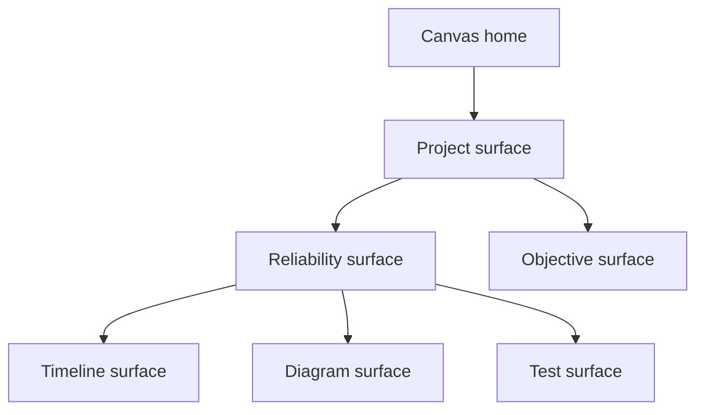
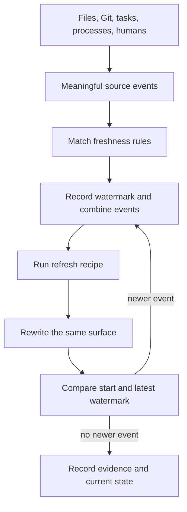
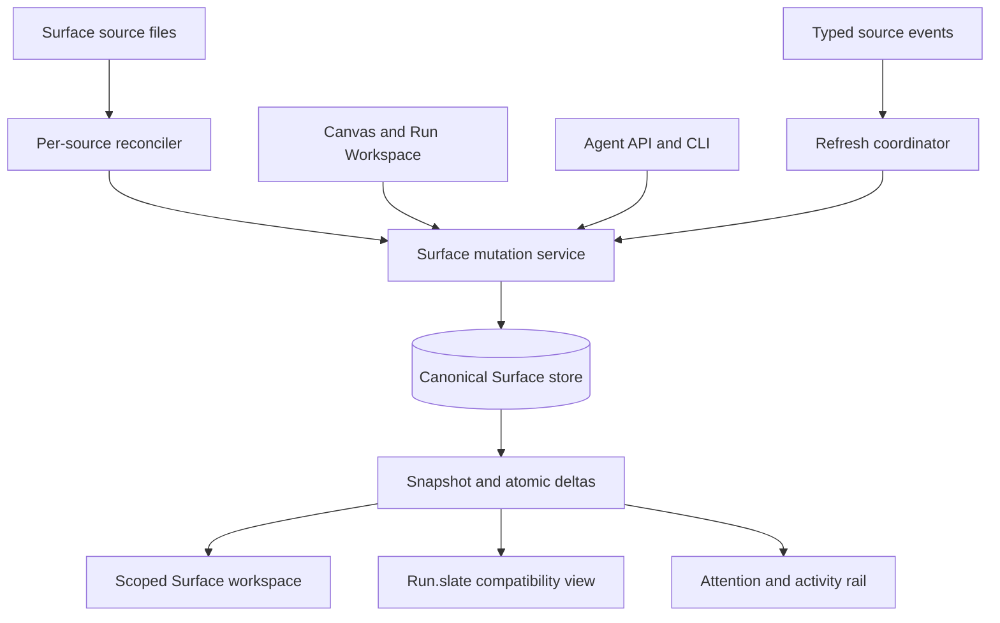
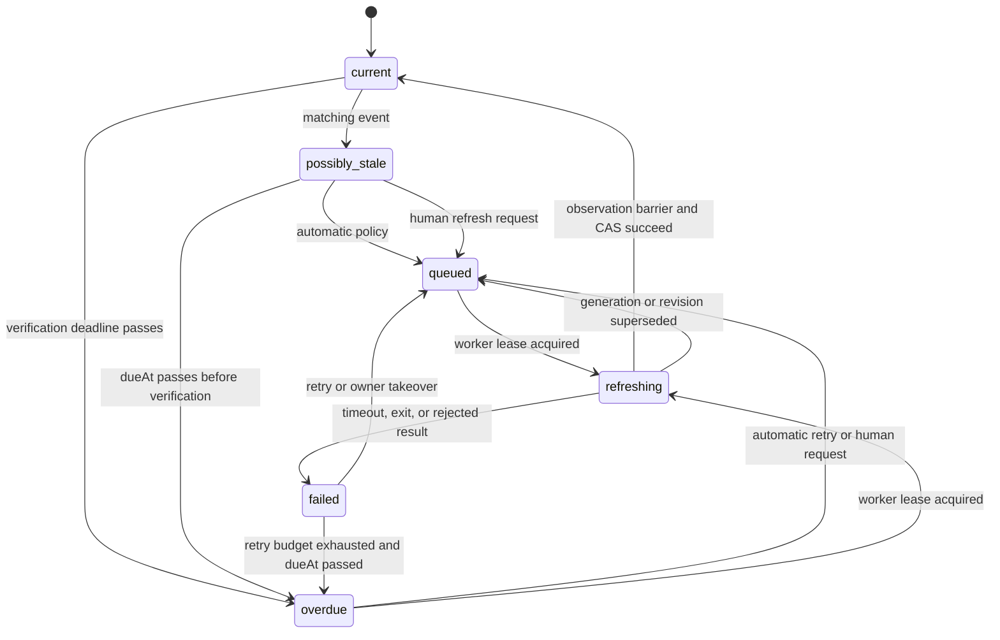
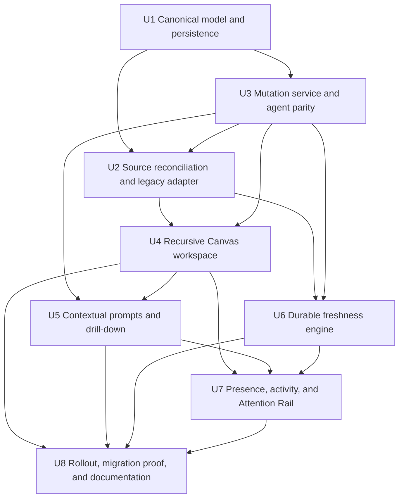

# Recursive Collaborative Surfaces - Plan

## Goal Capsule

- **Objective:** Make surfaces the primary place where humans and agents collaborate, while retaining the raw session as an auditable source of truth and safe fallback.
- **Product authority:** The target model for new and migrated work artifacts is one surface primitive; a surface that holds other surfaces keeps the same affordances and lifecycle.
- **Migration posture:** Recursive surfaces and existing canvas widgets coexist throughout a gradual transition. The transition ends when the maintainer declares it ended — this is a single-maintainer project and that is the governance model, not an oversight. Recorded so the coexistence period does not read as an unbounded commitment to a later reader.
- **Execution profile:** Deep, compatibility-first delivery across independently verifiable units.
- **Implementation scope:** One trusted local human in the first release, with stable actor and view seams for later authenticated collaboration.
- **Stop conditions:** Do not enable promotion or recursive writes if migration cannot preserve canonical identity, threads, provenance, or rollback visibility.
- **Tail ownership:** The final rollout unit owns compatibility proof, migration rehearsal, documentation, and targeted browser coverage.
- **Open blockers:** None.

---

## Product Contract

### Summary

Tinstar's canvas becomes a recursive collaborative workspace whose target work-artifact model is one surface primitive.
Surfaces combine structured content, contextual prompting, human and agent presence, event-driven freshness, and arbitrary-depth composition while legacy widgets and terminal workflows remain compatible.

### Problem Frame

The current Slate proves that agent-authored visual surfaces are compelling, but it remains clunky and becomes stale unless the user reminds the underlying agent to update it.
That combination prevents the Slate from earning enough trust to replace the raw conversation scroll.

The transcript is complete but tiring to read and poor at presenting many concurrent questions, diagrams, decisions, and ongoing activities.
It should remain the source of truth and diagnostic escape hatch without remaining the primary interface.

The current run-scoped Slate also constrains surfaces inside Run Workspace even though Tinstar already has an infinite canvas and recursive widget containers.
The product needs one composable work-artifact model that can grow from a card into a workspace without accumulating separate interaction systems.

### Key Decisions

- **Surface-first interaction.** (session-settled: user-directed — chosen over transcript-first interaction: each raw-session prompt is treated as a product failure signal because reading and prompting through the text scroll is tiring.) Humans primarily read, decide, answer, and steer through surfaces; the transcript remains available for diagnosis and unusual work.
- **One recursive surface primitive.** (session-settled: user-directed — chosen over separate leaf and container entities: separate primitives would cause shared behavior to diverge into special cases.) A "container" is shorthand for a surface with children, not another entity; legacy widgets are an explicit migration exception.
- **One home per surface.** (session-settled: user-directed — chosen over linked cards with multiple live parents: multiple homes make navigation, deletion, ownership, and prompting confusing.) Recursion forms a tree, not a general graph.
- **Stable Living Stack with a collapsible Attention Rail.** (session-settled: user-directed — chosen over an inbox-first workspace or automatic priority reordering: many surfaces should remain visible without losing spatial memory.) Urgency is projected through a rail rather than by moving the underlying surfaces.
- **Ambient per-surface presence.** (session-settled: user-directed — chosen over typing lines, presence footers, and separate participant rails: one activity halo and compact avatar cluster remain consistent at every depth.) Presence reveals that work is happening without exposing detailed agent activity.
- **Event-driven freshness ownership.** (session-settled: user-directed — chosen over coordinator discipline or timer-only refreshes: the Slate must stay current without the user nagging an agent.) A refresh recipe defines how to rebuild a surface; an owner and declarative triggers define who updates it and when.
- **Recoverable action over gated action.** (session-settled: user-directed — REPLACES an earlier approval-gated decision: approval prompts made the Slate feel like paperwork, and fluidity is the point.) Agents may create, group, reparent, and delete surfaces directly, with no proposal or approval step. Safety comes from recoverability rather than permission: every destructive operation is reversible from a lightweight recovery store. Per-user view state — minimize and hide — stays personal and is never written by an agent, because it is a preference rather than a destructive act.
- **Gradual coexistence.** (session-settled: user-approved — chosen over a big-bang canvas replacement: the new experience must prove itself without disrupting today's workflow.) Existing widgets and Run Workspace remain usable while surfaces expand onto the canvas.
- **Personal views over shared destruction.** Placement, filtering, minimize, and hide are per-user; grouping, content, threads, freshness, and provenance are shared; delete requires explicit shared authority.
- **Bounded product identity.** Surfaces are agent-authored work outputs from a fixed catalog, not user-defined pages, databases, schemas, workflows, or board columns.

The recursive relationship is structural, while every node keeps the same product behavior:



### Actors

- A1. **Primary human:** Manages several concurrent runs, reads and acts through surfaces, arranges the workspace, and opens a raw session when the abstraction is insufficient.
- A2. **Human collaborator:** Shares the same surfaces, contributes answers and prompts, and exposes lightweight presence without requiring a separate workflow.
- A3. **Coordinator agent:** Maintains the coherent workspace, routes requests, inherits orphaned refresh responsibility, and creates specialist agents when needed.
- A4. **Specialist agent:** Owns or updates one or more surfaces for a bounded task and may enter or leave without forcing the human to manage session topology.
- A5. **Local process or external source:** Publishes structured progress or change events that can drive a surface without consuming a conversational agent turn.
- A6. **Tinstar host:** Renders surfaces, tracks provenance and freshness state, matches trigger events, preserves user view state, and provides terminal or Graveyard drill-down.

### Requirements

**Recursive surface model**

- R1. The target model for every new or migrated work artifact is one surface primitive with optional authored content and zero or more child surfaces; legacy widgets remain a migration exception.
- R2. Every surface has one home on the Canvas or inside another surface, and arbitrary-depth composition must remain cycle-free.
- R3. Leaf and parent surfaces share the same affordances and lifecycle while contextual routing and descendant rollups may depend on what the surface contains.
- R4. Opening a parent focuses its immediate workspace with an ancestor breadcrumb; when not focused, it shows a useful preview and standard rolled-up indicators.
- R5. Placement, filtering, minimize, and hide are per-user view state; grouping, content, threads, freshness, provenance, and deletion are shared state.
- R6. Reparenting and ungrouping preserve child identity; deleting a non-empty parent requires an explicit choice to reparent its children or delete the displayed subtree.

**Structured content and contextual prompting**

- R7. Surface bodies use the bounded component catalog for agent-authored text, controls, lists, progress, charts, and structured diagrams rather than user-defined pages, databases, or workflows.
- R8. Every surface carries one contextual prompt/thread affordance; leaf prompts prefer the authorized owner, while parent prompts use a coordinator that preserves each child's context and permissions.
- R9. Presence and activity reveal identity, broad state, and elapsed time without exposing private reasoning or detailed live agent actions.

**Presence and session access**

- R10. A working surface displays the standard live edge and participant cluster; parent rollups deduplicate participants, show counts and highest-severity state, and drill down to every contributing child.
- R11. Participant access opens a live ttyd session or retired Graveyard record when one exists; process-authored or mixed-source surfaces instead expose all contributing sessions and source evidence.

**Provenance and freshness**

- R12. Every surface carries explicit project, repository, worktree, run or session, and author provenance when those values exist; file location may seed but not replace that context.
- R13. Every automatically refreshable surface declares a self-contained recipe, an owner, declarative triggers, and the source watermark its current content reflects.
- R14. Trigger declarations use a small host-controlled vocabulary for meaningful source changes, process or session events, human interactions, and time safety checks; templates and agents choose inspectable defaults.
- R15. A matching event records why the surface may be stale, combines repeated events, and follows an automatic, mark-stale, or manual policy; bounded automatic refresh is the default.
- R16. If an owner exits, an authorized coordinator inherits refresh responsibility or dispatches a bounded author without crossing a child's repository or worktree permissions.
- R17. Refresh captures its starting watermark, preserves newer pending events, and becomes current only when no later matching event exists; startup reconciles source versions before claiming current.
- R18. The visible lifecycle distinguishes current, possibly stale, queued, refreshing, overdue, and failed, with manual recovery available whenever automatic refresh cannot complete.

The freshness loop separates change detection from rebuilding:



**Attention and activity**

- R19. The default workspace preserves each user's placement and does not reorder surfaces when urgency or activity changes.
- R20. A collapsible Attention Rail scopes to the focused workspace or Canvas and provides Needs you, Active, Recent, search, filters, and a summarized activity feed.
- R21. Selecting a rail item locates and highlights its surface without changing placement; an explicit show-only action may temporarily filter the view.

**Grouping and agency**

- R22. Grouping sibling surfaces creates and focuses one parent while preserving each child's identity, thread, provenance, freshness, session links, and per-user view state.
- R23. Ungrouping or moving a child reparents the canonical surface rather than copying it.
- R24. An agent may organize its own newly produced surfaces and maintain parent summaries, but moving an existing human-arranged surface requires explicit acceptance and never replaces children as sources of truth.

**Lifecycle and safety**

- R25. Minimize keeps a surface compact, hide removes it from one user's view, and delete is a shared destructive action that requires authority, confirmation, and descendant disposition.
- R31. Deleting a surface moves it and its descendants to a recovery store that retains identity, authored content, thread, provenance, and former home, and restores them to that home on request. Retention is bounded and stated; a purge past the bound is the only irreversible path, and the recovery store survives restart.
- R26. Agents and automation may create, group, reparent, and delete any surface directly, without proposing or awaiting acceptance. They must not write another actor's per-user view state (minimize, hide, placement), which is personal preference rather than shared structure. Every agent-performed destructive operation must be recoverable under R31.

**Canvas coexistence and migration**

- R27. Recursive surfaces render alongside existing widgets and Run Workspace, and widget types may migrate independently without a coordinated cutover.
- R28. Legacy and recursive presentations reference one canonical surface identity and mutation stream; promotion to Canvas is atomic reparenting, never a second writable copy.
- R29. Canvas is a home for top-level surfaces rather than another surface, and global navigation or controls remain application chrome.

**Measurement**

- R30. Tinstar preserves direct terminal work as a fully supported escape hatch, never degraded or discouraged to make surfaces look better by comparison. Measuring the ratio of surface-originated to direct prompts is explicitly OUT of scope for this release (see the Planning Resolutions note on the dropped direct-use metric).

### Key Flows

- F1. **Act through a surface**
  - **Trigger:** A surface requests human judgment or the human opens its contextual prompt.
  - **Actors:** A1 or A2, A3 or A4.
  - **Steps:** The human answers or prompts in place; Tinstar marks the interaction as surface-originated; the correct agent receives the surface context; the response updates the same surface or its thread.
  - **Outcome:** Normal work completes without opening the raw transcript.
  - **Covered by:** R7-R11, R30.
- F2. **Compose a recursive workspace**
  - **Trigger:** A human selects related sibling surfaces and groups them.
  - **Actors:** A1, A6.
  - **Steps:** Tinstar creates and focuses one parent surface; reparents the selected surfaces without copying them; preserves their shared and per-user state.
  - **Outcome:** Complexity folds into the same surface model and remains reversible through reparenting or ungrouping.
  - **Covered by:** R1-R6, R22-R23.
- F3. **Find what needs attention**
  - **Trigger:** A human opens the Attention Rail.
  - **Actors:** A1, A6.
  - **Steps:** The rail shows scoped Needs you, Active, and Recent items; the human searches or filters; selecting an item locates the stable surface; show-only temporarily narrows the workspace when requested.
  - **Outcome:** Urgent work is easy to find without reorganizing the canvas.
  - **Covered by:** R19-R21.
- F4. **Refresh after a meaningful change**
  - **Trigger:** A declared source event matches a surface trigger.
  - **Actors:** A3, A4, A5, A6.
  - **Steps:** Tinstar captures the current watermark; marks the surface possibly stale; combines repeated events; follows the declared policy; shows queued and active presence; dispatches the recipe; compares the latest watermark before claiming current.
  - **Outcome:** Automatic surfaces refresh without human prompting; mark-stale or manual surfaces request action and never pretend to be current.
  - **Covered by:** R10, R13-R18.
- F5. **Inspect the underlying agent**
  - **Trigger:** A human clicks an avatar or terminal affordance on a surface.
  - **Actors:** A1 or A2, A4, A6.
  - **Steps:** Tinstar opens the live ttyd session or Graveyard record when one exists; otherwise it shows the contributing sources and states that no terminal is available.
  - **Outcome:** The surface experience safely degrades into the strongest underlying evidence available.
  - **Covered by:** R10-R11.
- F6. **Move gradually onto the canvas**
  - **Trigger:** A human promotes an existing run-scoped surface to the wider canvas.
  - **Actors:** A1, A6.
  - **Steps:** Tinstar atomically changes the canonical surface's home; legacy and recursive presentations share one mutation stream; existing widgets and Run Workspace continue operating.
  - **Outcome:** Adoption can proceed incrementally without workflow loss.
  - **Covered by:** R27-R29.

### Acceptance Examples

- AE1. **Covers R1-R6, R22-R23.** Given three sibling surfaces with existing threads and user layouts, when the human groups them, then one focused parent appears and every child keeps its identity, history, view state, and normal controls.
- AE2. **Covers R3-R4, R10.** Given one participant working on several nested children, when the parent is not the focused workspace, then its standard indicator shows one deduplicated participant, the rolled-up count and state, and drill-down to every active child.
- AE3. **Covers R13-R18.** Given a pull-request review refresh starts at one revision and a newer revision arrives during the run, when the first rewrite finishes, then the surface remains pending and cannot claim current until the newer revision is incorporated.
- AE4. **Covers R10-R11.** Given a retired specialist, clicking its avatar opens Graveyard; given a process-authored surface with no session, the same action shows its source evidence without offering a dead terminal.
- AE5. **Covers R19-R21.** Given several surfaces in a user-arranged grid, when a Needs you event arrives, then the rail updates while every surface stays in place.
- AE6. **Covers R5-R6, R25-R26.** Given a non-empty parent, when an authorized human deletes it, then confirmation lists affected descendants and requires either safe reparenting or explicit subtree deletion.
- AE7. **Covers R12, R16.** Given a parent spanning two worktrees, when its coordinator delegates an update, then each child keeps its own context and no write crosses a context without an authorized owner.
- AE8. **Covers R27-R29.** Given a legacy presentation and recursive presentation of one promoted surface, when either changes it, then both reflect the same canonical mutation and no duplicate writable surface exists.
- AE9. **Covers R7-R9, R24.** Given an agent-generated parent summary, when it renders, then it uses the fixed catalog, preserves its children as sources of truth, and reveals no private reasoning.
- AE10. **Covers R30.** Given a user who prompts through ttyd instead of a surface, when they do so repeatedly, then nothing in the product degrades, warns, nags, or reduces capability relative to prompting through a surface.

### Success Criteria

- A normal run can be read, answered, and steered end to end without opening the transcript, while opening it remains equally capable.
- Automatically refreshable surfaces update without human prompting, while mark-stale and manual surfaces honestly request action.
- Users can understand what needs attention, what is actively changing, and what evidence each surface reflects without opening the transcript.
- Users can manage many visible surfaces while preserving spatial memory and reducing reading fatigue.
- Existing widgets, Run Workspace, and direct terminal access remain fully usable during gradual adoption.
- No surface presents stale data as current or loses canonical identity, thread history, provenance, permissions, or user state when grouped or moved.

### Scope Boundaries

**Deferred for later**

- A sibling-reorder primitive. (session-settled: user-directed.) The Canonical Field Authority table places sibling `order` under "changed only by atomic topology mutation", but the three topology mutations this plan defines — set-home, group, reparent — cannot change it. So a Surface takes its position at creation and keeps it. This is a KNOWN gap, deliberately not closed in U3: `SlateStore.assignOrderSlots` exists because reordering turned out to be genuinely subtle the first time (dragging one row has to renumber its neighbours without churning the rest), and that is its own piece of work rather than a rider on the mutation service. Until a later unit adds it, surfaces cannot be reordered and the UI must not offer an affordance that silently does nothing.
- Linked surfaces that appear in multiple containers.
- A general-purpose custom trigger editor beyond inspecting and choosing supported trigger policies.
- Automatic cleanup actions beyond suggestions and freshness-driven status.
- Converting every existing widget into a surface.
- Choosing the first migration slice and implementation sequence.
- Removing Run Workspace.

**Outside this product's identity**

- Kanban as the primary workspace model.
- Notion-style databases, document page building, or per-surface schemas.
- A general-purpose automation or page-building system disguised as surface composition.
- Arbitrary freeform drawing and hand-built boxes or connectors where a structured diagram exists.
- Monitoring or exposing private agent reasoning as a collaboration feature.
- Removing the transcript as the auditable source of truth or eliminating direct terminal work.

### Dependencies and Assumptions

- The existing shared A2UI renderer remains the bounded vocabulary for authored surface content.
- The existing canvas can already render registered recursive containers and leaves, providing a coexistence path rather than requiring a new canvas.
- Current Slate points are run-scoped, so independent surface identity and movement require a deliberate migration contract.
- Current refresh recipes and one-shot surface authors provide the starting execution path for automatic freshness.
- The internal typed event bus is suitable for server-local change events; NATS remains the agent communication plane and may contribute semantic agent events.
- Graveyard and ttyd provide the two session drill-down destinations for retired and live agents.
- Surface file location is a trustworthy default for worktree provenance, but explicit metadata is required for mixed-context parents and moved surfaces.
- Mixed-context parent prompting is read-only until each target context has an authorized coordinator or owner.
- The stable browser actor ID introduced in KTD6 is intended to BECOME the participant identity used by the separately-planned v5.4 multiplayer work (`docs/brainstorms/2026-07-21-multiplayer-presence-substrate-requirements.md`), not to compete with it. Both designs assume ephemeral, account-free identity assigned per connection, so the browser-generated ID is the natural input to a future server-owned participant record rather than a parallel scheme. Recorded so neither track rebuilds the other's identity model in ignorance. Note that the multiplayer track's central complaint — that `DocumentStore.activeSpaceId` is a single server-wide value — is untouched by this plan in either direction.

### Outstanding Questions

**Deferred to planning**

- What migration slice proves the recursive model with the least disruption to Run Workspace?
- What persistent identity and parent relationship let a surface move without breaking its file-owned and store-owned state?
- Which trigger vocabulary forms the safe first release, and which event sources already exist?
- How should attention and activity events be retained and summarized while preserving the product-level feed behavior in R20?

### Sources and Research

- `CONCEPTS.md`
- `docs/brainstorms/2026-07-21-the-slate-requirements.md`
- `docs/slate-design-language.md`
- `docs/the-slate.md`
- `src/domain/types.ts`
- `src/server/event-bus.ts`
- `src/server/stores/slate.ts`
- `src/server/sessions/slate-watcher.ts`
- `src/server/sessions/surfaceAuthor.ts`
- `src/components/InfiniteCanvas.tsx`
- `src/hooks/useWidgetLayouts.ts`
- [Google Keep](https://workspace.google.com/products/keep/) — lightweight cards, pinning, search, filters, archive, and real-time collaboration.
- [Linear Inbox](https://linear.app/docs/inbox) — attention triage, search, filters, snooze, and keyboard navigation.
- [Figma Spotlight](https://help.figma.com/hc/en-us/articles/360040322673-Present-to-collaborators-using-spotlight) — participant presence and avatar-based drill-down.
- [Allume](https://allume.com/) — cards, recursive boards, edge inbox, and spatial composition.
- [Apple Live Activities](https://developer.apple.com/videos/play/wwdc2023/10184/) — glanceable activity with defined start, active, stale, and end states.
- [GitHub Checks](https://docs.github.com/rest/checks/runs) — work status tied to a specific source revision and explicit reruns.

---

## Planning Contract

### Product Contract Preservation

Product Contract REVISED on 2026-07-27, by author ruling during a ce-doc-review pass. Recorded here because a plan that silently rewrites its own contract is worse than one that never had a contract.

- **Key Decision replaced.** "User-owned view and destruction state" (agents suggest, users control minimize/hide/delete) became "Recoverable action over gated action" (agents act directly; safety comes from recoverability). Approval prompts made the Slate feel like paperwork, and fluidity is the product goal.
- **R26 rewritten** from suggest-and-await-acceptance to act-directly, with the constraint narrowed to per-user view state, which agents still may not write.
- **R31 added** for the recovery store that makes deletion reversible.
- **R30 narrowed** to the escape-hatch guarantee alone; its measurement clause was dropped because the metric was self-inverting.
- **AE10 rewritten** to assert escape-hatch behaviour rather than the existence of a report.
- **Success criteria**: the direct-interaction ratio was replaced by an observable outcome.

Everything else in the Product Contract stands as brainstormed.

### Implementation Scope

This implementation covers the complete recursive Surface experience for one trusted local human.
It introduces stable actor and view identifiers but does not claim authenticated multi-human isolation.
Legacy widgets remain top-level Canvas peers during migration; placing legacy widgets inside a Surface workspace is deferred.

Delivery is compatibility-first.
Canonical identity, migration, and source reconciliation precede everything.
DELIVERY ORDER IS U1, U3, U2, U6 — freshness is the FIRST user-visible milestone, rendered in today's Run Workspace Slate panel before any recursive UI exists.
This is deliberate and the dependency graph already permits it: U6 depends only on U2 and U3, never on U4.
Staleness is the problem this plan exists to solve, so relieving it first means the effort has delivered its justifying win even if recursion is later delayed or abandoned; the reverse order would spend five units before the stated pain moves at all.
Recursive Canvas, contextual prompts, and the Attention Rail follow, with activity and presence preceding the rail.
Each phase remains usable if later phases are delayed.

### Key Technical Decisions

- **KTD1 — `Surface` becomes the canonical work-artifact entity.** (session-settled: user-directed — chosen over separate leaf and container entities: one recursive primitive prevents shared behavior from diverging.) A global, non-reusable Surface ID owns authored content, thread, provenance, owner, freshness, activity links, and revision. `Point` and `SlateSurface` become compatibility shapes rather than independent sources of truth.
- **KTD2 — Home is store-owned and singular.** (session-settled: user-directed — chosen over linked multi-parent cards: one home keeps movement, deletion, prompting, and provenance understandable.) Each Surface home is Canvas or another Surface, exactly as required by R2. Children are derived from those home references, and all topology mutations reject cycles and cross-space parentage. Run Workspace membership is a compatibility presentation alias, never a third home.
- **KTD3 — Run Workspace remains a projection over canonical Surfaces.** (session-settled: user-approved — chosen over a big-bang replacement: existing widgets and session workflows must remain safe during migration.) Migration creates one normal canonical root Surface per run, marks that root `compatibility-only`, and homes legacy children under it. Compatibility-only is migration presentation metadata, not a second container type; the root retains the standard Surface model but is excluded from ordinary Canvas projection. A separate alias maps a Surface to one or more run or workspace fallback buckets and controls whether each legacy presentation is visible. Promotion atomically reparents a child from its run-root Surface to Canvas without changing identity or removing its fallback alias. `Run.slate` delegates reads and writes through aliases, so Canvas and Run Workspace never receive separate writable copies. Closing a legacy presentation only hides its alias; disabling recursive mode overrides that visibility and exposes every alias as a flat compatibility list, including a workspace recovery bucket for Surfaces without a source run.
- **KTD4 — Authored content has one explicit authority.** Each Surface persists a `source-binding` or `canonical-direct` content authority. An authoritative source binding may replace headline, A2UI content, author-declared recipe, and source evidence; direct API content edits must update that source through its adapter or explicitly transfer authority. Canonical-direct content ignores later file changes except to report divergence. Refresh results commit through the active authority adapter. Neither authority can replace home, thread, lifecycle, permissions, freshness history, or deletion. Authority transfer is explicit, revision-checked, and restart-stable.
- **KTD5 — Persistence uses a bounded versioned Surface sidecar, not event sourcing.** Canonical Surfaces, compatibility aliases, topology revision, source observation generations, refresh jobs, recovery-store records, and activity records live in one serialized `getConfigRoot()` sidecar that excludes large artifact payloads and unrelated document state. Legacy Slate data remains in the existing document snapshot as migration evidence but is no longer rewritten by canonical Surface mutations. Load returns `healthy`, `recovered`, or `faulted-read-only`; a faulted Surface store rejects mutations and persistence before session rehydration can overwrite evidence. One store-owned transaction queue validates a complete temporary sidecar, fsyncs it, rotates the last-known-good backup, renames it over the primary, and fsyncs the containing directory. A mutation log is deferred because atomic snapshots and revisions satisfy the current single-process deployment.
That single-process premise is ENFORCED, not assumed: `acquireBackendSingleton` in `src/server/infra/lock.ts` already refuses a second backend on the same config root, using an atomic `mkdirSync` marker with an owner pid, dead-owner stealing, and an explicit `--force` takeover.
The JSON sidecar is RATIFIED over an embedded database for this release (session-settled: user-directed): no experimental dependency, state stays plain-text inspectable and hand-editable, and the codebase gains no second persistence idiom.
The constraint that keeps that reversible: the store's public interface is a revision-checked transaction over records, and MUST NOT expose the whole-snapshot shape to callers. Engine choice stays an implementation detail behind that seam, so swapping to an embedded store later does not touch U2-U8. This seam closes at U3, when four units begin calling through it.
The Surface store therefore ASSERTS that lock is held rather than acquiring a second one of its own — two locks guarding the same invariant is a synchronization bug waiting to happen.
The gap this closes is coverage, not mechanism: the guard is currently acquired only in `src/server/standalone.ts`, so the Vite plugin backend in `src/server/index.ts` can run against the same config root unguarded. Both entrypoints must acquire it before the sidecar can rely on single-writer.
- **KTD6 — The first release has one trusted local human actor.** (session-settled: user-approved — chosen over making authenticated multi-human identity a prerequisite: Tinstar has no human authentication or authorization layer today.) A stable browser actor ID namespaces view state and audit entries. Managed sessions, host jobs, and processes receive distinct principal IDs. These identities enforce product-level routing and approval rules without claiming hostile local-process isolation.
- **KTD7 — Shared mutations use durable revisions, idempotency keys, and atomic batches.** Content writes compare a Surface revision; grouping, reparenting, and subtree deletion compare the workspace topology revision and affected Surface revisions. The service constructs and validates a candidate snapshot, durably commits it, installs it in memory, emits one ordered `surface.batch`, and only then acknowledges the caller. Failure before durable commit changes nothing; a crash after commit is recovered from the snapshot; a crash after SSE but before response is resolved by the persisted idempotency result. Agents perform these operations directly; there is no proposal or approval step. Deletion is a move into the recovery store within the same durable transaction, so a delete and its undo are ordinary revision-checked mutations rather than a separate mechanism.
- **KTD8 — Recursion is navigated as scoped workspaces.** (session-settled: user-directed — chosen over expanding every descendant inline: the UI model may be infinitely recursive without rendering an unreadable hall of mirrors.) Canvas shows top-level Surfaces and legacy widgets. Opening a parent focuses its immediate children, reuses the same Surface shell in the workspace header, and shows ancestor breadcrumbs. Layouts are stored per actor, space, and home scope.
- **KTD9 — Contextual prompting persists one human intent before dispatch.** A leaf intent routes to its authorized owner or coordinator. A parent intent creates bounded, per-child dispatches and one aggregate result, preserving blocked and partial outcomes. Every dispatch carries the same origin and idempotency identity so fan-out counts as one human interaction.
- **KTD10 — Freshness is a durable host-owned job lifecycle.** (session-settled: user-directed — chosen over timer-only refreshes and relying on agents to remember: currentness must survive owner exit and server restart.) Every source binding has a persisted, host-owned monotonic observation generation; content hashes, Git SHAs, and process IDs remain evidence and are never ordered as time. Typed events advance that generation and mark a Surface possibly stale. Before claiming current, the coordinator performs an authoritative observation barrier, advances any changed generations, and compares the Surface revision and generation in the same durable transaction. Newer or delayed observations schedule one successor rather than allowing an old result to claim current.
- **KTD11 — Inspectable agent refreshes use managed background sessions and staged results.** The current fire-and-forget `claude -p --dangerously-skip-permissions` author is retired for autonomous agent refreshes. A live owner may receive serialized work directly; otherwise the host launches a background managed session in the authorized worktree, tracks it as a contributor, and retires it through the normal Graveyard path. Workers write only to a job-specific staging artifact outside watched Slate source paths. The coordinator validates and commits that artifact through KTD10 and the active content-authority adapter. Non-agent processes remain evidence-only contributors.
- **KTD12 — Presence is ephemeral; ownership and activity are durable.** (session-settled: user-directed — chosen over typing lines and separate participant rails: the same ambient halo and avatar cluster must work at every depth.) Human focus and live participants use expiring leases. Surface ownership, refresh jobs, recovery-store records, and bounded activity entries survive restart. Descendant rollups deduplicate participants and apply deterministic severity precedence.
- **KTD13 — The existing right Canvas sidebar becomes a tabbed Attention Rail.** (session-settled: user-directed — chosen over automatic priority reordering: urgency should not destroy spatial memory.) TAB SELECTION IS STICKY AND USER-OWNED. (session-settled: user-directed — chosen over auto-selecting Attention when actionable work exists: a panel that re-selects itself on a background event fights the user for their own sidebar.) The rail opens on whichever tab the actor last chose, persisted per actor. Attention may be the initial tab on a first-ever open, but NO background event may ever change the active tab afterwards — new actionable work raises an unread badge and count on the Attention tab and nothing more. Clicking the Canvas tools tab opens it and it stays open until the user says otherwise. Selecting a row locates the Surface without mutating placement.
- **KTD14 — Direct-use measurement is dropped for this release.** (session-settled: user-directed — chosen over shipping the measurement pipeline: the metric was self-inverting and the apparatus was heavier than a single-user release needs.) The proposed design counted unmarked human transcript prompts as direct use, but U6 delivers refresh work to a live owner through that same prompt path, so automatic freshness would have inflated the very number it was meant to drive down. Surface intents still carry a stable origin identity for idempotency and fan-out accounting under KTD9; that identity is NOT aggregated into a direct-versus-surface ratio, and no transcript scanning, dedup, or exclusion-disclosure machinery ships. If the question is revisited, the prerequisite is marking every host-originated prompt — refresh dispatches and notice replies included — not only Surface intents.

- **KTD15 — Deletion is a move, not an erase.** (session-directed, replaces the proposal machinery.) `delete` reparents the target subtree into a per-space recovery store inside the same atomic transaction that would otherwise have destroyed it, preserving identity, revision lineage, thread, provenance, and former home reference. `restore` is the inverse and reuses the same topology validation, so a restore into a home that no longer exists lands in the workspace recovery bucket rather than failing. Retention is bounded by the same policy shape activity already uses; only an explicit purge is irreversible. This costs one extra subtree in the sidecar and removes proposals, approvals, expiry, and their UI entirely.

- **KTD16 — A run name reborn retires its predecessor's aliases rather than colliding with them.** (session-settled: user-directed — ratifying a policy surfaced during U1 implementation.) Compatibility aliases are keyed on the run NAME while canonical identity is keyed on the run INCARNATION, so deleting a session and recreating it under the same name leaves the dead incarnation holding every alias the reborn run needs. Left unhandled the reborn run collides on its own root and quarantines itself out of existence permanently, on every boot. When the reserved root alias for a run is held by a Surface the current incarnation does not derive, the previous incarnation's run aliases move to the `workspace-recovery` bucket — which KTD3 already defines as the fallback for a Surface whose source run no longer exists. Nothing is erased: identity, thread, home, and revision lineage are untouched and only the bucket changes, so the operation is idempotent. The signal is not a heuristic — `LEGACY_RUN_ROOT_LOCAL_ID` is a reserved id only the migration module ever writes.

### High-Level Technical Design

The canonical store sits between every authoring path and every presentation:



Shared topology changes are one revision-checked transaction:

```mermaid
sequenceDiagram
  participant C as Human or agent client
  participant S as Surface service
  participant G as Canonical topology
  participant E as SSE clients

  C->>S: grouping or reparent intent + expected revisions
  S->>G: build candidate; validate actor, homes, cycles, and revisions
  alt direct mutation allowed
    G->>G: durably commit snapshot and idempotency result
    G->>G: install full batch and bump topology revision
    G-->>E: publish one atomic Surface batch
    S-->>C: applied canonical records
  else deletion
    G->>G: move subtree to recovery store in the same transaction
    G-->>E: publish one atomic Surface batch
    S-->>C: deleted, restorable
  else conflict
    S-->>C: current revisions and unchanged topology
  end
```

Freshness state is independent from surface discussion status:



Freshness stores an execution phase plus an orthogonal `overdue` flag.
The `overdue` node above is shorthand for idle and overdue; entering queued or refreshing retains an overdue badge until successful verification clears the flag.

### Canonical Field Authority

| Concern | Canonical owner | Source behavior |
|---|---|---|
| Identity and revision | Host store | Never accepted from mutable request fields |
| Headline and A2UI body | Explicit content-authority adapter | Source-bound edits update the source or transfer authority; canonical-direct ignores non-authoritative file changes |
| Home and sibling order | Host topology | Changed only by atomic topology mutation |
| Thread and discussion status | Host store | Persist first, then dispatch best-effort |
| Provenance and contributors | Host store | Accumulates verified source, run, session, worktree, and process evidence |
| Freshness policy and recipe | Host store with author-declared recipe | Validated before activation; source omission cannot clear history |
| Freshness state and jobs | Refresh coordinator | Host observation generations, dueAt, barriers, and job transitions are authoritative |
| View state | Browser actor namespace | Never overwritten by canonical or agent mutations |
| Deletion and recovery | Host store | Revision-bound explicit operation; delete moves to the recovery store, purge is the only erase |

### Agent-Native Action Parity

| Action | Human UI | Agent API or CLI | Safety boundary |
|---|---|---|---|
| Read tree and context | Canvas, breadcrumbs, rail | List/get with ancestors, descendants, freshness, and capabilities | Descendant context filtered by effective worktree access |
| Create Surface | Composer or grouping | Create primitive | Agent-created state remains movable only until human arrangement |
| Update authored content | Surface controls | Revision-checked update | A2UI validation, field whitelist, source authority |
| Append thread intent | Contextual prompt | Append reply or result | Persist first; idempotent delivery |
| Group or reparent | Selection and move controls | Direct, always | Atomic batch, cycle guard, revision check |
| Request refresh | Surface control or rail | Refresh request | Durable job and authorization snapshot |
| Inspect contributors | Avatar or source affordance | Contributor-resolution result | Live ttyd, Graveyard transcript, process evidence, or explicit denial |
| Delete | Confirmed shared action | Direct, always | Moves the subtree to the recovery store; restorable until purge |
| Restore | Recovery affordance | Restore primitive | Reuses topology validation; missing home falls back to the recovery bucket |

### Sequencing



### System-Wide Impact

- **Persistence:** A dedicated SurfaceStore gains a bounded schema-versioned sidecar, serialized transaction queue, explicit load health, atomic replacement, fallback backup, canonical records, compatibility aliases, source generations, topology metadata, recovery-store records, refresh jobs, and bounded activity. DocumentStore retains legacy migration evidence and large artifacts without joining Surface commit transactions.
- **Wire state:** `/api/state`, SSE snapshots, and client delta handling gain canonical Surface collections and one `surface.batch` delta containing `spaceId`, base and resulting topology revisions, ordered upserts, deletes, and explicit cleared fields. Clients with the wrong base revision discard the batch and request a snapshot.
- **Canvas:** Workspace construction gains a Surface scope projection without replacing taxonomy trees or synthetic legacy widgets.
- **Sessions:** Surface ownership and refresh work integrate with managed-session create, retire, ttyd, and Graveyard paths. Session deletion no longer cascades into promoted Surface deletion.
- **Files:** Slate watching becomes source-file-aware and remains active for persisted promoted sources even when their original session retires.
- **Agent interfaces:** Surface primitives become first-class HTTP and CLI actions; the Slate authoring skill moves from direct file-only assumptions to canonical operations plus source-file compatibility.
- **Preferences:** Surface layout, focus, hide, minimize, filters, and rail state use a stable browser actor namespace. Canonical deletion prunes stale view keys at the SSE boundary.
- **Observability:** Prompt origin, refresh jobs, activity retention, failed migration entries, and source validation failures become inspectable rather than silent.

### Risks and Mitigations

| Risk | Mitigation |
|---|---|
| Legacy migration loses a thread or changes identity | Deterministic legacy aliases, shadow comparison against `run.slate`, quarantine on collision, and no destructive cleanup during migration |
| Two writable presentations diverge | One Surface store and mutation service; Run Workspace only projects and delegates |
| Recursive rollback hides Canvas-only work | Every Surface keeps a compatibility alias; Canvas-only work uses the workspace recovery bucket; disabled mode renders flat fallback lists |
| Source omission deletes promoted work | Missing binding becomes stale evidence; explicit delete is the only canonical removal |
| Large topology mutation renders partial or non-durable state | Durable candidate-snapshot commit before install, one batch delta guarded by topology revision, and persisted idempotency recovery |
| File, API, and refresh writers fight | Persisted content authority and explicit revision-checked transfer |
| Recursive content or topology hangs the client | Cycle-free homes, immediate-scope rendering, existing A2UI total-node budget, and bounded rollups |
| Shared config leaks placement between browsers | Browser actor namespace on every Surface view-layout key |
| Refresh loop or stale completion lies about currentness | Monotonic observation generation, authoritative completion barrier, one worker lease, retry budget, and startup reconciliation |
| Agent crosses a mixed-worktree boundary | Parent context is partitioned per child; host dispatches only through that child's owner or managed worker |
| Local actors are mistaken for hardened authorization | UI and docs label the first release trusted-local; authenticated multi-human authority remains deferred |
| Activity or transcript metrics grow without bound | Activity retention cap and on-demand transcript analysis with an explicit reporting window |

### Alternative Approaches Considered

- **Keep `(runId, pointId)` as identity and copy on promotion:** rejected because a reused run name, run deletion, or two writable projections would orphan or overwrite shared state.
- **Add a separate container entity:** rejected because title, prompt, presence, freshness, and lifecycle would immediately require duplicate behavior.
- **Represent multiple homes with references:** rejected because deletion, arrangement, prompting, and freshness ownership become ambiguous.
- **Expand every nested Surface inline:** rejected because depth would consume the Canvas and make attention rollups unreadable.
- **Treat file omission as deletion:** rejected because moved and promoted Surfaces must survive source or session loss.
- **Adopt an append-only event store now:** rejected because Tinstar is a single-process local application and versioned atomic snapshots plus revisions provide sufficient recovery with less machinery.
- **Ship authenticated multi-human collaboration in this plan:** deferred because identity and authorization would dominate the Surface work and are not present elsewhere in the product.

### Planning Resolutions

- The first migration slice establishes canonical storage, a compatibility-only canonical run-root Surface excluded from ordinary Canvas projection, deterministic compatibility aliases, per-file bindings, and the Run Workspace projection before any Canvas promotion UI. Existing runs receive immutable incarnation IDs; legacy runs derive a deterministic incarnation from space, run ID, and `createdAt`, while missing or duplicate inputs are quarantined.
- Rollback disables recursive readers and writers while keeping canonical data. Every Surface remains accessible through a flat run alias or workspace recovery-bucket projection; canonical trees are never reverse-migrated into run-scoped points.
- Initial triggers are source-content version, Git revision, process completion or failure, managed-session lifecycle, human answer or prompt, and periodic safety reconciliation.
- Parent prompts persist one parent-thread intent, dispatch through immediate child contexts with a bounded fan-out, and record one aggregate result with blocked or partial targets.
- Activity retains at most 30 days or 10,000 entries per space, whichever limit is reached first.
- A refresh has one executing worker per Surface; source events advance a host observation generation and produce at most one successor job. `overdue` is derived when `dueAt` passes without successful verification; manual and mark-stale are scheduling policies, not additional freshness states.
- Source reconciliation runs as a complete directory epoch after debounce. It compares the full prior and current binding sets, resolves identity-preserving renames independent of watcher event order, and marks entry-level or file-level omissions missing without deletion.
- Child prompt results bind capability, owner, worktree, context, and target revisions at dispatch and revalidate before commit. Raw child results stay on authorized child threads; the parent receives only permitted summaries plus redacted blocked or changed-authority outcomes.

---

## Implementation Units

### U1. Canonical Surface model and crash-safe persistence

**Goal:** Introduce independent canonical Surface identity and persistence without changing the visible Run Workspace.

**Requirements:** R1-R6, R12, R27-R29; F2, F6; AE1, AE6, AE8; KTD1-KTD7.

**Dependencies:** none.

**Files:**
- Create `src/server/stores/surfaces.ts`.
- Create `src/server/stores/surface-persistence.ts`.
- Modify `src/domain/types.ts`.
- Modify `src/server/stores/document-store.ts`.
- Modify `src/server/index.ts`.
- Modify `src/server/api/sse.ts`.
- Modify `src/domain/api.ts`.
- Modify `src/server/index.ts` (acquire the backend singleton in the Vite plugin path, as `standalone.ts` already does).
- Add `src/server/stores/__tests__/surfaces.test.ts`.
- Add `src/server/stores/__tests__/document-store-surface-migration.test.ts`.
- Extend `src/server/stores/__tests__/document-store-slate-bridge.test.ts`.

**Approach:** Add the canonical Surface record, source binding, compatibility alias, principal reference, freshness summary, explicit content authority, view-independent discussion state, per-record revision, and per-space topology revision.
Keep the home on the child record and derive child indexes so a Surface with children remains the same entity.
Generate new IDs with host UUIDs and add an immutable incarnation UUID to new runs.
For legacy migration, derive the incarnation deterministically from space, run ID, and `Run.createdAt`, then combine it with the local point ID; missing or duplicate derivation inputs are quarantined instead of guessed.

Persist Surface state through a schema-versioned sidecar under `getConfigRoot()` and one serialized Surface transaction queue.
Do not include large artifact payloads or unrelated DocumentStore fields, and do not schedule a core document write for a canonical Surface mutation.
Resolving the apparent conflict with the compatibility bridge: `Run.slate` is DERIVED at projection time, never stored by a canonical Surface mutation, and `DocumentStore` gains an explicit persist-exempt change emit used only for that derived projection.
Today every `DocumentStore.changes` emit is wired unconditionally to `schedulePersist` (`document-store.ts:308`), which is why "keep `Run.slate` byte-equivalent" and "schedule no core document write" cannot both hold without this seam.
The persist-exempt emit broadcasts to SSE and leaves `docstore.json` untouched.
`SSEBroadcaster` today subscribes only to `DocumentStore.changes` and snapshots only that store, so this unit also wires the Surface store's change stream and snapshot contribution into it — the SSE path U1's own `surface.batch` emit and test scenarios depend on.
Return explicit `healthy`, `recovered`, or `faulted-read-only` load outcomes before session rehydration starts.
Define what a faulted store RENDERS, not only what it rejects: Run Workspace shows the frozen legacy document snapshot behind an explicit, non-dismissable degraded marker naming that snapshot's migration timestamp, and canonical Surface projection is empty rather than partial.
Silently rendering the frozen legacy copy as if current would violate this plan's own success criterion that no surface presents stale data as current.
Write and validate a complete temporary snapshot, fsync it, rotate the last-known-good backup, rename it over the primary, and fsync the containing directory.
If both snapshots are unusable, expose a startup fault, reject mutations and persistence, and keep both files untouched rather than silently persisting an empty store.
Assert the backend singleton is held before taking ownership of the sidecar, and fail startup with the existing owner-pid diagnostic if it is not.
Do not introduce a second lock: reuse `acquireBackendSingleton`, and extend the Vite plugin entrypoint to acquire it so both backends are covered by the one guard.

Migration is RE-ENTRANT, not one-shot.
While the legacy bridge remains the write path — that is, for the whole window between this unit and U2 — every boot reconciles new and changed `slatePoints` into canonical records rather than skipping migration whenever any canonical record already exists.
Without this, points and replies written after the first migration never reach the canonical store, and they disappear from view the moment U2 makes aliases authoritative.
Migration loads canonical records when present and reconciles legacy input against them.
Otherwise it reads legacy `slatePoints` as immutable migration input, creates one compatibility-only canonical run-root Surface, converts each point beneath that root, preserves every thread and lifecycle timestamp, records a run compatibility alias, and keeps `Run.slate` byte-equivalent through the existing bridge.
Colliding or malformed legacy entries are quarantined and reported without deleting their old snapshot data.

Canonical Surface transactions build a candidate Surface sidecar snapshot without mutating live state.
After validation, they durably write the candidate and persisted idempotency result, atomically install it in memory, and emit one `surface.batch`.
Persistence failure leaves live state and clients unchanged.
A crash after durable commit is recovered from disk, while a retry after a lost response returns the persisted result.

Cascade space and store lifecycle into the Surface store.
`DocumentStore.clearSpace` already drops Slate points by ownership of a cleared run and `clear()` already calls `clearAll()`; moving ownership into a separate store silently drops both, leaving canonical Surfaces alive for runs that no longer exist and reachable only through the workspace recovery bucket.
`clearSpace` and `clear` therefore delete canonical Surfaces owned by cleared runs and by the cleared space, and Surface sidecar persistence is enabled on the same gate as `docStore.enablePersistence`.

**Execution note:** Establish characterization coverage for current `SlateStore` projection and persistence before moving ownership.

**Patterns to follow:** Equality-short-circuited mutators in `src/server/stores/document-store.ts`; the `DocumentStore.upsertConstellationGraph` and `DocumentStore.upsertPinSet` revision gates in `src/server/stores/document-store.ts`; merge-by-id ownership in `src/server/stores/slate.ts`.

**Test scenarios:**
- Migrating a file-authored point preserves body, thread, status, order, author, timestamps, and a deterministic alias across repeated boots.
- Two runs using the same local Surface slug receive different global IDs.
- Deleting and recreating a run name does not reuse the earlier Surface identity.
- A byte-identical canonical upsert emits no change and schedules no extra persist.
- A primary snapshot interrupted before replacement leaves the prior primary readable.
- A corrupt primary loads the valid backup and reports recovery.
- Corrupt primary and backup enter faulted-read-only before rehydration and cannot be overwritten by later startup work.
- Persistence failure before commit leaves memory, SSE, and response state unchanged.
- Crash after durable commit but before SSE reloads the new topology on restart.
- Crash after SSE but before response returns the persisted idempotent result on retry.
- Concurrent non-Surface DocumentStore mutations survive a Surface commit because the stores do not replace each other's snapshots.
- A second backend against the same config root is refused before it can open the sidecar, through the existing singleton guard rather than a Surface-specific lock — via the Vite plugin entrypoint as well as the standalone one.
- With a realistic large artifact in DocumentStore, Surface serialized bytes remain unchanged, and a 20-mutation burst against a sidecar preloaded to the retention ceiling (10,000 activity entries per space, accumulated threads across all migrated runs, and a populated recovery store) stays within the local-interaction budget defined in the Verification Contract.
- An alias collision quarantines the candidate and leaves the legacy Run Workspace usable.
- A canonical snapshot reload reconstructs parent indexes and topology revision exactly.
- Legacy incarnation derivation is deterministic; missing or duplicate `createdAt` inputs are quarantined.
- A point and a thread reply written through the legacy bridge AFTER the first migration are reconciled into canonical records on the next boot, without duplicating identities.
- A canonical Surface content change emits a run delta over SSE and schedules no `docstore.json` write.
- A faulted load renders legacy Slate content behind the degraded marker and never presents it as current, while canonical projection stays empty.
- Deleting a space leaves no orphan canonical Surfaces, and a FAST_SIM boot clear cascades identically.

**Verification:** Existing Run Workspace projections remain unchanged while the snapshot contains canonical Surfaces; migration and persistence tests prove deterministic restart behavior.

### U2. Per-source reconciliation and the legacy Run Workspace adapter

**Goal:** Make file authoring update canonical Surfaces safely while preserving current Slate rendering and Clean Slate behavior.

**Requirements:** R12-R14, R17, R27-R29; F4, F6; AE3, AE7, AE8; KTD3-KTD5.

**Dependencies:** U1, U3.

**Files:**
- Modify `src/server/sessions/slate-watcher.ts`.
- Modify `src/server/sessions/slate-clean.ts`.
- Modify `src/server/stores/surfaces.ts`.
- Modify `src/server/stores/document-store.ts`.
- Modify `src/domain/types.ts`.
- Extend `src/server/sessions/__tests__/slate-watcher.test.ts`.
- Extend `src/server/sessions/__tests__/slate-clean.test.ts`.
- Extend `src/server/stores/__tests__/document-store-slate-bridge.test.ts`.
- Extend `src/server/stores/__tests__/slate.test.ts`.

**Approach:** Preserve `SlateWatcher` as the compatibility entry point but reconcile the complete watched directory as one epoch after debounce.
Track run incarnation, worktree path, relative source file, local entry ID, content hash, and last-valid watermark.
Compare the complete prior and current binding sets before applying mutations.
Identity follows the local entry ID and run incarnation rather than filename, so a rename rebinds the same Surface regardless of create/remove event order.
Duplicate local IDs present in the final epoch are rejected observably.

Retain the existing watch, poll, debounce, size cap, `lstat`, symlink rejection, and torn-write behavior.
A valid authoritative source update proposes authored fields through the canonical service and advances its host observation generation.
An update to a non-authoritative binding records divergence but cannot overwrite canonical-direct content.
An invalid read retains the last-valid body.
A file-level or entry-level omission marks only the missing binding source-missing and possibly stale; it does not retract canonical records.

Keep `Run.slate` derived from explicit compatibility aliases for that run.
Existing run-scoped routes delegate through the compatibility alias.
Promotion and grouping cannot remove an alias.
Canvas-created work receives a workspace recovery alias, and cross-run groups retain one designated coordinator alias while descendants retain their own aliases.
Clean Slate removes matching source files and invokes the U3 deletion service for eligible legacy-only Surfaces, preserving the user's Objective and refusing any operation that lacks an approved descendant disposition.

Decouple source watches from live-session membership when a promoted Surface still has a persisted worktree binding.
Session retirement changes contributor evidence but does not stop source reconciliation while the path remains available.

**Patterns to follow:** Last-valid retention and containment checks in `src/server/sessions/slate-watcher.ts`; explicit source cleanup in `src/server/sessions/slate-clean.ts`; one projection after a batch mutation in `DocumentStore.clearSlateForRun`.

**Test scenarios:**
- Updating one source file cannot retract a Surface owned by another file.
- Renaming a file with the same entry ID preserves canonical identity and thread for both watcher event orders.
- Removing one entry from a multi-entry file marks only that binding missing.
- Removing a source file marks only its bound Surfaces source-missing.
- A non-authoritative file change reports divergence without overwriting canonical-direct content.
- Explicit authority transfer persists across restart; source, API, and refresh pairwise races honor the selected adapter.
- A promoted Surface survives its source file and run disappearing.
- Torn or all-invalid reads retain last-valid content and emit one transition warning.
- Mixed valid and invalid entries update the valid Surfaces without erasing the invalid entry's last-valid record.
- Clean Slate uses the revision-safe deletion service, deletes eligible legacy-only Surfaces explicitly, and leaves promoted Surfaces and unrelated files intact.
- A watcher restored from persistence continues monitoring a promoted Surface after its source session retires.
- `Run.slate` reads and writes the same canonical object before and after promotion.
- Grouping and restart preserve run and recovery aliases; flat fallback mode exposes every canonical Surface.

**Verification:** Current Slate tests remain green; per-file reconciliation proves no omission path can delete a promoted Surface.

### U3. Surface mutation service, recoverable deletion, and agent parity

**Goal:** Expose one revision-safe mutation boundary for the UI, agents, CLI, and compatibility routes.

**Requirements:** R1-R9, R22-R30; F1, F2, F6; AE1, AE6-AE10; KTD1-KTD9.

**Dependencies:** U1.

**Files:**
- Create `src/server/surfaces/surface-service.ts`.
- Create `src/server/surfaces/surface-context.ts`.
- Modify `src/server/api/routes.ts`.
- Modify `src/server/api/openapi.ts`.
- Modify `src/server/api/sse.ts`.
- Modify `src/domain/types.ts`.
- Modify `src/domain/api.ts`.
- Create `bin/tinstar/commands/surfaces.js`.
- Modify `bin/tinstar.js`.
- Modify `bin/tinstar/help.js`.
- Modify `agent-skills/skills/slate-surface/SKILL.md`.
- Add `src/server/api/__tests__/routes.surfaces.test.ts`.
- Add `src/server/surfaces/__tests__/surface-service.test.ts`.
- Add `tests/cli/tinstar-surfaces.test.ts`.

**Approach:** Add primitive list, get-context, create, update-content, transfer-content-authority, append-thread, group, reparent, ungroup, refresh-request, contributor-resolution, delete, restore, and purge operations.
There is no proposal or approval operation: agents perform every structural mutation directly, and safety is provided by the recovery store rather than by a permission gate.
Return canonical revisions, effective capabilities, provenance, and freshness so agents and UI consume the same contract.
Whitelist mutable fields and validate A2UI at the boundary.
Source-bound content updates route through the source adapter with an expected hash; canonical-direct updates use the canonical revision.
Changing between those modes is a separate explicit operation.

Use one service transaction for grouping and subtree deletion.
Grouping validates sibling homes, actor eligibility, cycles, expected revisions, and space membership before creating anything.
Deleting a non-empty parent requires the exact displayed descendant set and either reparent-children or delete-subtree disposition.
Conflicts return current records and leave the topology unchanged.
The service durably commits the candidate snapshot before replacing in-memory state or acknowledging.
It publishes exactly one `surface.batch` with `spaceId`, base and resulting topology revisions, ordered upserts, deletes, and explicit clear fields.

Assign every mutation an actor principal and idempotency key.
The browser supplies its stable local actor ID.
Managed-session and host-job calls use server-resolved principal context.
Direct local agent CLI calls use the managed session name as a trusted-local identity; documentation states that this is routing identity, not hardened authentication.
Create assigns a source-run compatibility alias when available and otherwise assigns the workspace recovery alias, ensuring rollback reachability from the first durable commit.

Agents may arrange and delete any Surface, not only their own — arrangement carries no ownership gate.
Deletion moves the subtree into the per-space recovery store within the same transaction; `restore` returns it to its former home, falling back to the workspace recovery bucket when that home is gone.
Only `purge` erases, and it is the single irreversible operation in the service.

**Execution note:** Build service invariants test-first; route and CLI layers should remain thin adapters.

**Patterns to follow:** `CONFLICT` response envelopes; constellation and PinSet revision gates; body parsing through `readBody`; route ordering discipline for sub-resources; `apiFetch` for frontend consumers.

**Test scenarios:**
- UI and agent creation return equivalent canonical records, revisions, provenance, and capabilities.
- Updating content with a stale revision changes nothing and returns the current record.
- Grouping valid siblings creates one parent and reparents every child in one batch.
- Any invalid child, cycle, cross-space parent, or stale topology revision leaves no parent and moves no child.
- Ungrouping and reparenting preserve identity, thread, provenance, freshness, and source bindings.
- An agent can reorganize its own unarranged Surfaces.
- An agent moving a human-arranged Surface succeeds directly and emits one atomic batch.
- A deleted subtree is restorable with identity, thread, provenance, and former home intact; restoring into a deleted home lands in the workspace recovery bucket.
- Reparent-children deletion preserves every child record; subtree deletion removes exactly the approved set.
- Duplicate idempotency keys return the prior result without duplicating a thread message or topology change.
- Source-bound updates either atomically update the expected source or reject; canonical-direct updates cannot be overwritten by reconciliation.
- A client with the wrong Surface batch base revision requests a full snapshot instead of partially applying the batch.
- CLI commands and HTTP primitives report the same conflict and recovery states.
- Invalid A2UI, raw identity fields, and unsupported trigger declarations are rejected before persistence.

**Verification:** Service, route, OpenAPI, CLI, and skill contracts expose full agent/UI action parity with atomic shared mutations.

### U4. Recursive Canvas workspace and per-actor view state

**Goal:** Render and navigate canonical Surfaces on the existing Canvas without displacing legacy widgets.

**Requirements:** R1-R7, R19, R22-R23, R27-R29; F2, F6; AE1, AE8; KTD2, KTD3, KTD6-KTD8.

**Dependencies:** U2, U3.

**Files:**
- Create `src/domain/surfaceTree.ts`.
- Create `src/widgets/surface/index.tsx`.
- Create `src/components/SurfaceWorkspace/SurfaceCard.tsx`.
- Create `src/components/SurfaceWorkspace/SurfaceWorkspaceHeader.tsx`.
- Create `src/components/SurfaceWorkspace/SurfaceBreadcrumbs.tsx`.
- Create `src/components/SurfaceWorkspace/SurfaceGroupDialog.tsx`.
- Modify `src/hooks/useServerEvents.ts`.
- Modify `src/components/WorkspaceShell.tsx`.
- Modify `src/components/InfiniteCanvas.tsx`.
- Modify `src/hooks/useWidgetLayouts.ts`.
- Modify `src/widgets/widgetComponentRegistry.ts`.
- Modify `src/widgets/index.ts`.
- Modify `src/lib/uiPrefs.ts`.
- Modify `src/lib/windowEvents.ts`.
- Modify `src/a2ui/catalog.tsx`.
- Modify `docs/slate-design-language.md`.
- Add `src/domain/__tests__/surfaceTree.test.ts`.
- Add `src/a2ui/__tests__/ChartComponent.test.tsx`.
- Add `src/components/SurfaceWorkspace/__tests__/SurfaceCard.test.tsx`.
- Add `src/components/SurfaceWorkspace/__tests__/SurfaceWorkspace.test.tsx`.
- Extend `src/hooks/__tests__/useServerEvents.test.ts`.
- Extend `src/hooks/__tests__/useWidgetLayouts.test.ts`.

**Approach:** Add canonical Surfaces to the SSE snapshot and apply topology batches atomically in the client store.
Represent Canvas roots and a focused parent as separate scope projections.
Canvas scope contains legacy nodes and top-level Surfaces; a focused Surface scope contains only its immediate Surface children.
Compatibility-only run roots and their unpromoted descendants are excluded from ordinary Canvas projection and remain available through Run Workspace aliases.
Legacy widgets cannot be reparented into Surface scopes in this release.

Render every Surface through one shell.
At Canvas level it is a card with authored content, preview, reserved prompt, presence, and freshness slots, minimize, hide, and shared actions.
When focused, the same shell becomes the workspace header above the child Canvas and retains the same slots; U5 and U7 activate their behavior.
Breadcrumbs move through ancestors without rendering deeper descendants.

Create the stable browser actor ID once through `uiPrefs` and persist Surface layouts as one record per actor, space, and Surface ID containing current home scope and rectangle.
After an accepted local reparent, transform the rectangle from old-scope to new-scope coordinates and atomically update the record.
On a remote or offline scope mismatch, retain personal hide and minimize state but incrementally place the Surface in the new scope.
The mutation response supplies old and new scope anchors for deterministic local conversion.
Insert new Surface nodes incrementally so the existing greater-than-20-percent regeneration rule cannot erase unrelated spatial memory.
Hide, minimize, filter, focused workspace, and rail state route through `uiPrefs`; delete deltas prune stale keys and dispatch the typed same-tab event.

Adapt Canvas containment helpers to distinguish a node's rendered container role from its widget registration.
Surface cards are scope portals even when they have children; existing taxonomy containers retain current movement and sizing.

Add selection-based group, move, ungroup, promotion, and deletion controls.
Use optimistic feedback only after the service accepts the operation; stale revisions restore the authoritative snapshot and show the documented conflict treatment.

Write the design-language sections for the new components BEFORE implementing them, not in U8.
`docs/slate-design-language.md` is the authority every Slate component already answers to, so a section written after the component ships documents whatever was guessed rather than governing it.
The sections this unit adds must resolve, at minimum: the avatar cluster and presence halo (sizing, overflow past N participants, and a monochrome treatment that keeps the reserved live-edge cyan unspent, per P4); breadcrumb overflow at depth; what the user sees when an optimistic group or reparent is rejected by the service, using the existing honest-degradation vocabulary rather than a silent revert; distinct messages for each of the four grouping rejection reasons; and whether the existing panel keys extend to group, ungroup, and promote.
U8 then reconciles the doc with what actually shipped instead of authoring it from scratch.

Add a chart component to the A2UI catalog so R7 is satisfiable.
R7 promises the bounded catalog covers charts, but the catalog registers fourteen components and none of them is a chart, and no other unit in this plan touches `src/a2ui`.
The component is validated at the U3 boundary like every other catalog entry, degrades to an inline notice on unusable data exactly as `Mermaid` and `Stepper` already do, and takes its palette from the design language rather than carrying its own colors.

**Patterns to follow:** Synthetic node injection in `WorkspaceShell`; recursive Canvas rendering in `InfiniteCanvas`; typed preferences in `uiPrefs`; hidden-run removal cleanup; host widget registration in `src/widgets/`; catalog registration and degrade-to-notice behavior of `Mermaid` and `Stepper` in `src/a2ui/catalog.tsx`.

**Test scenarios:**
- Canvas renders top-level canonical Surfaces beside run, editor, browser, image, and plugin widgets.
- Migrated compatibility-only run roots and unpromoted children remain absent from Canvas before promotion.
- Opening a parent shows only immediate children and an ancestor breadcrumb.
- Deeply nested data does not render all descendants or exceed the visible scope budget.
- The focused parent header exposes the same control slots and lifecycle actions as its Canvas card.
- Grouping preserves each child's layout key and focuses the new parent.
- Local reparenting converts the initiating actor's rectangle to the new scope; another actor incrementally places it without sharing coordinates.
- Ungrouping returns children to the former parent's home without changing identity.
- A second browser actor receives a distinct Surface layout namespace.
- Hide and minimize affect only the current actor and survive reload.
- Canonical deletion prunes stale view keys in the writing tab and other tabs.
- A large subtree arriving over SSE does not regenerate unrelated legacy widget layouts.
- A stale optimistic topology action rolls back to the atomic server batch.
- Set-to-clear nullable Surface fields disappear after serialized SSE round-trip.
- A rejected optimistic group or reparent surfaces the documented conflict treatment rather than reverting silently.
- Each of the four grouping rejection reasons produces its own distinct message.
- A chart body renders through the catalog, and an unusable chart body degrades to an inline notice without blanking sibling surfaces.
- No design-language value used by a new component contains the reserved live-edge cyan.

**Verification:** Component and hook tests prove focused recursion, stable legacy placement, scoped preferences, and atomic client reconciliation.
The design-language sections for every component this unit introduces exist before that component is implemented, and the catalog satisfies R7.

### U5. Contextual prompts, contributor drill-down, and interaction measurement

**Goal:** Make Surface threads the normal human-agent channel while preserving ttyd and Graveyard as complete drill-down paths.

**Requirements:** R7-R12, R16, R24, R30; F1, F5; AE4, AE7, AE9, AE10; KTD6, KTD9, KTD12.

**Dependencies:** U3, U4.

**Files:**
- Create `src/server/surfaces/surface-prompt-router.ts`.
- Create `src/components/SurfaceWorkspace/ContributorDrilldown.tsx`.
- Move or adapt `src/components/RunWorkspaceWidget/SurfaceThread.tsx` into `src/components/SurfaceWorkspace/SurfaceThread.tsx`.
- Modify `src/components/SurfaceWorkspace/SurfaceCard.tsx`.
- Modify `src/components/SurfaceWorkspace/SurfaceWorkspaceHeader.tsx`.
- Modify `src/slate/slatePrompt.ts`.
- Modify `src/server/api/routes.ts`.
- Modify `src/server/sessions/transcript-parser.ts`.
- Modify `src/server/sessions/graveyard-snapshot.ts`.
- Modify `src/widgets/primitives/TerminalPrimitive.tsx`.
- Add `src/server/surfaces/__tests__/surface-prompt-router.test.ts`.
- Extend `src/server/api/__tests__/routes.surfaces.test.ts`.
- Extend `src/server/api/__tests__/graveyard-route.test.ts`.
- Add `src/components/SurfaceWorkspace/__tests__/ContributorDrilldown.test.tsx`.

**Approach:** Persist one human intent and append it to the target Surface thread before any delivery.
Attach an idempotency key, origin marker, actor, Surface ID, and target revision.
If the target is a leaf, deliver to the live authorized owner or queue it as undelivered.
If it is a parent, resolve immediate child contexts, cap fan-out, route through child owners or coordinators, and retain blocked targets.
One coordinator aggregate reply lands on the parent thread; detailed child work stays on child threads and activity.

Context includes the target body, bounded recent thread, ancestor path, immediate-child summaries, provenance, freshness evidence, and effective capabilities.
Mixed-worktree parents receive only authorized summaries.
Ownership selects a route but never expands the principal's worktree capability.
Each dispatch binds the capability, owner, worktree, context, Surface, and topology revisions used to construct it.
The service revalidates those facts before committing a child result or aggregate.
Raw child output remains on the child thread; the parent aggregate contains only authorized summaries and redacted blocked, revoked, or changed-authority outcomes.
Retry is explicit and bound to the same session incarnation or a newly selected target.

Resolve contributors into live session, retired session, process source, or unavailable evidence.
Live sessions open `TerminalPrimitive` in a focused modal.
Retired sessions open a read-only parsed Graveyard transcript with a separate revive action.
Process contributors show source path, command or job evidence, timestamps, and the explicit absence of a terminal.

Inject the origin marker into every Surface-delivered user intent.
The metrics reader scans active and Graveyard transcripts, deduplicates marked intent IDs, classifies eligible unmarked human messages as direct, and reports exclusions.
Parent child dispatches reuse one intent ID.

**Patterns to follow:** Persist-then-deliver answer routes; serialized `sendPrompt`; prompt injection guardrails and `oneLine`; existing transcript lookup and Graveyard snapshot APIs; `TerminalPrimitive` session targeting.

**Test scenarios:**
- A valid intent persists even when no owner is reachable and reports undelivered.
- Retrying the same intent cannot duplicate the thread entry or metric.
- Leaf routing prefers the active owner and falls back to the coordinator.
- Parent routing dispatches only authorized child contexts and returns partial blocked results.
- Ownership or worktree authority changing during execution blocks stale result commit and produces a redacted parent outcome.
- Parent fan-out uses one origin intent ID across every child dispatch.
- Concurrent replies to one session are serialized and cannot interleave tmux keystrokes.
- A live contributor resolves to ttyd; a retired contributor resolves to read-only transcript and revive; a process resolves to evidence only.
- Missing or inaccessible transcript evidence produces an honest unavailable state.
- Metrics count one parent intent, distinguish Surface and direct prompts, apply the requested window, and disclose excluded transcript records.
- No prompt context includes private reasoning or unauthorized descendant content.

**Verification:** A human can prompt, inspect partial delivery, and open the correct underlying evidence without reading implementation state.

### U6. Durable trigger and refresh engine

**Goal:** Keep refreshable Surfaces current through typed events, durable jobs, managed workers, and generation-safe completion.

**Delivery position:** This is the FIRST user-visible unit, shipped after U2 and before the recursive Canvas work. Its freshness state renders in the existing Run Workspace Slate panel, so automatic currentness is usable without any recursive UI. Add `src/components/RunWorkspaceWidget/SlatePanel.tsx` to this unit's Files for that surfacing.

**Worker concurrency and port safety.** KTD11 launches a full managed session per autonomous refresh, and every managed session claims a ttyd port. `findPort` in `src/server/sessions/backends/tmux.ts` scans exactly 100 ports from 8681 and throws past that, and user-initiated sessions draw from the same pool — so an unbounded trigger fan-out can make the user's own `POST /api/sessions` fail. The plan's only stated bound is one job per Surface, which does not bound the fleet.

Two composed guards, and they are chosen so that WIDENING THE PORT RANGE IS NEVER NEEDED:
- A configurable global cap on concurrently-running background refresh workers. Jobs beyond the cap stay `queued` rather than launching; the cap is the fleet-wide bound the per-Surface rule does not provide.
- A dedicated port window for autonomous refresh workers, disjoint from the window interactive sessions draw from. `findPort` takes an explicit window rather than an implicit 100 from a start offset, so the two pools cannot overlap.

The cap defaults comfortably below the size of the refresh window. That is the invariant: cap < refresh-window size means refresh workers can never exhaust even their own slice, and they can never touch the interactive slice at all, so a user session is unstarvable by background work regardless of trigger volume. Widening the total range would only raise a ceiling this design never reaches.

Add `src/server/sessions/backends/tmux.ts` to this unit's Files for the window split.

**Requirements:** R13-R18; F4; AE3, AE7; KTD4, KTD6, KTD10-KTD11.

**Dependencies:** U2, U3.

**Files:**
- Create `src/server/surfaces/surface-refresh-coordinator.ts`.
- Create `src/server/surfaces/surface-trigger-matcher.ts`.
- Create `src/server/sessions/session-launcher.ts`.
- Modify `src/server/sessions/surfaceAuthor.ts`.
- Modify `src/server/types.ts`.
- Modify `src/server/event-bus.ts`.
- Modify `src/server/index.ts`.
- Modify `src/server/api/routes.ts`.
- Modify `src/server/sessions/config.ts`.
- Modify `src/slate/slatePrompt.ts`.
- Add `src/server/surfaces/__tests__/surface-refresh-coordinator.test.ts`.
- Add `src/server/surfaces/__tests__/surface-trigger-matcher.test.ts`.
- Extend `src/server/sessions/__tests__/surfaceAuthor.test.ts`.
- Extend `src/server/api/__tests__/routes.surfaces.test.ts`.

**Approach:** Add a closed trigger vocabulary for source-content versions, Git revisions, process completion or failure, session lifecycle, human intents, explicit semantic signals, and periodic reconciliation.
Normalize observations onto the typed local EventBus with stable source identifiers, evidence values, and deduplication keys.
For every changed observation, durably increment the source binding's monotonic generation.
The matcher records why a Surface may be stale and coalesces the highest host generation before scheduling; it never attempts to order content hashes or Git revisions.

Persist refresh jobs with queued, running, completed, superseded, failed, and cancelled states.
Each job records the target Surface revision, start and target observation generation, `dueAt`, owner lease, attempts, authorization snapshot, dispatch evidence, staged-result path, and result.
Only one job executes per Surface.
Workers write validated A2UI and evidence only to a job-specific staging path outside `.tinstar/slate`.
Before completion, the coordinator directly re-observes every authoritative source, advances changed generations, revalidates authorization and Surface revision, and commits through the active content-authority adapter in one durable transaction.
If any revision or generation differs, the job is superseded and one successor consumes the newest pending generation.
`overdue` derives when `dueAt` passes without successful verification; it remains visible until a successful barrier or an explicit policy change.

Extract managed-session creation from route-only code into a reusable launcher.
The launcher persists `reserved`, `provisioning`, `ready`, `failed`, and `retired` states and returns a session incarnation only after worktree, tmux, ttyd, Run, NATS, and ready-queue setup succeed.
Partial launch failure compensates created resources and records evidence.
The refresh job owns a worker only after `ready`; cancellation retires it, and restart adopts only a live matching incarnation.
An available owner receives serialized work directly.
Otherwise a self-contained recipe starts a background managed session in the bound worktree with no camera focus.
Its lifecycle feeds participant presence and Graveyard.
Process-only surfaces remain mark-stale or manual unless they declare a safe process refresh adapter.

Replace the current untracked one-shot author fast path.
Keep a temporary kill switch that falls back to owner delivery while rollout is incomplete.
Startup reconstructs queued and running jobs, marks vanished workers failed or retryable, reconciles source versions, and never declares current from age alone.

**Execution note:** Implement the state machine and restart tests before connecting automatic event sources.

**Patterns to follow:** Typed BusEvent recipe in `docs/conventions.md`; background session creation and retirement; refresh guardrails; no-op store emits; status-watcher ownership transitions.

**Test scenarios:**
- A matching event moves current to possibly stale and records its reason, evidence, and host generation.
- Repeated equivalent events create one queued job.
- Content hashes and Git revisions coalesce by host observation generation, never lexical or arrival ordering.
- A newer event during execution keeps the Surface pending and supersedes stale completion.
- A source change whose watcher event is delayed until after worker completion is detected by the authoritative barrier and cannot claim current.
- Passing `dueAt` exposes overdue for automatic, mark-stale, and manual scheduling policies.
- A byte-identical regeneration completes only through explicit job evidence and never leaves an unbounded spinner.
- Owner exit transfers a queued job once; two workers cannot complete the same lease.
- Restart reconstructs queued work and fails or retries vanished running workers without claiming current.
- Automatic, mark-stale, and manual policies produce distinct visible outcomes.
- An unauthorized mixed-worktree dispatch is reported as blocked with its reason.
- A managed refresh worker is backgrounded, focus-neutral, visible as a contributor, and retires through Graveyard.
- Worker output written to the staging artifact cannot bypass CAS through the Slate watcher.
- Failure after each launcher provisioning stage compensates resources; restart adopts only the persisted matching incarnation.
- Process-only evidence never exposes a ttyd action.
- Trigger matching ignores arbitrary NATS payload strings and unsupported executable watcher declarations.
- Identical freshness state writes emit no SSE or persistence storm.

- A trigger fan-out exceeding the concurrent-worker cap leaves the excess jobs `queued` and launches no session for them.
- With every refresh worker slot occupied, an interactive `POST /api/sessions` still acquires a port, because the two windows are disjoint.
- Refresh workers never claim a port from the interactive window, and `findPort` rejects a window that overlaps it.

**Verification:** Deterministic state-machine tests, session lifecycle integration tests, and restart tests prove honest currentness under failure and supersession.
A user running only U1, U3, U2 and U6 sees surfaces stay current without prompting an agent, in today's Slate panel.
A trigger fan-out larger than the cap queues rather than launching, and never consumes a port an interactive session could have used.

### U7. Presence, bounded activity, and the Attention Rail

**Goal:** Show who is working, what needs the human, and what changed without reordering the workspace.

**Requirements:** R9-R11, R18-R21, R24; F3, F4, F5; AE2, AE4-AE6, AE9; KTD8, KTD10-KTD13.

**Dependencies:** U4, U5, U6.

**Files:**
- Create `src/server/surfaces/surface-presence.ts`.
- Create `src/server/surfaces/surface-activity.ts`.
- Create `src/domain/surfaceRollup.ts`.
- Create `src/components/CanvasSidebar/AttentionRail.tsx`.
- Create `src/hooks/useSurfaceAttention.ts`.
- Modify `src/server/stores/document-store.ts`.
- Modify `src/server/api/routes.ts`.
- Modify `src/hooks/useServerEvents.ts`.
- Modify `src/hooks/useInbox.ts`.
- Modify `src/components/CanvasSidebar/CanvasSidebar.tsx`.
- Modify `src/components/SurfaceWorkspace/SurfaceCard.tsx`.
- Modify `src/components/SurfaceWorkspace/SurfaceWorkspaceHeader.tsx`.
- Modify `src/lib/uiPrefs.ts`.
- Add `src/server/surfaces/__tests__/surface-presence.test.ts`.
- Add `src/server/surfaces/__tests__/surface-activity.test.ts`.
- Add `src/domain/__tests__/surfaceRollup.test.ts`.
- Add `src/components/CanvasSidebar/__tests__/AttentionRail.test.tsx`.
- Extend `src/hooks/__tests__/useInbox.test.tsx`.

**Approach:** Add expiring presence leases keyed by Surface and principal.
The local browser heartbeats only while a Surface is focused or its prompt is active.
Managed session and refresh job lifecycle updates agent leases.
Leases expire independently from durable ownership so a disconnected avatar cannot imply active work.

Record bounded activity for canonical updates, human intents, deletions and restores, ownership transfer, refresh transitions, failures, and meaningful session evidence.
Prune at 30 days or 10,000 records per space.
Current Needs you derives from waiting threads, blocked prompt targets, failed manual recovery, and explicit agent requests.
Active derives from live leases and running jobs.
Recent derives from retained activity.

Compute parent rollups from descendants with participant deduplication, severity precedence, contributing-child counts, and deterministic drill-down.
Apply the same halo, avatar cluster, elapsed time, and freshness treatment to leaf cards, parent cards, and the focused workspace header.

Turn the existing right Canvas sidebar into Attention and Canvas tabs.
Attention offers Needs you, Active, Recent, search, filters, scope switch, read markers, and explicit show-only.
Canvas preserves telemetry, Marshal, and minimap.
The active tab is persisted per actor through `uiPrefs` and is changed only by an explicit user click; incoming activity updates the Attention badge count and never the selection.
The Canvas tools tab's subtree stays MOUNTED and is hidden with CSS rather than unmounted, because `MarshalTerminal` calls `ensure()` from a mount effect (`src/components/CanvasSidebar/MarshalTerminal.tsx`) — unmounting on tab switch would tear down and reload the ttyd iframe and re-fire `POST /api/marshal/ensure` every time the user came back to it.
Selecting an item changes focus and camera only; it does not mutate layout or canonical order.

**Patterns to follow:** Existing CanvasSidebar collapse state; `useInbox` ordering and read keys; AttentionState severity; UI preferences; session status and observability signals.

**Test scenarios:**
- A live lease shows the halo and expires without changing ownership or content.
- One participant active on several descendants appears once on the parent with the correct contributing count.
- Failed refresh outranks ordinary recent activity; Needs you outranks Active.
- A deletion performed by an agent appears in Recent with a one-click restore, and never blocks in Needs you.
- New actionable work arriving while the Canvas tools tab is active raises the Attention badge and does NOT change the active tab.
- The chosen tab survives reload, per actor.
- Switching to Attention and back does not re-issue `POST /api/marshal/ensure` or reload the ttyd iframe.
- Hidden or minimized Surfaces still appear in the rail and can be located without changing their view state.
- Selecting a rail row focuses or opens the correct scoped workspace while preserving placement.
- Show-only filters temporarily and clearing it restores the stable workspace.
- Activity retention prunes the older threshold deterministically.
- Read markers are isolated by browser actor.
- Existing Canvas tools remain usable in their tab and the whole rail remains collapsible.
- Reduced-motion mode keeps a static live cue without animation.

**Verification:** Domain rollup tests and UI tests prove stable placement, consistent indicators, scoped attention, and honest lease expiry.

### U8. Promotion rollout, compatibility proof, and documentation

**Goal:** Ship gradual adoption with a kill switch, migration diagnostics, complete browser flows, and updated authoring guidance.

**Requirements:** R1-R30; F1-F6; AE1-AE10; KTD1-KTD13.

**Dependencies:** U4, U5, U6, U7.

**Files:**
- Modify `src/components/RunWorkspaceWidget/SlatePanel.tsx`.
- Modify `src/components/WorkspaceShell.tsx`.
- Modify `src/server/sessions/config.ts`.
- Modify `src/server/api/routes.ts`.
- Modify `src/server/simulator/event-sequence.ts`.
- Modify `e2e/fixtures.ts`.
- Add `e2e/fixtures/surface-server.ts`.
- Modify `docs/the-slate.md`.
- Modify `docs/slate-design-language.md` (reconcile with what shipped; the sections for U4's new components are authored in U4, before those components are built).
- Modify `CONCEPTS.md`.
- Add `e2e/recursive-surfaces.spec.ts`.
- Add `e2e/surface-migration.spec.ts`.
- Add `e2e/surface-freshness.spec.ts`.
- Add `e2e/surface-attention.spec.ts`.

**Approach:** Add a guarded recursive-Surface capability that can disable Canvas promotion and new recursive mutations while leaving canonical data and flat run or workspace fallback projections intact.
Enable the capability only after startup migration and shadow projection checks pass.
Expose migration diagnostics for quarantined aliases, unavailable sources, failed jobs, and compatibility mismatches.

Add the Promote to Canvas affordance to Run Workspace.
Promotion atomically reparents the Surface from its canonical run-root Surface to Canvas and leaves the legacy panel as a linked compatibility presentation until the user hides that alias.
Hiding changes only the alias visibility preference; disabled recursive mode overrides that preference so rollback cannot strand data.
Grouping may change canonical home but never removes fallback aliases.
Subsequent edits from either presentation update the same Surface.
Session deletion converts live contributor links to Graveyard evidence and leaves promoted or grouped Surfaces intact.

Update the simulator with deterministic nested Surfaces, presence, stale/current jobs, and attention activity for browser tests.
Add a Surface-specific Playwright fixture that enables persistence in an isolated data root, can stop and restart the backend while retaining that root, loads copied legacy snapshots, and substitutes a controlled managed-session launcher where real tmux is not under test.
Document source binding, canonical identity, parent prompts, trigger recipes, actor limitations, lifecycle states, Clean Slate behavior, and terminal fallback.
Update the agent skill so authors prefer canonical API and CLI operations while existing file-in workflows remain supported.

**Execution note:** Keep the capability disabled until migration, compatibility, and rollback tests pass against a copied real-world snapshot.

**Patterns to follow:** Existing config kill switches; Playwright isolated data roots; simulator reset; CONTRIBUTING one-feature-per-PR and squash-merge flow.

**Test scenarios:**
- A legacy snapshot migrates, renders the same Run Workspace content, and promotes one Surface without changing identity.
- Legacy and Canvas presentations reflect each other's thread, content, freshness, and lifecycle mutations.
- Existing run, editor, browser, image, and plugin widgets retain placement and behavior beside Surfaces.
- Grouping, focusing, prompting, refreshing, attention, and contributor drill-down complete in one browser journey.
- Deleting a source file or contributing session does not delete a promoted Surface.
- Retiring a worker changes ttyd drill-down to read-only Graveyard evidence.
- Disabling the capability preserves canonical data and restores flat run and workspace fallback operation.
- After grouping, closing the linked legacy panel, and restarting, disabled mode exposes every Surface through its flat run or workspace recovery alias with content and threads intact.
- Restart during a queued or running refresh restores an honest job state.
- Migration diagnostics appear for a quarantined collision without mutating the old record.
- The UI remains usable at narrow and wide viewports, with the rail collapsed and expanded.

**Verification:** Targeted Playwright specs pass from isolated data, migration rehearses against a copied snapshot, rollback leaves canonical data intact, and documentation matches the enabled behavior.

---

## Verification Contract

| Gate | Command or procedure | Units | Passing signal |
|---|---|---|---|
| Local-interaction budget | Measure single-Surface content, thread, and topology mutations against a sidecar preloaded to the retention ceiling | U1, U3 | Optimistic feedback within one frame (~16ms); durable acknowledgement p95 under 150ms. Failing this reopens KTD5 BEFORE U3 depends on it |
| Full type safety | `npm run typecheck` | U1-U8 | App, E2E, and test projects report zero errors |
| Canonical store and migration | `npx vitest run --exclude='e2e/**' src/server/stores/__tests__/surfaces.test.ts src/server/stores/__tests__/document-store-surface-migration.test.ts` | U1 | Deterministic identities, atomic recovery, and no-op emission guards pass |
| Source and compatibility | `npx vitest run --exclude='e2e/**' src/server/sessions/__tests__/slate-watcher.test.ts src/server/sessions/__tests__/slate-clean.test.ts src/server/stores/__tests__/document-store-slate-bridge.test.ts` | U2 | Per-file ownership, last-valid retention, explicit deletion, and one canonical projection pass |
| Mutation and agent parity | `npx vitest run --exclude='e2e/**' src/server/surfaces/__tests__ src/server/api/__tests__/routes.surfaces.test.ts tests/cli/tinstar-surfaces.test.ts` | U3, U5, U6, U7 | Revision, recovery, routing, refresh, presence, and CLI contracts pass |
| Recursive client behavior | `npx vitest run --exclude='e2e/**' src/components/SurfaceWorkspace src/components/CanvasSidebar src/domain/__tests__/surfaceTree.test.ts src/domain/__tests__/surfaceRollup.test.ts src/hooks/__tests__/useServerEvents.test.ts` | U4, U7 | Scoped recursion, rollups, view isolation, and serialized clear behavior pass |
| Complete unit suite | `npx vitest run --exclude='e2e/**'` | U1-U8 | No existing unit or integration regression |
| Targeted browser contract | `npx playwright test e2e/recursive-surfaces.spec.ts e2e/surface-migration.spec.ts e2e/surface-freshness.spec.ts e2e/surface-attention.spec.ts` | U8 | Coexistence, promotion, restart, attention, and drill-down journeys pass |
| Existing browser regression | `npx playwright test` | U8 | Existing Canvas, Run Workspace, terminal, and widget scenarios remain green |
| Migration rehearsal | Start an isolated backend from a copied pre-Surface document snapshot, inspect migration diagnostics, promote and group Surfaces, restart, then disable recursive mode | U1, U2, U8 | IDs and threads remain stable; compatibility view remains usable; canonical data survives rollback |

Verification commands run on Node 22.12 or newer.
Backend and frontend requests use isolated Tinstar config roots so tests never touch the primary workspace.
Any test that clears an optional field must cross a real JSON serialization boundary.

---

## Definition of Done

- The artifact remains one canonical implementation-ready plan with its Product Contract preserved.
- Every new or migrated Surface has a non-reusable global identity, one valid home, a revision, provenance, and a canonical mutation stream.
- Legacy points migrate without losing body, thread, lifecycle, order, author, timestamps, or source evidence.
- Run Workspace and Canvas presentations cannot diverge or create a second writable copy.
- File omission, torn writes, session deletion, worker retirement, and feature rollback cannot silently delete a promoted Surface.
- Grouping, reparenting, ungrouping, and subtree deletion are atomic, cycle-safe, revision-checked, and reversible from the recovery store until purge.
- Agent and human clients can perform equivalent primitive Surface actions and receive the same context and capabilities.
- Per-browser placement, hide, minimize, focus, filters, and rail state never overwrite canonical shared state.
- Parent prompting partitions mixed-worktree context, persists one intent, reports partial outcomes, and never expands authorization through ownership.
- Live contributor drill-down opens ttyd; retired contributors open read-only Graveyard evidence; processes show source evidence without a false terminal action.
- Automatic freshness survives restart, rejects stale completion, inherits orphaned work once, and never labels unknown data current.
- Presence expires independently from ownership, and parent rollups deduplicate participants with deterministic drill-down.
- The Attention Rail finds Needs you, Active, and Recent work without reordering the Canvas and preserves existing Canvas tools.
- Direct terminal work remains fully supported and undegraded; no direct-versus-surface ratio is computed or reported.
- Recursive Surface mode has a tested kill switch that preserves canonical data and exposes every Surface through flat run or workspace recovery aliases.
- Authenticated multi-human identity and authorization remain clearly deferred; the shipped actor model is labeled trusted-local.
- All Verification Contract gates pass.
- Documentation and agent skills describe the shipped authoring, lifecycle, freshness, migration, and fallback behavior.
- Abandoned experiments, duplicate stores, superseded one-shot refresh paths, dead compatibility branches, and temporary migration scaffolding not required for rollback are removed before completion.
