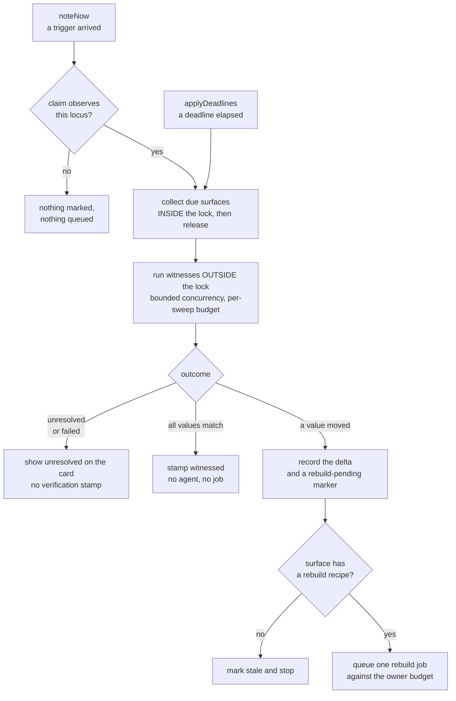

# feat: Slate claims and witnesses

## Summary

Let a Slate surface declare what would prove it wrong, and let the host check those declarations
without waking an agent. A witness that returns its stored value stamps the surface verified and stops
there; only a moved value queues a rebuild. Proved on two surfaces — one whose truth lives in the
repo, one whose truth lives in deployed infrastructure.

---

## Problem Frame

Two failures produce the Slate's staleness, and every approach so far has tuned a single trigger dial
with one of them at each end.

A surface that declares no rebuild recipe gets an empty trigger list from `effectiveDeclaration`,
therefore no deadline from `deriveDueAt`, therefore `overdue` can never rise and its phase stays
`current` forever. Nothing in the system can doubt it. Meanwhile a commit fires every surface bound
to that worktree, and owner delivery in the refresh coordinator skips the concurrency cap on the
grounds that it "costs no port and no session" — so ten surfaces became ten prompts into one working
session.

The split this plan introduces breaks the dial in two. Detection stays cheap and generous; repair
stays expensive and rare. See origin for the measured basis: 110 of 121 completed refreshes changed
nothing.

---

## Requirements

**The claim model**

- R1. A surface declares zero or more claims; each names a witness kind, its parameters, and the
  locus it observes. Claims live beside the A2UI body and are referenced from components by id.
  (origin R1)
- R2. Witness kinds and their parameters resolve against a closed host-owned registry. A claim naming
  an unknown kind, or supplying parameters that do not conform to that kind's schema, is refused.
  (origin R2, R20)
- R3. A refused claim is reported on the affected card, not only logged. (origin R2, AE5)
- R4. A claim's declaration is author-owned and part of the source watermark basis. Its observed
  values are host-owned and excluded from that basis. (origin R19)
- R5. A claim's locus determines which trigger kinds can invalidate it. A trigger at a locus no claim
  on that surface observes queues no work. (origin R4)

**Witness outcomes**

- R6. A witness returns one narrow value, or reports itself unresolved, or fails. (origin R5)
- R7. Only a lookup that completed may report an absence as a value. An unresolved witness never
  counts as a match and never advances the verification stamp. (origin R5)
- R8. A claim's first observed value is recorded when the claim is first seen, before any deadline
  elapses. (origin R3)

**Revalidation**

- R9. The host revalidates a claim by running its witness and comparing the result to the stored
  value. (origin R6)
- R10. A revalidation in which every claim matches stamps the surface verified without an agent
  session. (origin R7)
- R11. A revalidation in which a value moved records which claim moved and both values, and reports
  the change on the surface before any rebuild runs. (origin R8, R10)
- R12. A moved value on a surface with no rebuild recipe records the delta and marks the surface
  stale, without queuing a rebuild there is no instruction for.
- R13. Revalidation is reachable from both a matching trigger and an elapsed deadline, by the same
  path. (origin R4, R6)
- R14. Declaring claims earns a verification deadline regardless of which trigger kinds the claims'
  loci imply. (origin R18)
- R15. Witness execution does not hold the refresh coordinator's serialization lock. (origin R7)
- R16. Rebuild dispatch is bounded regardless of dispatch kind. (origin R17)
- R17. A moved value that has not yet produced a rebuild job is re-derivable after a restart.
  (origin R9)

**Honest reporting**

- R18. A surface that declares no claims reports `unwitnessed` rather than `current`, gating no
  controls and changing no scheduling. (origin R11, R12)
- R19. The visible age of a surface reflects its last successful witness verification, which is
  distinct from the timestamp a file save writes. A surface never witnessed shows no age.
  (origin R13, R21)

**The slice**

- R20. Two surfaces ship: a roadmap card whose claims are repo-locus, and a small card whose claims
  are infra-locus. (origin R14)
- R21. The registry ships two kinds and no others: one reporting whether a named unit has landed;
  one reporting the status code returned by a URL. (origin R15)
- R22. The roadmap's step statuses derive from claim values without an agent. (origin R16)
- R23. Every newly authored surface declares at least one claim, as authoring convention rather than
  boundary enforcement. (origin R22)

---

## Key Technical Decisions

**KTD1 — `unwitnessed` is derived at projection, not a sixth freshness phase.** Origin R12 says it
gates no controls and changes no scheduling, which is the argument for deriving it from
`content.claims` in `slateSurfaceFromCanonical` rather than persisting it. A sixth value on
`SurfaceFreshnessPhase` would touch every phase comparison in the service and coordinator for a fact
nothing queries. The cost is that `unwitnessed` is not a stored fact.

**KTD2 — the claim splits across the two existing ownership homes.** The declaration goes in
`SurfaceContent.claims`, so it travels the file→record path, clears on omission, and is covered by
the watermark. The observed values go under `SurfaceFreshness`, which `FORBIDDEN_FIELDS` already
blocks from any request body. This mirrors `slateEntryWatermark`'s treatment of `proposal`: the
author's meaning is in the basis, the host's timestamp is not — hashing a host-stamped field moves
the watermark every epoch forever.

**KTD3 — witnesses run outside the coordinator's lock, and both entry points reach them by the same
step.** Every coordinator entry point serializes on one key, and the sweep runs every five seconds.
Running a `git fetch` or an HTTP request inside that lock stalls harvest, dispatch, and the manual
refresh button behind network latency, and destroys the property that makes the every-surface walk
free. So the pass collects due claim-bearing surfaces inside the lock and returns; witnesses run
outside it under a bounded concurrency and a per-sweep budget; each result commits back through a
short serialized call that re-checks the surface still exists and still holds the same claims.

The same step is called from `noteNow`, not only from `applyDeadlines`. A commit reaches
`markPossiblyStale` and then `scheduleFor` today without ever touching the deadline pass, and 115 of
175 measured jobs took that route. Putting revalidation only on the deadline path would leave the
cheap check unreachable from the trigger that produces most of the work.

**KTD4 — the claims field is tri-state, and both empty states report `unwitnessed`.** Absent and `[]`
are preserved separately through the file round trip because the egress adapter must not invent a
declaration the author did not write. They do not differ in scheduling or rendering: both project
`unwitnessed`, which is what origin R11 asks for and what makes the state discriminate once witnessed
cards exist. `[]` differs from absent only as an authoring signal — the author checked and found
nothing witnessable — which suppresses the R23 convention nag.

**KTD5 — a refused claim drops that claim, never the surface.** This matches the existing parse
posture: unknown trigger names and out-of-vocabulary policies are dropped while the surface still
projects. The surface therefore renders its *new* content with the bad claim absent, plus a visible
refusal — not its prior content. Without the refusal reaching the card, a mistyped witness kind is
indistinguishable from a healthy surface.

**KTD6 — claim loci are the only trigger narrowing.** The path-glob narrowing added on this branch is
dropped along with the path-collection step in the commit trigger that nothing else consumes. Two
narrowing mechanisms would leave an implementer with no rule for which wins, and dropping the globs
keeps the storm criterion honest: on `main` a commit does reach every surface bound to its worktree.
The same branch's six-hour default interval and its permanent missing-source blocker are kept.

**KTD7 — the witness verification stamp is its own field.** `observeSource` already writes
`verifiedAt` on surface creation and on every file save where the watermark moved, so that field
means "content last arrived or was rebuilt". Reusing it would make an author's file save reset the
host's claim-check deadline and would make the never-witnessed state unreachable, since every surface
is stamped at birth. A separate host-owned timestamp, written only by the witness path, carries the
age in R19 and the deadline in R14.

**KTD8 — a witness outcome is three-valued.** A failed fetch, an unreachable host, an unauthenticated
call, or a wrong ref all produce "no result", and under a two-valued contract that is
indistinguishable from a genuine absence — so a broken witness would match its stored absence and
stamp the card verified. `unresolved` is its own outcome: it never matches, never advances the
verification stamp, and shows on the card as a claim nobody could check.

**KTD9 — owner delivery gets its own per-sweep budget.** `runningWorkerCount()` counts only jobs
dispatched as workers, and every one of the 175 jobs in the live table dispatched as `owner`, so that
counter has never returned anything but zero. Moving the existing cap check above the owner branch
would gate against a constant. Counting owner deliveries in the worker cap instead re-creates a
documented regression, where an owner delivery held a slot on every sweep after the one that
dispatched it and starved the background fleet. So owner dispatch gets a separate in-pass counter.

---

## High-Level Technical Design

The revalidate step, and the two entry points that share it.

Each of `COLLECT`, `V`, `D` and `RB` is a short serialized call. `RUN` is the only slow step and it
holds no lock.

---

## Implementation Units

### U1. Claim declaration on the record and the file contract

- **Goal:** A surface carries claims from an authored file to the canonical record and back, with the
  declaration in the watermark basis and surviving every write path.
- **Requirements:** R1, R4
- **Dependencies:** none
- **Files:** `src/domain/types.ts`, `src/server/sessions/slate-watcher.ts`,
  `src/server/surfaces/slate-source.ts`, `src/server/surfaces/surface-service.ts`,
  `src/server/surfaces/__tests__/slate-source.test.ts`,
  `src/server/sessions/__tests__/slate-watcher.test.ts`,
  `src/server/surfaces/__tests__/surface-service.test.ts`
- **Approach:** Add `SurfaceClaimLocus` as its own closed union rather than extending
  `SurfaceTriggerKind` — locus is an orthogonal axis and the trigger vocabulary's closedness is a
  stated safety property. Add `SurfaceClaim` and `SurfaceContent.claims`. Parse in `toPointInput`,
  preserving absent and `[]` as distinct. Add `claims` to the `slateEntryWatermark` basis, to
  `authoredFieldsOf`, and to `SlateFileAdapter.write`'s set/delete pair so ingress and egress hash the
  same thing. Carry `claims` forward explicitly in `updateContent` beside `refreshPolicy` and in
  `completeRefresh`'s content assembly, and add it to `CONTENT_PATCH_FIELDS` and `parseContent` for
  agent parity — omitting any of the three silently deletes the declaration from the record and, via
  the egress adapter, from the author's own file. Size-cap the list in the existing refuse-never-
  truncate style.
- **Patterns to follow:** `proposal` in `slateEntryWatermark` for the basis split; `refreshPolicy`'s
  carry-forward comments in `surface-service.ts` for why all three sites matter.
- **Test scenarios:**
  - A file entry with a well-formed claims array projects a surface carrying those claims.
  - A body update that omits `claims` clears them, matching `proposal` semantics.
  - Absent `claims` and `claims: []` remain distinguishable across a full file round trip.
  - A headline-only content patch preserves claims rather than deleting them.
  - A successful rebuild preserves claims rather than deleting them.
  - Editing a claim's declaration moves the entry watermark; a host-written observed value does not.
  - A claims list over the cap is refused whole rather than truncated.
- **Verification:** A surface authored with claims survives a reconcile epoch, a headline patch, and a
  rebuild with its declaration intact.

### U2. The witness registry, its two kinds, and the unit linkage

- **Goal:** A named witness kind resolves to host-owned code that returns a value, `unresolved`, or a
  failure.
- **Requirements:** R2, R6, R7, R21
- **Dependencies:** U1
- **Files:** `src/server/surfaces/witness-registry.ts` (new),
  `src/server/surfaces/__tests__/witness-registry.test.ts` (new), `docs/contributing.md`,
  `docs/solutions/conventions/guest-env-boundary.md`
- **Approach:** A registry keyed by kind, each entry carrying a parameter schema, a runner, and a
  timeout. Outcomes are three-valued per KTD8.

  The unit-landed kind needs a link that does not exist today: merged squash commits carry the unit
  tag and the PR number in the subject, but nothing names the plan document, and sixteen of the
  twenty-two plan documents number their units `U1..Un`. Add a `Plan: docs/plans/<file>#U<n>` commit trailer to the
  contributing guide, and ship a small backfill map for the units already merged. The witness reads
  the trailer, falling back to the backfill map, and reports `unresolved` rather than "not landed"
  when it can resolve neither.

  The witness reads a named remote ref and advances it before reading, because feature PRs
  squash-merge remotely and nothing in the host fetches. A worktree on a feature branch must not
  cause a unit to read as landed. The http-status kind takes a URL and returns the status code. Both
  run with a timeout; the repo witness is host tooling rather than a guest running user code, so it
  follows the `commits.ts` and `status-watcher.ts` precedent rather than the guest-env boundary.
- **Execution note:** Write the unit-landed witness test-first against real repository history. The
  naive subject-line and body-grep forms are both wrong on this repo today — one misses a unit that
  landed in two parts, the other matches five unrelated commits.
- **Test scenarios:**
  - A unit whose PR is merged reports landed; one that is not reports pending.
  - A unit that landed across two commits under differing tags still reports landed.
  - A unit id appearing in an unrelated plan's commit does not produce a false landed.
  - A worktree on a feature branch reports against the named remote ref, not local HEAD.
  - A fetch failure, an auth failure, and an unknown plan path each report unresolved — never pending.
  - The http-status witness returns the status code, and reports unresolved when the host is
    unreachable.
  - A claim whose parameters do not conform to its kind's schema is refused with the kind named.
  - A witness exceeding its timeout reports failed, distinct from both unresolved and a moved value.
- **Verification:** Both kinds return a stable value across repeated runs against unchanged inputs,
  and every failure mode reports unresolved rather than an absence.

### U3. Host-owned observation state, seeding, and the verification mutator

- **Goal:** The host can seed a claim's first value and stamp a surface witnessed without a refresh
  job.
- **Requirements:** R8, R10, R11, R19
- **Dependencies:** U1, U2
- **Files:** `src/domain/types.ts`, `src/server/surfaces/surface-service.ts`,
  `src/server/surfaces/source-reconciler.ts`,
  `src/server/surfaces/__tests__/surface-service.test.ts`
- **Approach:** Add per-claim observation state and a `witnessedAt` timestamp under
  `SurfaceFreshness`, distinct from `verifiedAt` per KTD7. Add a `recordWitnessResult` mutator. Model
  the short-circuit on `setSchedule`; model the success payload on `completeRefresh`'s barrier, but
  **narrower** — it clears only the stale reasons whose kind a claim locus observes, and leaves
  `jobId` and any other `staleReason` alone. Clearing `jobId` would orphan a queued rebuild, and
  `dispatch` then cancels it, so a deadline pass could swallow a manual refresh press. Carry
  `lastReasonKeys` forward, without which the next unchanged poll re-stales what was just witnessed.

  Seed the first value when a claim is first seen, in the reconcile path, so a fresh card never reads
  witnessed before anything ran. A claim with no stored value is treated as immediately due rather
  than deferred a full interval.
- **Test scenarios:**
  - Recording a result where all values match sets `witnessedAt` and clears the claim-derived stale
    reason.
  - Covers AE1. A claim whose stored value is an absence, re-observed as still absent by a completed
    lookup, counts as matched.
  - An unresolved outcome does not advance `witnessedAt` and does not count as a match.
  - A pending human-requested refresh survives a passing revalidation — `jobId` is untouched.
  - A stale reason at a kind no claim observes survives a passing revalidation.
  - `lastReasonKeys` survives; a subsequent unchanged trigger of the same kind does not re-stale.
  - A newly authored claim has a stored value before its first deadline.
  - Recording an unchanged observation twice emits exactly one change event.
  - Claim observation state is not settable through the content-update path.
- **Verification:** A surface is stamped witnessed repeatedly and the document store emits nothing on
  the runs where nothing moved.

### U4. The shared revalidate step, outside the lock

- **Goal:** A trigger and an elapsed deadline both reach the same cheap check, and neither blocks the
  coordinator.
- **Requirements:** R9, R10, R11, R12, R13, R14, R15, R16, R17
- **Dependencies:** U2, U3
- **Files:** `src/server/surfaces/surface-refresh-coordinator.ts`,
  `src/server/surfaces/surface-refresh-jobs.ts`, `src/server/surfaces/surface-trigger-matcher.ts`,
  `src/server/surfaces/refresh-wiring.ts`,
  `src/server/surfaces/__tests__/surface-refresh-coordinator.test.ts`,
  `src/server/surfaces/__tests__/surface-trigger-matcher.test.ts`
- **Approach:** Add a `runWitness` dep to `RefreshCoordinatorDeps`, following the pattern that every
  effect leaving the process is injected. Build the revalidate step as three phases per KTD3: collect
  inside the lock, run outside it under a bounded concurrency and a per-sweep budget, commit each
  result back through a short serialized call that re-checks existence and claim identity. Call it
  from both `noteNow` and `applyDeadlines`.

  Make claims satisfy `deriveDueAt`'s want test directly, so a repo-locus-only surface still earns a
  deadline as a backstop. Extend `effectiveDeclaration` so claims earn the trigger kinds their loci
  imply. On a moved value, record the delta and a durable rebuild-pending marker in the same commit,
  then queue a rebuild only when the surface has a recipe — leave the recipe-less arm of
  `refreshBlocker` intact so a rebuild is never dispatched with no instruction. Drain the marker on
  subsequent sweeps until a job exists, so a restart between the delta and the job does not lose the
  rebuild.

  Separately, add a per-pass owner-delivery counter per KTD9, leaving `runningWorkerCount` worker-only.
- **Execution note:** The headline claim is a negative — "a matching revalidation does not wake an
  agent." Stub the dispatch layer so *would have dispatched* is observable, then invert the comparison
  and confirm the test goes red. A test satisfied by "nothing dispatched because nothing ran" proves
  nothing.
- **Test scenarios:**
  - A commit matching a repo-locus claim revalidates before any job is scheduled, and schedules none
    when the value matches.
  - A claim-bearing surface with no recipe and no periodic trigger still acquires a deadline.
  - A due surface whose witnesses all match is stamped witnessed, and the dispatch stub records no
    call.
  - Inverting the comparison so values report changed makes the previous test fail.
  - A witness that takes seconds does not delay harvest, dispatch, or a concurrent manual refresh.
  - A per-sweep budget bounds how many witnesses run in one pass.
  - A moved value on a surface with a recipe queues exactly one rebuild job.
  - A moved value on a surface with no recipe marks it stale and queues nothing.
  - A restart between recording a delta and queuing its rebuild still produces the rebuild.
  - Ten owner-owned surfaces with moved values produce dispatches bounded by the owner budget.
  - A surface deleted between collect and commit does not commit a result.
  - A failing witness respects the existing failure cooldown.
  - A surface with no claims follows the existing path unchanged.
- **Verification:** A day of sweeps against unchanged sources produces witness stamps and zero agent
  sessions; a moved value produces one job; the manual refresh button stays responsive throughout.

### U5. Locus gating, and removing the path-glob narrowing

- **Goal:** A trigger reaches only the surfaces whose claims observe its locus, and there is one
  narrowing mechanism.
- **Requirements:** R5
- **Dependencies:** U1
- **Files:** `src/server/surfaces/surface-trigger-matcher.ts`,
  `src/server/surfaces/refresh-wiring.ts`, `src/server/index.ts`,
  `src/server/surfaces/__tests__/surface-trigger-matcher.test.ts`,
  `src/server/surfaces/__tests__/refresh-wiring.test.ts`
- **Approach:** Add a claim-locus predicate as a fourth filter in `matchTrigger`, applying only when
  `claims` is a non-empty array; both absent and `[]` fall through to today's matching behaviour.
  Delete `MAX_EVENT_PATHS`, `SurfaceTriggerEvent.paths`, the `git-revision` arm of `kindMatches`,
  `changedPaths()` in `refresh-wiring.ts`, and its call site in `src/server/index.ts`. **Keep**
  `isExternalSourceId`, `declaredPathGlobs`, `globToRegExp`, `pathMatchesGlob`, and `anyPathMatches` —
  the `source-content` arm still uses them, and deleting them is a compile error plus a silent
  behaviour change for adapters emitting path-shaped source ids.
- **Test scenarios:**
  - Covers AE2. A commit event against a surface whose claims are all infra-locus produces no match,
    no stale mark, and no job.
  - The same commit event against a repo-locus surface does match.
  - A surface with claims at both loci matches triggers at either.
  - A surface with absent claims retains today's matching behaviour.
  - A surface with `claims: []` retains today's matching behaviour.
  - The `source-content` arm still matches a path-shaped source id against declared globs.
  - The commit trigger fires without collecting changed paths.
- **Verification:** A commit on the worktree produces work on the roadmap card and nothing on the
  infra card, and the existing source-content matching is unchanged.

### U6. A refused claim reaches the card

- **Goal:** A claim the host refused is visible on the surface rather than only in a log line.
- **Requirements:** R3
- **Dependencies:** U1, U2
- **Files:** `src/server/sessions/slate-watcher.ts`, `src/server/surfaces/slate-source.ts`,
  `src/server/surfaces/source-reconciler.ts`, `src/server/surfaces/surface-service.ts`,
  `src/server/stores/run-slate-projection.ts`,
  `src/components/RunWorkspaceWidget/SlatePanel.tsx`,
  `src/server/surfaces/__tests__/source-reconciler.test.ts`,
  `src/components/RunWorkspaceWidget/__tests__/SlatePanel.test.tsx`
- **Approach:** The existing epoch `refusals` array only carries hard failures from `!ok` results, and
  under KTD5 a claim-refused entry still projects successfully — so that channel never sees it. Have
  the claim parser return the accepted claims alongside the refusals, carry the refusals on
  `SlateSourceEntry`, thread them through `observeSource` onto a host-owned field on the record, and
  project them to the card. The surface renders its new content with the bad claim dropped plus the
  refusal, not its prior content.
- **Test scenarios:**
  - Covers AE5. Authoring a surface with an unknown witness kind renders the new content, drops that
    claim, and shows the refusal naming the kind.
  - A refusal clears once the entry parses cleanly.
  - A claim refused on one surface does not mark its siblings.
  - A refusal survives an SSE round trip rather than being dropped as an absent key.
- **Verification:** A deliberately mistyped witness kind is visibly distinguishable on the canvas from
  a healthy surface.

### U7. Honest reporting in the render layer

- **Goal:** A witnessed surface, a never-witnessed surface, and a claimless surface look different.
- **Requirements:** R18, R19
- **Dependencies:** U3
- **Files:** `src/server/stores/run-slate-projection.ts`, `src/domain/types.ts`,
  `src/components/RunWorkspaceWidget/SurfaceAge.tsx`,
  `src/components/RunWorkspaceWidget/FreshnessBadge.tsx`,
  `src/components/RunWorkspaceWidget/SlatePanel.tsx`,
  `src/components/RunWorkspaceWidget/OpenPointsSurface.tsx`,
  `src/components/RunWorkspaceWidget/__tests__/SurfaceAge.test.tsx`,
  `src/components/RunWorkspaceWidget/__tests__/FreshnessBadge.test.tsx`
- **Approach:** Derive `unwitnessed` in `slateSurfaceFromCanonical` when `claims` is absent or empty,
  and carry it on the projected surface. Change `SurfaceAge` to read `witnessedAt` with a no-age case,
  and update **all three** call sites — two in `SlatePanel` and one in `OpenPointsSurface`. Do not
  leave an optional `amendedAt` fallback on the component, or the third site silently keeps the old
  behaviour while the tests pass. Show an unresolved claim distinctly from a witnessed one.
- **Test scenarios:**
  - Covers AE3. A claimless surface reports unwitnessed, keeps its controls usable, and schedules no
    refresh.
  - Covers AE4. A surface whose content last changed four hours ago and was witnessed a minute ago
    shows the witness age.
  - Covers AE6. A surface never witnessed shows no age.
  - A surface whose file was saved a moment ago but never witnessed still shows no age.
  - A surface with an unresolved claim is distinguishable from a witnessed one.
  - All three `SurfaceAge` call sites read the same field.
  - The age label advances without a server re-render — the ticking clock lives in the caller, and a
    test pinning `now` will not catch its absence.
- **Verification:** On a canvas holding one witnessed surface, one never-witnessed surface, and one
  claimless surface, all three are distinguishable at a glance.

### U8. The two slice surfaces, end to end

- **Goal:** The slice's own claims work against the real chain.
- **Requirements:** R20, R21, R22, R23
- **Dependencies:** U1–U7
- **Files:** `docs/solutions/documentation-gaps/slate-surface-authoring-contract.md`,
  `src/server/surfaces/__tests__/surface-service.test.ts`, `e2e/` (one spec)
- **Approach:** Author the roadmap card with one repo-locus claim per unit, deriving its step statuses
  mechanically from claim values, and the infra card with a single http-status claim. Document
  `claims` in the authoring contract alongside `refreshPolicy` and `proposal`, including the
  tri-state, the omission-clears semantics, and the one-claim-minimum convention. Add the end-to-end
  pass over the real file→record→projection→render chain rather than stubs.
- **Test scenarios:**
  - An authored roadmap file produces step statuses matching the repository's actual merge state.
  - Covers AE1. A unit that has not landed renders as witnessed and pending.
  - The infra card ignores a commit and revalidates on its own deadline.
  - The end-to-end pass uses the session-enabled Playwright fixture — the default fixture disables
    session-scoped routes and returns SPA HTML.
- **Verification:** Both cards sit on a live Slate reporting witnessed, and a commit moves only the
  roadmap.

---

## System-Wide Impact

The witness scheduler is a fourth re-asserting loop in a codebase that already runs three. Every
document-store mutator that emits a change must equality-short-circuit on a no-op write, or each tick
becomes a persist-and-SSE storm across every surface. The comparator has to compare semantic witness
state while excluding the when-we-last-looked timestamp from the change decision — including it
storms, forgetting the new fields entirely swallows real transitions. Observation state under
`SurfaceFreshness` falls inside the projected-slate JSON comparison, so this boundary has to be drawn
precisely.

Witness parameters arrive from an agent-authored JSON file, the same untrusted channel the
prompt-delivery guardrail exists for. A parameter that reaches a command or a delivered prompt is
untrusted input.

The repo witness is host tooling rather than a guest running user code, so it follows the existing
internal-tooling precedent rather than the guest-env boundary — the boundary doc explicitly excludes
Tinstar's own git tooling, and routing through it would withhold credentials for no isolation gain.

---

## Risks & Dependencies

- **The unit-landed witness is the highest-risk piece.** A naive form is wrong in both directions on
  this repository today, and the link it needs between a unit id and a plan document does not exist —
  U2 creates it. A wrong witness is worse than none because it fails without doubt.
- **No prior art in the knowledge base.** Nothing in `docs/solutions/` covers the freshness engine,
  leases, or job scheduling. Concurrency behaviour here is new ground, and a second backend on the
  same machine is a real scenario rather than hypothetical.
- **Adding `claims` to the watermark basis rehashes every existing entry on first read.** That
  produces a one-time epoch where every surface looks author-edited. Acceptable given surfaces are
  wiped, but worth expecting rather than debugging.
- **The interim storm widens.** U5 drops the path-glob narrowing before U8 authors any claims, so
  between those two units the commit fan-out is worse than the branch it started from. Landing U5 late
  in the sequence keeps that window short.
- **Host writes near a watched directory.** Keeping observation state on the record rather than in the
  sidecar avoids a host-write/agent-write loop that no existing convention covers; the plan depends on
  that holding.

---

## Scope Boundaries

Carried from origin: the witness registry beyond the two kinds; the raw-command escape hatch; the
missing UI components; card templates; the authoring skill beyond the one-line convention; the
authoring-time execution gate; slate-locus claims; refresh-on-read; the periodic tick as a semantic
audit; request coalescing; and migration of existing surfaces, which are wiped along with their
accumulated replies.

### Deferred to Follow-Up Work

- Carrying `proposal` forward in `updateContent` and `completeRefresh`. Both sites carry `recipe` and
  `refreshPolicy` and omit `proposal`, so a headline patch drops it. Pre-existing and outside this
  slice, but U1 touches the same three sites for `claims`.
- Documenting the freshness engine's job lifecycle and lease behaviour in `docs/solutions/`.

---

## Open Questions

- Whether the per-sweep witness budget should be a new config scalar or reuse `maxConcurrentWorkers`.
  The former is honest, the latter is one fewer knob.
- Whether an unresolved claim should eventually escalate — a witness unresolved for a day is a
  different situation from one unresolved once.
- The observation window for the success criteria. The origin scopes three of four to it and does not
  fix its length.

---

## Sources / Research

- `docs/brainstorms/2026-07-29-slate-claims-and-witnesses-requirements.md` — origin.
- `src/server/surfaces/surface-refresh-coordinator.ts` — every entry point serializes on one key;
  sweep order is load-bearing and documented in place; `runningWorkerCount` is deliberately
  worker-only, and the comment records the starvation regression that narrowed it.
- `src/server/surfaces/surface-trigger-matcher.ts` — `effectiveDeclaration` is the rot mechanism;
  `deriveDueAt` wants an interval or a periodic trigger; the `source-content` arm shares the glob
  helpers with the `git-revision` arm being removed.
- `src/server/surfaces/surface-service.ts` — `observeSource` writes `verifiedAt` on create and on
  every watermark move, which is why KTD7 adds a separate field; the mutator template; the
  carry-forward hazard that once deleted a recipe from both the record and the author's file.
- `src/server/surfaces/source-reconciler.ts` — the epoch `refusals` array carries only `!ok` results.
- `src/server/sessions/slate-watcher.ts` — `toPointInput` is a pure validator with no per-field
  refusal channel, which is why U6 changes its shape.
- `src/server/surfaces/slate-source.ts` — `slateEntryWatermark` excludes `proposal.at` for the same
  reason the observed value must be excluded.
- `docs/solutions/conventions/adding-a-docstore-entity-and-plugin-widget.md` — the equality
  short-circuit contract and its zero-emit test.
- `docs/solutions/integration-issues/sse-delta-drops-undefined-keys-stale-client-state.md` — why a
  cleared field needs an explicit line in the client merge.
- `docs/solutions/conventions/verify-a-guard-by-breaking-it.md` — the negative-claim guard shape U4's
  execution note follows.
- `docs/solutions/conventions/guest-env-boundary.md` — and its explicit exclusion of Tinstar's own git
  tooling, which is why the repo witness does not join that table.
- `docs/solutions/documentation-gaps/slate-surface-authoring-contract.md` — where `claims` must be
  documented.
- `docs/solutions/test-failures/e2e-session-scoped-api-routes-return-spa-html.md` — the fixture U8's
  e2e pass requires.
