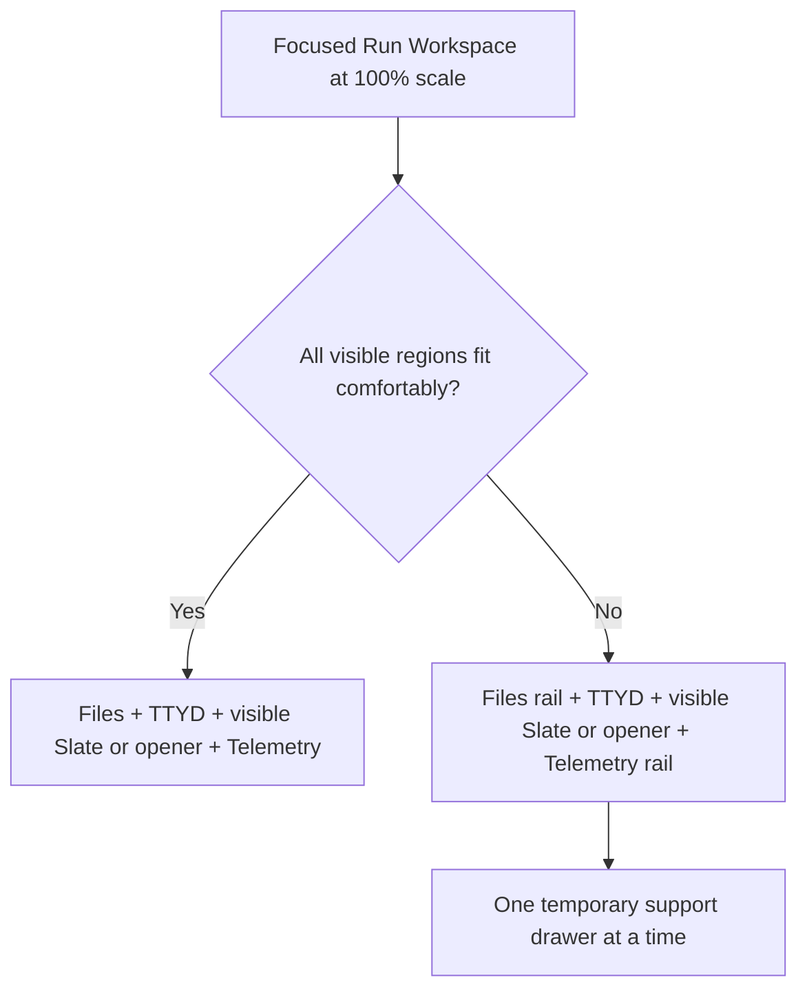

# Focus Mode - Plan

## Goal Capsule

- **Objective:** Let a user work with one Run Workspace at readable scale across changing desktop and laptop viewports, without arranging or selecting canvas widgets.
- **Product authority:** This Product Contract owns the Canvas/Focus view behavior for Run Workspaces. Existing canvas layout semantics remain authoritative outside Focus.
- **Open blockers:** None. Control placement, responsive thresholds, and transient drawer behavior are resolved below.

---

## Product Contract

### Summary

Add a remembered Canvas/Focus toggle that keeps one existing Run Workspace mounted while temporarily fitting its rendered shell to the available viewport at 100% scale.
Focus responds continuously to viewport changes and never changes the saved canvas layout.

### Problem Frame

A Run Workspace that is comfortable on a large monitor can be oversized on a laptop, forcing the user to resize windows individually after every display change.
The current `Z` action is difficult to reach when the prompt composer or TTYD captures clicks, adjusts only height, and acts on one selected widget at a time.
Some users also want to operate Tinstar as a single-session workspace without learning or interacting with the canvas.

### Key Decisions

- **Use a constrained canvas state, not a second Run Workspace surface** (session-settled: user-approved — chosen over a separate Focus rendering surface: one mounted workspace preserves live UI state and lowers maintenance cost). Governs R2, R6-R8.
- **Use responsive priority layout C** (session-settled: user-directed — chosen over compressed four-column and 2x2 reflow: TTYD and Slate retain useful working space). Governs R10-R14.
- **Remember Focus per browser without an entry picker** (session-settled: user-directed — chosen over Canvas-only startup and explicit session picking: users can opt out of the canvas without recurring setup). Governs R1, R3, R17.
- **Preserve existing hierarchy and HUD collapse behavior** (session-settled: user-directed — chosen over forcibly hiding all global chrome: familiar controls remain while the incompatible widget palette closes). Governs R4, R5.

### Requirements

**Mode and continuity**

- R1. Tinstar provides an immediately available Canvas/Focus toggle and a Settings preference for the browser's default view.
- R2. Entering Focus keeps the active Run Workspace instance mounted so terminal focus, open tabs, composer state, and panel state continue without a Focus-specific copy.
- R3. Focus opens the current or most recently focused present built-in Run Workspace, including a stopped-but-present current target under R17, and otherwise falls back to the first eligible live built-in Run Workspace in Tinstar's existing session order without showing a picker. Custom run views are not Focus-eligible.
- R4. Focus leaves the hierarchy and HUD under their existing collapse controls, forces the widget palette closed, and makes non-run canvas widgets unavailable.
- R5. Leaving Focus restores the prior camera, canvas geometry, and widget-palette state without changing the user's existing hierarchy or HUD choices.

**Viewport constraint**

- R6. Focus gives the active Run Workspace temporary render geometry that matches the available canvas viewport and recomputes it whenever that viewport changes.
- R7. Focus holds the active Run Workspace at 100% visual scale and disables canvas pan, zoom, drag, resize, snap, marquee, and widget-creation interactions.
- R8. Focus geometry never enters the canonical layout collection or the normal persisted resize path.
- R9. A wheel or trackpad gesture that no inner panel can consume leaves the focused run and camera unchanged and shows a rate-limited reminder for the directional session-cycling hotkeys.

**Responsive Run Workspace**

- R10. When all visible regions fit comfortably, Focus retains the Run Workspace's normal full-panel composition and the user's existing panel choices.
- R11. When width becomes constrained, Focus keeps TTYD and the visible Slate at useful full height while Files and Telemetry collapse into narrow rails.
- R12. In the constrained layout, Files and Telemetry open as temporary drawers one at a time without permanently shrinking the primary working pair.
- R13. When no Slate is visible, TTYD receives the space the Slate would otherwise occupy while the existing Slate-opening affordance remains reachable.
- R14. Responsive auto-collapse is temporary and never overwrites the user's normal Files, Telemetry, or Slate width and collapse preferences.

**Run navigation and lifecycle**

- R15. Existing previous/next ready-run and previous/next all-run bracket shortcuts switch the focused Run Workspace without returning to Canvas.
- R16. Ctrl-modified cycling remains available while focus is inside the prompt composer or TTYD iframe.
- R17. A stopped run remains focused until the user navigates away, while a removed run triggers the R3 fallback. During initial hydration Focus shows a resolving state; after hydration, a fleet with no eligible live Run Workspace shows a no-live-workspaces state, and an empty fleet shows an empty-fleet state. Both settled empty states provide a route back to Canvas and automatically resolve when an eligible run later appears.

The responsive composition follows this decision boundary:

### Key Flows

- F1. Enter Focus from the canvas
  - **Trigger:** The user activates the Focus toggle while a run is current.
  - **Steps:** Tinstar preserves the canvas state, applies temporary viewport geometry to that run, locks the camera at 100%, and closes the widget palette.
  - **Outcome:** The same Run Workspace fills the available viewport without a persisted layout change.
  - **Covered by:** R1, R2, R4, R6-R8.
- F2. Continue after moving to a smaller monitor
  - **Trigger:** The browser viewport shrinks while Focus is active or Focus is restored on reload.
  - **Steps:** The active Run Workspace tracks the new viewport and crosses into the constrained composition when its regions no longer fit comfortably.
  - **Outcome:** TTYD and any visible Slate stay usable while Files and Telemetry remain available through rails and drawers.
  - **Covered by:** R1, R6, R10-R14.
- F3. Switch sessions without leaving the terminal
  - **Trigger:** The user presses a Ctrl-modified bracket shortcut while TTYD or the prompt composer owns focus.
  - **Steps:** Tinstar applies the existing ready-run or all-run cycling order and moves temporary Focus geometry to the selected run.
  - **Outcome:** The next session replaces the current one without canvas selection or mouse interaction.
  - **Covered by:** R3, R15-R17.
- F4. Return to Canvas
  - **Trigger:** The user activates the Canvas/Focus toggle from Focus.
  - **Steps:** Tinstar removes the temporary geometry and interaction constraint, then restores the saved camera and palette state.
  - **Outcome:** The original canvas arrangement returns exactly as the user left it.
  - **Covered by:** R5, R8.

### Acceptance Examples

- AE1. **Covers R2, R6-R8.** Given a selected Run Workspace with open TTYD and Slate state, when the user enters Focus, then the same workspace fills the canvas viewport at 100% scale and its canonical layout values do not change.
- AE2. **Covers R1, R6, R10-R14.** Given Focus was remembered on a large monitor, when the user reloads on a narrower laptop viewport, then Focus opens automatically and reflows into the priority layout without rewriting normal panel preferences.
- AE3. **Covers R3, R15, R16.** Given TTYD owns keyboard focus, when the user presses `Ctrl+]`, then Focus moves to the next ready run without requiring a click; `Ctrl+Shift+]` uses the all-run order.
- AE4. **Covers R9.** Given an inner panel is already at its scroll boundary, when the user continues scrolling outward, then the panel and camera stay put and a directional cycling reminder appears without repeating continuously.
- AE5. **Covers R5, R8.** Given the user entered Focus from a canvas with custom widget positions and an open widget palette, when they return to Canvas, then the prior camera, positions, sizes, and palette state are restored.
- AE6. **Covers R4.** Given Focus is active, when the user changes the existing hierarchy or HUD collapse controls, then those controls continue to work while the widget palette remains closed and canvas widgets remain unavailable.
- AE7. **Covers R3, R17.** Given Focus is active and its focused run is removed through a live update, when target reconciliation runs, then Tinstar chooses the R3 fallback without a picker; if no runs exist, it shows the Focus empty state and a Canvas toggle.

<!-- ce-section: work-relationships -->
### How This Work Fits Together

This plan owns Focus Mode as one coherent Run Workspace experience; the surrounding work below is context, not a committed roadmap.

- **Can proceed independently of Focus:** Correct `Z` so selected canvas widgets fit both viewport dimensions. This remains a canvas utility and does not provide a canvas-free workflow.
- **Shares the responsive-workspace concern:** The existing mobile-mode proposal defines a separate phone projection rather than mounting the infinite canvas. Focus targets desktop and laptop canvas viewports and does not replace that proposal.
- **Still to decide separately:** Whether non-run widgets ever receive their own focused presentations. They are excluded from this Run Workspace plan.

### Scope Boundaries

- The `Z` fit correction is not part of Focus Mode.
- Non-run canvas widgets are outside Focus per R4.
- Focus does not redesign the content or data contracts of Files, TTYD, Slate, or Telemetry.
- Phone navigation and the mobile list projection remain owned by the mobile-mode proposal.
- Persisted canvas resizing and rearrangement are outside Focus per R8.

### Dependencies and Assumptions

- The current Run Workspace remains the single source of rendered session UI and can receive a Focus-specific responsive constraint without a second component instance.
- The existing session order and bracket shortcuts remain the navigation authority for Focus.
- The available canvas viewport, rather than the browser window, is the sizing authority because existing side panels may remain visible.
- Planning may choose exact breakpoints from usable panel widths; the product rule is the behavior in R10-R14, not a device-name breakpoint.

### Outstanding Questions

None block implementation. The implementation defaults and the verification contract below resolve the former planning questions without changing the settled Product Contract.

### Sources and Research

- `src/components/RunWorkspaceWidget/index.tsx` — current Run Workspace state, panel composition, collapse affordances, and action registration.
- `src/components/InfiniteCanvas.tsx` — viewport observation, transformed canvas rendering, selection, and current `Z` behavior.
- `src/hooks/useWidgetLayouts.ts` — canonical layout updates and persistence behavior.
- `src/hotkeys/useGlobalHotkeys.ts` — ready-run and all-run bracket cycling semantics.
- `src/widgets/runWorkspace/index.tsx` — Run Workspace canvas registration and default geometry.
- `docs/brainstorms/2026-07-21-mobile-mode-requirements.md` — adjacent phone projection and its non-canvas boundary.

---

## Planning Contract

### Implementation Approach

Focus Mode is a host-owned presentation state, not a second route and not a persisted canvas mutation. `WorkspaceShell` owns the remembered mode and the current focused run. `InfiniteCanvas` keeps its existing tree mounted, but in Focus it supplies one run shell with temporary viewport geometry, an effective 100% camera, and a locked interaction surface; every other canvas shell remains mounted but hidden and inert. `RunWorkspaceWidget` reads a host presentation context and derives its narrow composition from its measured width, without writing responsive choices back to Files, Telemetry, or Slate preferences.

The immediate control is a compact, screen-space Canvas/Focus toggle in the top-left of the canvas slot so it remains available whether the hierarchy or Canvas sidebar is collapsed. In Focus, the Run Workspace header reserves the toggle's footprint so the overlay never covers session controls; the same anchor is used in resolving and empty states. Settings > Widgets > Run Session exposes the same per-browser boolean. Changing either control changes the current view and the remembered default together.

### Key Technical Decisions

- **KTD1 — Persist only the view mode, never a run identity or temporary geometry.** Add `focusMode` to the singleton `UiPrefs` blob and hold the most recently focused run per space only in live `WorkspaceShell` state. This avoids stale reusable run ids while satisfying browser-level mode recall. Read the preference on mount/new tabs; changing it in the current tab uses the controlled owner and does not live-switch other already-open tabs. Governs R1, R3, R5, R8, R17. Instantiates the session-settled browser-memory decision.
- **KTD2 — Derive a Focus camera and layout at render time.** Keep the canonical `layouts` map and `useCanvasCamera` state untouched. In Focus, render the target at `{x: 0, y: 0, width: usableWidth, height: containerHeight}` and use `{x: 0, y: 0, zoom: 1}` as the effective camera. `usableWidth` subtracts the expanded Canvas sidebar's occupied width; hierarchy width is already excluded by the canvas slot. Governs R5-R8.
- **KTD3 — Preserve component identity by hiding, not filtering or reparenting.** All existing `CanvasWidgetShell` and Run Workspace component keys remain in the render tree. Non-target shells use `visibility: hidden`, `pointer-events: none`, and accessibility hiding; the target shell receives an interaction lock. Constellation, snap, selection, add-widget, pin-placement, marquee, and drag overlays do not render while Focus is active. Governs R2, R4, R5, R7.
- **KTD4 — Keep Focus presentation host-internal.** Add a small React context around each shell's widget component rather than expanding the public plugin API. The context reports `canvas` or `focus`; only the built-in `run-workspace` consumes it, and target resolution excludes custom run views. Governs R2-R4, R10-R14.
- **KTD5 — Use a measured, content-derived responsive threshold.** In Focus, the full layout remains while the current visible side regions plus a 640px minimum session pane fit. When they do not, Files and Telemetry become 24px rails; visible Slate is clamped between its existing 260px minimum and 40% of the available width, and TTYD receives the remainder. With no visible Slate, its existing 28px open strip remains and TTYD receives the reclaimed width. Governs R6, R10-R14. Instantiates the session-settled priority-C decision.
- **KTD6 — Make support panels temporary, mutually exclusive drawers.** Activating a Focus rail opens Files or Telemetry as a non-modal overlay above the primary layout at `clamp(280px, 32vw, 420px)`; opening one closes the other and moves focus to its heading or first control. Escape, the rail/close control, a target switch, a return to full composition, or leaving Focus closes the drawer and returns focus to the invoking rail when it still exists. Drawer state is local and never calls normal collapse setters or `setPref`. Governs R11, R12, R14.
- **KTD7 — Reuse the existing cycling authority.** Existing ready/all queues and Ctrl-modified bracket handling continue selecting runs, but Focus cycles relative to `focusedRunId` even when hierarchy selection is non-run. While Focus is active, a valid eligible run selection also becomes the focused target; removal reconciles against the live visible queue and then the existing run order, while a stopped-but-present target remains. A target change moves DOM focus out of the hidden shell to the new workspace root, announces the new run, and supports an immediate second cycle shortcut. No focused id is restored from storage. Governs R3, R15-R17.
- **KTD8 — Treat outer wheel gestures as guidance, not navigation.** A mode-aware wheel wrapper reuses the canvas camera's existing nested-scroll helpers to determine whether a DOM panel can consume the gesture. The same-origin TTYD wrapper performs the equivalent check against the xterm viewport and posts an unconsumed boundary gesture to the parent. Only an unconsumed gesture shows a non-modal reminder for three seconds, rate-limited to once per five seconds. Upward gestures show `Ctrl+[` / `Ctrl+Shift+[`; downward gestures show the matching `]` shortcuts. The gesture never changes the camera or run. Governs R9, R15-R16.

### Repository Grounding

- `src/components/WorkspaceShell.tsx:453` already owns the one-shot camera focus request, selection, global cycle queues, dialogs, hierarchy, widget palette, and the `InfiniteCanvas` boundary. It is the narrowest owner for mode and target lifecycle.
- `src/components/InfiniteCanvas.tsx:243` owns canonical camera state, while `src/components/InfiniteCanvas.tsx:252` already observes the real canvas container. `renderNode` at `src/components/InfiniteCanvas.tsx:1882` is the seam for effective shell geometry and presentation without touching `useWidgetLayouts`.
- `src/widgets/CanvasWidgetShell.tsx:39` owns host chrome and all move/resize/pin pointer paths, so one `interactionLocked` prop can make the active shell non-canvas-interactive without weakening normal behavior.
- `src/components/RunWorkspaceWidget/index.tsx:61` owns the panel state that must survive entry/exit. Its horizontal composition at `src/components/RunWorkspaceWidget/index.tsx:320` already has Files and Telemetry rails and a Slate-open strip to reuse.
- `src/components/CanvasSidebar/CanvasSidebar.tsx:29` keeps its own remembered collapse state and uses a fixed 320px expanded width. Reporting occupied width upward preserves that behavior while making Focus geometry honest.
- `src/components/WidgetsPalette/WidgetsPalette.tsx:19` keeps expansion state locally. A `forceCollapsed` presentation prop can preserve and restore it without adding another persisted preference.
- `src/lib/uiPrefs.ts:25` is the required typed access layer for browser preferences; `src/lib/__tests__/uiPrefs.test.ts` is its regression suite.
- `e2e/fit-to-viewport.spec.ts` and `e2e/canvas-interactions.spec.ts` establish geometry/camera assertion patterns; `e2e/hotkeys.spec.ts` covers bracket behavior through editable and iframe focus.

### Institutional Learnings Applied

- `docs/solutions/integration-issues/hidden-runs-ghosting-stale-localstorage-on-run-removal.md` establishes that run ids are reusable and that new UI preferences must use `uiPrefs`. Therefore Focus persists only its boolean mode and resolves targets from the live run collection.
- `docs/solutions/integration-issues/sse-delta-drops-undefined-keys-stale-client-state.md` establishes that lifecycle behavior must be checked across the serialized SSE path. Therefore browser verification includes removal of the active run and deterministic fallback, not only pure helper tests.
- External research is intentionally omitted: this feature is governed by local interaction, state, and persistence contracts, and the repository already contains direct patterns for every implementation seam.

### Risk Controls

- **Saved-layout corruption:** no Focus code may call `updateRunPosition`, `updateRunSize`, `resizeNode`, `batchSetLayouts`, or layout persistence. Tests snapshot the active space's server-backed `config.ui.layouts['tinstar-layouts-v3-<spaceId>']` entry before entry, resizing, target cycling, and exit, wait past the 500ms persistence debounce, and compare it structurally.
- **State loss through remount:** keep stable node keys and providers in both modes; test composer text/tab state across entry/exit and target switching.
- **Blank Focus after SSE removal:** resolve the target from the post-update `runMap`; never retain a removed object and never restore an id from storage.
- **Hidden controls or inaccessible drawers:** the toggle is screen-space, rails are semantic buttons with `aria-expanded`/`aria-controls`, the hint uses `role=status`, and Escape closes a temporary drawer without exiting Focus.
- **Short viewports:** keep the Run Workspace header and Focus toggle fixed and reachable, bound temporary drawers to the workspace body, fill the available height, and rely on existing internal panel scrollers; do not introduce a second vertical composition.
- **Iframe input bridge:** TTYD key and wheel events do not bubble to the parent. Extend the existing same-origin terminal-wrapper postMessage bridge for the four Ctrl/Cmd bracket chords and for wheel gestures the xterm viewport cannot consume; keyboard cycling and the reminder then share the parent-owned callbacks and rate limiter.

---

## Implementation Units

### U1 — Remembered mode, target lifecycle, and chrome controls

- **Requirements:** R1, R3-R5, R15-R17; AE2, AE3, AE5-AE7.
- **Depends on:** None.
- **Primary files:**
  - `src/lib/uiPrefs.ts` — add the typed `focusMode?: boolean` singleton preference.
  - `src/focusMode/focusTarget.ts` — add pure target selection/reconciliation helpers that accept the live runs and existing ordered candidate ids.
  - `src/components/WorkspaceShell.tsx` — own `focusMode`, the per-space in-memory focused target, and controlled widget-palette expansion; read/write the preference without forcing live cross-tab switches, reconcile selection/removal/hydration, pass Focus props to the canvas, and keep hotkey cycling in Focus.
  - `public/terminal-wrapper.html` — intercept the four Ctrl/Cmd bracket chords inside xterm, post session-scoped cycle messages to the parent, and post plain wheel-boundary direction when the xterm viewport cannot scroll farther.
  - `src/components/RunWorkspaceWidget/RunSessionPanel.tsx` — validate terminal-wrapper messages for the current session and forward cycle/boundary events to the parent-owned Focus callbacks.
  - `src/components/FocusModeToggle.tsx` — add the always-available screen-space Canvas/Focus control and Focus empty-state action.
  - `src/components/SettingsDialog.tsx` — add a controlled “Open in Focus mode” setting under Widgets > Run Session.
  - `src/components/WidgetsPalette/WidgetsPalette.tsx` — become controlled by `WorkspaceShell`, accept `forceCollapsed`, and disable expansion/resize while Focus is active so hierarchy unmount/remount cannot erase the entry state.
- **Tests:**
  - `src/lib/__tests__/uiPrefs.test.ts` — boolean read/write and malformed-storage fallback.
  - `src/focusMode/__tests__/focusTarget.test.ts` — selected/last/live-order fallback, stopped-but-present retention, removal, no-run, hidden candidate, and reusable-id non-persistence cases.
  - `src/components/__tests__/FocusModeToggle.test.tsx` — accessible labels, state, and callback.
- **Implementation notes:** `focusedRunId` is an in-memory raw run id stored per active space. On entry, prefer a selected present eligible workspace, then that space's in-memory target, then visible ordered eligible candidates, then the first eligible live workspace. Preserve a stopped current target, but do not choose a stopped or custom-view run as a fresh fallback. A non-run hierarchy selection does not discard the current Focus target; selecting/double-clicking an eligible hierarchy run switches Focus rather than issuing a one-shot camera request. `handleSelectRun` updates the target whenever Focus is active. Distinguish unresolved initial hydration, no eligible live workspaces, and a truly empty fleet; an arriving eligible run resolves either settled empty state.
- **Verification scenarios:** Enable Focus from the canvas and Settings; reload and see it restored; switch runs with all four bracket actions twice in succession from the page, composer, and TTYD iframe; remove the focused run and observe fallback; stop it and observe retention; cover resolving/no-live/empty/custom-view states and empty-then-arrival; collapse hierarchy while focused; return to Canvas; and observe the prior palette expansion.

### U2 — Transient canvas constraint and interaction lock

- **Requirements:** R2, R4-R9; AE1, AE4-AE6.
- **Depends on:** U1.
- **Primary files:**
  - `src/focusMode/FocusPresentationContext.tsx` — host-only `canvas | focus` presentation provider/hook.
  - `src/components/InfiniteCanvas.tsx` — derive effective camera/layout from `containerSize`, subtract Canvas-sidebar occupation, keep non-target shells mounted but hidden/inert, suppress canvas overlays and pointer interactions, and show the boundary reminder.
  - `src/hooks/useCanvasCamera.ts` — accept an enabled/mutation guard, export and reuse the existing nested-scroll helpers, and suppress global reset/pan/zoom state writers while Focus is active.
  - `src/widgets/CanvasWidgetShell.tsx` — add `interactionLocked`, `hidden`, and presentation props; disable selection/drag/resize/add/pin affordances while preserving the inner workspace's input events.
  - `src/components/CanvasSidebar/CanvasSidebar.tsx` — report `0 | 320` occupied pixels whenever its existing effective collapse state changes.
  - `src/components/FocusCycleHint.tsx` — render the rate-limited, directional `role=status` shortcut reminder.
- **Tests:**
  - `src/hooks/__tests__/useCanvasCamera.test.ts` — guarded Alt+Z, wheel, and pan paths plus nested scrollable ancestors, both axes/directions, exact boundaries, and non-scrollable targets.
  - `src/widgets/__tests__/CanvasWidgetShell.focusMode.test.tsx` — inner inputs remain interactive while host drag/resize/add/pin paths are locked; hidden shells are inert and accessibility-hidden.
  - `src/components/__tests__/FocusCycleHint.test.tsx` — direction, timeout, and rate limit.
- **Implementation notes:** Use `effectiveCamera` and `effectiveLayout` local values only; leave the real camera and layout maps unchanged so exit restoration is automatic. The focused shell starts at canvas-space origin, and the transformed layer uses the identity camera. Hide it until the first nonzero container measurement to avoid a one-frame canonical-size flash. Do not filter `renderedNodes`; stable keys and provider placement are required. On entry, cancel active drag/resize/pan/marquee/pin/add-picker/palette-drag transients. Disable camera mutation at its hook boundary and gate every external `setCamera`/`centerOn` caller, including Alt+Z, minimap input, viewport directives, widget flash/focus, fresh-run autofocus, and the old one-shot focus request. Skip normal canvas actions, context menu, drops, wheel/pan/pointer handlers, and creation hotkeys in Focus, but do not prevent a plain wheel when an inner scroller can still consume it.
- **Verification scenarios:** Snapshot camera/layout storage, enter Focus, resize the browser, collapse/expand hierarchy and Canvas sidebar, attempt pan/zoom/drag/resize/snap/marquee/add, trigger a boundary hint, exit, and compare the exact original camera/layout and widget interactivity.

### U3 — Responsive Run Workspace priority layout

- **Requirements:** R2, R6, R10-R14; AE1, AE2.
- **Depends on:** U2.
- **Primary files:**
  - `src/components/RunWorkspaceWidget/focusLayout.ts` — pure full/constrained calculation from measured width, visible panels, and current widths.
  - `src/components/RunWorkspaceWidget/index.tsx` — observe its root width in Focus, derive effective rails, clamp Slate, manage the one-at-a-time drawer, and preserve all normal state setters/preferences.
  - `src/components/RunWorkspaceWidget/__tests__/focusLayout.test.ts` — threshold and sizing matrix.
  - `src/components/RunWorkspaceWidget/__tests__/RunWorkspaceWidget.focusMode.test.tsx` — full/constrained transitions, drawer exclusivity, Escape, no-Slate behavior, and preference non-mutation.
- **Implementation notes:** Calculate full-layout demand as effective Files width (`filesPanelWidth` or 24) + 640 session minimum + visible Slate width (or its 28px opener) + effective Telemetry width (160 or 24). Below that demand, derive Focus rails regardless of normal collapse state, clamp a visible Slate to `min(userWidth, 40% available)` but never below 260px, and leave the session pane flexible. A Files or Telemetry drawer is absolutely positioned and height-bounded within the workspace body above TTYD/Slate and uses one mounted panel container whose CSS changes presentation rather than duplicating its content. Manual controls inside full mode retain current behavior; responsive transitions and drawer controls never call `setFilesCollapsed`, `setTelemetryCollapsed`, `setSlateWidth`, or `setPref`.
- **Verification scenarios:** Start wide with all panels, shrink across the computed threshold, open each drawer by keyboard and verify focus/exclusivity/Escape return, resize back wide, enter/exit Focus, test a run without Slate, verify at 768px and 600px canvas heights, and confirm normal Files/Telemetry/Slate choices and widths are unchanged.

### U4 — Integrated browser coverage and regression proof

- **Requirements:** R1-R17; AE1-AE7.
- **Depends on:** U1-U3.
- **Primary files:**
  - `e2e/focus-mode.spec.ts` — cover remembered entry, viewport geometry at 100%, responsive rails/drawers, page/composer/TTyD cycling, empty/removal fallback, palette behavior, interaction lock, and exact restoration.
  - Existing `e2e/hotkeys.spec.ts`, `e2e/canvas-interactions.spec.ts`, `e2e/run-panels.spec.ts`, and `e2e/persistence.spec.ts` — run as regression suites; change only if a stable Focus-specific assertion belongs there.
- **Implementation notes:** Use the fast simulation's seeded runs for deterministic cycling and a live backend removal path for the SSE lifecycle case. Assert geometry through bounding boxes and the `zoom-indicator`; assert non-persistence through the config API by comparing the active space's `ui.layouts['tinstar-layouts-v3-<spaceId>']` value before and after Focus/viewport changes, waiting past the 500ms debounce before the final read. Exercise at a wide desktop viewport and a laptop viewport, with hierarchy and Canvas sidebar in both collapse states.
- **Verification scenarios:** Every Acceptance Example receives at least one browser assertion; screenshots are captured at wide Focus, constrained Focus, an open support drawer, and restored Canvas.

---

## Verification Contract

### Automated Gates

1. `npm run typecheck` — full TypeScript project, including test configuration.
2. `npm run lint` — repository lint contract.
3. `npm run check:case` — case-sensitivity/import contract.
4. Targeted unit/component tests while iterating:
   - `npx vitest run src/focusMode src/components/RunWorkspaceWidget/__tests__/focusLayout.test.ts src/components/RunWorkspaceWidget/__tests__/RunWorkspaceWidget.focusMode.test.tsx src/widgets/__tests__/CanvasWidgetShell.focusMode.test.tsx src/components/__tests__/FocusModeToggle.test.tsx src/components/__tests__/FocusCycleHint.test.tsx src/lib/__tests__/uiPrefs.test.ts`
5. `npm run test:unit` — full unit suite.
6. `npx playwright test e2e/focus-mode.spec.ts e2e/hotkeys.spec.ts e2e/canvas-interactions.spec.ts e2e/run-panels.spec.ts e2e/persistence.spec.ts` — focused browser and adjacent regression suites.
7. Pipeline browser QA through `ce-test-browser mode:pipeline`, including required screenshot review.

### Acceptance Trace

- **AE1:** U2 transient geometry assertions + U3 component continuity + wide browser screenshot.
- **AE2:** U1 preference restore + U3 narrow calculation + constrained browser screenshot.
- **AE3:** U1 target updates + page/composer handlers + terminal-wrapper postMessage bridge assertions.
- **AE4:** U2 scroll-boundary unit cases + browser-visible rate-limited hint.
- **AE5:** U1 palette preservation + U2 camera/layout storage comparison + restored-canvas screenshot.
- **AE6:** U1 forced palette presentation + U2 hierarchy/Canvas-sidebar geometry assertions.
- **AE7:** U1 pure reconciliation + U4 real SSE removal and empty-state browser assertions.

### Manual/Visual Checks

- At 1600px and 1280px viewport widths, verify the focused Run Workspace is crisp at 100%, no panel sits behind the Canvas sidebar, and no canvas chrome leaks through.
- At 768px and 600px canvas heights, verify the header/toggle remain reachable, drawers stay within the workspace body, and panel content scrolls internally without a vertical reflow mode.
- At the constrained width, verify TTYD and Slate remain full height, support rails are easy to target, only one drawer opens, and the toggle is never obscured.
- Verify focus rings, `aria-pressed`, `aria-expanded`, `role=status`, Escape behavior, and keyboard cycling without relying on pointer selection.
- Compare screenshots after returning to Canvas to ensure the prior composition, camera, selection styling, and palette expansion have returned.

---

## Definition of Done

- All R1-R17 requirements and AE1-AE7 examples are implemented and traced to passing tests.
- Focus is remembered per browser through `uiPrefs`; no focused run id is persisted.
- The same Run Workspace instance survives Focus entry/exit and viewport changes with terminal, composer, tabs, and normal panel state intact.
- Focus geometry and its identity camera never update canonical canvas layouts or normal camera state.
- Other canvas widgets remain mounted but hidden/inert; canvas manipulation and creation affordances are unavailable in Focus.
- Wide and constrained priority-C layouts behave as specified, with temporary mutually exclusive Files/Telemetry drawers and no preference overwrite.
- Existing ready/all bracket shortcuts switch the focused run from normal, editable, and iframe focus paths.
- Run stop/removal/empty lifecycle behavior is deterministic and verified across the live browser/SSE seam.
- Typecheck, lint, case check, unit tests, targeted Playwright regressions, pipeline browser QA, and screenshot review pass.
- The implementation receives simplification and code-review passes, is committed and pushed, and its pull request reaches merge-ready green status.
