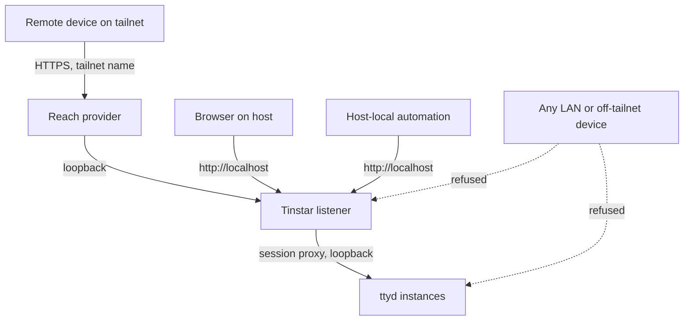
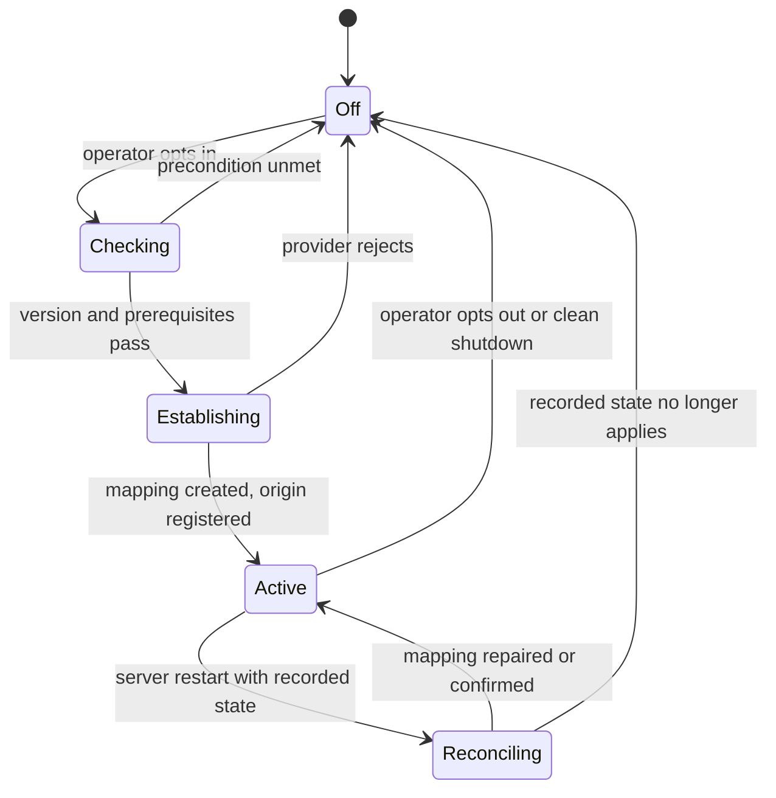
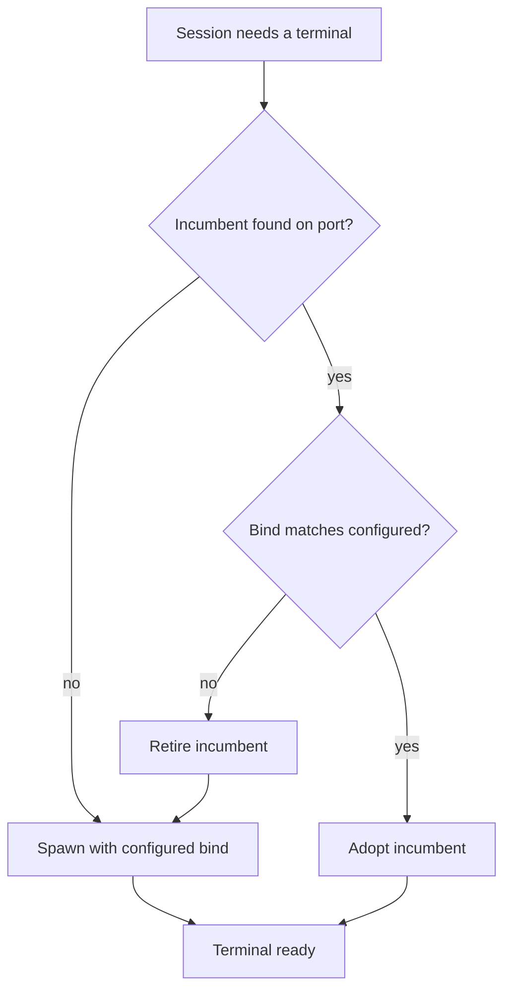

# Tailnet Remote Reach - Plan

## Goal Capsule

- **Objective:** Make Tinstar reachable from the operator's other devices over a tailnet, and close the ambient network exposure it ships with today. This plan owns containment and reach for a single-operator install; distributed session hosts are not active scope.
- **Product authority:** The Product Contract below. Multi-human rooms, invites, presence, and distributed session hosts are named as surrounding work, not requirements.
- **Stop conditions:** Stop and ask if the work would widen any bind beyond loopback, introduce a Tinstar-owned credential, or expose anything to the public internet. Those reverse decisions this plan rests on.
- **Execution profile:** Terminal containment lands first and is independently shippable. Reach is additive and opt-in; it cannot regress a host that never enables it.
- **Tail ownership:** Branch from `main`, one feature per PR, squash-merge. The pre-merge gate is in the Verification Contract.
- **Open blockers:** None.

---

## Product Contract

**Product Contract preservation:** changed — added R18–R21 and re-pointed R16's mechanism. Phase 1 research found four gaps that make R1, R2, and R10 unachievable as originally written; the additions were surfaced and confirmed before writing. R1–R15 and R17 keep their original meaning.

### Summary

Bind Tinstar and every ttyd to loopback, then put a reach provider in front of that bind so the operator can drive the full canvas — including live terminals — from any device on their tailnet. Tailnet membership is the authorization; Tinstar ships no credential of its own, and `localhost` on the host machine keeps working unchanged.

### Problem Frame

Tinstar binds every interface by default and has never had an authentication check. With no `--host` flag the server calls `listen(port)` with no address, which the code documents as "bind to the unspecified address (one listener, all interfaces)" (`src/server/standalone.ts:235-236`). Each ttyd is spawned with `-W` and no `-i`, `-c`, or `-O` (`src/server/sessions/backends/tmux.ts:2055-2061`), so every terminal is independently reachable and writable on its own port. CORS answers `Access-Control-Allow-Origin: *` when `TINSTAR_CORS_ORIGINS` is unset (`src/server/api/cors.ts:26-28`), and the WebSocket upgrade checks only that the run exists (`src/server/standalone.ts:183-198`). The absence of auth is deliberate and documented — "Tinstar has no human auth layer, the first release is explicitly one trusted local human" (`src/server/api/surfaceRoutes.ts:54-58`).

The consequence on a live install: on a host with `ufw` inactive, the API and all three ttyd ports answered `200` on both the LAN address and the tailnet address. Anyone routing to that host has an unauthenticated writable shell as the operator, with their git credentials and agent tokens in reach. Nothing in the product says so.

Meanwhile the operator cannot get the thing they actually want. Per-session remote driving is already solved by provider-native surfaces — Claude remote control and Codex remote — so the gap is not "nudge one agent." It is the canvas: which of several agents needs attention, what is wedged, what is done. Today that requires being at the machine. Live terminals matter for one residual job the provider surfaces cannot do — Ctrl-C, a raw permission prompt, restarting a crashed CLI.

`docs/brainstorms/2026-07-21-multiplayer-tailscale-reach-requirements.md` reached compatible conclusions in July and is unbuilt: no corresponding plan exists in `docs/plans/`, and no Tailscale code exists in `src/` beyond a JSDoc hint. Nothing technical stalled it. One of its assumptions has since gone stale — its R7 assumes the server binds loopback and an adapter fronts it, which was never the running default.

### Key Decisions

- **A product feature, not a firewall recipe.** (session-settled: user-directed — chosen over documenting `ufw` rules plus `tinstar install-service`: the recipe leaves ttyd exposed by default and puts the fix on every operator instead of in the product.) Governs R1, R2, R3.
- **Loopback by default, reversing the current all-interfaces bind.** Widening becomes an explicit act rather than the state you get by doing nothing. Governs R1, R2.
- **Tailnet membership is the authorization boundary; Tinstar ships no credential.** Delegating buys real HTTPS and an attested caller identity while adding no auth surface to maintain in perpetuity. Governs R9.
- **Reach is a provider port with exactly one adapter shipped.** Keeps a future non-tailnet path open without building it now. Governs R4, R5.
- **Live terminals stay in the remote surface.** They cover the wedged-agent case that provider-native remote control cannot reach. Governs R10.
- **Localhost is an invariant, not a configuration.** The codebase already treats it as one — `src/server/standalone.ts:243-250` force-adds `127.0.0.1` whenever an explicit host is named, citing host-local hooks. Governs R11, R12, R13.
- **Single operator, several devices; no identity model.** Distinct principals, membership, and audit are what the rooms and presence brainstorms are for; adopting any of it here would import a user model this install has no use for.

<!-- ce-section: work-relationships -->
### How This Work Fits Together

This plan owns one area: containment plus reach for a single-operator install. The breakdown below is the current understanding, not a committed roadmap; a later plan may revise, split, merge, or discard any of it.

- Remote as a first-class mode — mobile layout, desktop-app origin wiring, richer at-a-glance surfaces.
  - Depends on this plan for a stable remote origin and a working HTTPS context.
  - Can proceed independently of any identity work. `docs/brainstorms/2026-07-21-mobile-mode-requirements.md` states mobile ships with zero dependency on identity, rooms, or invite links.
- Multi-human access — rooms, invites, presence, per-participant viewport.
  - Depends on this plan only for reach; its access model is a separate decision.
  - Shares the reach-provider port defined here, which is why that port stays abstract.
  - Still to decide: whether a Tinstar-issued token ever ships, or tailnet membership remains the only boundary.
- Distributed session hosts — one canvas backing runs on more than one machine.
  - Depends on the session proxy resolving its target from a host-and-port pair (R17), which this plan delivers.
  - Enabled by NATS rather than by anything else in this plan: `src/server/nats/nats-manager.ts` already skips spawning a local broker and uses an external one when `NATS_URL` is set, and the subject scheme in `docs/nats-agent-channels.md` carries no host token.
  - Still to decide: whether a remote host runs a full Tinstar backend or a thin session agent.

### Actors

- A1. Operator at the host — a browser on the machine running Tinstar, reaching it at `localhost`.
- A2. Operator on a remote device — the same person on a laptop or phone joined to the tailnet.
- A3. Host-local automation — the cc-quota statusline shim, project `.claude/settings.json` hooks, `tinstar doctor`, `tinstar status`, agent skills, the built-in hand prompt, and `bin/apiBase.js`. Always loopback, never remote.
- A4. Reach provider — external to Tinstar; owns membership, TLS, and the reachable name.
- A5. Agent sessions — tmux-backed runs with a ttyd terminal, driven by A1 or A2 through the session proxy.

### Requirements

**Containment**

- R1. The Tinstar HTTP listener binds loopback only by default; binding any other address requires an explicit opt-in.
- R2. Every ttyd instance binds loopback only, and no ttyd port is reachable from a non-loopback address.
- R3. One bind setting governs both the Tinstar listener and every ttyd it spawns, so the two cannot drift apart.
- R18. A ttyd inherited from a previous server lifecycle is adopted only when its bind matches the configured bind; a mismatched instance is replaced rather than reused.
- R21. A ttyd accepts a WebSocket upgrade only when the request carries a header the session proxy injects, and every Tinstar code path that speaks to a terminal directly presents that header.
- R22. The session proxy refuses a WebSocket upgrade whose `Origin` is present and not allowed, so a page the operator merely visits cannot open a terminal.
- R23. Terminals are refused when the installed ttyd version is below the floor named in Dependencies / Assumptions, and the refusal names the installed and required versions.

**Reach**

- R4. Remote reach is provided by a named reach provider with an explicit lifecycle: establish a reachable URL, report status, and revoke on teardown.
- R5. Tailscale is the only reach adapter shipped, behind an interface that admits others without changing callers.
- R6. Reach is opt-in; starting the server never establishes it implicitly.
- R7. Reach state is written under `getConfigRoot()`, honoring `TINSTAR_CONFIG_HOME`.
- R8. Establishing reach never widens the server's bind; the adapter fronts the loopback listener.
- R9. Authorization is delegated to the reach provider's membership; Tinstar introduces no credential of its own.
- R10. A remote caller reaches the full product surface — canvas, prompts, diffs, telemetry, and live terminals through the session proxy.
- R19. Establishing reach registers the resulting origin as an allowed browser origin for the lifetime of that reach; revoking removes it.
- R20. Reach is refused when the provider version is below the patched release named in Dependencies / Assumptions, and the refusal names the required version.
- R24. Only one Tinstar instance per host holds the provider mapping. A second instance's establish is refused, naming the holder, and a startup flag lets a second instance run with reach disabled instead of failing.
- R25. The privilege grant permits exactly the serve invocation Tinstar issues and no other provider subcommand; it is installed during first-run setup and removed on teardown.

**Local invariants**

- R11. `http://localhost:<port>` on the host works in every bind and reach configuration.
- R12. Host-local API callers listed in A3 keep working unchanged, and no reach URL is written into the files or environment variables they read.
- R13. Terminals stay reachable from the host through the session proxy path.

**Proxy correctness**

- R16. The terminal wrapper reaches a terminal only through the session proxy, never by constructing a URL from a bare port (`public/terminal-wrapper.html:88-95`).
- R17. The session proxy resolves its target from a host-and-port pair instead of a hardcoded `localhost` template, with the IPv4 loopback literal the only host this work produces (`src/server/standalone.ts:125`, `:197`).

**Migration and diagnostics**

- R14. `tinstar doctor` reports the observed bind of the Tinstar listener and of every ttyd, and flags any listener reachable from a non-loopback address.
- R15. Release notes name the removal of default LAN reachability as a breaking change and give the command that restores remote access, and the server logs that change once on the first start after upgrade so an operator who never reads release notes still learns why their LAN URL stopped working.

### Key Flows

- F1. Remote glance and drive
  - **Trigger:** A2 opens the tailnet URL from a phone or laptop.
  - **Actors:** A2, A4, A5
  - **Steps:** The reach provider authenticates tailnet membership and terminates TLS; Tinstar serves the canvas over the loopback listener; A2 reads run status, sends a prompt, and opens a terminal on a wedged run through the session proxy.
  - **Outcome:** A2 identifies which run needs attention and unsticks it without being at the host.
  - **Covered by:** R8, R9, R10, R19, R21
- F2. Establish reach
  - **Trigger:** The operator opts in, once per host.
  - **Actors:** A1, A4
  - **Steps:** Tinstar checks the provider version and prerequisites; asks the provider to front the loopback listener; records the reach state under the config root; registers the resulting origin; reports the URL. The first request to that URL blocks while the provider issues a certificate.
  - **Outcome:** A stable remote URL exists; the server's bind is unchanged.
  - **Covered by:** R4, R6, R7, R8, R19, R20
- F3. Revoke reach
  - **Trigger:** The operator turns reach off, or Tinstar shuts down after establishing it.
  - **Actors:** A1, A4
  - **Steps:** Tinstar removes only its own provider mapping, clears its recorded reach state, and unregisters the origin.
  - **Outcome:** The remote URL stops resolving to Tinstar; no provider-side configuration is orphaned and no unrelated mapping is disturbed.
  - **Covered by:** R4, R7, R19
- F4. Reconcile reach after an unclean stop
  - **Trigger:** The server starts and finds recorded reach state.
  - **Actors:** A4
  - **Steps:** Tinstar reads the provider's current mapping set, repairs a mapping that points at the wrong port, removes one whose recorded state no longer applies, and re-registers the origin for a mapping it keeps.
  - **Outcome:** Provider state and Tinstar state agree, without stacking duplicate mappings across restarts.
  - **Covered by:** R4, R7, R19

### Acceptance Examples

- AE1. Reach provider unavailable
  - **Covers R4, R6.**
  - **Given** the reach provider is not installed or the node is not joined,
  - **When** the operator opts into reach,
  - **Then** the attempt fails with a message naming the unmet precondition, and the server continues running loopback-bound.
- AE2. Off-tailnet device
  - **Covers R1, R2.**
  - **Given** Tinstar is running with reach established,
  - **When** a device on the same LAN but outside the tailnet requests the Tinstar port or any ttyd port by IP,
  - **Then** the connection is refused because nothing is listening on that address.
- AE3. Host-local automation during reach
  - **Covers R11, R12.**
  - **Given** reach is established,
  - **When** the cc-quota statusline shim posts to `http://localhost:<port>/api/cc-quota/ingest`,
  - **Then** the post succeeds and the session's context meter updates.
- AE4. Remote terminal on a wedged run
  - **Covers R10, R13, R21.**
  - **Given** a run is waiting at a permission prompt,
  - **When** A2 opens that run's terminal from a remote device and sends a keystroke,
  - **Then** the keystroke reaches the tmux session and the run proceeds.
- AE5. Drifted bind
  - **Covers R14.**
  - **Given** a ttyd is listening on a non-loopback address,
  - **When** the operator runs `tinstar doctor`,
  - **Then** doctor names that listener and its address as a problem rather than reporting all checks passed.
- AE6. Insufficient privilege to establish reach
  - **Covers R4, R6.**
  - **Given** the operator lacks the privilege the reach provider requires to change its serving configuration,
  - **When** they opt into reach,
  - **Then** the attempt fails naming the privilege as the unmet precondition and the escalation step that fixes it, and the server continues running loopback-bound. The message never directs the operator at the provider's daemon-wide operator grant, which KTD7 rejects.
- AE7. Terminal inherited from a previous lifecycle
  - **Covers R18.**
  - **Given** a ttyd left running by a prior server version is bound to all interfaces,
  - **When** the server restarts and reattaches that session,
  - **Then** the inherited process is not adopted, a replacement is spawned with the configured bind, and the session's terminal keeps working.
- AE8. Desktop app reaching a tailnet-hosted backend
  - **Covers R19.**
  - **Given** reach is established and the desktop app is pointed at the backend's reach URL,
  - **When** its window issues a credentialed API request,
  - **Then** the request succeeds because the reach origin is registered — a case that genuinely fails when it is not. A browser opening the canvas at the reach URL is same-origin with the API and does not exercise this.
- AE9. Provider below the patched version
  - **Covers R20.**
  - **Given** the installed provider version is below the patched release,
  - **When** the operator opts into reach,
  - **Then** the attempt is refused, names the installed and required versions, and the server continues running loopback-bound.
- AE10. Host without IPv6
  - **Covers R1, R11.**
  - **Given** a host where the IPv6 loopback address cannot be bound,
  - **When** the server starts,
  - **Then** it binds the IPv4 loopback address, logs the skipped address, and serves normally rather than failing to start.
- AE11. Page the operator merely visits
  - **Covers R22.**
  - **Given** Tinstar is running and a session has a terminal,
  - **When** a page on an unrelated origin opens a WebSocket to the session proxy's terminal path,
  - **Then** the upgrade is refused because the origin is not allowed, and no terminal traffic flows.
- AE12. Terminal binary below its floor
  - **Covers R23.**
  - **Given** the installed ttyd version is below the floor,
  - **When** a session tries to start a terminal,
  - **Then** it is refused naming the installed and required versions, rather than spawning a terminal whose bind flag may be ignored.
- AE13. Restart with reach enabled
  - **Covers R4, R6, R7.**
  - **Given** reach is enabled and the server is restarted cleanly,
  - **When** it comes back up,
  - **Then** the same reach URL works again without the operator opting in a second time, and no duplicate mapping was created.
- AE14. Second instance on the same host
  - **Covers R24.**
  - **Given** one instance already holds the provider mapping,
  - **When** a second instance on the same host starts with reach enabled,
  - **Then** its establish is refused naming the holder, and starting it with the reach-disabled flag succeeds normally.
- AE15. Unattended revoke with no operator present
  - **Covers R4, R25.**
  - **Given** reach is active and the grant is installed,
  - **When** the server is stopped by the service manager with no terminal attached,
  - **Then** the mapping is removed without prompting, and if the grant is missing the failure is named in the log rather than passing silently.

### Success Criteria

- From a phone on the tailnet, the operator can tell which of several running agents needs attention and unstick it, without returning to the host.
- With Tinstar running, no port it owns answers from any address outside loopback and the tailnet — verifiable by scanning the host's LAN address.
- Nothing that worked at `localhost` before this change needs reconfiguring after it.
- Upgrading an existing install closes the terminal exposure without requiring the operator to restart sessions by hand.

### Scope Boundaries

- Multi-human access — rooms, invites, membership, per-participant viewport. Covered by the July brainstorms; not started here.
- Presence and co-driving semantics. Out; a single operator on several devices needs no concurrent-editor model.
- Distributed session hosts. Named as direction in How This Work Fits Together; only R17 builds toward it.
- Public-internet exposure, including Tailscale Funnel. Out — the tailnet is the boundary, and widening it would make R9's delegation unsound. Funnel also carries no caller identity and is the exposure surface of the provider's own denial-of-service advisory.
- A Tinstar-issued token or any login. Deferred; R5's provider interface is what keeps it reachable later.
- Mobile-specific layout. Separate work; this plan makes the remote origin exist, not the small-screen experience.
- HTTPS by any path other than the reach provider. Out — self-managed certificates are a maintenance burden the provider absorbs.
- Per-device authorization tiers (a read-only phone versus a writable laptop). Out; tailnet membership cannot express it and this install does not need it.

#### Deferred to Follow-Up Work

- Replacing `http-proxy`. It was last published in 2020, carries 500+ open issues, and emits a Node deprecation warning on load, but no advisory forces the change and mixing a library migration into a bind-surface change would make the security diff unreviewable. The maintained fork's stated motivation — socket leaks and uncatchable errors in the WebSocket path — describes surfaces Tinstar exercises, so this is worth its own plan.
- The Vite dev server's bind (`vite.config.ts:48-50` sets `host: true` and `allowedHosts: true`). Out of this plan's production-listener scope, and `docs/running-on-windows-wsl.md:205` documents a workflow that relies on it. Needs its own decision.
- Cryptographic peer attestation via the provider's TLS-terminated TCP mode. It would give a real tailnet source address instead of trusted headers, but costs the identity-header injection and adds PROXY-protocol parsing.

### Dependencies / Assumptions

- The host has the reach provider installed and its node joined, with a stable name for the operator's devices to use.
- The reach provider proxies WebSocket upgrades end to end, including binary frames. Verified on 2026-08-05 against Tailscale **1.98.4**: `tailscale serve --bg 5273` fronts `http://127.0.0.1:5273`, and a terminal upgrade through the resulting HTTPS name returned `101 Switching Protocols` with the `tty` subprotocol negotiated and ttyd's opening frames byte-identical to the loopback baseline. **This evidence sits below the version floor the plan enforces.** The patched release changes the Serve HTTP request path — that is what TS-2026-008 fixes — and the upgrade traverses the same path, so the result is not transitive. U8 re-runs this verification at or above the floor before the adapter is considered done.
- **Minimum provider version is Tailscale 1.98.9.** Bulletins TS-2026-005, TS-2026-007, and TS-2026-008 are all fixed in 1.98.9; TS-2026-008 pins a CPU core indefinitely from a single malformed HTTP request to a node running Serve, reachable from any tailnet peer. Verified against Tailscale's published bulletin index on 2026-08-05.
- **Minimum ttyd version is 1.7.4.** The containment guarantee rests entirely on ttyd's `-i` and `-H` flags; ttyd is an operator-installed prerequisite whose version is arbitrary. On a build lacking either flag, spawn dies or the flag is ignored and terminals stay world-reachable — the exact exposure this plan closes — with no refusal and no failing check. `bin/doctor.js` already reads the ttyd version and reports it as informational; U10 gates on it.
- **The tailnet is assumed to be single-user.** Every member is one of the operator's own devices. This design is sound only under that assumption: default provider ACLs let any member reach any peer, so on a shared tailnet the plan relocates the exposure rather than closing it. No check enforces this — it is a stated precondition, and adding a member changes the trust model.
- **Provider mutations must run unattended.** Establish happens once with the operator present, but revoke runs at shutdown and repair runs at boot, both with nobody to answer a prompt. The escalation is therefore a persistent, non-interactive, argument-scoped grant — never an interactive elevation. Read-only provider status queries need no elevation at all.
- The first HTTPS request to a newly established reach URL blocks while the provider issues a certificate, long enough to exceed a ten-second client timeout. Subsequent requests settle to tens of milliseconds. Certificate issuance is rate-limited upstream, so issuance is attempted once and surfaced, never retried in a loop.
- MagicDNS and HTTPS certificates are tailnet-wide admin settings, not device settings. A first-run check must name them, because a node with both off fails to serve with no local cause.
- ttyd can be constrained to loopback without patching. Verified against ttyd 1.7.4 by observation, not by reading the help text:
  - `-i` accepts an **IP address literal** as well as an interface name or a unix socket path. `ttyd -i 127.0.0.1 -p <port>` was observed listening on `127.0.0.1:<port>` only, answering `200` on loopback and refusing the host's LAN address. The help text documents only the interface-name and socket-path forms, so the literal form is verified behavior rather than documented behavior.
  - `-H` is **not upgrade-scoped — it gates every HTTP request.** With `-H X-Tinstar-Proxy`, a plain `GET /` returns `407` without the header and `200` with it; `/token` likewise returns `407`. Any Tinstar code path that speaks to ttyd directly must present the header, not only the proxy.
  - Whether `-H` also rejects a raw WebSocket upgrade lacking the header is **not yet verified**. U6 proves it against a live process rather than a mock.
- Identity headers injected by the provider are stripped-and-replaced on the inbound edge, so a tailnet peer cannot spoof them. They are **not** attested from Tinstar's side: after loopback binding every request appears to originate locally, so any local process can forge them. The stated trust boundary is "no untrusted local user or process on the host."
- The operator accepts losing LAN reachability. This is the intended outcome, not a side effect.
- No external consumer is *known* to depend on today's wide bind — but the package is published and its documented onboarding is `npx tinstar`, so this cannot be asserted. R15 compensates at runtime rather than relying on a release note alone.

### Outstanding Questions

**Resolve Before Planning**

- None.

**Deferred to Planning**

- Whether the narrow privilege escalation for enabling reach has a workable equivalent on macOS, where the provider uses a platform auth token rather than the operator model. Linux is the shipping target; the macOS path may end up documented-manual.
- Whether reconcile-on-start should remove a provider mapping it does not recognize, or leave it and warn. Leaving it is safer for an operator who configured their own mapping by hand.

### Sources / Research

- `docs/brainstorms/2026-07-21-multiplayer-tailscale-reach-requirements.md` — reach-provider port, "reachability is not authorization," opt-in per scope, adapter state under `getConfigRoot()`. Unbuilt; its R7 loopback assumption is stale. Its open question on which provider surface to use is answered here: serve, never Funnel.
- `docs/brainstorms/2026-07-21-multiplayer-rooms-and-invites-requirements.md` — "link, not login"; the token as credential. Unbuilt; the source of the deferred token option.
- `docs/solutions/conventions/guest-env-boundary.md` — why dashboard HTTP config is withheld from spawned guests, and therefore why the bind cannot reach ttyd by inheritance.
- `docs/solutions/conventions/agent-skill-backend-url-env-var.md` — the dependency surface behind R12: agent skills, the built-in hand prompt, and `bin/apiBase.js` all resolve to the loopback fallback.
- `docs/solutions/conventions/verify-a-guard-by-breaking-it.md` — the vacuous-pass failure mode a bind test falls into.
- `docs/solutions/documentation-gaps/context-meter-dark-statusline-hook-never-installed.md` — the shape doctor checks take for state Tinstar does not own.
- `src/server/standalone.ts` — bind normalization and the all-interfaces default (`:235-250`), listener loop and rollback (`:252-293`), session proxy targets (`:125`, `:197`), upgrade handling (`:183-198`), host file write (`:299`), CLI parsing (`:330-340`).
- `src/server/sessions/backends/tmux.ts` — the single ttyd spawn (`:2050-2064`), incumbent inspection and matching (`:1503-1538`, `:1780-1808`), reattach adoption (`:1246-1255`), port probe (`:289-298`), health check (`:2690`), the existing module-level setter pattern (`:301-320`).
- `bin/tinstar.js:305-315` — the second, independent `--host` parser that must stay in step with the server's.
- `bin/apiBase.js` — the only consumer of the `server.host` file; backs every `tinstar` subcommand.
- `src/server/api/cors.ts:26-28` — wildcard-when-empty, and the credentialed-origin echo that makes R19 necessary.
- `src/server/api/browser-widget-url.ts` — the hardcoded self-embed origin set a reach URL is absent from.
- `src/plugins/browser/src/BrowserPrimitive.tsx:314-317` — the existing precedent for R16: always proxy so the iframe works under a remote hostname.
- `src/server/infra/supervisor.ts`, `src/server/observability/codex-otel.ts` — the supervised-child pattern that does not fit a reach adapter, and the state-file pattern that does.
- `bin/tinstar/commands/service.js` — the shipped systemd unit that already binds a tailnet IP and builds a CORS allowlist at install time; the migration surface for R15.
- `src/uuid.ts:5-6` — why a real HTTPS origin matters: `crypto.randomUUID()` is secure-context-only and throws on plain HTTP.
- Tailscale security bulletins (TS-2026-005, TS-2026-007, TS-2026-008) — all fixed in 1.98.9; verified against the published index.

---

## Planning Contract

### Key Technical Decisions

- KTD1. **Terminals bind the IPv4 loopback literal via the interface flag, not a unix socket.** (session-settled: user-approved — chosen over a unix domain socket: the socket removes the port that four working mechanisms key on, and the interface literal is portable where an interface name is not.) Governs R2.
- KTD2. **The bind address reaches the terminal spawner through a module-level setter applied once at boot.** Mirrors the existing port-window setter; inheritance is unavailable because dashboard HTTP config is withheld from guests, and threading through spawn options would touch every restart path. Governs R3.
- KTD3. **IPv6 loopback is best-effort.** The listener loop rolls back every listener when one fails, so an unconditional second address would stop an IPv6-disabled host from booting; address-family errors are tolerated and address-in-use stays fatal so port fallback survives. Governs R1, R11.
- KTD4. **The reach adapter keeps a state file and reconciles on start; it is not a supervised child.** (session-settled: user-approved — chosen over owning a foreground provider process: background configuration survives reboot, at the cost of repairing drift after a crash.) Governs R4, R7.
- KTD5. **Teardown removes only Tinstar's own mapping.** The provider's reset subcommand wipes the node's entire serving configuration, including mappings the operator created by hand. Governs R4.
- KTD6. **Provider integration shells out to the provider CLI and reads machine-readable status.** Its local socket API is explicitly unstable for third parties and platform-specific; the CLI is the supported surface. Governs R5.
- KTD7. **Privilege comes from a sudoers drop-in scoped to the single serve invocation, installed at first-run setup and removed on teardown.** (session-settled: user-directed — chosen over the provider's operator grant and over documented-manual enablement: the operator grant confers control of the whole daemon and is the pivot in one of the advisories this plan gates on, while manual enablement cannot clean up at shutdown or repair at boot.) The rule permits no other subcommand and no wildcard paths, so its blast radius is serve-shaped rather than daemon-shaped. Governs R4, R24.
- KTD8. **Terminals gate on a proxy-injected header, and the proxy itself enforces the `Origin` check.** The header alone does not close the browser path — a hostile page reaches the *proxied* hop, and the proxy injects the header on its behalf; verified, an upgrade carrying a foreign `Origin` currently returns `101`. The header's job is narrower than first stated: it stops a direct hit on the terminal port. ttyd's own origin-check flag is not used because it breaks under proxy host rewriting, and its basic-auth flag surfaces a prompt inside the iframe. Governs R21, R22.
- KTD14. **The header gate applies to every Tinstar-to-terminal hop, not just the proxy.** The flag gates all HTTP, so the readiness probe must present it too or no session ever reports a working terminal. Governs R21.
- KTD15. **ttyd is version-gated the same way the reach provider is.** Both are operator-installed externals carrying a containment guarantee; gating one and not the other was an asymmetry, not a decision. Governs R23.
- KTD16. **The mapping is self-identifying, and a second instance refuses rather than overwrites.** (session-settled: user-directed — chosen over last-writer-wins with a warning: the config-root override makes second backends a supported configuration, so a silent takeover would redirect the operator's remote URL to a rehearsal harness.) The state file carries a per-instance discriminator derived from the config root, and revoke and reconcile match on it so one instance can never tear down another's mapping. Governs R24.
- KTD9. **The session proxy target is pinned to the IPv4 loopback literal rather than a resolvable name.** Removes the resolution ambiguity and the per-request fallback penalty, and is the change that makes the target a host-and-port pair. Governs R13, R17.
- KTD10. **Identity headers are recorded, never trusted as attested.** Governs R9.
- KTD11. **The terminal wrapper routes through the backend proxy rather than deriving a hostname.** (session-settled: user-approved — chosen over deriving the host from the API base: a loopback-only terminal port is not reachable from a remote browser at all, so host derivation cannot work.) Governs R16.
- KTD12. **Reach is refused below the patched provider version rather than warned.** (session-settled: user-approved — chosen over a warning: the advisories include an unauthenticated denial of service against the exact surface this feature turns on.) Governs R20.
- KTD13. **The proxy library is not replaced in this change.** No advisory forces it, and a library migration would make the security diff unreviewable.

### High-Level Technical Design

**Reach lifecycle.** The adapter owns four transitions. Reconcile is the one that makes an unclean stop recoverable.

**Terminal bind and adoption.** The spawn path and the adoption path are separate; only covering the first leaves inherited terminals wide open.

### Assumptions

- A release note plus a one-time runtime warning is sufficient migration; no deprecation window is needed. This is weaker than the original assumption that only the operator's machines are affected, which the package's public distribution contradicts.
- Read-only provider status queries remain unprivileged, so doctor and reconcile can inspect provider state without escalation.

### Sequencing

Terminal containment lands before reach. It is the larger share of the exposure, is independently testable, and is reversible on its own. Reach is additive: a host that never opts in is unaffected by U7–U10 and U12. U11 is not reach-side — it carries the breaking-change notice and ships with the bind flip, because a migration note that arrives in a later release is worse than no release split at all.

---

## Implementation Units

| U-ID | Title | Key files | Depends on |
|---|---|---|---|
| U1 | Terminals bind loopback | `src/server/sessions/backends/tmux.ts` | — |
| U2 | Refuse mismatched inherited terminals | `src/server/sessions/backends/tmux.ts` | U1 |
| U3 | Server binds loopback by default | `src/server/standalone.ts`, `bin/tinstar.js` | U1 |
| U4 | Origin check, proxy target, upgrade hardening | `src/server/standalone.ts` | — |
| U5 | Terminal wrapper routes through the proxy | `public/terminal-wrapper.html`, `src/widgets/primitives/TerminalPrimitive.tsx`, `src/components/PromptComposer/PromptComposer.tsx` | U1 |
| U6 | Terminal upgrade header gate | `src/server/sessions/backends/tmux.ts`, `src/server/standalone.ts` | U1, U4 |
| U7 | Reach provider port and state | `src/server/reach/` | U3 |
| U8 | Tailscale reach adapter | `src/server/reach/` | U7 |
| U9 | Reach origin registration | `src/server/api/cors.ts`, `src/server/reach/` | U7, U8 |
| U10 | Bind and reach diagnostics | `bin/doctor.js` | U1, U3, U8 |
| U11 | Breaking-change notice | `src/server/standalone.ts`, `docs/` | U3 |
| U12 | Reach migration | `bin/tinstar/commands/service.js`, `docs/` | U8, U11 |

### U1. Terminals bind loopback

- **Goal:** Every newly spawned ttyd binds the loopback address instead of all interfaces.
- **Requirements:** R2, R3
- **Dependencies:** none
- **Files:** `src/server/sessions/backends/tmux.ts`, `src/server/index.ts`, `src/server/sessions/__tests__/ttyd-reclaim.test.ts`
- **Approach:**
  1. Add a module-level bind-address setter beside the existing interactive-port-window setter, with a loopback default so tests that do not set it are unaffected (KTD2).
  2. Read it inside the single ttyd spawn helper and append the interface argument (KTD1).
  3. Call the setter once at backend init, from the same boot site that sets the port window.
- **Patterns to follow:** the existing port-window setter (module-level `let`, exported setter and getter, null-safe default) at `src/server/sessions/backends/tmux.ts:301-320`, wired at `src/server/index.ts:1166`.
- **Test scenarios:**
  - Spawn args contain the interface flag with the loopback literal when the setter holds the default.
  - Spawn args reflect a non-default address after the setter is called with one.
  - Restart-after-exit and reattach spawn paths produce the same interface argument as the initial spawn.
  - The port probe and the spawned bind agree: a port free on loopback is usable by the spawned terminal.
  - A real spawned terminal's observed listening socket is loopback-only, and the host's non-loopback address refuses. An args assertion cannot tell an accepted bind address from a silently ignored one, so this scenario runs against a live process.
- **Verification:** With a session running, the terminal's listening socket shows a loopback address only; a request to the host's LAN address on that port is refused.

### U2. Refuse mismatched inherited terminals

- **Goal:** A ttyd left running by a previous server lifecycle is adopted only if its bind matches; otherwise it is retired and replaced.
- **Requirements:** R18, R2
- **Dependencies:** U1
- **Files:** `src/server/sessions/backends/tmux.ts`, `src/server/index.ts`, `src/server/sessions/__tests__/ttyd-reclaim.test.ts`
- **Approach:**
  1. Extend the incumbent record with the bind address parsed from the same process-args string the tmux target is already parsed from, keeping both parsers adjacent so they cannot drift.
  2. Make incumbent matching require the expected bind, so a mismatch falls through to the existing respawn path.
  3. Apply the same check on the boot reattach path, not only the per-session reattach.
- **Execution note:** Add the parser test before changing the matcher — the parse is where a silent mismatch would hide.
- **Patterns to follow:** the existing single-source parser doc-comment discipline at `src/server/sessions/backends/tmux.ts:1521-1538`.
- **Test scenarios:**
  - An incumbent whose args carry the expected bind is adopted.
  - An incumbent with no interface argument is refused.
  - An incumbent bound to a different address is refused.
  - A refused incumbent results in a replacement spawn, and the session's terminal is serving afterward.
  - The args parser returns null rather than throwing on an unexpected argument shape.
- **Verification:** Start a terminal, replace the server process without killing the terminal, restart, and confirm the terminal is respawned with the loopback bind rather than adopted.

### U3. Server binds loopback by default

- **Goal:** With no explicit host, the server binds only the loopback addresses, and still starts on hosts without IPv6.
- **Requirements:** R1, R11, R12, R3
- **Dependencies:** U1
- **Files:** `src/server/standalone.ts`, `bin/tinstar.js`, `tests/server/bind.test.ts`
- **Approach:**
  1. Extract host normalization into an exported pure function so the default, the explicit-host path, and the localhost force-add are testable without booting a server.
  2. Default the empty case to both loopback addresses. Leave the localhost-coverage check keyed on the IPv4 literal: an explicit IPv6-loopback host must still gain the IPv4 address, because the CLI's base-URL builder does not bracket IPv6 and would emit an unparseable URL.
  3. Make the IPv6 listener best-effort in the listener loop: tolerate address-family and address-unavailable errors, keep address-in-use fatal so the existing port-fallback path is unchanged (KTD3).
  4. Mirror the default into the CLI's own host parser so both entry points agree.
  5. Keep the IPv4 literal as the value written to the host file, since every `tinstar` subcommand builds its base URL from it.
- **Patterns to follow:** the existing pure-and-exported helpers used for testability elsewhere in the server (`shouldRestartTtyd`, `resolveCorsHeaders`).
- **Test scenarios:**
  - No host given resolves to both loopback addresses.
  - An explicit external host still gains the IPv4 loopback address.
  - An explicit IPv6 loopback host still gains the IPv4 loopback address, and the host file records the IPv4 literal.
  - A wildcard host is left untouched.
  - A simulated address-family failure on the IPv6 address leaves the IPv4 listener serving.
  - A simulated address-in-use failure still triggers the existing retry-then-increment path.
  - Bound addresses observed from the listeners are exactly the loopback pair.
  - A connection to a non-loopback loopback-range address is refused; this scenario is skipped on platforms that assign only one loopback address.
  - The host file and the loopback fallback host-local callers read are unchanged when reach is active — no reach URL reaches either.
- **Execution note:** Verify each bind guard by reverting the default to all-interfaces and confirming that specific test fails for that specific reason before restoring.
- **Verification:** `http://localhost:<port>`, `http://127.0.0.1:<port>`, and the host's LAN address are exercised: the first two succeed, the third is refused.

### U4. Pin proxy target, harden upgrade path

- **Goal:** The session proxy refuses cross-origin upgrades, resolves a host-and-port target, and survives a client dying mid-handshake.
- **Requirements:** R22, R17, R13, R10
- **Dependencies:** none
- **Files:** `src/server/standalone.ts`, `src/server/api/__tests__/proxyResolve.test.ts`
- **Approach:**
  1. Reject an upgrade whose `Origin` is present and not allowed, before proxying. Absent `Origin` passes — that is a non-browser client. The allowed set is the same one U9 maintains, so a registered reach origin is admitted without a second list (KTD8).
  2. Replace the two hardcoded target templates with a resolved host-and-port pair, with the IPv4 loopback literal the only host produced here (KTD9). The resolver rejects a non-loopback host, so it cannot later become a request-forgery pivot.
  3. Attach an error handler to the client socket in the upgrade handler before proxying, so a reset during the handshake is absorbed rather than thrown uncaught.
  4. Destroy the client socket in the existing proxy error handler instead of only logging; leave its response-versus-socket discrimination alone, which is correct for the upgrade path.
- **Test scenarios:**
  - An upgrade carrying a foreign `Origin` is refused before any proxying happens.
  - An upgrade with no `Origin` is admitted.
  - An upgrade carrying a loopback origin, and one carrying a registered reach origin, are both admitted.
  - The resolved target uses the loopback literal and the run's port.
  - The resolver refuses a non-loopback host rather than proxying to it.
  - A run with no port yields no target rather than a malformed one.
  - A client socket destroyed mid-handshake does not produce an unhandled error, and the process survives.
  - A proxy error on the upgrade path destroys the client socket.
  - An HTTP request through the session proxy still reaches the terminal after the target change.
- **Verification:** Kill a client mid-upgrade in a loop; the server stays up and keeps serving other sessions.

### U5. Terminal wrapper routes through the proxy

- **Goal:** The terminal wrapper never constructs a URL from a bare port, so terminals work from a remote origin.
- **Requirements:** R16, R10
- **Dependencies:** U1
- **Files:** `public/terminal-wrapper.html`, `src/widgets/primitives/TerminalPrimitive.tsx`, `src/components/PromptComposer/PromptComposer.tsx`, `src/widgets/primitives/__tests__/TerminalPrimitive.test.tsx`
- **Approach:**
  1. Remove the bare-port branch and route every terminal through the session-proxy path.
  2. Give **both** wrapper-URL construction sites a session-scoped source instead of a port. The composer is the non-obvious one: it always emits a session parameter, but an undefined session id renders as an empty string, which the wrapper treats as falsy and falls through to the port branch. Gate its terminal tab on the session id rather than the port.
- **Patterns to follow:** the browser widget's always-proxy rule and its stated reason at `src/plugins/browser/src/BrowserPrimitive.tsx:314-317`.
- **Test scenarios:**
  - A wrapper given a session renders the proxied path.
  - A wrapper given only a port does not produce an absolute host-and-port URL.
  - Neither construction site emits a port parameter.
  - A composer terminal opened before its session id resolves does not fall through to a bare-port URL.
- **Verification:** From a remote browser with reach established, a terminal loads and accepts input.

### U6. Terminal upgrade header gate

- **Goal:** A terminal accepts traffic only from Tinstar, and every Tinstar path that speaks to it presents the header.
- **Requirements:** R21
- **Dependencies:** U1, U4
- **Files:** `src/server/sessions/backends/tmux.ts`, `src/server/standalone.ts`, `src/server/sessions/__tests__/ttyd-reclaim.test.ts`
- **Approach:**
  1. Add the auth-header flag to the spawn args, naming a Tinstar-specific header (KTD8).
  2. Inject that header on both the HTTP and upgrade proxy passes via the shared proxy header option.
  3. **Thread the same header into the readiness probe** and through the surface-verification helper that calls it (KTD14). The flag gates all HTTP, so an unauthenticated probe returns `407`, which reads as not-ok — without this step every terminal fails readiness, incumbent adoption breaks, and no session publishes a working terminal, while unit tests that only assert the upgrade path still pass.
  4. Strip provider identity headers on the same hop so they are not forwarded to the terminal.
- **Execution note:** Land the probe change in the same commit as the spawn flag. Either alone is a broken state.
- **Test scenarios:**
  - Spawn args carry the auth-header flag with the expected header name.
  - Both proxy passes inject the header.
  - The readiness probe presents the header and succeeds against a header-gated terminal.
  - A readiness probe without the header is refused, proving the gate is live rather than vacuous.
  - Provider identity headers present on an inbound request are absent on the proxied request.
  - A direct loopback upgrade without the header is rejected — run against a live terminal process, not a mock, because whether the gate covers the upgrade path is unverified.
  - A terminal upgrade through the proxy still negotiates its subprotocol.
- **Verification:** A session starts, reports ready, and serves its terminal through the proxy; a handshake straight to the terminal port without the header fails.

### U7. Reach provider port and state

- **Goal:** A provider-neutral reach interface with persisted state and lifecycle wiring, with no adapter behavior yet.
- **Requirements:** R4, R6, R7, R8, R12
- **Dependencies:** U3
- **Files:** `src/server/reach/`, `src/server/index.ts`, `src/server/reach/__tests__/`
- **Approach:**
  1. Define the interface as establish, status, and revoke, plus a reconcile entry point.
  2. Persist **two** things, not one: the operator's preference (reach on or off) and the live mapping record. Revoke clears the mapping; it never clears the preference. Otherwise a clean shutdown erases the operator's opt-in and reach silently fails to come back after any restart or reboot — which would invert the durability KTD4 chose this shape for.
  3. Persist both as JSON under the config root, following the state-file shape used by the local telemetry receiver rather than the supervised-child machinery, which has no process to own (KTD4). Never write the reach URL where host-local callers read their base URL (R12).
  4. Drive establish and reconcile from the listener's post-bind callback, taking the **resolved** port. The listener can fall back to a higher port when the configured one is busy; fronting the configured port would leave the remote URL pointing at nothing while `localhost` works fine.
  5. Register revoke-on-clean-shutdown in the existing single shutdown block, and re-establish on start when the preference is on. R6 holds — establishment still follows an explicit opt-in; the preference *is* that opt-in, persisted.
  6. Stamp the state with a per-instance discriminator derived from the config root, and match on it in revoke and reconcile so one instance never tears down another's mapping (KTD16). Accept a startup flag that runs the instance with reach disabled, so a second backend on the same host is usable rather than blocked (R24).
- **Patterns to follow:** `src/server/observability/codex-otel.ts` for the state-path plus start/stop shape; the shutdown registration block in `src/server/index.ts:829-846`.
- **Test scenarios:**
  - A newly constructed provider reports inactive and writes no state.
  - Establish then revoke leaves no residual state file content claiming an active mapping.
  - State survives a construct-persist-reconstruct cycle.
  - A malformed state file is treated as no state rather than throwing at boot.
  - Shutdown triggers revoke when a mapping is active and does nothing when it is not.
  - A clean shutdown clears the mapping but preserves the preference, and the next start re-establishes.
  - Turning reach off clears the preference, and the next start does not re-establish.
  - Establish uses the port the listener actually bound, not the configured one, after a port fallback.
  - Neither the host file nor any environment variable host-local callers read gains the reach URL.
  - A second instance's establish is refused, naming the holder, and its revoke never removes the first instance's mapping.
  - The reach-disabled startup flag brings an instance up normally with no provider interaction at all.
- **Verification:** Server starts and stops cleanly with reach never enabled; with reach enabled, a restart brings the same URL back without the operator re-opting-in.

### U8. Tailscale reach adapter

- **Goal:** The one shipped adapter fronts the loopback listener, refusing clearly when prerequisites are unmet.
- **Requirements:** R5, R8, R9, R20, R4, R12
- **Dependencies:** U7
- **Files:** `src/server/reach/`, `src/server/reach/__tests__/`
- **Approach:**
  1. Shell out to the provider CLI for mutations and read machine-readable status for reads (KTD6).
  2. Gate establish on a version check against the patched release, refusing with both versions named (KTD12).
  3. Check the tailnet-wide prerequisites and the privilege precondition before attempting, and name whichever is unmet. Probe the grant non-interactively — a check that would prompt is itself the failure mode, since revoke and repair run unattended.
  4. Attempt certificate pre-warm once; surface a provisioning state rather than retrying.
  5. Revoke by removing only Tinstar's own mapping (KTD5).
  6. Reconcile on start by comparing recorded state against the provider's current mapping set.
- **Test scenarios:**
  - Establish is refused when the provider binary is absent, naming the precondition.
  - Establish is refused below the patched version, naming installed and required versions.
  - Establish is refused when privilege is unavailable, naming the escalation step rather than the provider's daemon-wide operator grant.
  - Establish is refused when a tailnet-wide prerequisite is off, naming it.
  - A successful establish reports a URL and records state.
  - Revoke issues a scoped removal, never the reset form.
  - Reconcile repairs a mapping pointing at a stale port.
  - Reconcile leaves an unrecognized mapping in place and warns.
  - Two consecutive reconciles do not stack duplicate mappings.
  - Certificate provisioning failure surfaces as a named state and is not retried.
  - Establishing reach leaves the host file and the host-local base-URL environment byte-unchanged.
- **Verification:** With the provider present and **at or above the version floor**, establish yields a URL that serves the canvas from a second tailnet device, and the terminal upgrade through it returns `101` with the expected subprotocol and opening frames matching the loopback baseline. This re-runs the Dependencies verification on a supported version — the recorded evidence was gathered below the floor and does not carry forward.

### U9. Reach origin registration

- **Goal:** A browser loading the canvas from the reach URL can make credentialed API calls without hand-editing configuration.
- **Requirements:** R19, R10
- **Dependencies:** U7, U8
- **Files:** `src/server/api/cors.ts`, `src/server/reach/`, `tests/server/cors.test.ts`, `src/server/api/browser-widget-url.ts`
- **Approach:**
  1. Let the allowlist accept origins registered at runtime in addition to the environment-provided set. The header resolver already takes the allowlist as a parameter, so only its caller changes.
  2. Register on establish and unregister on revoke.
  3. Seed the allowlist at boot with the loopback origins and the desktop app's origins, so it is never empty and the wildcard branch is unreachable in normal operation. This matters most in the steady state this plan actually ships first: containment lands without reach, the allowlist would otherwise stay empty, and every origin — including any page the operator happens to visit — gets a wildcard that can read the full canvas API. Seeding also removes the trap where registering the first reach origin silently narrows the response for everyone else.
  4. Add the reach origin to the self-embed origin set so the recursive-embed guard keeps working remotely.
- **Test scenarios:**
  - A registered origin receives an explicit allow-origin header and the credentials header.
  - An unregistered origin receives neither.
  - Unregistering restores the prior behavior for that origin.
  - The environment-provided allowlist and registered origins coexist.
  - Registering the first origin does not strip the desktop app's access.
  - On a fresh install with reach disabled, an unknown origin receives no allow-origin header — the wildcard is gone.
  - Revoking the last registered origin returns to the seeded set, never to an empty allowlist.
  - The reach origin is recognized by the self-embed guard.
- **Verification:** From a remote browser on the reach URL, a credentialed API call succeeds and a Tinstar URL pasted into a browser widget is still recognized as self-embedding.

### U10. Bind and reach diagnostics

- **Goal:** `tinstar doctor` reports the observed bind of every listener Tinstar owns, the reach state, and both external version floors.
- **Requirements:** R14, R23, R2, R1
- **Dependencies:** U1, U3, U8
- **Files:** `bin/doctor.js`, `tests/cli/doctor.test.ts`
- **Approach:**
  1. Add a section covering the server listener, every terminal port, and reach state.
  2. Determine the bind by observing the live listener set rather than reading the host file, which is self-reported.
  3. Check for the provider binary on PATH and report reach as inactive rather than broken when it is absent.
  4. Report a non-loopback listener as a failure and name the address.
  5. Report both external versions against their floors — the terminal binary's and the reach provider's — and fail when either is below. Also report the date the provider floor was last verified, so a floor that has gone stale after a later advisory is visible in the same place a broken bind is; nothing else in the system would surface it.
- **Patterns to follow:** the batch check idiom and the missing/drifted/foreign reporting shape already used by the Claude Code integration section in `bin/doctor.js`; `tests/cli/` for bin-level tests.
- **Test scenarios:**
  - All-loopback listeners report clean.
  - A non-loopback terminal listener is reported as a failure naming the address.
  - Reach absent reports inactive, not failed.
  - A missing provider binary is reported as a PATH problem with the fix.
  - A terminal binary below its floor is reported as a failure naming both versions.
  - A provider below its floor is reported as a failure naming both versions.
  - The provider floor's verification date is reported.
  - Doctor completes and exits non-zero when a bind or version failure is present.
- **Verification:** Run doctor with a deliberately wide-bound terminal and confirm it is named; restore and confirm clean.

### U11. Breaking-change notice

- **Goal:** An operator who upgrades into the containment release learns why their LAN URL stopped working, and how to get remote access back today.
- **Requirements:** R15
- **Dependencies:** U3
- **Files:** `src/server/standalone.ts`, `docs/`, `README.md`, `tests/cli/bind-notice.test.ts`
- **Approach:**
  1. Log the bind change once on the first start after upgrade, naming the existing explicit-host opt-in as the interim restore path. This unit ships with the bind flip, not after it — a breaking change whose migration note arrives in a later release is the worst version of this rollout, and the reach command does not exist yet at this point in the sequence.
  2. Document the breaking change in the release notes with the same interim restore path.
  3. Note the inherited-terminal behavior so an operator understands why terminals restart once on upgrade.
- **Test scenarios:**
  - The notice fires once on the first start after the change and not on subsequent starts.
  - The notice names the explicit-host opt-in, not the reach command, which does not exist in this release.
- **Verification:** Upgrade a pre-change install, start once, and confirm the notice appears and the named opt-in restores LAN access.

### U12. Reach migration

- **Goal:** First-run setup installs the scoped grant, the shipped systemd unit stops conflicting with the new default, and the release notes gain the reach restore command.
- **Requirements:** R15, R25
- **Dependencies:** U8, U11
- **Files:** `bin/tinstar/commands/service.js`, `docs/`, `tests/cli/service-unit.test.ts`
- **Approach:**
  1. Install the privilege grant during first-run setup and remove it on teardown, scoped to the exact serve invocation with no wildcard permitting another subcommand or path (KTD7). Print what is being granted before writing it — this is a root-adjacent rule on a machine running autonomous agents, and it should never appear without the operator seeing it.
  2. Reconcile the generated unit with the new default: it currently pins a tailnet IP and builds a CORS allowlist at install time, both of which the reach adapter now owns.
  3. Append the reach restore command to the release notes, replacing the interim opt-in U11 documented.
- **Test scenarios:**
  - The installed grant permits the serve invocation and refuses every other provider subcommand.
  - Teardown removes the grant.
  - The grant's content is printed before it is written.
  - The generated unit no longer pins a tailnet address.
  - A unit generated before the change is detected and the operator is told to regenerate.
- **Verification:** Generate the unit on a clean config root and confirm the resulting invocation matches the new default.

---

## Verification Contract

| Gate | Command | Applies to |
|---|---|---|
| Type check (three projects) | `npm run typecheck` | all units |
| Ship build | `npm run build:all` | all units |
| Unit and integration tests | `npx vitest run --exclude='e2e/**'` | all units |
| End-to-end | `TINSTAR_FAST_SIM=1 npx playwright test` | U4, U5, U6 |

Environment-sensitive runs prefix with `env -u NODE_ENV`. Server-side tests must live under `src/server/**/__tests__/` or `tests/server/` — anywhere else loads a browser test environment.

Behavioral gates that no unit test proves:

- No non-loopback listener exists for the server port or any terminal port while Tinstar is running.
- A request to the host's LAN address on the server port and on a terminal port is refused from a second machine.
- A WebSocket upgrade to a session's terminal path carrying a foreign `Origin` is refused. This is verified against the running server, not a mock — it returns `101` today.
- After the header gate lands, a freshly created session reports ready and serves its terminal. This proves the readiness hop presents the header; a unit test asserting only the upgrade path passes while every session is broken.
- With reach enabled, a clean restart brings the same URL back with no second opt-in and no duplicate mapping.
- With reach established, a second tailnet device loads the canvas over HTTPS and its terminal upgrade negotiates the expected subprotocol.
- A hand-forged provider identity header on a loopback request is recorded and not treated as attested — this asserts the documented trust boundary rather than a prevention.
- After a hard kill of the server and a restart, reconcile converges to a single mapping rather than stacking duplicates.
- Each bind guard has been verified by reverting the bind and observing that specific test fail for that specific reason.

## Definition of Done

**Global**

- Every requirement is either implemented or explicitly deferred in Scope Boundaries.
- All Verification Contract gates pass, including the behavioral gates.
- `localhost` still works for every host-local caller named in A3, verified rather than assumed.
- A host that never enables reach shows no behavior change beyond the narrowed bind.
- Abandoned or experimental code from approaches that did not work out is removed, not left in the diff.
- The branch is cut from `main` and carries one feature.

**Per unit**

- U1, U2: terminals bind loopback on both the spawn and adoption paths; an inherited mismatched terminal is replaced.
- U3: the server binds the loopback pair by default and starts on a host without IPv6.
- U4: a foreign-origin upgrade is refused, the proxy target is a host-and-port pair that rejects non-loopback hosts, and a mid-handshake client death does not stop the process.
- U5: neither construction site emits a bare-port terminal URL.
- U6: a session still reports ready and serves its terminal, and a direct terminal hit without the injected header is rejected.
- U7, U8: reach establishes, reports, revokes, and reconciles; it survives a clean restart without a second opt-in; every refusal names its unmet precondition; the WebSocket path is re-verified at or above the version floor.
- U9: no origin receives a wildcard on a fresh install, and the desktop app still works once the allowlist is non-empty.
- U10: doctor names a non-loopback listener or an out-of-floor external version and exits non-zero.
- U11: the bind change announces itself once at runtime, naming a restore path that exists in that release.
- U12: the generated unit matches the new default and the release notes carry the reach restore command.
