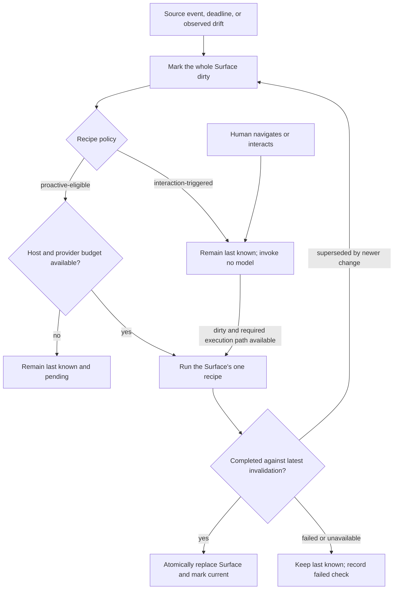
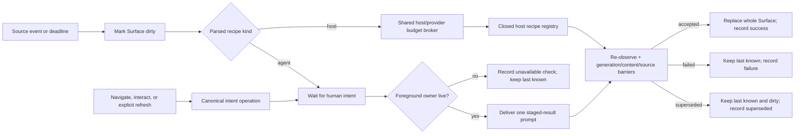
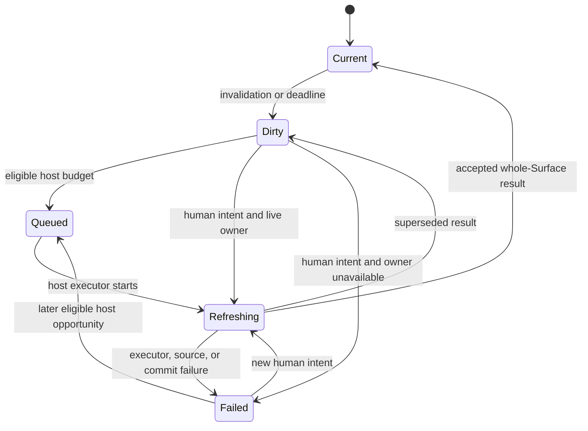
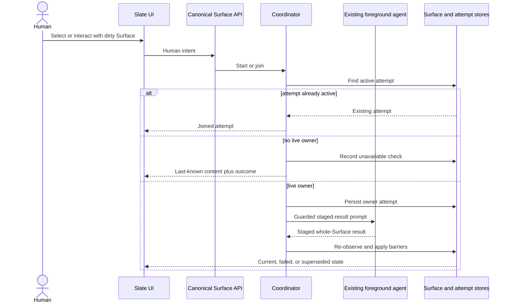

# Trusted Atomic Surface Refresh - Plan

## Goal Capsule

- **Objective:** Make the Slate trustworthy as the collaborative interface between humans and agents by keeping inexpensive Surfaces warm and refreshing expensive Surfaces only in response to discrete human intent.
- **Product authority:** This plan owns Surface refresh atomicity, scheduling policy, freshness presentation, and the prohibition on autonomous LLM refresh. Surface composition, A2UI authoring, and general managed-session lifecycle remain outside its active scope.
- **Execution profile:** Code change in seven ordered units. Remove refresh-created sessions first, then add the replacement host and foreground paths. Do not start or stop the user's Tinstar process during implementation unless the user asks.
- **Stop conditions:** Stop if any refresh path can still create a session or terminal, if proactive eligibility can be granted by untrusted author text, or if legacy active worker jobs cannot be reconciled without losing last-known Surface content.
- **Tail ownership:** The implementer owns migrations, diagnostics, authoring documentation, and the complete verification contract. This plan creates no recurring agent-watch or babysit obligation.
- **Open blockers:** None at product scope.

---

## Product Contract

### Summary

Each refreshable Surface has one recipe that replaces the Surface as a whole and produces one freshness result.
Machine-only recipes may refresh proactively within strict budgets, while expensive or LLM-backed recipes refresh once when a human navigates to or interacts with a dirty Surface.

### Problem Frame

The Slate is intended to replace the text scroll with a collaborative interactive surface where humans see and manipulate artifacts while agents read, reason about, and revise them.
That interface cannot replace the scroll while a Surface may silently describe a pending roadmap item that has landed or an open, failing PR that has merged green.

The previous automatic-refresh design made invalidation and repair nearly synonymous.
A matching event could queue managed refresh sessions across every affected Surface even when almost all content remained unchanged.
The measured result was 110 no-change refreshes among 121 completed jobs, alongside a session that accumulated 43 tmux panes.
Bounding concurrent workers limited simultaneous damage but did not remove the hidden fleet, repeated provider reads, or continuous LLM cost.

The opposite extreme is also insufficient.
Manual-only refresh makes every Surface another thing the human must distrust and nag.
The contract therefore distinguishes cheap machine work from expensive interpretive work without dividing a Surface into independently refreshed regions.

### Key Decisions

- **A Surface remains the atomic refresh boundary.** (session-settled: user-directed — chosen over refreshing machine facts and agent-written prose separately: composition belongs at the Slate level, not inside a Surface.) Governs R1-R5.
- **Refresh policy is cost-aware.** (session-settled: user-directed — chosen over making every recipe proactive or every recipe manual: inexpensive machine work can stay warm without paying interpretive costs.) Governs R6-R10.
- **LLM execution requires a discrete human action.** (session-settled: user-directed — chosen over visibility-, focus-, timer-, and invalidation-driven model calls: Tinstar remains open continuously, so ambient presence is not permission.) Governs R11-R14.
- **Last-known content remains visible.** (session-settled: user-directed — chosen over withholding a dirty Surface until refresh completes: old content is still real information when its age and check state are honest.) Governs R3, R4, R16-R18.
- **Agent-written refresh uses the existing foreground collaboration path.** Background refresh sessions are not a fallback when the foreground owner is unavailable. Governs R13 and R19.

### Actors

- A1. **Human collaborator:** Navigates among Surfaces, asks questions, edits artifacts, and supplies the discrete intent that may authorize an expensive refresh.
- A2. **Foreground agent:** Owns or collaborates on agent-written Surfaces within an existing interactive session.
- A3. **Tinstar host:** Tracks freshness, classifies refresh eligibility, enforces budgets, coalesces work, and presents current versus last-known state.
- A4. **External or local source:** Supplies repository, provider, process, deployment, or other facts that a recipe uses.

### Requirements

**Atomic Surface contract**

- R1. A refreshable Surface has exactly one declared refresh recipe, regardless of how many sources or kinds of content the recipe consults.
- R2. The recipe produces one candidate replacement for the whole Surface and one refresh outcome; independently refreshed subregions are separate Surfaces composed by the Slate.
- R3. Every Surface presents both the last-known result and the last check: what was known, when it became known, what was checked, when it was checked, and whether that check succeeded.
- R4. Dirty or failed-to-check content remains visible as last known and is never presented as current.
- R5. Machine-derived facts and agent-written interpretation inside one Surface change together through that Surface's recipe rather than through competing writers.

**Cost-aware scheduling**

- R6. Every recipe is either proactive-eligible or interaction-triggered, and an unclassified recipe defaults to interaction-triggered.
- R7. Proactive eligibility requires a machine-only, read-only, bounded recipe that cannot invoke a model, create a managed session, allocate a terminal, or delegate to an agent.
- R8. Proactive refresh operates under host-wide and provider-specific budgets, with duplicate in-flight source work coalesced so Surface count cannot bypass a provider limit.
- R9. Matching events and deadlines may mark any Surface dirty, but they run a recipe only when its policy authorizes that execution.
- R10. Proactive refresh is single-flight per Surface and coalesces repeated invalidations into one pending refresh.

**Human-authorized expensive refresh**

- R11. Deliberately navigating to or interacting with a dirty Surface authorizes exactly one execution of its interaction-triggered recipe.
- R12. Keeping Tinstar open, leaving a Surface visible, focusing the browser, receiving a source event, or passing time never authorizes LLM execution.
- R13. An LLM-backed recipe runs through the Surface's existing foreground collaborative agent; if that agent is unavailable, the Surface retains last-known content and reports that a fresh result could not be obtained.
- R14. Repeated navigation or interaction while the authorized refresh is running joins the same refresh and cannot create another agent, session, or recipe execution.

**Completion and failure**

- R15. A refresh becomes current only if it completes successfully against the latest known invalidation; a change observed during execution leaves the Surface dirty.
- R16. Successful completion atomically replaces the prior Surface, records the new last-known and last-checked evidence, and clears the dirty state.
- R17. Failed or unavailable refresh records the attempted check and its outcome while preserving the prior last-known Surface.
- R18. Failure cannot enter an automatic tight retry loop; another attempt requires the recipe's next allowed proactive opportunity or a new discrete human action.
- R19. Legacy autonomous refresh workers remain disabled throughout migration and are removed rather than retained as a fallback path.

The lifecycle is one path with two execution gates:



### Key Flows

- F1. Cheap proactive refresh
  - **Trigger:** A proactive-eligible Surface is dirty and host and provider budgets permit work.
  - **Actors:** A3, A4
  - **Steps:** The host starts or joins one recipe execution, coalesces repeated invalidations, and verifies that no newer invalidation superseded the result.
  - **Outcome:** The whole Surface is replaced and marked current, or the prior result remains last known with an honest check outcome.
  - **Covers:** R1-R10, R15-R18.
- F2. Navigation to a dirty agent-written Surface
  - **Trigger:** A1 deliberately navigates to a dirty Surface whose recipe requires A2.
  - **Actors:** A1, A2, A3, A4
  - **Steps:** The host immediately shows the last-known Surface as refreshing, routes one refresh through the existing foreground agent, and joins any duplicate interaction to that execution.
  - **Outcome:** The fresh replacement appears atomically, or the last-known Surface remains with the failed or unavailable check recorded.
  - **Covers:** R3, R4, R11-R18.
- F3. Dirtying while a Surface remains open
  - **Trigger:** A source change invalidates an agent-written Surface that is already visible.
  - **Actors:** A1, A3, A4
  - **Steps:** The host marks the Surface dirty without invoking a model; the next human interaction authorizes one refresh.
  - **Outcome:** An unattended Tinstar window consumes no LLM work while still reporting that its visible content is last known.
  - **Covers:** R9, R11, R12, R18.

### Acceptance Examples

- AE1. **Covers R1, R2, R5.** Given an agent-written release Surface contains PR status, CI interpretation, and roadmap prose, when its recipe refreshes, then the host accepts one whole replacement rather than patching those regions independently.
- AE2. **Covers R3, R4, R11, R16.** Given a dirty Surface says a PR was open at 09:12, when the human navigates to it at 10:47, then the 09:12 version remains visible as last known while one refresh runs and is replaced atomically if the check succeeds.
- AE3. **Covers R7, R12, R19.** Given Tinstar remains open overnight on an agent-written Surface, when timers and source events fire, then no LLM call, managed session, tmux pane, or terminal port is created.
- AE4. **Covers R8-R10.** Given many proactive-eligible Surfaces are invalidated by the same provider event, when refresh becomes due, then provider access stays within the shared budget and duplicate in-flight reads do not multiply with Surface count.
- AE5. **Covers R13, R17.** Given an agent-written Surface is dirty and its foreground agent is unavailable, when the human navigates to it, then last-known content remains visible and the Surface reports that freshness could not be obtained without spawning a background agent.
- AE6. **Covers R14.** Given an interaction-triggered refresh is running, when the human revisits or asks another question on that Surface, then the interaction joins the existing refresh rather than launching another execution.
- AE7. **Covers R15.** Given a source change arrives during refresh, when the older refresh completes, then its output does not clear dirty or claim currentness.
- AE8. **Covers R17, R18.** Given Jira, GitHub, or another source is unavailable, when a recipe fails, then the prior result remains visible with the failed check time and no automatic tight retry loop begins.

### Success Criteria

- Leaving Tinstar open with dirty agent-written Surfaces produces zero autonomous model calls and zero refresh-created managed sessions.
- Navigating to a dirty agent-written Surface produces at most one refresh execution and yields either a current atomic replacement or an honest last-known state.
- Proactive refresh never exceeds its host-wide or provider-specific budget, regardless of how many Surfaces are invalidated together.
- A user can distinguish current, dirty, refreshing, and failed-to-check Surfaces and can see both last-known and last-checked evidence without inspecting logs.
- Refresh activity cannot consume interactive tmux panes or terminal ports.

### Scope Boundaries

- This plan does not redesign A2UI, Surface composition, threads, points, or the Canvas layout.
- This plan does not introduce independently refreshed components inside a Surface.
- This plan does not keep hidden or unattended LLM-backed Surfaces continuously current.
- This plan does not add autonomous retry agents, replacement refresh-worker pools, or a larger terminal-port range.
- This plan does not require predictive or self-learning cost classification; explicit eligibility plus enforced budgets is sufficient.

<!-- ce-section: work-relationships -->
### How This Work Fits Together

This plan owns the revised refresh execution and trust contract within the broader Surface product.
The relationships below describe current boundaries rather than a committed roadmap.

- **Shares evidence with** `docs/plans/2026-07-29-001-feat-slate-claims-and-witnesses-plan.md`: claims and witnesses may cheaply establish facts or mark a Surface dirty, but they do not become additional refresh recipes or partial writers.
- **Replaces part of** `docs/plans/2026-07-24-001-feat-recursive-collaborative-surfaces-plan.md`: its autonomous managed refresh-worker mechanism and visibility-independent LLM refresh no longer define the target behavior.
- **Preserves** the recursive plan's Surface identity, composition, provenance, source authority, and generation-safe completion decisions.
- **Can proceed independently of** broader Canvas and recursive-composition work because the contract applies to today's Run Workspace Slate as well as future Canvas Surfaces.

### Dependencies and Assumptions

- The host can receive cheap invalidation signals or deadlines without interpreting them as permission to execute a recipe.
- Machine-only recipes can be distinguished from recipes capable of model, session, terminal, or delegated-agent execution.
- Agent-written Surfaces retain a foreground owner or collaboration route when available; lack of that route is an honest freshness failure rather than permission to spawn a background replacement.
- Existing claims, witnesses, source watermarks, and generation checks remain useful inputs to the revised contract when they respect Surface atomicity.

### Sources and Research

- `docs/brainstorms/2026-07-29-slate-claims-and-witnesses-requirements.md` — measured no-change refresh rate and the detection-versus-repair framing.
- `docs/plans/2026-07-24-001-feat-recursive-collaborative-surfaces-plan.md` — existing Surface model and autonomous refresh-worker design being narrowed.
- `docs/plans/2026-07-29-001-feat-slate-claims-and-witnesses-plan.md` — current claim, witness, and generation-safe freshness concepts.
- `docs/solutions/conventions/agent-prompt-delivery-and-surface-refresh.md` — existing refresh prompt and bounded-spinner convention.
- `docs/essays/the-tmux-grid-problem.md` — human attention and observable-artifact product principles.

---

## Planning Contract

### Implementation Approach

**Product Contract preservation:** unchanged. Planning adds implementation boundaries and proof without changing R1-R19, F1-F3, or AE1-AE8.

Extend the canonical Surface store and refresh coordinator rather than adding another scheduler.
Keep the current dirty detection, durable single-flight record, staged-result protocol, and generation/content/source barriers.
Remove every refresh-to-session edge before enabling the replacement execution paths.

The replacement has two executors:

- A closed host-recipe registry runs machine-only, read-only recipes through one shared lookup broker.
- The canonical human-intent route delivers agent recipes only to an already-live foreground owner.

The host never interprets a recipe string, policy label, browser event, timer, or invalidation as permission to create a session.

### Key Technical Decisions

- KTD1. Proactive authority comes from a closed host-recipe union and registry. (session-settled: user-approved — chosen over allowing Surface authors to label arbitrary work as cheap: proactive work must be structurally unable to invoke a model or session.) Legacy recipe strings and unknown recipe objects resolve to the interaction path. Governs R6, R7, R12, R19.
- KTD2. Recipe policy and invalidation policy are separate. Triggers may mark either recipe class dirty, but only the parsed recipe kind decides whether the coordinator may execute without human intent. `automatic` on a legacy agent recipe cannot grant proactive authority. Governs R6, R9, R11, R12.
- KTD3. Delete refresh-created sessions as a runtime capability. (session-settled: user-directed — chosen over a smaller worker cap or larger port pool: refresh fleets are the failure mode.) Keep `dispatchSurfaceAuthor` only for deliberate composition. No config key, fallback branch, recovery branch, or legacy route may reactivate refresh workers. Governs R12-R14, R18, R19.
- KTD4. One canonical intent operation owns agent refresh. (session-settled: user-directed — chosen over focus-, visibility-, and time-driven refresh: navigation or interaction is the authorization.) Run-scoped compatibility routes resolve their Surface alias and delegate to the canonical operation. Governs R11-R14.
- KTD5. Freshness stores last-known and last-checked evidence separately. (session-settled: user-directed — chosen over blanking or replacing old content on failure: last-known content remains useful when its age is honest.) `lastKnownAt` dates the visible content. A nullable `lastCheck` records start, finish, execution class, reason, target generation, outcome, and detail. Governs R3, R4, R15-R18.
- KTD6. One lookup broker owns all proactive budgets. (session-settled: user-approved — chosen over per-Surface rate limits: Surface count must not multiply provider load.) Start with four host lookups globally and one concurrent lookup per provider. Coalesce equal in-flight lookups by provider plus stable lookup key. A deferred lookup does not update `lastCheck`. Governs R7-R10.
- KTD7. Claims on an interaction Surface detect drift but never patch its content. (session-settled: user-directed — chosen over independently refreshed fact and prose regions: a Surface has one writer and one outcome.) A host recipe may consume claim observations only when it deterministically returns the whole Surface. Governs R1, R2, R5, R9.
- KTD8. Keep the durable job store but change it into a two-executor attempt store. Host attempts may resume after restart under budgets. Foreground-agent attempts fail as unavailable after restart and require a new human action. Active legacy worker jobs become terminal failures while their Surfaces retain content and stay dirty. Governs R10, R14-R19.
- KTD9. Bulk refresh means cheap check, not prompt fan-out. (session-settled: user-approved — chosen over refreshing every visible Surface: bulk action must never hammer an LLM.) It schedules eligible host recipes and leaves interaction recipes dirty until visited. Governs R8-R12, R18, R19.
- KTD10. Preserve the existing completion barriers. A result may become current only after direct source re-observation and successful generation, authored-content-digest, and source compare-and-swap checks. Supersession is a completed check with a non-current outcome, not an error that retries automatically. Governs R15-R18.
- KTD11. Use stable nullable freshness fields across persistence and SSE. New writers emit `lastCheck: null` when no check exists. They do not depend on omitted object keys to clear old failures or active state. Governs R3, R4, R16, R17.

### High-Level Technical Design

These diagrams define behavioral boundaries and state ownership. They do not prescribe class structure.



There is no edge from the coordinator, attempt store, route, recovery path, or registry to managed-session creation.



`lastKnownAt` changes only on an accepted content replacement. `lastCheck` changes on every terminal check transition. Queueing and budget deferral change neither evidence field.



| Recovery input | Boot action | Next execution authority |
|---|---|---|
| Queued or running legacy worker attempt | Terminalize once; preserve content; leave dirty | New host eligibility or new human intent, based on parsed recipe |
| Interrupted host attempt | Return to broker-managed queue | Host and provider budgets |
| Interrupted foreground-owner attempt | Record unavailable; preserve content | New human intent only |
| Terminal attempt | Retain within existing evidence cap | None |

#### Recipe contract

Add a discriminated `SurfaceRefreshRecipe`:

- `agent` carries the foreground collaboration prompt and is always interaction-triggered.
- `host` names one registered machine handler and validated parameters. Only registry members are proactive-eligible.

Treat a legacy string as an `agent` recipe. Treat an unknown object as non-executable interaction work and record a diagnostic refusal. Do not guess a host handler from recipe text, claims, or `refreshPolicy`.

#### Freshness evidence

Make `lastKnownAt` required on persisted canonical Surfaces. Make `lastCheck` either `null` or a completed attempt record with these outcomes:

- `succeeded`: the check finished and the Surface is current.
- `failed`: the executor ran but could not obtain or commit a fresh result.
- `unavailable`: no authorized execution path or source was available.
- `superseded`: a newer invalidation or authored-content change prevented currentness.

The visible content is the last-known value. An unchanged successful check updates `lastCheck` but not `lastKnownAt`. A successful replacement updates both. Budget deferral, queueing, and an active attempt do not overwrite the previous completed `lastCheck`.

#### Durable attempt recovery

Upgrade the refresh-job file format in place. Replace worker dispatch metadata with `host`, `owner`, or `blocked` execution metadata. Preserve terminal history within the existing retention limit.

At boot:

- Convert active legacy worker jobs to terminal failure once. Mark their Surfaces dirty and preserve their content.
- Requeue interrupted host attempts through the broker without bypassing budgets.
- Fail interrupted owner attempts as unavailable. Do not redeliver their prompt until a new human intent arrives.
- Remove stale staging artifacts only after their owning attempt is terminal and no recovery path can consume them.

#### Interaction semantics

The UI emits intent only for a user-generated selection change, a click or keyboard interaction on a Surface, or the explicit per-Surface refresh control. Initial render, route hydration, browser focus, document visibility, SSE delivery, and leaving a Surface selected emit no intent.

The server remains authoritative. It verifies that the Surface is dirty, returns the active attempt when one exists, and starts at most one new attempt. A live foreground owner receives the existing guarded staged-result prompt. Owner absence, owner exit, or timeout records an unavailable or failed check and never starts a replacement session.

### System-Wide Impact

- **Managed sessions and ports:** Refresh no longer consumes either. Composition and user-requested subagents keep their existing lifecycle.
- **Persistence:** Surface freshness and refresh-job files need deterministic, re-entrant migrations. Migration never deletes Surface content.
- **API:** Canonical Surface refresh becomes end to end. Run-scoped endpoints become compatibility adapters instead of alternate executors.
- **Provider load:** Witnesses and host recipes share one budget and in-flight map. A second Surface can reuse the same lookup result but cannot buy another provider slot.
- **Projection:** Claim observations may mark an agent Surface dirty. They cannot rewrite Stepper state or another content region outside that Surface's recipe commit.
- **Human authorization and agent context:** Within Tinstar's existing trusted-local model, only a human routing principal may authorize an interaction recipe. Agent tools may inspect refresh state and an existing foreground agent may execute an authorized recipe, but neither may mint human intent. This is a workflow boundary, not authentication against a malicious local process. The executing agent receives Surface identity, current content digest, dirty reason, target generation, and staging path.
- **Realtime state:** SSE must carry explicit clearing of nullable check and failure state. Client merge tests cover set-then-clear sequences.
- **Dependencies:** No new package is required. Use the existing coordinator, persistence, prompt serialization, `prom-client`, Vitest, and Playwright infrastructure.

### Sequencing and Safety

1. Land U1 first. It removes the dangerous capability while leaving current last-known rendering and foreground delivery intact.
2. Land U2 before new execution work. All later units depend on typed recipes and unambiguous freshness evidence.
3. Build the broker and host registry in U3, then switch coordinator scheduling in U4.
4. Route all intent through the canonical API in U5 before enabling the UI triggers in U6.
5. Finish diagnostics, documentation, and cross-layer proof in U7.

Do not restore the old worker path as a rollback. If host refresh causes trouble, disable host scheduling while preserving dirty marking, manual foreground intent, last-known content, and the no-session invariant.

### Research Findings

- `src/server/surfaces/surface-trigger-matcher.ts` currently makes a recipe string implicitly `automatic`. This is the authority leak KTD1 and KTD2 close.
- `src/server/surfaces/surface-refresh-coordinator.ts` already has per-Surface job coalescing and completion barriers worth preserving. Its no-owner branch currently falls through to `launchWorker` when enabled.
- `src/server/surfaces/refresh-wiring.ts` and `src/server/sessions/surfaceAuthor.ts` connect refresh to managed tmux sessions, terminal ports, and retirement. U1 removes that connection while retaining composition.
- `src/server/api/routes.ts` contains both the canonical alias path and a legacy one-shot Surface-author refresh path. `src/server/api/surfaceRoutes.ts` changes Surface state but does not schedule the coordinator. U5 makes the canonical route complete and deletes the alternate executor.
- `src/server/surfaces/surface-service.ts` already preserves content on failure and enforces generation, content-digest, and source compare-and-swap barriers. KTD10 keeps those semantics.
- `src/server/stores/run-slate-projection.ts` currently binds claim observations into projected Stepper state. U2 and U4 restrict that mutation to host-owned whole-Surface recipes.
- `src/components/RunWorkspaceWidget/slateRefresh.tsx` guards one client request per Surface but bulk-refreshes every visible Surface. `SlatePanel.tsx` already has explicit pointer and keyboard selection seams for U6.
- `src/server/surfaces/witness-registry.ts` provides bounded `unit-landed` and `http-status` lookups, but the current budget is global to one witness pass and does not coalesce equal requests across Surfaces. U3 supplies the missing provider boundary.
- `docs/solutions/integration-issues/sse-delta-drops-undefined-keys-stale-client-state.md` establishes the explicit-clear regression pattern used by KTD11.
- External research is not needed. The risk and behavior are repository-specific, and the repository contains the relevant runtime, persistence, UI, tests, and incident scars.

---

## Implementation Units

### U1. Remove refresh-created session and port paths

**Goal:** Make it structurally impossible for refresh to create a managed session, tmux pane, or terminal port before building replacement behavior.

**Requirements:** R12-R14, R18, R19. **Flows:** F2, F3. **Acceptance:** AE3, AE5, AE8. **Decisions:** KTD3, KTD8.

**Files:**

- Modify `src/server/surfaces/surface-refresh-coordinator.ts`
- Modify `src/server/surfaces/surface-refresh-jobs.ts`
- Modify `src/server/surfaces/refresh-wiring.ts`
- Modify `src/server/sessions/surfaceAuthor.ts`
- Modify `src/server/sessions/config.ts`
- Modify `src/server/sessions/index.ts`
- Modify `src/server/index.ts`
- Modify `src/server/api/routes.ts`
- Modify `src/server/surfaces/__tests__/surface-refresh-coordinator.test.ts`
- Modify `src/server/surfaces/__tests__/refresh-wiring.test.ts`
- Modify `src/server/sessions/__tests__/surfaceAuthor.test.ts`
- Modify `src/server/sessions/__tests__/port-windows.test.ts`
- Modify `src/server/api/__tests__/routes.slate.test.ts`

**Approach:**

- [ ] Delete `launchWorker` and `retireWorker` from coordinator dependencies and dispatch.
- [ ] Delete `launchRefreshWorker`, refresh-worker retirement, refresh port-window allocation, worker caps, and worker timeout logic.
- [ ] Keep `dispatchSurfaceAuthor` and its tests only for explicit composition. Remove its use from refresh routes.
- [ ] Make legacy refresh-worker config keys inert if they are still accepted during config parsing. No value may re-enable behavior.
- [ ] Add versioned refresh-job hydration that terminalizes active `worker` dispatches and preserves their Surface content.
- [ ] Remove staging artifacts and managed-session records only through existing safe retirement/cleanup rules. Do not kill unrelated panes or sessions.
- [ ] Update startup wiring so refresh cannot fail or disable itself based on a refresh-port window that no longer exists.

**Test Scenarios:**

- A deadline, source event, and unavailable owner produce zero calls to every managed-session seam.
- Loading config with `autonomousWorkers: true` cannot create or expose a worker launcher.
- A persisted queued or running worker job becomes terminal once, leaves the Surface dirty, and keeps its content.
- A compose request still uses the deliberate Surface-author path.
- Refresh route tests prove that compose dispatch is not called.

**Focused verification:** Coordinator, refresh wiring, Surface author, port-window, and Slate route suites listed above pass with zero refresh-session calls.

**Dependencies:** None. This unit must land first.

### U2. Introduce typed recipes and explicit freshness evidence

**Goal:** Give scheduling a safe recipe discriminator and give users independent last-known and last-checked evidence.

**Requirements:** R1-R7, R9, R15-R18. **Flows:** F1-F3. **Acceptance:** AE1, AE2, AE5, AE7, AE8. **Decisions:** KTD1, KTD2, KTD5, KTD7, KTD11.

**Files:**

- Modify `src/domain/types.ts`
- Modify `src/server/surfaces/surface-trigger-matcher.ts`
- Modify `src/server/surfaces/surface-service.ts`
- Modify `src/server/surfaces/slate-source.ts`
- Modify `src/server/sessions/slate-watcher.ts`
- Modify `src/server/stores/surface-migration.ts`
- Modify `src/server/stores/surface-persistence.ts`
- Modify `src/server/stores/run-slate-projection.ts`
- Modify `src/hooks/useServerEvents.ts`
- Modify corresponding tests under `src/server/surfaces/__tests__`, `src/server/stores/__tests__`, `src/server/sessions/__tests__`, and `src/hooks/__tests__`

**Approach:**

- [ ] Add the `agent` and closed `host` recipe variants. Parse legacy strings as `agent`.
- [ ] Derive execution authority from the parsed recipe variant. Keep triggers responsible only for dirtying.
- [ ] Refuse unknown host kinds and invalid parameters without falling back to model or session execution.
- [ ] Add required `lastKnownAt` and nullable `lastCheck` fields to canonical Surface freshness.
- [ ] Hydrate legacy `verifiedAt`, `witnessedAt`, and failure fields into the new evidence shape. New writers stop producing competing timestamps.
- [ ] Make complete, fail, unavailable, and superseded transitions update evidence according to KTD5.
- [ ] Remove read-time claim patches from interaction-recipe projections. Preserve claim observations as dirtying evidence.
- [ ] Emit explicit nullable fields through persistence and SSE so a successful later check clears a prior failure on every client.

**Test Scenarios:**

- A recipe string with `policy: automatic` parses as interaction-triggered.
- A registered host recipe parses as proactive-eligible; an unknown host kind does not.
- An unchanged successful check advances `lastCheck` while retaining `lastKnownAt`.
- A replacement advances both timestamps atomically.
- Failed, unavailable, and superseded outcomes preserve content and produce distinct evidence.
- A legacy Surface and legacy job file migrate deterministically on repeated boots.
- An SSE set-failure then clear-failure sequence leaves the client at `lastCheck: succeeded`, not stale failure state.

**Focused verification:** Parser, service, source, migration, persistence, projection, watcher, and SSE merge suites prove the evidence and compatibility scenarios above.

**Dependencies:** U1.

### U3. Add the closed host registry and shared lookup broker

**Goal:** Run cheap machine checks proactively without allowing Surface count to multiply provider work.

**Requirements:** R6-R10, R15-R18. **Flow:** F1. **Acceptance:** AE4, AE7, AE8. **Decisions:** KTD1, KTD6, KTD7, KTD10.

**Files:**

- Create `src/server/surfaces/surface-lookup-broker.ts`
- Create `src/server/surfaces/host-refresh-registry.ts`
- Create tests for both modules under `src/server/surfaces/__tests__/`
- Modify `src/server/surfaces/witness-registry.ts`
- Modify `src/server/surfaces/witness-runtime.ts`
- Modify `src/server/surfaces/surface-refresh-coordinator.ts`
- Modify `src/server/sessions/config.ts`
- Modify `src/server/surfaces/__tests__/witness-registry.test.ts`
- Modify `src/server/surfaces/__tests__/surface-refresh-coordinator.test.ts`

**Approach:**

- [ ] Implement one process-wide broker with a global semaphore, one semaphore per provider, and an in-flight map keyed by provider plus stable lookup key.
- [ ] Default to four concurrent host lookups globally and one per provider. Validate overrides as positive bounded integers.
- [ ] Make budget deferral observable to the coordinator without recording a completed check or spinning a retry loop.
- [ ] Route existing `unit-landed` and `http-status` witness I/O through the broker.
- [ ] Register host handlers by code-owned identifier. Each handler declares validated parameters, provider identity, lookup key construction, and a whole-Surface result builder.
- [ ] Prohibit registry handlers from receiving session, terminal, model, prompt-delivery, or delegation dependencies.
- [ ] Return failures as data so one provider failure cannot reject the whole sweep.

**Test Scenarios:**

- Many Surfaces requesting the same provider key cause one lookup and share its result.
- Different keys respect one provider slot and the four-slot host cap.
- A deferred request records no `lastCheck` and is reconsidered only on a later allowed pass.
- A timeout or provider error preserves each Surface's content and produces one failed outcome per actual check.
- Registry construction cannot reference or call managed-session dependencies.
- A host recipe returns one complete candidate Surface rather than a partial content patch.

**Focused verification:** Broker, host registry, witness registry, and coordinator suites prove provider and host bounds without real network access.

**Dependencies:** U2.

### U4. Split coordinator execution by recipe class

**Goal:** Preserve dirty detection and barriers while making host refresh proactive and agent refresh human-authorized.

**Requirements:** R8-R19. **Flows:** F1-F3. **Acceptance:** AE3-AE8. **Decisions:** KTD2-KTD8, KTD10.

**Files:**

- Modify `src/server/surfaces/surface-refresh-coordinator.ts`
- Modify `src/server/surfaces/surface-refresh-jobs.ts`
- Modify `src/server/surfaces/refresh-wiring.ts`
- Modify `src/server/surfaces/surface-service.ts`
- Modify `src/server/index.ts`
- Modify `src/server/surfaces/__tests__/surface-refresh-coordinator.test.ts`
- Modify `src/server/surfaces/__tests__/refresh-wiring.test.ts`
- Modify `src/server/surfaces/__tests__/surface-service.test.ts`

**Approach:**

- [ ] Change `note` and deadline sweeps so interaction recipes stop after dirty marking.
- [ ] Schedule host recipes through the broker only when dirty, due, and budget-eligible.
- [ ] Keep one active attempt per Surface and coalesce newer invalidation generations into queued host work.
- [ ] Expose an idempotent human-intent operation that starts or joins one foreground-agent attempt.
- [ ] Dispatch no owner prompt until that operation supplies a fresh intent token.
- [ ] Keep target generation frozen after execution begins. A newer event makes the result superseded and leaves the Surface dirty.
- [ ] Run direct source re-observation plus generation, content-digest, and source compare-and-swap checks before commit.
- [ ] Apply KTD8 recovery separately to host, owner, and legacy worker attempts.
- [ ] Bound owner attempts by a timeout. Timeout records failure and creates no successor.

**Test Scenarios:**

- Timer, Git event, HTTP event, and startup recovery never deliver a prompt for an agent recipe.
- One human intent starts one owner attempt; repeated intent joins the same attempt id.
- A dirty event during execution supersedes the result and does not schedule an automatic agent successor.
- A content edit during execution fails the digest barrier and preserves the human edit.
- A host attempt resumes after restart under the same budgets.
- An owner attempt interrupted by restart becomes unavailable and waits for new intent.
- Missing source, mixed worktree, invalid recipe, owner exit, timeout, and source compare-and-swap failure each preserve last-known content.

**Focused verification:** Coordinator, Surface service, and refresh wiring suites cover scheduling, barriers, recovery, and failure propagation.

**Dependencies:** U2, U3.

### U5. Make the canonical Surface API the only refresh entry point

**Goal:** Route UI, compatibility endpoints, and agent tools through one intent-aware server operation.

**Requirements:** R11-R19. **Flows:** F2, F3. **Acceptance:** AE3, AE5, AE6, AE7, AE8. **Decisions:** KTD3, KTD4, KTD8, KTD10.

**Files:**

- Modify `src/server/api/surfaceRoutes.ts`
- Modify `src/server/api/routes.ts`
- Modify `src/server/api/openapi.ts`
- Modify `src/server/surfaces/refresh-wiring.ts`
- Modify `src/server/api/__tests__/routes.surfaces.test.ts`
- Modify `src/server/api/__tests__/routes.slate.test.ts`
- Modify `src/server/api/__tests__/openapi-provider-contract.test.ts`
- Modify `src/server/api/__tests__/sse-surface-batch.test.ts`

**Approach:**

- [ ] Let `POST /api/surfaces/:id/refresh` accept `navigate`, `interact`, `explicit`, or `bulk-check` intent.
- [ ] Require `navigate`, `interact`, or `explicit` for an agent recipe. Limit `bulk-check` to host recipes.
- [ ] Require the existing Surface-route principal to be human for `navigate`, `interact`, and `explicit`. A session, job, or process principal may observe state and return staged work but cannot authorize an agent recipe.
- [ ] Move state transition, attempt creation/join, immediate dispatch, and response assembly behind one coordinator operation.
- [ ] Return the existing active attempt for repeated intent instead of reporting a second queue error.
- [ ] Resolve run-scoped Slate aliases and delegate to the canonical operation. Delete their source-derived author fallback.
- [ ] Preserve the guarded staged-result prompt. Include Surface identity, recipe, dirty reason, target generation, current content digest, and staging path.
- [ ] Record owner absence immediately as unavailable. Record post-delivery exit or timeout through U4.
- [ ] Document the intent and response contract in OpenAPI.

**Test Scenarios:**

- Canonical and run-scoped calls produce the same attempt and freshness transitions.
- Repeated navigation returns the same active attempt.
- A session-, job-, or process-principal request cannot authorize or join-create an agent attempt; the Surface remains dirty and no prompt is delivered.
- `bulk-check` on an agent recipe performs no prompt delivery and returns the dirty state.
- Owner absence produces unavailable evidence in the same response cycle.
- Canonical route ordering does not let a broader Surface mutation handler swallow the refresh sub-route.
- No refresh request calls `dispatchSurfaceAuthor` or any session creation function.

**Focused verification:** Canonical Surface, Slate compatibility, OpenAPI, and SSE route suites prove one server operation and no alternate executor.

**Dependencies:** U4.

### U6. Bind deliberate Slate interaction to freshness

**Goal:** Refresh a dirty agent-written Surface when the human deliberately reaches it while keeping last-known content visible.

**Requirements:** R3, R4, R11-R18. **Flows:** F2, F3. **Acceptance:** AE2, AE3, AE5, AE6, AE8. **Decisions:** KTD4, KTD5, KTD9, KTD11.

**Files:**

- Modify `src/components/RunWorkspaceWidget/slateRefresh.tsx`
- Modify `src/components/RunWorkspaceWidget/SlatePanel.tsx`
- Modify `src/components/RunWorkspaceWidget/OpenPointsSurface.tsx`
- Modify `src/components/RunWorkspaceWidget/FreshnessBadge.tsx`
- Modify `src/components/RunWorkspaceWidget/SurfaceAge.tsx`
- Modify tests under `src/components/RunWorkspaceWidget/__tests__/`
- Modify `src/hooks/useServerEvents.ts`
- Modify `src/hooks/__tests__/useServerEvents.test.ts`
- Create `e2e/slate-refresh-intent.spec.ts`

**Approach:**

- [ ] Replace optimistic refresh truth with server attempt and freshness state. Keep only a client in-flight guard for duplicate clicks before the response arrives.
- [ ] Add one `onSurfaceIntent` seam for pointer selection, `j`/`k` selection changes, Surface controls, and explicit refresh.
- [ ] Fire the seam only from trusted user events and only for a dirty Surface. Initial selection and ambient browser lifecycle events do nothing.
- [ ] Keep the last-known card mounted during queued, refreshing, failed, unavailable, and superseded states.
- [ ] Show `lastKnownAt` and the completed `lastCheck` time, outcome, and detail without implying that old content is current.
- [ ] Relabel or explain bulk refresh as a cheap check. Send `bulk-check` only for proactive-eligible Surfaces.
- [ ] Let a click on the already-selected dirty Surface count as interaction. Repeated clicks join the server attempt.
- [ ] Cover set-then-clear SSE transitions so a recovered Surface loses its failure badge everywhere.

**Test Scenarios:**

- Mounting or refocusing Tinstar on a dirty agent Surface sends no request.
- Pointer navigation and `j`/`k` navigation each send one intent for the newly selected dirty Surface.
- Repeated navigation while refreshing sends at most one request and renders the same attempt.
- Last-known content remains readable under refreshing and failure badges.
- Current, dirty, refreshing, failed, unavailable, and superseded evidence have distinguishable accessible text.
- Cheap-check-all excludes agent recipes.
- Browser coverage proves that leaving a dirty Surface visible across timer and SSE activity creates no session and no prompt request.

**Focused verification:** Slate panel, Open Points, freshness badge, age, and SSE hook suites pass. The dedicated Playwright scenario proves deliberate intent and ambient no-op behavior.

**Dependencies:** U5.

### U7. Finish diagnostics, authoring guidance, and no-storm proof

**Goal:** Make the safe contract visible to Surface authors and prove that the retired worker architecture cannot return unnoticed.

**Requirements:** R1-R19. **Flows:** F1-F3. **Acceptance:** AE1-AE8. **Decisions:** KTD1-KTD11.

**Files:**

- Modify `CONCEPTS.md`
- Modify `agent-skills/skills/tinstar/SKILL.md`
- Modify `docs/solutions/documentation-gaps/slate-surface-authoring-contract.md`
- Modify `docs/solutions/conventions/agent-prompt-delivery-and-surface-refresh.md`
- Modify `src/server/stores/surface-diagnostics.ts`
- Modify `src/server/stores/surface-diagnostics-cli.ts`
- Modify `src/server/stores/__tests__/surface-diagnostics.test.ts`
- Modify or add refresh metrics beside existing server telemetry wiring
- Modify `tests/cli/tinstar-surfaces.test.ts`

**Approach:**

- [ ] Document one recipe per atomic Surface, the two recipe kinds, safe legacy parsing, and the difference between dirty detection and execution authority.
- [ ] Document last-known and last-checked evidence with success, failure, unavailable, and superseded examples.
- [ ] Remove instructions that promise automatic agent refresh, refresh workers, refresh ports, or partial claim-driven content mutation.
- [ ] Report counts for dirty Surfaces, host attempts, joined intents, provider deferrals, failed checks, and legacy job reconciliation.
- [ ] Add a diagnostic invariant that reports any active worker dispatch or refresh-created session metadata as corruption.
- [ ] Add counters for host checks, coalesced provider requests, human intents, joined intents, and unavailable owners. Add a gauge derived from active job/session metadata for refresh-created sessions; its expected value is zero and any nonzero value is corruption.
- [ ] Add a static regression check for removed worker symbols and a behavioral no-storm scenario to the CLI or test harness.
- [ ] Preserve unrelated local edits in the listed documentation and UI files.

**Test Scenarios:**

- Authoring examples cannot make a string recipe proactive.
- Diagnostics distinguish dirty from failed-to-check and show both evidence timestamps.
- Legacy worker records are visible as reconciled terminal history, not active fleet members.
- A stress fixture invalidates many agent Surfaces, runs repeated sweeps, and observes zero prompt deliveries, sessions, ports, and new attempts.
- A shared-provider host fixture stays within the broker budgets and reports coalescing.

**Focused verification:** Surface diagnostics, CLI, no-storm coordinator, and lookup broker suites pass and expose no active refresh worker state.

**Dependencies:** U1-U6.

---

## Verification Contract

### Safety Gates

Run these before broader tests:

```bash
rg -n 'launchRefreshWorker|retireRefreshWorker|autonomousWorkers|refreshPortWindow|runningWorkerCount' src
rg -n "kind: 'worker'|dispatch[?]?.kind === 'worker'" src/server/surfaces src/server/sessions
```

Both searches must return no runtime matches. Migration fixtures may contain literal legacy values only when the test proves they are terminalized.

The focused coordinator and API tests must also assert zero calls to prompt delivery for timer, invalidation, visibility, startup, and bulk-check scenarios.

### Focused and Full Commands

Use the focused command in each implementation unit while working. Then run:

```bash
env -u NODE_ENV npm run typecheck
env -u NODE_ENV npm run lint
env -u NODE_ENV npm run test:unit
env -u NODE_ENV npx playwright test e2e/slate-refresh-intent.spec.ts e2e/slate-claims.spec.ts
env -u NODE_ENV npm run build
```

Do not start, stop, or restart the user's live Tinstar instance as part of this verification. Use injected clocks, fake providers, route handlers, and the Playwright-managed test server.

### Behavioral Proof Matrix

| Scenario | Expected proof |
|---|---|
| Tinstar stays open overnight on dirty agent Surfaces | Repeated deadlines and invalidations produce zero owner prompts, managed sessions, tmux panes, and terminal ports. |
| Human navigates to one dirty agent Surface | One canonical attempt is created and one live-owner prompt is delivered. Repeated navigation joins it. |
| Foreground owner is unavailable | Last-known content remains and `lastCheck` records unavailable. No replacement agent starts. |
| Source changes during refresh | Completion is superseded, old content stays visible, and the Surface remains dirty. |
| Many host Surfaces share one provider lookup | One provider call serves equal keys and concurrency stays within KTD6. |
| Provider times out or authentication fails | Each attempted Surface records failure once. No tight retry and no content loss occur. |
| Cheap-check-all includes mixed recipe classes | Host recipes may run. Agent recipes receive no prompt and stay dirty. |
| Server restarts with active legacy worker jobs | Jobs become terminal once, Surfaces remain dirty, and no worker is adopted or relaunched. |

### Requirements Coverage

| Requirements | Primary units | Acceptance proof |
|---|---|---|
| R1-R5 | U2, U3, U6 | Whole-Surface host result tests; interaction projections do not partially patch claims; atomic UI replacement. |
| R6-R10 | U2-U4 | Safe parser defaults; registry restriction; broker budgets; per-Surface and cross-Surface coalescing. |
| R11-R14 | U1, U4-U6 | Trusted event tests; canonical join behavior; no ambient prompt or session execution. |
| R15-R18 | U2, U4-U6 | Generation/content/source barriers; evidence outcome tests; last-known preservation; no retry loops. |
| R19 | U1, U5, U7 | Removed symbols, migrated legacy jobs, API negative tests, and no-storm stress fixture. |

### Review Gates

- Review the U1 diff separately for hidden refresh launch paths before evaluating new behavior.
- Review recipe parsing as an authority boundary. Any unknown value must fail toward interaction, never toward proactive execution.
- Review provider budgets at the broker boundary rather than per caller.
- Review UI effects for ambient triggers. Only direct event-handler call sites may invoke Surface intent.
- Review persistence and SSE together so fields can be set, replaced, and cleared without stale client state.
- Inspect the final diff for unrelated user changes. Do not rewrite or discard them.

---

## Definition of Done

### Global Completion

- [ ] Every requirement has passing unit, API, or browser proof in the coverage table.
- [ ] No refresh code can import or call managed-session, tmux, terminal-port, model, or delegation creation.
- [ ] Legacy worker config cannot reactivate a worker path.
- [ ] Active legacy worker jobs migrate once without content loss or session adoption.
- [ ] Host work obeys global and provider-specific budgets and coalesces equal in-flight lookups.
- [ ] Agent work requires a canonical discrete human intent and joins one active attempt.
- [ ] Last-known content and last-checked evidence render correctly through success, failure, unavailable, and superseded outcomes.
- [ ] Cheap-check-all never fans out agent prompts.
- [ ] Typecheck, lint, unit tests, targeted browser tests, and build pass.
- [ ] Authoring docs, Tinstar skill guidance, diagnostics, and OpenAPI describe the shipped contract.
- [ ] No abandoned worker adapters, unused port configuration, dead experimental handlers, or duplicate refresh routes remain in the diff.
- [ ] Unrelated pre-existing worktree changes remain intact.

### Per-Unit Completion

- [ ] U1 is done when refresh-created session and port paths are absent and legacy active worker jobs reconcile safely.
- [ ] U2 is done when every recipe has a safe execution class and every Surface has unambiguous last-known and last-check evidence.
- [ ] U3 is done when all proactive I/O crosses the shared broker and registry handlers cannot reach model/session capabilities.
- [ ] U4 is done when coordinator tests prove host-only proactive execution, human-only agent execution, single-flight, barriers, and restart behavior.
- [ ] U5 is done when all refresh callers use the canonical intent operation and no compatibility route contains an alternate executor.
- [ ] U6 is done when deliberate Slate interaction refreshes dirty agent Surfaces once and ambient browser state refreshes none.
- [ ] U7 is done when docs and diagnostics expose the contract and the no-storm stress proof stays green.

---

## Appendix

### Risks and Mitigations

- **Legacy authoring compatibility:** Existing string recipes currently imply automatic behavior. Parse them as agent recipes and add diagnostics before changing examples, so migration is safe by default.
- **False human intent:** React effects and initial focus can resemble navigation. Keep intent calls inside direct pointer/keyboard handlers and test initial mount, focus, visibility, and SSE as negative cases.
- **Duplicate prompts:** A user action can race SSE state. Enforce single-flight on the durable server attempt, not only in React state.
- **Partial claim mutation:** Current projection can update Stepper statuses independently. Restrict that behavior by recipe class and test mixed prose/fact Surfaces explicitly.
- **Restart ambiguity:** A delivered owner prompt may outlive the server. Fail the durable attempt after restart rather than adopt or redeliver it.
- **Provider burst after restart:** In-memory coalescing is lost on boot. The broker's concurrency limits still fail closed; the cost is one extra bounded lookup, not an unbounded burst.
- **Trusted-local actor spoofing:** Surface actor headers identify routing context and do not authenticate callers. The human-principal check prevents normal agent and job paths from self-authorizing refresh; it does not defend against a malicious local process, and this plan does not introduce a new authentication layer.
- **Unsafe rollback:** Reverting to the previous binary restores worker code. Roll back new host handlers or UI triggers independently, but keep the U1 safety cut deployed.

### Deferred Follow-Up Work

- Add new provider-specific host handlers, such as richer GitHub or Jira checks, only after this execution boundary ships. Agent recipes already provide interaction-time freshness for those Surfaces.
- Generalize the interaction seam from the Run Workspace Slate to future Canvas Surface navigation when those Surfaces use the canonical API.
- Remove inert legacy config keys in a later compatibility cleanup after diagnostics show no remaining users.
