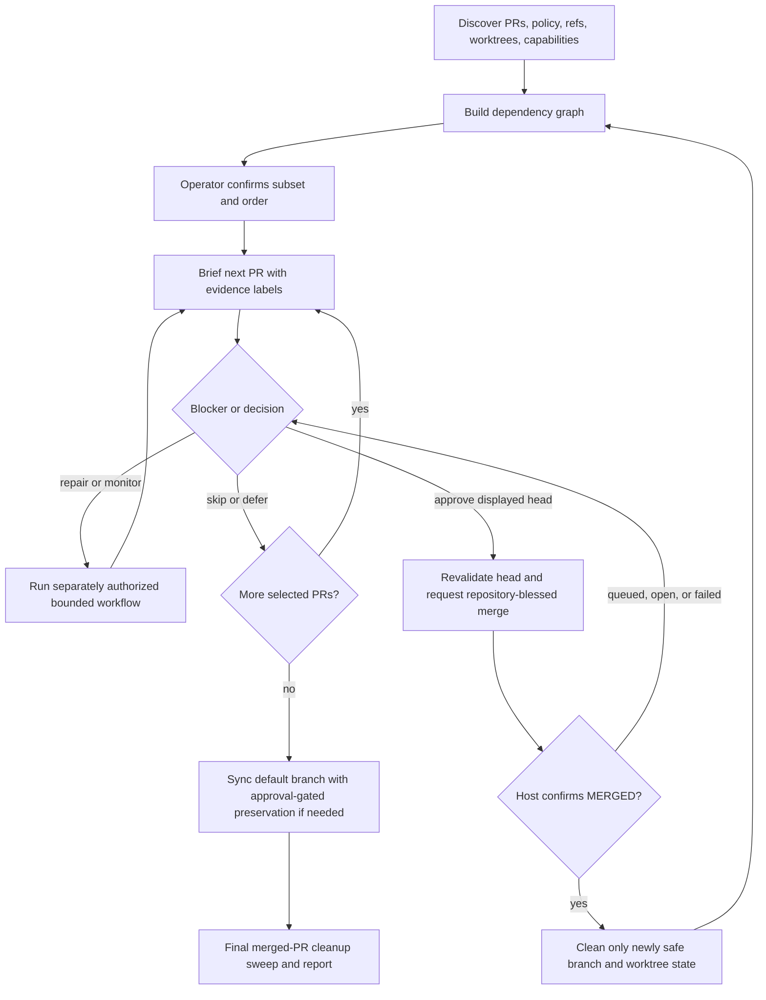
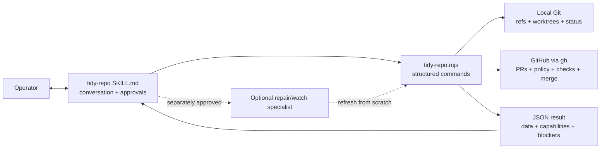

# Tidy Repo Skill - Implementation Plan

## Goal Capsule

- **Objective:** Add a repo-owned Claude skill named `tidy-repo` that interactively briefs and lands selected open pull requests, safely removes merged-PR branches and worktrees, and leaves local and remote default branches synchronized.
- **Product authority:** The operator chooses the PR subset and order, decides how blockers are handled, approves every merge and any temporary stash, and can stop at any time. Repository policy determines valid merge methods.
- **Implementation shape:** A thin conversational `SKILL.md` orchestrates a dependency-free Node helper that performs fresh, machine-readable Git and GitHub inspection plus narrowly guarded mutations.
- **Open blockers:** None block implementation.

## Product Contract

### Summary

`tidy-repo` is a thin, interactive orchestrator for understanding and landing PR work one item at a time. It owns repository-wide discovery, dependency ordering, operator briefings and approvals, safe cleanup, default-branch synchronization, and the final report. Narrower repair and monitoring workflows remain optional and separately authorized.

### Problem Frame

Landing several PRs is not just a sequence of merge commands. The operator needs to understand each change, distinguish demonstrated behavior from claims, see omissions and blockers, and control irreversible decisions. After landing, branches, worktrees, and the default branch can drift unless one workflow deliberately reconciles them.

The existing Compound Engineering skills cover neighboring jobs but not this full lifecycle. `ce-babysit-pr` watches or repairs a known PR and can land a confirmed managed stack; `ce-commit-push-pr` turns current work into a PR; `ce-worktree` creates or attaches isolated worktrees; and `lfg` autonomously ships one body of work to an open PR. None inventories an independent PR queue, briefs the operator PR by PR, merges only after approval tied to the displayed head, and then performs repository-wide PR-branch cleanup and default-branch convergence.

### Actors

- A1. **Operator:** Selects scope, changes queue order, chooses blocker responses, and grants action-specific approvals.
- A2. **Tidy Repo Orchestrator:** Discovers state, explains evidence, coordinates bounded workflows, performs approved mutations, and reports outcomes.
- A3. **Repository Host and Local Git Repository:** Supply PR metadata, policy, checks, refs, worktrees, permissions, and observable post-action state.

### Key Decisions

- **KTD1 — Keep landing scope PR-only.** Governs R2, R15, and R19. (session-settled: user-directed — chosen over shipping local-only work because non-checked-in and non-PR work is outside this workflow)
- **KTD2 — Require an operator decision for every current PR head.** Governs R12 and R14. (session-settled: user-approved — chosen over autonomous bulk landing because understanding and control are the primary product value)
- **KTD3 — Use a graduated evidence model.** Governs R8 and R9. (session-settled: user-directed — chosen over CI-only evidence and mandatory full local reproduction because targeted checks add confidence without making every PR equally expensive)
- **KTD4 — Keep the orchestration thin and make fragile operations deterministic.** `SKILL.md` owns dialogue, selection, briefing, and specialist routing; a dependency-free Node helper owns structured discovery, dependency ordering, merge guards, cleanup eligibility, and default-branch convergence. This avoids shell-fragile parsing without turning the skill into a standalone application. Governs R1, R3-R7, R13, and R16-R23. (session-settled: user-directed — chosen over a standalone monolith and extending `ce-babysit-pr` because discovery, approvals, convergence, and cleanup are distinct from one-PR repair or monitoring)
- **KTD5 — Bind approval to PR identity, head commit, and merge posture.** The helper must enforce the expected head at merge time. Routine CI or review settlement on the same head does not expire approval; a new head, repair action, PR replacement, or changed merge posture does. This permits merge queues without turning an old answer into approval for new code. Governs R12-R14. (session-settled: user-directed — chosen over evidence-bound approval because routine CI settlement and merge queues should remain possible on unchanged code)
- **KTD6 — Gate dirty-checkout preservation on separate approval.** Governs R20-R22. (session-settled: user-directed — chosen over automatic stashing and immediate refusal to sync because local work remains untouched unless the operator accepts a recoverable preservation step)
- **KTD7 — Clean merged PR state immediately and sweep again at the end.** Governs R16-R19. (session-settled: user-approved — chosen over end-only cleanup because each landing reaches a known state while the final sweep catches historical residue)
- **KTD8 — Use fresh host and Git state instead of persisted workflow state.** Every action revalidates its preconditions and returns a typed outcome. Idempotent retries are preferred to a checkpoint database; partial success is reported as residue for the next fresh pass. This limits stale-state and resume hazards across an interactive session.
- **KTD9 — Make optional Compound Engineering delegation capability-based.** Core discovery, briefing, approval, merge, sync, and cleanup work without Compound Engineering. Repair or extended watching may invoke an available specialist only after explicit authorization; absence of that plugin becomes a reported capability limitation, not a broken core workflow.
- **KTD10 — Separate repository policy from host capability.** Host settings establish which merge methods are technically enabled; checked-in repository instructions establish the project's blessed posture. The skill may select a method automatically only when those sources yield one compatible answer. Otherwise it asks the operator and records the selected posture under KTD5. This prevents “enabled” from being misreported as “preferred.” Governs R14.
- **KTD11 — Treat PR-controlled content and code as untrusted.** Titles, descriptions, comments, diffs, filenames, check output, and linked text are evidence to analyze, never instructions for the agent to follow. Local reproduction uses an isolated temporary worktree, explicit commands selected from trusted repository policy, a minimized environment, and a separate operator confirmation before executing code from an external fork. This contains prompt injection and build-script credential exposure without weakening the R8 briefing. Governs R8-R10 and R13.

### Requirements

**Skill boundary and discovery**

- R1. The product is a user-invoked Claude skill named `tidy-repo` whose orchestration layer owns discovery, decisions, synchronization, and cleanup.
- R2. The skill inventories open PRs plus branches and worktrees associated with merged PRs, while ignoring uncommitted and local-only work as landing candidates.
- R3. The skill proposes a queue and lets the operator select a subset or reorder it before and during the run.

**Dependency-aware queueing**

- R4. The dependency graph treats a PR base that is another open PR branch, confirmed managed-stack order, and explicit host dependency metadata as hard edges.
- R5. The proposed order is a topological ordering with prerequisites first, and the graph is recalculated from fresh state after every successful merge.
- R6. Cycles, unavailable or missing dependency evidence, and contradictory ordering signals are surfaced for operator resolution instead of being guessed. An unavailable dependency API is represented as unknown, never as evidence of no dependencies.
- R7. Shared-file overlap is reported as merge-interaction risk but never creates or reverses a hard dependency without stronger evidence.

**Per-PR understanding and evidence**

- R8. Before requesting a decision, the skill briefs one PR with its purpose, material contents, architecture, confirmed working behavior, confirmed failures, unverified claims, blockers, and surprising omissions.
- R9. Every behavioral claim is labeled as CI-confirmed, locally reproduced, PR-author-claimed, or unverified, with targeted local checks run when existing evidence leaves a material gap.
- R10. Conflicts, failing CI, missing reviews, and other merge blockers do not suppress or shorten the briefing required by R8.
- R11. After a blocked briefing, the skill reports the blocker and asks the operator to choose among currently safe and repository-permitted responses.

**Approval, repair, and merge**

- R12. Merge approval is bound to the displayed PR number, head commit, and selected merge posture. A head change or repair invalidates approval; routine CI or review settlement on the same head does not.
- R13. Repair and extended monitoring occur only as separately authorized bounded actions, after which the skill refreshes the briefing before another merge decision.
- R14. The skill merges only after explicit approval satisfying R12, using a repository-allowed merge method and asking when no single repository-blessed method can be determined.
- R15. A skipped, deferred, closed-unmerged, or unapproved PR is never merged or treated as cleanup-authorizing landed work.

**Post-merge cleanup**

- R16. Cleanup starts only after the host confirms the PR is actually merged rather than merely queued or merge-requested.
- R17. For a just-merged PR, the skill deletes its same-repository remote head branch when permitted, removes its clean associated worktree, prunes stale worktree metadata, and deletes its safe local branch.
- R18. A PR branch is pruneable only when it belongs to a confirmed merged PR, has no open PR, is not required as the base or managed-stack ref of an open dependent PR, has no dirty associated worktree, and has no local commits beyond the PR head used for the merge.
- R19. The final cleanup pass applies R18 to all discoverable merged-PR branches, excluding non-PR branches, external-fork branches, and branches from closed-unmerged PRs.

**Default-branch convergence and handoff**

- R20. The skill fetches authoritative remote state and makes the local default branch fast-forward to the remote default branch until their tips match with zero ahead and zero behind.
- R21. When the default-branch checkout is dirty, the skill offers an approval-gated named stash, fast-forward, and reapply sequence that preserves tracked and untracked work or leaves a recoverable blocker.
- R22. Diverged default-branch history, denied stash approval, failed reapplication, insufficient permissions, and failed cleanup are reported without resets, force operations, or silent data loss.
- R23. The final report assigns every selected PR an outcome, lists remaining blockers and unpruned PR residue, states default-branch ahead/behind status, and identifies untouched out-of-scope work.

### Key Flows



- F1. **Inventory and queue.** A2 reads A3 state, proposes the R4-R7 ordering, and A1 confirms or edits the active subset under R3.
- F2. **Understand and decide.** For each selected PR, A2 produces the R8-R10 briefing and A1 chooses the next permitted action under R11-R15.
- F3. **Land and reconcile.** After an approved merge, A2 observes R16, performs R17-R18 cleanup, refreshes the dependency graph under R5, and continues with the next selected PR.
- F4. **Converge and hand off.** When the queue is exhausted or stopped, A2 applies R19-R22 and returns the R23 report.

### Acceptance Examples

- AE1. **Green independent PR lands cleanly.** Given a selected PR has passing required checks, an unchanged head, and a clean associated worktree, when the operator approves the displayed head and repository-blessed merge posture, then the skill confirms actual merged state before removing safe associated branch/worktree state and recalculating the queue. Covers R8, R9, R12, R14, R16, R17.
- AE2. **Blocked PR remains understandable.** Given a selected PR has merge conflicts and failing CI, when the skill reaches it, then it still provides the complete evidence-labeled briefing, reports both blockers, and waits for the operator to repair, monitor, skip, defer, or choose another repository-permitted action. Covers R8-R11 and R15.
- AE3. **Approval expires only when its code or posture changes.** Given the operator approved a displayed head, when checks settle on that head, then merge can proceed without a new approval; when a repair or external push changes the head, the skill refreshes the briefing and asks again. Covers R12-R14.
- AE4. **Dependency order updates after landing.** Given PR B depends on PR A and another PR only overlaps their files, when PR A merges, then the skill refreshes the graph, keeps any still-required branch, and leaves overlap advisory. Covers R4-R7.
- AE5. **Dirty PR worktree prevents deletion.** Given a merged PR branch is checked out in a worktree with uncommitted changes, when cleanup evaluates it, then the skill leaves the worktree and branch intact and reports the exact blocker. Covers R17-R19 and R22.
- AE6. **Dirty default checkout is preserved by choice.** Given the local default branch can fast-forward but its checkout contains tracked or untracked work, when the operator approves the named preservation sequence, then the skill stashes, fast-forwards, reapplies, verifies ahead/behind state, and preserves recoverable state if reapplication conflicts. Covers R20-R22.
- AE7. **Historical merged-PR residue is pruned selectively.** Given one old branch belongs to a merged PR and another belongs to a closed-unmerged PR, when the final pass runs, then only the branch satisfying R18 is pruned and the report explains why the other remains. Covers R18, R19, R23.
- AE8. **A merge-queue request is not mistaken for a merge.** Given the host accepts a merge-queue request but still reports the PR open, when the helper refreshes state, then cleanup does not run and the operator sees a queued/waiting outcome. Covers R12, R14, R16, R22.

### Scope Boundaries

- **In scope:** Open-PR discovery and selection, dependency-aware sequencing, per-PR explanation, explicit landing decisions, merged-PR branch and worktree cleanup, default-branch synchronization, and residual reporting under R1-R23.
- **Outside landing scope:** Uncommitted changes, local-only commits, branches with no PR, and closed-unmerged PRs are not shipped or merged under R2 and R15.
- **Separately authorized:** Code changes, conflict resolution, review-response work, CI repair, and extended watching may be delegated under R13 but are not implied by invoking `tidy-repo`.
- **No destructive reconciliation:** History rewriting, administrator merge bypass, force deletion of dirty worktrees, resetting divergent default branches, and discarding local changes are excluded under R18 and R22.
- **No personal-skill runtime dependency:** Existing personal `lightsout` and `pr-brief` skills remain unchanged and are not required by `tidy-repo`.
- **Deferred:** Non-GitHub forges, Tinstar UI/progress surfaces, automatic repair, and live destructive integration tests.

### Dependencies and Assumptions

- The first version targets GitHub and uses authenticated `gh` plus Git because repository policy and adjacent workflows are GitHub-specific.
- Node 22.12 or newer is available, matching this repository's runtime contract.
- The operator has enough host and Git permissions for requested reads and mutations; missing permissions become R22 blockers.
- Squash merge is expected to be common, but never overrides repository policy or R14's clarification gate.
- GitHub issue dependency metadata may be unavailable because of host version, permissions, or API evolution; that source then remains explicitly unknown under R6.
- Confirmed managed-stack metadata is optional. The helper detects a supported `gh stack` capability instead of assuming an extension's presence or output format.
- Existing project commands provide targeted local verification where R9 calls for it; the skill reports when no suitable check exists.

### Sources and Research

- [GitHub REST issue dependencies](https://docs.github.com/en/rest/issues/issue-dependencies?apiVersion=2026-03-10) grounds explicit dependency discovery and the unknown-capability state in R4 and R6.
- [GitHub REST pull requests](https://docs.github.com/en/rest/pulls/pulls) grounds authoritative PR heads, mergeability, and actual merged-state verification in R12, R14, and R16.
- [GitHub CLI `gh pr merge`](https://cli.github.com/manual/gh_pr_merge) provides `--match-head-commit` and merge-queue behavior used by KTD5.
- [GitHub merge queue](https://docs.github.com/en/pull-requests/collaborating-with-pull-requests/incorporating-changes-from-a-pull-request/merging-a-pull-request-with-a-merge-queue) motivates AE8 and the distinction between accepted queue request and actual merge.
- [GitHub repository REST settings](https://docs.github.com/en/rest/repos/repos?apiVersion=2022-11-28) grounds allowed merge-method detection and host-side branch-deletion policy.
- [GitHub Git refs REST](https://docs.github.com/en/enterprise-cloud@latest/rest/git/refs?apiVersion=2026-03-10) grounds same-repository remote branch deletion while external-fork branches remain report-only.
- [Git worktree documentation](https://git-scm.com/docs/git-worktree) grounds porcelain inventory, clean removal, and stale metadata pruning.
- `bin/install-skills.js` already installs complete directories under `agent-skills/skills/`; the new bundle needs no hard-coded installer entry.
- `src/server/sessions/slashCommandRegistry.ts` already discovers installed `skills/*/SKILL.md`; integration testing should protect discoverability.
- `agent-skills/skills/*/SKILL.md` establishes the repo-owned skill packaging convention.
- Compound Engineering `ce-babysit-pr`, `ce-commit-push-pr`, `ce-worktree`, and `lfg` are adjacent workflows, not substitutes for the R1-R23 lifecycle.

## High-Level Technical Design

This sketch fixes boundaries and state transitions without prescribing internal function signatures.



The helper exposes small command families rather than one implicit end-to-end mutation:

- **Inspect:** capability preflight, repository snapshot, repo-policy evidence, PR detail/evidence, dependency graph, cleanup candidates, and default-branch relation. Read operations return data plus source confidence and typed capability gaps. Detailed PR inspection includes commits, changed files, bounded patches, checks/reviews, description and linked dependency evidence so the orchestrator can inspect architecture and omissions rather than paraphrase metadata. Every PR-controlled field is marked as untrusted data in the result contract.
- **Check:** prepares a temporary detached worktree at the exact PR head, returns the proposed trusted-repo verification command for confirmation when required by KTD11, executes only that explicit command with a minimized environment, captures bounded output, and removes only a clean temporary worktree. Dirty or failed cleanup becomes reported residue rather than a forced removal.
- **Merge:** accepts an explicit PR number, expected head OID, and merge posture; refreshes the PR; rejects mismatches; invokes a repository-permitted non-admin merge; and distinguishes merged, queued/open, blocked, and failed outcomes.
- **Cleanup:** accepts only a candidate derived from a confirmed merged PR, refreshes every R18 guard, performs safe worktree/local/remote cleanup in order, prunes stale metadata, and reports partial residue. Re-running is harmless.
- **Sync:** fetches first; refuses divergence; either fast-forwards a clean default branch or returns a distinct `approval_required` plan for a named tracked-and-untracked stash. The mutation path runs only with the explicit approval token described by the skill and preserves the stash if reapplication is incomplete.

All child processes use argument arrays rather than shell interpolation, explicit repository/worktree paths, bounded execution, scrubbed errors, and machine-readable stdout. Human-facing prose is composed by `SKILL.md`; secrets, raw environment dumps, and auth material never become briefing content. Mutation results include the exact refreshed identity and state that authorized each completed action so the orchestrator can distinguish a safe partial success from an opaque failure.

## Output Structure

The implementation adds one self-contained skill bundle and focused tests:

```text
agent-skills/skills/tidy-repo/
├── SKILL.md
├── agents/
│   └── openai.yaml
├── references/
│   ├── briefing-contract.md
│   └── safety-contract.md
└── scripts/
    └── tidy-repo.mjs
tests/
└── tidy-repo.test.mjs
```

`SKILL.md` stays concise and loads the references only at the workflow stages that need them. `openai.yaml` supplies discoverable interface metadata without duplicating the behavioral contract. The helper remains dependency-free so an installed copied skill works outside this source tree.

## Implementation Units

### U1 — Scaffold the portable skill contract

- **Requirements:** R1-R3, R8-R15, R23; F1, F2, F4; AE2, AE3.
- **Files:** `agent-skills/skills/tidy-repo/SKILL.md`, `agent-skills/skills/tidy-repo/agents/openai.yaml`, `agent-skills/skills/tidy-repo/references/briefing-contract.md`, `agent-skills/skills/tidy-repo/references/safety-contract.md`.
- **Approach:** Define the trigger, mandatory one-at-a-time interactive loop, capability preflight, subset/reorder controls, evidence-label vocabulary, full briefing schema, blocker choices, approval invalidation rules, optional specialist routing, and terminal report. Define CI-confirmed as a named check result, locally reproduced as a command and observed outcome, author-claimed as unattributed-to-execution PR prose, and unverified as an explicit gap. Require surprising omissions to compare the requested/claimed behavior with changed code, tests, docs, migrations, rollout, and cleanup as applicable. Keep the skill as the single authority for conversation; references own reusable briefing and safety detail rather than restating it.
- **Tests:** Add contract assertions in `tests/tidy-repo.test.mjs` that parse frontmatter, verify referenced assets exist, ensure the required briefing sections/evidence labels are present, require explicit merge and stash approvals, mark PR-controlled content as untrusted, and reject wording that authorizes admin bypass, force deletion, reset, or local-only landing.
- **Observable outcome:** Installing the bundle exposes `/tidy-repo`, and its instructions fully describe the R1-R23 interaction without depending on personal or Compound Engineering skills.

### U2 — Implement fresh inventory and dependency ordering

- **Requirements:** R2-R7, R8-R10; F1, F2; AE2, AE4.
- **Files:** `agent-skills/skills/tidy-repo/scripts/tidy-repo.mjs`, `tests/tidy-repo.test.mjs`.
- **Approach:** Build a dependency-free Node CLI with structured JSON results; tests inject fixture executables through a controlled temporary `PATH`, while production resolves standard `git` and `gh`. Inventory repository identity/default branch, host merge capabilities, checked-in policy evidence, open PR metadata, commits/reviews/checks/files/bounded patches, local refs, and `git worktree list --porcelain -z`. Normalize hard edges from open-PR base branches, explicit issue dependencies, and only confirmed managed-stack output. Topologically order selected PRs with stable tie-breaking; report cycles, contradictory edges, unavailable sources, and shared-file overlap separately.
- **Tests:** Use temporary repositories and a fixture-backed fake `gh` executable to verify independent PR ordering, base-branch dependency order, explicit dependency metadata, cycles, unavailable metadata represented as unknown, contradictory signals, overlap-only advisories, worktree paths with unusual characters, and no inclusion of local-only branches.
- **Observable outcome:** `inspect` returns a complete, deterministic snapshot from which the skill can propose a dependency-aware queue and a full blocked or unblocked briefing without treating PR-authored text as workflow control.

### U3 — Implement head-guarded merge and actual-state polling

- **Requirements:** R12-R16, R22; F2, F3; AE1, AE3, AE8.
- **Files:** `agent-skills/skills/tidy-repo/scripts/tidy-repo.mjs`, `tests/tidy-repo.test.mjs`, `agent-skills/skills/tidy-repo/references/safety-contract.md`.
- **Approach:** Apply KTD10 to resolve a blessed posture and require clarification if repository instructions and enabled host methods do not yield one compatible answer. Before mutation, refresh PR identity, state, head OID, base repository, and head repository ownership. Pass the expected head through `gh pr merge --match-head-commit`; never use `--admin`. Return distinct outcomes for rejected precondition, requested/queued but still open, actually merged, and host/permission failure. Polling stays bounded and can be resumed with a fresh read.
- **Tests:** Verify an exact head can invoke the selected allowed method, enabled-but-not-blessed methods require clarification, conflicting policy evidence requires clarification, a changed head prevents any merge subprocess, disabled methods are rejected, admin bypass is absent, fork metadata does not redirect mutation, same-head evidence changes retain eligibility, and a queue-accepted/open response never authorizes cleanup.
- **Observable outcome:** The helper can turn a current-head approval into at most one policy-compliant merge request and cannot mistake queue acceptance for landing.

### U6 — Isolate targeted local reproduction

- **Requirements:** R8-R10, R13, R22; F2; AE2, AE3.
- **Files:** `agent-skills/skills/tidy-repo/scripts/tidy-repo.mjs`, `tests/tidy-repo.test.mjs`, `agent-skills/skills/tidy-repo/references/briefing-contract.md`, `agent-skills/skills/tidy-repo/references/safety-contract.md`.
- **Approach:** Add the KTD11 check lifecycle after read-only briefing evidence and before any conclusion that requires local reproduction. Resolve candidate commands only from trusted checked-in repository policy or ask the operator; never execute commands embedded in PR text. Use an exact-head temporary worktree and minimized environment, require separate confirmation for external-fork code, label the observed command/output, and remove only a clean temporary worktree. A changed PR head invalidates the result for merge briefing purposes.
- **Tests:** Verify PR-body commands are never executed, exact-head worktrees are used, external-fork checks require confirmation, environment allowlisting omits common credential variables, bounded output is labeled, head changes stale the result, clean temporary worktrees are removed, and dirty/failed worktrees are retained and reported.
- **Observable outcome:** Targeted checks can improve the evidence ladder without running PR-authored instructions or contaminating existing worktrees.

### U4 — Implement pruneability, cleanup, and default-branch convergence

- **Requirements:** R16-R23; F3, F4; AE1, AE4-AE8.
- **Files:** `agent-skills/skills/tidy-repo/scripts/tidy-repo.mjs`, `tests/tidy-repo.test.mjs`, `agent-skills/skills/tidy-repo/references/safety-contract.md`.
- **Approach:** Derive cleanup candidates only from confirmed merged PRs, then revalidate open dependents, local OID versus recorded PR head, worktree cleanliness, and same-repository remote ownership. Remove only clean linked worktrees, then safe local/remote refs, and run metadata pruning; report each residue independently. For default sync, fetch and compute ahead/behind, allow fast-forward only, and split dirty-checkout handling into a read-only approval plan plus an approved named stash/update/reapply operation that includes untracked files and preserves recoverability on conflict.
- **Tests:** Cover dirty worktree, local commits beyond PR head, open dependent base, closed-unmerged branch, external fork, already-removed refs, partial remote-delete failure, and idempotent retry. Cover clean fast-forward, non-checked-out default ref update, dirty sync awaiting approval, tracked plus untracked stash/reapply, reapply conflict with preserved stash, denied approval, and divergent-history refusal.
- **Observable outcome:** Cleanup cannot cross R18's boundary, and sync reaches zero ahead/behind only through fast-forward-safe or explicitly approved preservation paths.

### U5 — Integrate installation, discovery, and forward scenarios

- **Requirements:** R1-R23; F1-F4; AE1-AE8.
- **Files:** `tests/tidy-repo.test.mjs`, `src/server/sessions/__tests__/slashCommandRegistry.test.ts` only if existing behavior needs an explicit regression assertion.
- **Approach:** Validate the skill package with the skill-authoring validator, exercise `bin/install-skills.js --copy` against a temporary destination, verify every script/reference is copied, and confirm the installed frontmatter is discoverable through the slash-command registry. Forward-test representative transcripts by pairing fixture snapshots and helper outcomes with contract assertions for queue selection, blocked explanation, head change, queue wait, cleanup residue, and dirty-default approval.
- **Tests:** Run the dedicated Node test suite, the slash-command registry test when changed, and the repository gates. No live merge, branch deletion, stash, or remote mutation is used in automated tests.
- **Observable outcome:** A packaged install is self-contained and discoverable, and dry scenarios demonstrate the full interaction lifecycle without destructive external effects.

## System-Wide Impact

- **Agent interface:** Adds one user skill discovered through the existing installer and slash-command registry. No server API, database, UI, or runtime session protocol changes are required.
- **External boundaries:** The helper reads and mutates GitHub only through authenticated `gh`; it treats API/permission/version gaps as typed capability results. Git commands are scoped to the current repository and explicit ref/worktree paths.
- **State lifecycle:** Host and local state are refreshed before each mutation. There is no durable workflow cache; the final report is derived from current observations plus this session's selected outcomes. A subprocess timeout or malformed result authorizes no follow-on mutation because absence of a typed success is treated as unknown state.
- **Failure propagation:** Each helper call returns one JSON document with status, blockers, capabilities, actions taken, and residue. Nonzero exits distinguish invalid invocation from safe operational blockers so the skill does not turn expected conflict or permissions states into guessed recovery.
- **Security and integrity:** No shell evaluation, PR-authored command execution, admin merge override, force deletion, hard reset, arbitrary ref deletion, environment dump, or token output. Remote deletion is restricted to a same-repository head ref tied to a merged PR. External-fork code receives no ambient credentials during an approved local check.
- **Compatibility:** Node's standard library only; GitHub is the explicit v1 forge. Unavailable newer dependency metadata degrades to unknown ordering evidence rather than breaking all inventory.
- **Performance:** One repo snapshot may call several GitHub endpoints per PR. Bound concurrency and request timeouts keep large PR sets responsive; detailed briefing data can be fetched lazily for the next selected PR rather than every PR up front.

## Verification Contract

- The dedicated helper/contract suite passes against temporary Git repositories and fake GitHub fixtures, including all mutation-denial paths in AE1-AE8.
- The skill-authoring validator accepts `agent-skills/skills/tidy-repo` with valid frontmatter, naming, references, and packaged assets.
- A copy-mode install into a temporary harness root includes `SKILL.md`, `agents/`, `references/`, and `scripts/`; slash-command discovery returns `tidy-repo` with the intended description.
- `npm run typecheck`, `npm run build:all`, and `npx vitest run --exclude='e2e/**'` pass.
- No browser verification is required because this change has no UI or browser-facing behavior.
- Manual forward scenarios show: a dependency-ordered two-PR queue, a fully briefed blocked PR, same-head CI settlement, head-change invalidation, merge-queue waiting without cleanup, safe historical pruning, and dirty-default stash approval/conflict reporting.

## Risks and Mitigations

- **Host/API drift:** GitHub dependency and merge-queue seams can vary. Keep capabilities explicit, use documented `gh api`/`gh pr merge` contracts, and make unknown evidence visible rather than inferred.
- **TOCTOU during merge or cleanup:** Re-read PR head/state and Git refs immediately before mutation; use `--match-head-commit`; revalidate every cleanup guard independently.
- **Accidental local-data loss:** Refuse dirty worktree removal, local-ahead branches, divergence, and unapproved stash flows. Preserve stash/recovery details on partial failure.
- **Overconfident briefing:** Require evidence labels and a surprising-omissions section even when empty; distinguish host evidence, local reproduction, author claims, and unknowns.
- **Ambiguous repository preference:** Distinguish host-enabled methods from checked-in project policy under KTD10; ask rather than treating any enabled method as blessed.
- **Prompt injection or malicious build scripts:** Mark every PR-controlled value as untrusted, never turn it into workflow instructions, and isolate explicitly approved local execution under KTD11.
- **Large repository latency:** Inventory cheap queue metadata first, fetch detailed evidence lazily, bound concurrency, and let the operator choose a subset before expensive checks.
- **Optional plugin absence:** Core behavior stays self-contained; only explicitly requested repair/watch delegation may become unavailable.

## Documentation and Operational Notes

- `SKILL.md` and its two references are the user/operator documentation; no separate README is added.
- The existing `tinstar install-skills` command automatically installs the new directory. Existing installs must rerun it only in copy mode; symlink installs see the skill immediately after updating Tinstar.
- The helper should print a short usage document for invalid commands and keep stdout JSON-only for valid commands, reserving diagnostics for stderr.
- Automated tests must use temporary repositories and fake host fixtures. Any live end-to-end trial must remain read-only unless the operator separately identifies a disposable repository and authorizes mutations.

## Definition of Done

- U1-U6 are implemented with no abandoned alternate scripts, duplicate contracts, or temporary design files.
- The full R1-R23 contract and AE1-AE8 behavior are traceable through the skill, helper, and tests.
- Merge, cleanup, and sync mutations are exact-target, fresh-state guarded, recoverable, and independently report partial failure.
- The complete skill bundle installs and is discoverable as `/tidy-repo`.
- Targeted tests and all repository quality gates pass, or any external-only blocker is documented with the exact unverified surface.
- The change is committed on one feature branch, pushed, opened as one PR, and observed through CI according to the LFG pipeline.

## Open Questions

### Resolved During Planning

- **Helper surface:** One dependency-free Node entry point with bounded subcommands best matches the repo's portable skill packaging and avoids duplicating orchestration in shell.
- **Optional specialists:** Discover capabilities at runtime and call them only after explicit authorization; do not make Compound Engineering a core dependency.
- **Approval lifetime:** Approval is head-bound, not evidence-bound; same-head CI/review settlement remains valid, while head or merge-posture changes require a refreshed briefing and answer.

### Deferred to Implementation

- None. Output wording and internal helper decomposition may vary while preserving the product and verification contracts above.

## Product Contract Preservation

Product Contract changed: R12 clarified after user resolution — approval is head-bound; routine evidence settlement on the same head does not invalidate it. All other actors, flows, requirements, acceptance examples, and scope boundaries remain preserved from the requirements-only artifact.
