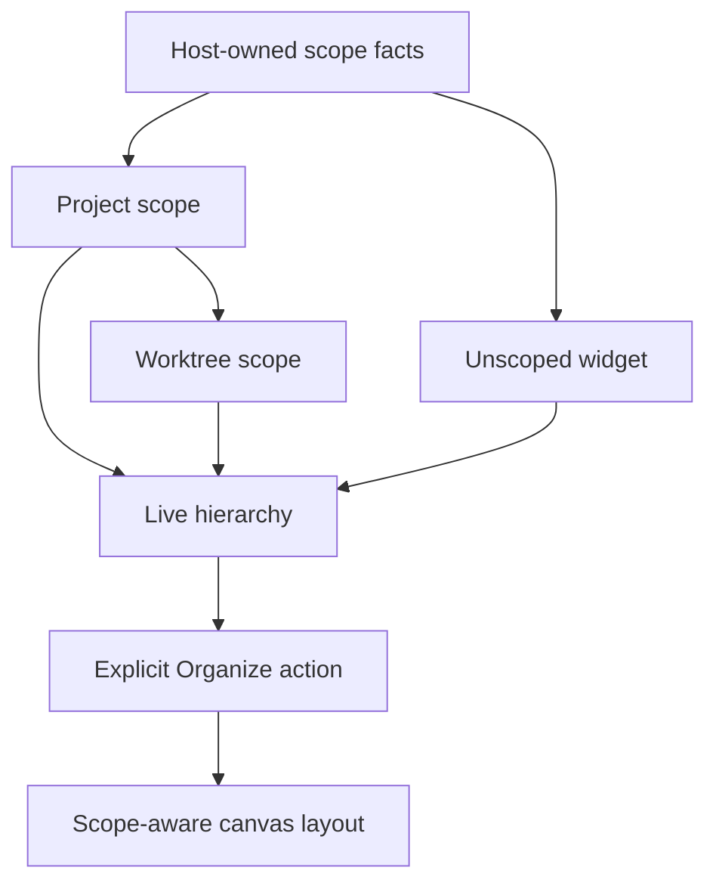
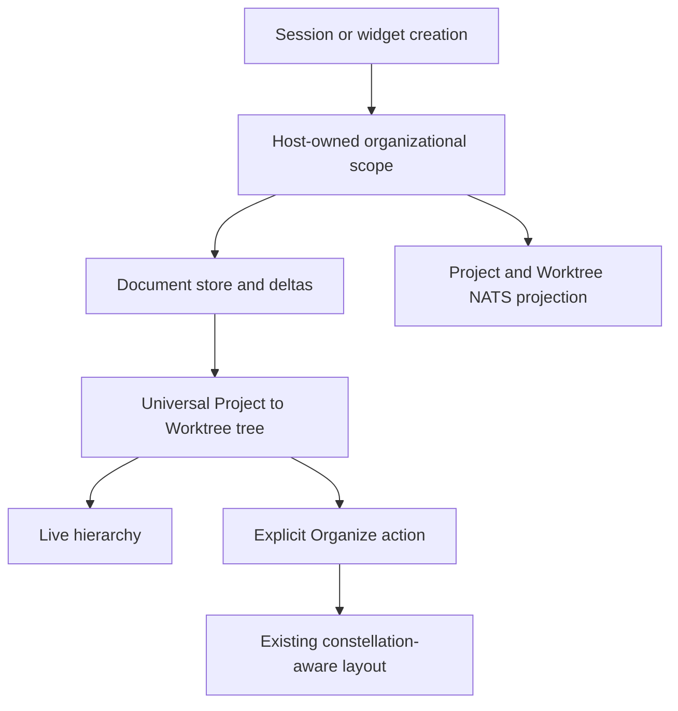
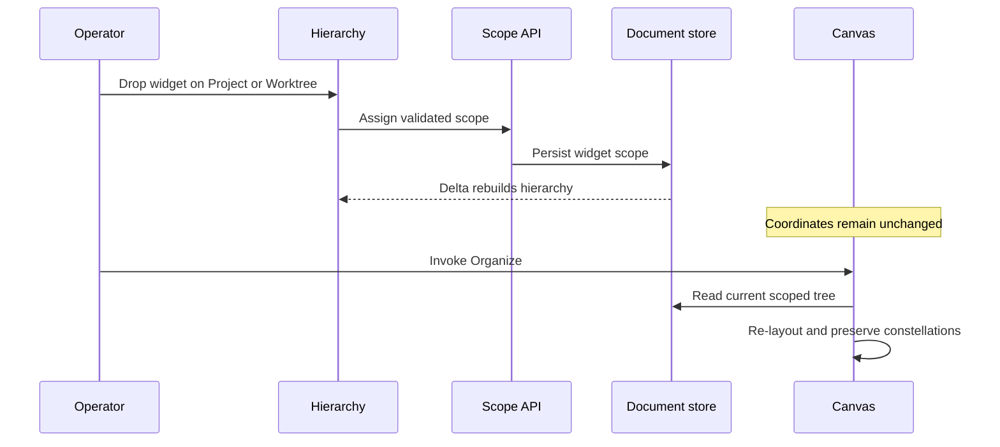

# Project and Worktree Scope - Plan

## Goal Capsule

- **Objective:** Replace Initiative, Epic, and Task with a lightweight Project and Worktree scope that organizes every canvas widget with little or no manual setup.
- **Product authority:** This Product Contract owns v1 behavior. Planning may choose implementation mechanics but may not reintroduce the retired taxonomy, automatic movement on scope changes, or widget-content filtering.
- **Open blockers:** None. Implementation-level choices are deferred to planning.

---

## Product Contract

### Summary

Give every canvas widget an optional organizational scope and project that scope as a live Project to Worktree hierarchy.
Sessions and the widgets they spawn organize themselves, while one explicit Organize action rebuilds the canvas layout when the user wants it.

### Problem Frame

Initiative, Epic, and Task require users to create and maintain a taxonomy before it provides value.
That friction is high enough that the primary user does not use the feature, leaving useful structure implicit even though sessions already know their Project and Worktree.

The limitation extends beyond sessions.
The current hierarchy is closed to four built-in dimensions and primarily groups Runs.
Session-backed editor, browser, and image widgets can be nested through a Task, while plugin widgets such as Stretchplan remain top-level.
This creates different organizational behavior for different widget kinds.

The existing Reset Layout action already provides useful one-shot packing and preserves snapped constellations.
The missing behavior is a lightweight, universal source of grouping truth that can feed both the hierarchy and that explicit layout action.

### Key Decisions

- **Project and Worktree are the only v1 dimensions.** (session-settled: user-directed — chosen over including Task or free-form dimensions: keep the replacement light while leaving room for later dimensions.) Governs R1-R5.
- **Use typed organizational scope rather than arbitrary hierarchical tags.** (session-settled: user-approved — chosen over parentable free-form tags: Worktree must imply exactly one Project without recreating taxonomy administration.) Governs R1-R4.
- **The hierarchy is live and canvas organization is explicit.** (session-settled: user-directed — chosen over continuously maintained canvas containers: scope changes must not move windows unexpectedly.) Governs R9-R17.
- **One scope-aware Organize action replaces separate Reset and Organize controls.** (session-settled: user-directed — chosen over two whole-canvas arrangers: the current Reset Layout behavior is already the right base.) Governs R12-R17.
- **Scope controls organization, not widget contents.** (session-settled: user-approved — chosen over automatic scope filtering: dragging a widget must not silently change what it displays.) Governs R18-R19.
- **The old taxonomy and session channels receive a clean break.** (session-settled: user-directed — chosen over migration and backward compatibility: existing hierarchy data is unused and sessions can be recreated.) Governs R5, R20-R23.

### Scope Structure

A Worktree is not an independent tag.
It belongs to one Project, so Worktree scope carries its Project ancestry wherever it is projected.
Unscoped is the absence of organizational scope, not a synthetic container.

### Actors

- A1. **Operator** — organizes sessions and widgets while preserving control of the canvas.
- A2. **Managed session or Hand** — begins with Project and Worktree context and may spawn widgets or child sessions.
- A3. **Widget host** — assigns, inherits, projects, and arranges scope consistently across built-in and plugin widgets.
- A4. **Widget** — any canvas item, including a Run Workspace, Graveyard, browser, editor, image, or plugin surface such as Stretchplan.

### Requirements

**Scope model**

- R1. Every canvas widget supports an optional organizational scope with exactly three v1 states: Unscoped, Project-scoped, or Worktree-scoped.
- R2. Every Worktree belongs to exactly one Project, and Worktree scope always includes that Project ancestry.
- R3. The v1 hierarchy projects Project before Worktree whenever both are shown; Worktree before Project is invalid because it adds no information.
- R4. The scope model must admit additional typed dimensions later without changing existing Project or Worktree assignments, but v1 provides no custom-dimension or hierarchy-building UI.
- R5. Initiative, Epic, and Task leave the active organizing model, and their existing records may be discarded without migration, preservation, or compatibility behavior.

**Assignment and inheritance**

- R6. A Managed session receives its Project and Worktree scope from the environment in which it is created without requiring organizational setup from the user.
- R7. A widget or Hand spawned by a session inherits the session's complete organizational scope at creation.
- R8. A standalone widget created directly by the operator begins Unscoped unless its creation context already names a session whose scope it must inherit under R7.
- R9. The live hierarchy includes every widget in the active Space and projects it under Project, Worktree, or an Unscoped area according to its current scope.
- R10. Dropping a widget's hierarchy entry onto a Project assigns Project scope, while dropping it onto a Worktree assigns that Worktree and its Project ancestry.
- R11. A hierarchy drop updates scope and hierarchy placement immediately but never changes the widget's canvas coordinates or size.

**Canvas organization**

- R12. Tinstar exposes one whole-canvas Organize action that carries forward the useful behavior of the current Reset Layout action.
- R13. Organize projects current scope into visible Project and Worktree containers and arranges scoped widgets inside the matching containers.
- R14. Organize also arranges Unscoped widgets as standalone peers outside the scoped containers and never creates an Unscoped container.
- R15. Organize keeps snapped constellations cohesive while packing scoped containers and standalone widgets.
- R16. Scope assignment, inheritance, and hierarchy updates never trigger Organize implicitly.
- R17. Re-running Organize uses the current scope truth, so hierarchy changes become canvas changes only when the operator invokes the action.

**Scope semantics and collaboration**

- R18. Organizational scope changes where a widget appears in the hierarchy and where Organize places it, but does not filter or alter the widget's contents.
- R19. Future widget capabilities may consume organizational scope explicitly without changing the meaning or persistence of existing scope assignments.
- R20. Project and Worktree replace Initiative, Epic, and Task as the automatic hierarchy for session collaboration channels.
- R21. Sessions in the same Worktree share a Worktree broadcast context, and a Hand inherits the parent's Project, Worktree, collaboration context, and direct parent-child link.
- R22. Existing Initiative, Epic, and Task channel subjects and subscriptions need not remain valid, and existing sessions may be recreated after the change.
- R23. Agent-facing skills, CLI help, product help, API guidance, and conceptual documentation must stop instructing users or agents to depend on Initiative, Epic, or Task.

### Key Flows

- F1. **A session and its spawned widget organize themselves.**
  - **Trigger:** A2 starts in a registered Project and Worktree, then spawns A4.
  - **Actors:** A2, A3, A4.
  - **Steps:** The session receives Worktree scope and its Project ancestry; the spawned widget copies that scope; both appear under the same live hierarchy branch; the scope assignments do not change canvas positions.
  - **Outcome:** Related work is correctly classified with no organizational gesture from A1.
  - **Covers:** R2, R6-R9, R11, R16.

- F2. **The operator scopes a standalone widget.**
  - **Trigger:** A1 creates a standalone Graveyard or plugin widget and later drags its hierarchy entry onto a Worktree.
  - **Actors:** A1, A3, A4.
  - **Steps:** The widget begins Unscoped; the hierarchy drop assigns the Worktree and Project ancestry; the hierarchy entry moves immediately; the canvas widget stays in place.
  - **Outcome:** A standalone widget joins the desired organizational scope without a form or taxonomy-creation flow.
  - **Covers:** R8-R11, R16.

- F3. **The operator organizes the canvas.**
  - **Trigger:** A1 invokes the one Organize action after creating or re-scoping widgets.
  - **Actors:** A1, A3, A4.
  - **Steps:** The host reads current scope; builds Project and Worktree containers; packs scoped widgets within them; arranges Unscoped widgets as standalone peers; preserves snapped constellations.
  - **Outcome:** The canvas reflects the hierarchy at a moment chosen by the operator.
  - **Covers:** R12-R17.

- F4. **Sessions collaborate within a Worktree.**
  - **Trigger:** Multiple sessions or Hands operate in the same Worktree.
  - **Actors:** A2, A3.
  - **Steps:** Their automatic collaboration context is derived from Space, Project, and Worktree; Worktree peers share the broadcast context; parent and child retain their direct link.
  - **Outcome:** Agent communication follows the new scope without the retired taxonomy.
  - **Covers:** R20-R22.

### Acceptance Examples

- AE1. **Zero-click session organization.** **Given** a session starts in Project `Tinstar` and Worktree `taskReorg`, **when** it appears, **then** its hierarchy path is `Tinstar` then `taskReorg` without Initiative, Epic, Task, or manual assignment. **Covers R2, R3, R5, R6, R9.**
- AE2. **Spawn inheritance.** **Given** that session spawns a Stretchplan widget or Hand, **when** the child appears, **then** it has the same Project and Worktree scope and joins the same hierarchy branch without moving either canvas widget. **Covers R7, R9, R11, R16, R21.**
- AE3. **Manual scope without canvas movement.** **Given** a standalone Graveyard is Unscoped, **when** the operator drops its hierarchy entry onto `taskReorg`, **then** it moves under `Tinstar` then `taskReorg` in the hierarchy and remains at its prior canvas coordinates. **Covers R8-R11.**
- AE4. **Explicit organization.** **Given** AE3 has occurred, **when** the operator invokes Organize, **then** the Graveyard moves into the `taskReorg` canvas container and other scoped widgets are packed according to their current scope. **Covers R12, R13, R17.**
- AE5. **Unscoped widgets are arranged but not boxed.** **Given** the canvas contains Unscoped widgets, **when** Organize runs, **then** those widgets receive orderly standalone positions outside the Project containers and no Unscoped container appears. **Covers R14.**
- AE6. **Constellations survive organization.** **Given** snapped widgets form a constellation, **when** Organize runs, **then** the constellation remains cohesive while the surrounding blocks are packed. **Covers R15.**
- AE7. **Scope does not filter content.** **Given** a Graveyard or Stretchplan widget has Worktree scope, **when** its scope changes, **then** its organizational placement changes but the data it displays does not. **Covers R18.**
- AE8. **Breaking collaboration transition.** **Given** old sessions use Initiative, Epic, and Task subjects, **when** the new model ships, **then** those sessions may stop participating and newly created sessions communicate through Project and Worktree context. **Covers R20-R23.**

### Scope Boundaries

**Deferred for later**

- Additional typed dimensions such as Task, including placing an independent dimension before or after the Project and Worktree chain.
- User-created dimensions, custom hierarchy views, and free-form tags.
- Widget opt-in behavior that uses scope to filter or otherwise contextualize content.

**Excluded from this transition**

- Migration, archival views, or compatibility adapters for Initiative, Epic, Task, their entity settings, or their collaboration subjects.
- Automatic canvas movement caused by session creation, widget spawning, scope inheritance, or hierarchy drag-and-drop.
- A second whole-canvas arranger alongside Organize.

### Dependencies and Assumptions

- Space remains the active top-level canvas boundary; Project and Worktree organize widgets inside that Space.
- Session creation can identify its registered Project and concrete Worktree reliably enough to satisfy R6.
- Worktree identity remains project-owned even when a hierarchy view eventually omits Project.
- Every built-in and plugin widget can carry host-owned organizational metadata independent of plugin-controlled content.
- The current Reset Layout behavior is the baseline for R12-R15, including cohesive constellation handling.
- The historical proposal in `docs/brainstorms/2026-07-21-auto-organize-grouping-requirements.md` is background only; this plan supersedes its auto-group and promotion direction.

### Outstanding Questions

**Deferred to planning**

- Choose the persisted representation for organizational scope and the transition behavior for obsolete serialized fields.
- Choose the exact Project and Worktree collaboration subject tokens while preserving R20-R22.
- Decide how the existing Reset Layout control is relabeled and how scope containers are styled without changing the one-action contract.
- Inventory and sequence removal or revision across runtime code, agent skills, CLI commands, help pages, and product documentation under R23.

### Sources and Research

- `src/domain/types.ts` and `src/domain/grouping.ts` define the current closed dimensions and recursive Run grouping.
- `src/components/WorkspaceShell.tsx` shows session-backed synthetic widget nesting and top-level plugin widgets.
- `src/components/InfiniteCanvas.tsx` and `src/canvas/tidyArrange.ts` define current Reset Layout and constellation-preserving packing behavior.
- `src/server/sessions/nats-subscriptions.ts` and `src/server/topic-metadata.ts` bind collaboration metadata to the retired hierarchy.
- `agent-skills/skills/tinstar-hand/SKILL.md`, `agent-skills/skills/tinstar/SKILL.md`, and `agent-skills/skills/all-hands/SKILL.md` contain agent-facing dependencies on the retired hierarchy.

---

## Planning Contract

**Product Contract preservation:** Product Contract unchanged.

### Key Technical Decisions

- KTD1. **Store one typed scope value on every widget record.** Use a host-owned `OrganizationalScope` whose `project` is optional and whose `worktree` is valid only with a Project. Runs project their existing session Project and registered Worktree into this shape. Other widgets persist the same shape beside plugin-controlled data. (session-settled: user-approved — chosen over arbitrary tag arrays: the Worktree-to-Project invariant stays explicit.) Governs R1-R4, R6-R11, R18-R19.
- KTD2. **Build the workspace tree from scoped widget nodes.** Replace recursive Run-only taxonomy grouping with a Project → Worktree projection over all active widget kinds. Registered Projects and Worktrees remain valid empty drop targets, while widgets with no scope appear beneath one synthetic Unscoped area. (session-settled: user-directed — chosen over keeping Task-backed synthetic nesting: every widget needs the same organizational behavior.) Governs R3, R5, R9-R11.
- KTD3. **Use one generic scope mutation route.** A widget identity and target scope are enough for the host to update the correct stored record. The route validates that a named Project exists and that a named Worktree belongs to it before emitting the normal document-store delta. Governs R1-R2, R10-R11, R18.
- KTD4. **Rename and extend Reset Layout instead of adding another arranger.** The existing tree-aware reset pipeline remains the layout engine. The new scoped tree supplies Project and Worktree container nodes, while the Unscoped area's children are flattened to top-level standalone layout units before arrangement. (session-settled: user-directed — chosen over separate Reset and Organize actions: the existing one-shot behavior is the desired interaction.) Governs R12-R17.
- KTD5. **Derive NATS subjects from Space, Project, and Worktree.** A scoped session subscribes to its Worktree broadcast plus its direct session subject. A Project-only or Unscoped session receives only its direct subject. Parent-child breakout rooms remain independent of hierarchy depth. (session-settled: user-directed — chosen over preserving Initiative/Epic/Task subjects: existing sessions are disposable.) Governs R20-R22.
- KTD6. **Delete active taxonomy surfaces in one transition.** Remove Initiative/Epic/Task creation, settings, labels, hierarchy dimensions, entity endpoints, and instructions rather than leaving compatibility UI. Generic uses of the word “task” for agent work, JavaScript scheduling, commit tags, or provider events are not taxonomy references and remain. (session-settled: user-directed — chosen over migration and compatibility adapters: the old records are unused.) Governs R5, R22-R23.

### High-Level Technical Design

### Assumptions

- Registered project names are stable scope identifiers in v1; a future durable Project ID can be introduced behind `OrganizationalScope` without changing hierarchy semantics.
- Existing Worktree `repo` values identify their owning registered Project. Invalid or missing ownership makes the Worktree unavailable as a scope target rather than inventing ancestry.
- Built-in editor, browser, and image widgets created for a session copy its scope at creation. They do not depend on later session lookup to remain organized.
- The implementation may delete obsolete serialized taxonomy collections on load because R5 explicitly rejects migration and preservation.
- Visual styling will reuse current group-container chrome, with labels and icons changed to Project and Worktree.

### System-Wide Impact

- **Frontend:** hierarchy construction, sidebar drag semantics, palette-created widget defaults, whole-canvas organization, settings, and hotkey labels change together.
- **Backend:** session creation, spawn inheritance, widget persistence, state projection, NATS metadata, and obsolete entity routes change together.
- **Agent parity:** the generic state and widget APIs expose scope, and bundled skills teach the same Project/Worktree model shown by the UI.
- **Persistence:** old taxonomy data is intentionally ignored or removed. Existing layout records remain useful because widget node IDs stay stable.

### Risks and Mitigations

- **Silent delta drift:** Scope is nullable and therefore must be explicitly copied in frontend merge paths when `undefined` is a meaningful clear, following `docs/solutions/integration-issues/sse-delta-drops-undefined-keys-stale-client-state.md`.
- **Widget inconsistency:** A single scope helper and generic mutation route prevent per-plugin scope semantics. Plugin data remains untouched.
- **Worktree name collisions:** Scope validation uses the Project plus Worktree pair even if the existing worktree store still uses a legacy flat key internally.
- **Layout regressions:** Keep node IDs stable for leaves and cover both scoped containers and flattened Unscoped widgets with pure layout tests before browser QA.
- **Partial taxonomy removal:** A repository-wide semantic scan must distinguish retired entity references from unrelated uses of “task” before Definition of Done.

---

## Implementation Units

### U1. Introduce the universal organizational scope model

- **Goal:** Define one scope contract and replace the active grouping vocabulary with Project and Worktree.
- **Requirements:** R1-R5, R18-R19; KTD1, KTD6.
- **Dependencies:** None.
- **Files:** `src/domain/types.ts`, `src/domain/dimension-meta.ts`, `src/domain/repositories.ts`, `src/domain/grouping.ts`, `src/domain/view-models.ts`, `src/domain/__tests__/grouping.test.ts`, `CONCEPTS.md`.
- **Approach:** Add `OrganizationalScope` to Runs and every persisted widget shape. Replace `GroupingDimension` with the fixed Project/Worktree vocabulary used by organizational containers. Build a universal tree from leaf widget nodes and their scopes, including registered empty targets and a synthetic Unscoped area whose children remain ordinary widgets.
- **Patterns to follow:** Stable leaf node IDs in `src/domain/grouping.ts`; canonical vocabulary in `CONCEPTS.md`.
- **Test scenarios:**
  - Covers AE1. A Worktree-scoped Run appears under its Project then Worktree.
  - Covers AE5. Multiple widgets with neither Project nor Worktree appear under the synthetic Unscoped hierarchy node.
  - A Project-scoped widget appears directly under its Project.
  - A Worktree scope with no Project is rejected or normalized to Unscoped at the model boundary.
  - Empty registered Projects and valid Worktrees remain visible as drop targets.
- **Verification:** Domain tests prove all three scope states and no active Initiative, Epic, or Task dimension remains.

### U2. Persist scope and inherit it at creation boundaries

- **Goal:** Make session, Hand, built-in widget, and plugin-widget creation assign scope consistently.
- **Requirements:** R2, R6-R8, R10-R11, R18; F1-F2; KTD1, KTD3.
- **Dependencies:** U1.
- **Files:** `src/server/api/routes.ts`, `src/server/stores/document-store.ts`, `src/server/processors/document-processor.ts`, `src/server/types.ts`, `src/hooks/useServerEvents.ts`, `src/server/api/__tests__/sessions-create-route.test.ts`, `src/server/api/__tests__/browser-widgets-placement-route.test.ts`, `src/server/api/__tests__/graveyard-route.test.ts`, `src/hooks/__tests__/useWidgetCatalog.test.ts`.
- **Approach:** Resolve session scope from the selected registered Project and concrete Worktree. Copy parent scope for Hands and session-created widgets. Default direct standalone widgets to Unscoped. Add a generic scope PATCH route with whitelist validation and equality-aware document-store writes.
- **Execution note:** Start with route and projection tests because persistence crosses HTTP, document-store, SSE, and React state.
- **Patterns to follow:** Generic host capability routes from `docs/solutions/conventions/no-bespoke-per-plugin-server-routes.md`; equality-short-circuit guidance in `docs/solutions/conventions/adding-a-docstore-entity-and-plugin-widget.md`.
- **Test scenarios:**
  - Covers AE1. Creating a session with Project and Worktree persists the complete scope.
  - Covers AE2. Spawning a Hand copies the parent scope without inheriting unrelated presentation fields.
  - Covers AE2. A browser, editor, image, or plugin widget created from a session copies the same scope.
  - Covers AE3. A standalone Graveyard/plugin widget begins Unscoped and accepts a validated Worktree assignment.
  - Clearing scope removes both Worktree and Project on the server and client after serialized delta delivery.
  - Assigning a Worktree under the wrong Project returns a validation error and leaves the widget unchanged.
- **Verification:** API and reducer tests prove create, inherit, assign, clear, and invalid-target behavior across widget types.

### U3. Replace the hierarchy interaction with universal scope assignment

- **Goal:** Render every widget in the live Project/Worktree hierarchy and make drag-and-drop assign scope without moving the canvas.
- **Requirements:** R3, R5, R9-R11, R16, R18; F1-F2; KTD2-KTD3, KTD6.
- **Dependencies:** U1-U2.
- **Files:** `src/components/WorkspaceShell.tsx`, `src/components/HierarchySidebar.tsx`, `src/hooks/useSidebarDrag.ts`, `src/hooks/useDimensionMeta.ts`, `src/components/__tests__/HierarchySidebar.rename.test.tsx`, `src/domain/__tests__/moveTargets.test.ts`.
- **Approach:** Fetch registered Projects for empty targets, convert all canvas widget records to scoped leaf nodes, and build one tree. Limit valid inside-drop targets to Project and Worktree. Route leaf drops through the scope endpoint. Remove entity creation, rename, delete, label customization, and Task-specific menus from this surface.
- **Test scenarios:**
  - Covers AE2. Plugin and built-in child widgets render beside their session under the same Worktree.
  - Covers AE3. Dropping a Graveyard hierarchy row on a Worktree updates its branch immediately.
  - Dropping on a Project clears any prior Worktree while retaining the Project.
  - Dropping on Unscoped clears scope.
  - Invalid Worktree-to-Project, Project-to-Worktree, and container reordering gestures are refused.
  - Scope mutation does not call any layout-position updater.
- **Verification:** Component and drag resolver tests show identical assignment behavior for Runs and non-Run widgets.

### U4. Turn Reset Layout into scope-aware Organize

- **Goal:** Use the current one-shot layout behavior to materialize Project and Worktree containers while keeping Unscoped widgets standalone.
- **Requirements:** R12-R17; F3; KTD4.
- **Dependencies:** U1, U3.
- **Files:** `src/components/InfiniteCanvas.tsx`, `src/hooks/useWidgetLayouts.ts`, `src/canvas/tidyArrange.ts`, `src/hotkeys/useCanvasHotkeys.ts`, `src/hotkeys/canvasActionsRegistry.ts`, `src/components/WorkspaceShell.tsx`, `src/hooks/__tests__/generateDefaultLayouts.test.ts`, `src/canvas/__tests__/tidyArrange.test.ts`, `src/hooks/__tests__/preserveCohesion.test.ts`.
- **Approach:** Relabel the existing whole-canvas action and keep its callback/hotkey. Arrange Project and Worktree nodes as real group containers. Flatten only the Unscoped synthetic node before layout so its widget children are top-level layout peers and the synthetic node never renders on canvas.
- **Test scenarios:**
  - Covers AE4. Organize creates nested Project and Worktree containers from current scope.
  - Covers AE5. Unscoped widgets receive packed positions without an Unscoped canvas container.
  - Covers AE6. A constellation spanning scoped leaf widgets remains a rigid block.
  - Covers AE3. A hierarchy scope change alone leaves all saved coordinates and sizes unchanged.
  - Re-running Organize after re-scoping uses the latest tree and preserves leaf sizes.
- **Verification:** Pure layout tests cover scoped, unscoped, mixed, and constellation cases; browser QA confirms the renamed action and visible container layout.

### U5. Replace taxonomy collaboration channels with Project and Worktree

- **Goal:** Make automatic agent collaboration follow the new hierarchy and preserve parent-child communication.
- **Requirements:** R20-R22; F4; KTD5-KTD6.
- **Dependencies:** U1-U2.
- **Files:** `src/server/nats/subjects.ts`, `src/server/sessions/nats-subscriptions.ts`, `src/server/topic-metadata.ts`, `src/server/api/routes.ts`, `src/server/nats/__tests__/subjects.test.ts`, `src/server/sessions/__tests__/nats-subscriptions.test.ts`, `src/server/__tests__/topicMetadata.test.ts`, `src/server/__tests__/sessionNatsProjection.test.ts`.
- **Approach:** Use canonical subjects rooted at `tinstar.<space>.<project>.<worktree>`, with a final session token for direct messages. Sanitize each token through the existing subject-token helper. Keep explicit custom subscriptions and breakout rooms unchanged.
- **Test scenarios:**
  - Covers AE8. A new Worktree-scoped session receives one Worktree broadcast and one direct subject with no retired hierarchy tokens.
  - A Project-only or Unscoped session receives a direct subject but no over-broad Project wildcard.
  - Covers AE2. A Hand inherits the parent collaboration scope and also receives its direct parent-child room.
  - Topic metadata labels Project, Worktree, and direct session subjects correctly.
  - Parsing rejects legacy-length assumptions and accepts the new canonical shapes.
- **Verification:** NATS subject, subscription, projection, and metadata tests pass together.

### U6. Remove retired product and agent surfaces

- **Goal:** Finish the clean break so users and agents encounter only Project and Worktree organization.
- **Requirements:** R5, R22-R23; KTD6.
- **Dependencies:** U1-U5.
- **Files:** `src/components/CreateEntityDialog.tsx`, `src/components/EntitySettingsDialog.tsx`, `src/components/SettingsDialog.tsx`, `src/widgets/taskGroup/TaskGroupWidget.tsx`, `src/hotkeys/widgets/entityWidgets.ts`, `src/server/hands/builtins/index.ts`, `src/server/api/openapi.ts`, `agent-skills/skills/tinstar-hand/SKILL.md`, `agent-skills/skills/tinstar/SKILL.md`, `agent-skills/skills/all-hands/SKILL.md`, `agent-skills/skills/all-hands/assets/entrypoint-template.md`, `README.md`, `docs/agent-api.md`.
- **Approach:** Delete obsolete UI entry points and entity-specific routes or registrations. Rewrite API/help examples and skill guidance around Project, Worktree, standalone Unscoped widgets, generic scope assignment, and the new NATS shape. Preserve unrelated Task terminology in external integrations and agent-work prose.
- **Test scenarios:**
  - The application exposes no Initiative, Epic, or Task creation or label-customization controls.
  - Built-in skill examples use Project/Worktree subjects and inheritance.
  - OpenAPI and help output contain the scope mutation contract and no retired entity endpoints.
  - A semantic repository scan has no active retired-taxonomy instructions outside historical plans and explicit migration exclusions.
- **Verification:** Typecheck, lint, unit tests, and targeted text scans pass; browser QA finds only Project, Worktree, Unscoped, and Organize in the organization flow.

---

## Verification Contract

| Gate | Applies to | Done signal |
|---|---|---|
| `npm run typecheck` | U1-U6 | All application, test, and e2e TypeScript projects compile. |
| `npm run lint` | U1-U6 | ESLint reports no new violations. |
| `npm run test:unit` | U1-U6 | The full non-e2e Vitest suite passes. |
| `npm run build` | U1-U6 | The production client build succeeds with the new tree and widget types. |
| Targeted browser test | U3-U4, U6 | A standalone widget can be scoped in the hierarchy; no movement occurs until Organize; Organize renders Project/Worktree containers and standalone Unscoped widgets. |
| NATS integration tests | U5 | Project/Worktree broadcast, DM, inheritance, and topic metadata behavior pass as one contract. |
| Semantic retired-taxonomy scan | U6 | Active product code, current docs, and bundled skills contain no Initiative/Epic/Task entity guidance; unrelated lowercase “task” uses are reviewed rather than mechanically deleted. |

---

## Definition of Done

- Every active canvas widget has a stable Organizational Scope and appears in the live hierarchy.
- Session and Hand creation inherit Project and Worktree without manual taxonomy setup.
- Hierarchy drag assignment changes scope immediately and never changes canvas geometry.
- One Organize action produces Project and Worktree containers, packs Unscoped widgets as standalone peers, and preserves constellations.
- Automatic NATS collaboration uses Space, Project, Worktree, and Session rather than Initiative, Epic, and Task.
- Retired taxonomy UI, APIs, settings inheritance, and agent instructions are removed with no compatibility or migration layer.
- All Verification Contract gates pass, including browser evidence for the primary interaction.
- The final diff contains no abandoned compatibility code, temporary probes, or obsolete alternate organization paths.
