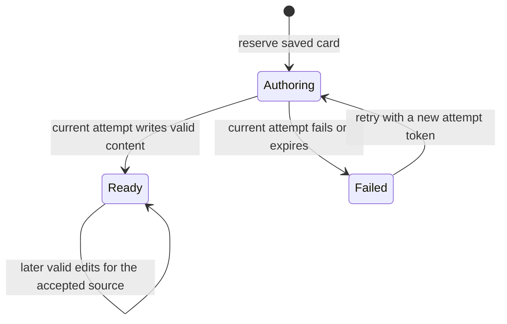
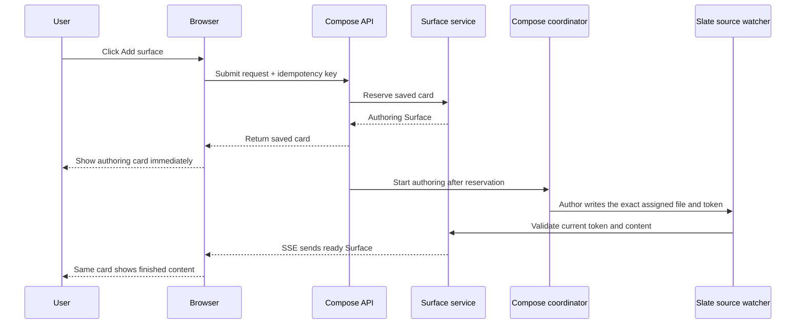

# Reliable Slate Bootstrap - Plan

## Goal Capsule

- **Objective:** Make every accepted Add surface action immediately create a visible card that becomes the requested surface or an explicit retryable failure.
- **Product authority:** This plan owns reliable Slate bootstrap only. Surface-first agent behavior and Keep-style reflow remain separate follow-on areas, and the existing resizable session/Slate workspace stays unchanged.
- **Open blockers:** None.
- **Execution profile:** Standard-depth implementation with focused tests at each state boundary and a browser test for the complete click-to-card experience.
- **Stop conditions:** Stop and revisit the product contract if implementation would require replacing the current authoring providers, changing the resizable workspace, or making an accepted card disappear.

---

## Product Contract

### Summary

This plan creates the visible card immediately and treats it as the real, saved surface—not a temporary placeholder.
The agent adds content to that same card.
If the agent fails, times out, or the server restarts, the card remains and explains what happened.

We will test the full journey from clicking Add surface to seeing the card appear and update in the browser.
This plan will not change which AI provider creates the content, teach agents to use Slate more often, or add Google Keep-style reflow.

### Problem Frame

The current Add surface path can acknowledge that authoring was dispatched and close the composer before any surface exists.
Authoring then proceeds out of view, so a later process, provider, authentication, timeout, validation, or projection failure looks identical to a successful request that is still taking time.

This breaks the Slate at its entry point.
A user who cannot trust the first click starts in the session text instead, leaving the Slate as an optional summary rather than the primary application surface.

### Key Decisions

- **A visible card is the creation receipt.** (session-settled: user-directed — chosen over treating author dispatch as success: pressing Add surface must make a surface appear instead of failing silently.) Governs R1, R5-R7.
- **Create the shell optimistically.** (session-settled: user-directed — chosen over waiting for finished content: the product directive is to keep interactions snappy and animate work that cannot finish immediately.) Governs R1-R4.
- **One card owns the whole creation lifecycle.** (session-settled: user-approved — chosen over a transient notice followed by a separate finished card: stable identity and position make progress and failure accountable.) Governs R2-R4, R8-R10.
- **Keep the resizable side-by-side workspace.** (session-settled: user-directed — chosen over flipping the session scroll behind the Slate: the Slate should earn primary status through better UX before the workspace shell changes.)

The creation lifecycle is visible on the Slate:

```mermaid
stateDiagram-v2
  [*] --> Authoring: Add accepted; card appears
  Authoring --> Ready: Valid content arrives
  Authoring --> Failed: Authoring cannot complete
  Failed --> Authoring: Retry in place
  Authoring --> Removed: User removes card
  Failed --> Removed: User removes card
  Ready --> Removed: Normal surface removal
```



`Removed` in this diagram means hidden from this browser through the existing reversible Slate control.
It is not a fourth server lifecycle state and does not delete the saved Surface.

<!-- ce-section: work-relationships -->
### How This Work Fits Together

This plan owns the first of three currently understood areas; the later areas are context, not a committed roadmap or active requirements.

- **Reliable Slate bootstrap — owned here.** Enables the Slate to become a trustworthy starting point by making every creation attempt visible and accountable.
  - **Surface-first agent behavior — later area.** Depends on reliable authoring for trust, then teaches agents to project decisions, progress, questions, results, and next actions onto surfaces so the transcript behaves like diagnostic logs.
  - **Keep-style reflow — later area.** Benefits from reliable creation because a denser card field matters once surfaces appear consistently; it can proceed independently at the code level and will cover multi-column packing without activity-driven reordering.

### Actors

- A1. **Slate user:** Chooses a template or freeform surface, expects immediate feedback, and retries or removes a failed card.
- A2. **Surface author:** Produces the requested content asynchronously and may succeed, fail, time out, or return unusable content.
- A3. **Tinstar host:** Creates and preserves the card identity, presents lifecycle state, accepts only the current authoring result, and keeps failures actionable.

### Requirements

**Optimistic presence**

- R1. Once Tinstar accepts an Add surface request, a card shell appears on the Slate before authored content is ready.
- R2. The shell identifies the requested template or freeform intent and reserves the identity and position of the finished surface.
- R3. Unless the user removes it, the same card transitions from authoring to ready or failed without replacement, disappearance, or completion-driven reordering.
- R4. Authoring state has a visible loading treatment and an equivalent reduced-motion presentation.

**Outcome accountability**

- R5. Dispatching work does not count as visible success; the composer closes only after the card shell has been created.
- R6. If Tinstar cannot create the shell, the composer remains open, preserves the draft, and explains that the request was not accepted.
- R7. Unless the user removes it, every accepted attempt reaches ready or failed within a bounded period; indefinite authoring is not a valid state.
- R8. A failed card remains on the Slate with a useful failure reason plus retry and remove actions.
- R9. Retry reuses the same card and position, and only the latest attempt may complete it.
- R10. Reload or host restart never turns an accepted attempt into silent absence; the card returns as ready, failed, or honestly recovering.

**Requested result**

- R11. A valid authoring result fills the reserved card with the requested surface content rather than creating a second card.
- R12. One user submission creates one card; repeated activation while acceptance is in flight cannot create duplicates.
- R13. A known template gives the optimistic shell a recognizable title and shape before its derived content arrives.
- R14. Open points with no unresolved items completes successfully as a visible No open points state.
- R15. After a card has been accepted, unreachable authors, provider failures, authentication failures, timeouts, invalid content, and update-projection failures become visible failed states rather than silent logs. An initial card that cannot be projected is rejected under R6 before acceptance.

### Key Flows

- F1. Add a surface successfully
  - **Trigger:** A1 submits a valid template or freeform request.
  - **Actors:** A1, A2, A3
  - **Steps:** A3 accepts the request and places its card shell; A2 authors the content; A3 validates the current result and fills the same card.
  - **Outcome:** The user sees immediate progress followed by the requested surface in the same location.
  - **Covered by:** R1-R5, R11-R13
- F2. Recover from failed authoring
  - **Trigger:** An accepted attempt cannot produce valid content within its allowed window.
  - **Actors:** A1, A2, A3
  - **Steps:** A3 marks the existing card failed and shows why; A1 retries or removes it; retry returns the same card to authoring and supersedes the earlier attempt.
  - **Outcome:** Failure is understandable and recoverable without duplicate cards or transcript diagnosis.
  - **Covered by:** R7-R10, R15
- F3. Reject before acceptance
  - **Trigger:** A3 cannot reserve a card for the submitted request.
  - **Actors:** A1, A3
  - **Steps:** The composer keeps the user's draft, reports the rejection, and offers another submission attempt.
  - **Outcome:** No card appears, but the product never implies that creation started.
  - **Covered by:** R5-R6, R12

### Acceptance Examples

- AE1. **Covers R1-R5, R11.** Given a valid Add surface request, when the user submits it, then a recognizable authoring card appears before derived content is ready and the finished content replaces that card's body in place.
- AE2. **Covers R7-R9, R15.** Given an author starts and later exits unsuccessfully, when the attempt settles, then its card remains visible as failed with a reason, retry, and remove actions.
- AE3. **Covers R5-R6.** Given Tinstar cannot reserve a card, when the user submits, then the composer stays open with the draft intact and does not claim the surface is being authored.
- AE4. **Covers R9.** Given a timed-out attempt finishes after the user has retried, when the old result arrives, then it cannot replace the newer attempt's state or content.
- AE5. **Covers R10.** Given an accepted card is authoring when the page or host restarts, when the Slate returns, then the card is still present and honestly shows its recovered state.
- AE6. **Covers R12.** Given an Add request is being accepted, when the user activates Add again, then only one reserved card exists.
- AE7. **Covers R13-R14.** Given the user requests Open points and the author finds nothing unresolved, when authoring completes, then the visible card reads No open points rather than disappearing.

### Scope Boundaries

#### Deferred to follow-up work

- Surface-first guidance that makes agents continuously maintain the Slate is deferred to a separate work area.
- Keep-style masonry or multi-column reflow beyond today's layout is deferred to a separate work area.

#### Other non-goals

- Flipping, hiding, or replacing the resizable session text pane is not part of this work.
- This work covers creation of new surfaces, not refresh behavior for an existing ready surface.
- Redesigning the template catalog or expanding what each template contains is not required beyond an optimistic shell and the explicit Open points empty state.

### Dependencies and Assumptions

- Surface authoring remains asynchronous and may fail after work has started.
- The existing Slate identity and projection model can be extended so a reserved card and its authored result converge on one surface.
- Creation lifecycle state must be durable enough to satisfy R10 rather than existing only in one browser render.
- Existing surface controls and design language remain the visual baseline; loading animation must respect reduced-motion preferences.

### Sources and Grounding

- `src/components/RunWorkspaceWidget/SlateComposer.tsx` currently closes the non-inline composer after a successful request response, before observing a surface.
- `src/server/api/routes.ts` currently treats author dispatch or prompt delivery as the compose response and persists no creation record.
- `src/server/sessions/surfaceAuthor.ts` currently launches compose authoring fire-and-forget and reports later process failures only through logs.
- `docs/plans/2026-07-24-001-feat-recursive-collaborative-surfaces-plan.md` establishes surface-first interaction as the broader product direction while preserving the transcript as an audit fallback.
- `docs/plans/2026-07-21-002-feat-the-slate-v2-plan.md` records multi-column reflow beyond two columns as deferred work.

---

## Planning Contract

- **Product contract preservation:** Unchanged. The implementation below realizes R1-R15 and AE1-AE7 without adding product scope.
- **Implementation boundary:** Change the saved Surface record, compose orchestration, source reconciliation, and Slate rendering needed for reliable creation. Keep the current provider selection and refresh system intact.
- **Testing boundary:** Prove state transitions in service and coordinator tests, prove API and React behavior at their boundaries, then prove the visible journey in a browser.
- **Documentation boundary:** Update lasting documentation only where the saved-card authoring contract changes. Do not turn this plan into permanent architecture documentation.

## How the Implementation Works

### The saved card is the source of truth

The first successful server write creates the real Surface record with an `authoring` state, a stable identity, its intended position, and enough information to describe what is being created.
The browser renders that saved record immediately.
Finished content, failure, retry, reload, and restart recovery all update the same record.

Creation has three server-owned states:



Each attempt receives an opaque token generated by the host.
The author must write that token with its result.
The source watcher accepts a result only when its token matches the card's current attempt, so a timed-out first attempt cannot overwrite a successful retry.

### Request and update sequence



If dispatch, execution, validation, or the deadline fails, the coordinator first asks the watcher to check the assigned file one final time.
If no valid current result exists, it marks the saved card failed.
On server startup, the same check runs before any stranded `authoring` card is marked failed because of the restart.

### Key technical decisions

1. **Store creation state on the Surface record.** The real saved card needs to survive reloads and restarts; a browser-only placeholder or separate temporary job cannot satisfy R3 or R10.
2. **Reserve before dispatch.** The API returns success only after the card is durably saved. Starting an author is not acceptance.
3. **Use one identity through every state.** Ready content is written into the reserved Surface rather than projected as a second Surface.
4. **Use idempotency at the API boundary.** The browser sends one key per submission and reuses it after an ambiguous network failure. Replayed acceptance returns the same card and does not dispatch a duplicate author.
5. **Use attempt tokens for latest-retry-wins.** The token travels through the exact assigned source entry but is not part of authored display content. Results from superseded attempts are refused.
6. **Keep composed results card-shaped.** A compose-created Surface retains a small saved presentation hint after it becomes ready, so an Open points request does not turn into multiple rows or move to another Slate region.
7. **Keep lifecycle writes bounded.** Store a compact label and retry input while authoring or failed. Once ready, discard the full request text and retain only the small provenance needed to reject stale results.
8. **Use server time for failure.** A single coordinator sweep handles deadlines. The browser never guesses that work timed out.
9. **Treat Remove as hide, not deletion.** Failed cards use the Slate's existing hide/reveal behavior, preserving recovery and audit information.
10. **Keep provider architecture unchanged.** The coordinator observes the existing one-shot author or main-agent delivery path; it does not choose a new provider model.
11. **Treat the attempt token as correlation, not authority.** Compose and retry keep the existing run API access boundary. The token only connects watched output to the current saved attempt; it is validated as bounded host data and never used as a credential.

Before the reservation is committed, the service must also prove that the candidate can be projected into `Run.slate`.
That keeps projection errors on the rejection side of the acceptance boundary: the composer remains open instead of accepting a card the browser cannot render.

## System-Wide Impact

| Area | Change | Important invariant |
| --- | --- | --- |
| Saved data | Add optional creation state and a compose-card presentation hint to `Surface` | Older records without these fields still load; no sidecar version bump unless strict validation proves one is required |
| Mutation service | Add reserve, retry, ready, and fail operations behind revision and idempotency checks | Every visible transition is durably written before it is broadcast |
| Authoring source | Assign one exact file, local ID, and attempt token | Only the current token may fill the reserved card |
| Process orchestration | Observe dispatch completion, deadlines, and startup recovery | Exit code zero alone is not success; valid watched content is success |
| API | Return the reserved card, not a dispatch boolean; add retry | One submission and one idempotency key produce one card |
| Projection and SSE | Carry creation and presentation state into `Run.slate` | Reload and live updates show the same state and identity |
| Slate UI | Render authoring, failed, retry, remove, and ready in the same card slot | Active search cannot hide the newly accepted card receipt |
| Templates | Share template metadata between browser and server | Templates describe content; the host chooses identity, file, and attempt token |
| Agent and file authoring | Accept the new attempt envelope only for host-reserved compose cards | Existing direct file-authored Surfaces keep their current workspace, permissions, and reconciliation path |

### Failure and recovery rules

- A reservation write failure rejects the request. The composer stays open and preserves its draft.
- An initial projection failure also rejects the request before dispatch; it is not an accepted invisible card.
- A dispatch failure, non-zero process exit, authentication failure, or timeout marks the card failed after one final source observation.
- A successful process exit does not mark the card ready; readiness requires valid watched content with the current attempt token.
- Invalid content leaves the card visible and ends in a useful failed state rather than disappearing into server logs.
- A late result for a failed attempt does not revive the card. Retry creates a new token on the same card.
- Startup recovery re-observes the assigned source before marking an interrupted authoring attempt failed with a restart explanation.
- Repeated equivalent lifecycle writes are no-ops so the deadline sweep and watcher do not create revision or SSE churn.
- Compose and retry preserve the current 8 KiB request limit, validate template IDs server-side, and keep raw process details out of browser-facing failure text.

## Implementation Units

### U1 — Add a durable creation lifecycle to Surface

**Purpose:** Make the immediately visible card a real saved record that can survive reloads and restarts.

**Covers:** F1-F3; AE1, AE3-AE6; R1-R3, R5-R12, R15.

**Files to change:**

- `src/domain/types.ts`
- `src/server/stores/surface-persistence.ts`
- `src/server/surfaces/surface-service.ts`
- `src/server/surfaces/run-slate-bridge.ts`
- `src/server/stores/run-slate-projection.ts`
- `src/server/surfaces/__tests__/surface-service.test.ts`
- Add or extend projection and persistence tests beside their implementations

**Work:**

- Add optional `authoring`, `ready`, and `failed` creation state to the canonical Surface type, including compact intent, attempt, timing, safe failure, and retry data.
- Add a saved hint that keeps compose-created results in the card presentation throughout their lifecycle.
- Extend persisted validation and hydration without invalidating existing version-1 sidecars.
- Add service operations that reserve a compose card, begin a retry on the same identity, accept the current result, and fail the current attempt.
- Validate that the candidate Surface can project into the run's Slate before committing its reservation, so an unrenderable card is rejected rather than accepted invisibly.
- Put revision checks, latest-token checks, no-op equality, and persisted idempotency in the service rather than routes or UI code.
- Extend the run alias bridge and Slate projection so the same Surface ID and order appear in `Run.slate` before and after completion.
- Strip bulky retry input when the card becomes ready while retaining the compact current-attempt marker needed to refuse stale output.

**Tests first:**

- Reserving twice with the same idempotency key returns one Surface and one order slot.
- Authoring, failed, retry, and ready states survive store reload.
- Retry keeps identity and position but replaces the attempt token.
- An old token cannot complete a newer attempt.
- An equivalent lifecycle write does not advance revisions or emit another change.
- Existing Surface records without creation fields still hydrate and project normally.

**Completion evidence:** A service-level test can create the card, simulate failure and retry, complete it with the current token, reload the store, and observe one ready Surface with the original ID and position.

### U2 — Give every author one exact destination

**Purpose:** Ensure authored content fills the card that the user already sees.

**Covers:** F1-F2; AE1, AE4, AE7; R2-R3, R9, R11, R13-R15.

**Files to change:**

- Move `src/components/RunWorkspaceWidget/surfaceCatalog.ts` to a shared module under `src/slate/` and update imports
- `src/server/sessions/slate-watcher.ts`
- `src/server/surfaces/slate-source.ts`
- `src/server/surfaces/source-reconciler.ts`
- `src/server/surfaces/__tests__/slate-source.test.ts`
- `src/server/surfaces/__tests__/source-reconciler.test.ts`
- Catalog and prompt tests beside the shared module

**Work:**

- Make template ID, display label, shell treatment, and content instructions available to both browser and server from one shared catalog.
- Remove filename and ID choices from individual template prompts. Build one central instruction that names the host-assigned file, local ID, and attempt token.
- Extend the watched source envelope with the host-issued attempt token, parsed separately from the display content and source watermark.
- Reconcile a matching result into the reserved canonical Surface in one durable mutation that updates content, source evidence, and creation state together.
- Refuse missing, mismatched, superseded, or failed-attempt tokens with a diagnostic the coordinator can turn into a useful card failure.
- Change Open points authoring to produce exactly one card containing its list, and require the visible text `No open points` when the list is empty.
- Leave ordinary direct file-authored open-point rows unchanged; the one-card rule applies to Add surface composition.

**Tests first:**

- A valid current token fills the reserved Surface rather than creating another one.
- A stale token after retry cannot alter content or state.
- Invalid source content cannot mark a card ready.
- A normal direct-authored Surface without a creation token follows the existing reconciliation path.
- Open points with zero results creates one valid ready card with the required empty state.
- Freeform or template text that asks for another file, ID, or token cannot override the host-assigned destination.

**Completion evidence:** A filesystem-backed reconciliation test starts with one authoring card, writes its assigned source entry, and ends with one ready card using the same canonical ID.

### U3 — Coordinate dispatch, deadlines, retry, and restart recovery

**Purpose:** Turn every accepted attempt into a visible ready or failed outcome.

**Depends on:** U1 for saved lifecycle mutations and U2 for exact source correlation.

**Covers:** F1-F3; AE1-AE6; R1, R5-R12, R15.

**Files to change:**

- Add `src/server/surfaces/surface-compose-coordinator.ts`
- Add `src/server/surfaces/__tests__/surface-compose-coordinator.test.ts`
- `src/server/sessions/surfaceAuthor.ts`
- `src/server/sessions/__tests__/surfaceAuthor.test.ts`
- `src/server/api/routes.ts`
- `src/server/api/__tests__/routes.slate.test.ts`
- `src/server/index.ts`

**Work:**

- Introduce a small compose coordinator after the Slate watcher starts. It owns dispatch settlement, deadline sweeps, final source observation, and startup recovery.
- Change the one-shot surface author wrapper to report completion, process errors, non-zero exits, and timeout instead of returning only `dispatched`.
- Reserve the Surface synchronously in the compose route, return its projection, and begin asynchronous authoring only for a fresh reservation.
- Map the `Idempotency-Key` header into the existing call context used by persisted Surface idempotency.
- Preserve the route's current combined 8 KiB prompt/freeform/recipe limit before saving retry input, and resolve known template IDs from the shared server-side catalog rather than trusting catalog prompt text from the browser.
- Add a retry route that checks the Surface belongs to the named run, moves the same failed Surface back to authoring with a new token, and dispatches only that fresh attempt.
- Give retry its own stable idempotency key so double activation or an ambiguous retry response cannot mint multiple tokens or dispatch multiple authors.
- For the existing main-agent fallback, treat failed delivery as a card failure and successful delivery as “waiting for watched content,” not as ready.
- Before failing any settled process, expired attempt, or recovered restart, ask the watcher to re-observe the exact run so content written just before the failure wins.
- On startup, recover saved authoring cards: re-observe their source, then fail any still-unresolved attempts with a safe restart reason.
- Keep one bounded deadline sweep rather than one timer per card. Use the configured `slate.author.timeoutMs` as the attempt deadline for both author paths so the child timeout, coordinator, tests, and UI describe one bound.

**Tests first:**

- The route persists and returns a card before dispatch is considered successful.
- A replayed idempotent request does not dispatch again.
- Process error, non-zero exit, delivery failure, invalid output, and deadline each produce one failed Surface.
- A valid file found during the final observation becomes ready instead of failed.
- Restart recovery preserves and resolves the card; it never deletes or forgets it.
- Retry dispatches a new token against the same Surface.
- A replayed retry response returns the same new attempt and does not dispatch it twice.

**Completion evidence:** Coordinator tests cover the state table, and the API test shows that `{ dispatched: true }` is no longer the success contract.

### U4 — Render the lifecycle in the Slate

**Purpose:** Make the click feel immediate and make later outcomes understandable without reading the transcript or server logs.

**Depends on:** U1's projected state and U3's compose/retry responses. It can start with those contracts before U2's author path is complete.

**Covers:** F1-F3; AE1-AE7; R1-R9, R11-R15.

**Files to change:**

- `src/components/RunWorkspaceWidget/SlateComposer.tsx`
- `src/components/RunWorkspaceWidget/SlatePanel.tsx`
- Add a small creation-state component beside the Slate components if it keeps state rendering focused
- `src/components/RunWorkspaceWidget/OpenPointsSurface.tsx` only if needed to preserve the composed-card path
- `src/components/RunWorkspaceWidget/__tests__/SlateComposer.test.tsx`
- `src/components/RunWorkspaceWidget/__tests__/SlatePanel.test.tsx`
- `src/index.css`

**Work:**

- Generate one stable idempotency key per submission and reuse it when retrying an ambiguous acceptance request.
- Send the selected template ID rather than trusting browser-supplied template prompt text; keep freeform and recipe text as bounded user input.
- Treat a returned saved Surface as acceptance. Only then close the composer and clear its draft.
- Keep the composer and draft visible when reservation fails; show the server's safe rejection message.
- Keep a small local overlay of the actual saved Surface returned by the API while normal SSE delivery catches up. Merge it with the `surfaces` prop by stable ID, and discard the overlay entry when that ID arrives at an equal or newer revision, so either response/SSE order produces one uninterrupted card.
- Clear an active Slate search after local acceptance, or otherwise exempt the newly accepted card, so the visible receipt cannot be filtered out by an old query.
- Render authoring with a recognizable template/freeform label and a loading treatment based on the existing Slate animation language.
- Render failed with a useful reason, Retry, and Remove. Retry changes the same card in place; Remove uses existing hide/reveal preferences.
- Respect `prefers-reduced-motion` with an equally clear static authoring treatment.
- Announce authoring and failure state changes with accessible status text, keep Retry and Remove keyboard reachable, and move focus to a stable card target if the control holding focus disappears during a transition.
- Preserve one DOM/card identity and grid position as state changes.

**Tests first:**

- The composer closes only after receiving a Surface and stays open with its draft on reservation failure.
- Double activation and response/SSE races render one card.
- An accepted card remains visible when search was previously active.
- Authoring, failed, retrying, and ready render in one card with the correct actions.
- Reduced motion removes animation without removing the authoring signal.
- Retry calls the retry endpoint for the existing Surface ID rather than composing another Surface.
- Screen-reader status and keyboard focus remain usable across authoring, failure, and retry.

**Completion evidence:** Component tests observe one stable card through authoring → failed → retrying → ready and verify that the composer never treats a dispatch-only response as success.

### U5 — Prove the full click-to-card journey and preserve lasting guidance

**Purpose:** Verify the feature at the level the user experiences it and record only the durable contract.

**Depends on:** U1-U4.

**Covers:** F1-F3; AE1-AE7; R1-R15.

**Files to change:**

- Add `e2e/slate-compose-bootstrap.spec.ts`
- `CONCEPTS.md`
- Update `docs/solutions/documentation-gaps/slate-surface-authoring-contract.md` if its authoring contract is superseded
- Update other lasting authoring documentation only when implementation changes its stated contract

**Work:**

- Add a browser test that opens Add surface, submits a known template, sees the saved authoring card immediately, and observes the same card reach a terminal state.
- Cover the failed state and in-place Retry/Remove controls in the browser. Cover ready reconciliation with the real watcher/source boundary in an integration test if the browser harness cannot run an author process.
- Add a browser assertion for Open points with no results showing one `No open points` card.
- Keep tests tied to real production boundaries or the repository's supported isolated backend fixture; do not add production mock behavior to make the test pass.
- Keep the new `Optimistic surface shell` vocabulary entry, and revise the lasting authoring contract so future work knows that an accepted compose request means a saved card exists.
- Run documentation hygiene: retain the plan as execution history, keep lasting concepts in their canonical docs, and avoid duplicating implementation details across documents.

**Completion evidence:** The browser recording or trace shows that the first visible result of Add surface is the saved card, and every accepted test attempt finishes ready or failed without inspecting the transcript.

## Verification Contract

### Focused checks during implementation

Run the smallest relevant test after each unit, including new test files:

```bash
npx vitest run --exclude='e2e/**' \
  src/server/surfaces/__tests__/surface-service.test.ts \
  src/server/surfaces/__tests__/source-reconciler.test.ts \
  src/server/surfaces/__tests__/surface-compose-coordinator.test.ts \
  src/server/sessions/__tests__/surfaceAuthor.test.ts \
  src/server/api/__tests__/routes.slate.test.ts \
  src/components/RunWorkspaceWidget/__tests__/SlateComposer.test.tsx \
  src/components/RunWorkspaceWidget/__tests__/SlatePanel.test.tsx
```

### Required quality gates

```bash
npm run typecheck
npm run lint
npm run test:unit
npx playwright test e2e/slate-compose-bootstrap.spec.ts
```

Run the full browser suite before handoff when the environment supports its configured services:

```bash
npm run test:e2e
```

### Acceptance proof

- Capture the card's Surface ID and position before content arrives and assert they are unchanged after ready or failed.
- Assert the compose response contains a saved Surface rather than a delivery boolean.
- Reload during authoring and verify that the card remains visible.
- Restart the host in the coordinator integration test and verify that the card resolves ready if valid content exists, otherwise failed with a restart reason.
- Retry after failure, deliver an older attempt result, and verify that only the new token can change the card.
- Verify that removing a failed card uses hide/reveal and does not delete the saved Surface.

## Risks and Guardrails

| Risk | Guardrail |
| --- | --- |
| The response and SSE event race, producing two cards | Reconcile by the server-issued Surface ID and test both arrival orders |
| A late first attempt overwrites a retry | Mint a new attempt token on retry and enforce it inside the mutation service |
| A process writes valid content just before failing | Re-observe the exact run before writing failed state |
| Restart recovery destroys evidence | Persist before dispatch, re-observe first, then mark unresolved cards failed in place |
| Lifecycle data bloats the whole-file sidecar | Keep creation metadata compact and remove full request text on ready |
| Deadline sweeps create revision/SSE storms | Make unchanged lifecycle writes no-ops and use one bounded sweep |
| Search makes an accepted card appear missing | Clear or bypass the current query for the locally accepted card |
| The Open points template accidentally recreates the current multi-row fan-out | Require exactly one assigned source entry and test the empty one-card result |
| User-facing errors expose process details | Store a safe category and message; keep raw diagnostics in logs |
| A new compose envelope breaks direct agent-authored files | Gate token enforcement on a saved compose lifecycle and retain the existing token-free reconciliation tests |
| Projection fails after persistence and leaves an invisible accepted record | Preflight the pure run projection before committing the reservation; reject without dispatch if it cannot render |
| Browser-supplied template text overrides the reserved destination | Accept template IDs, rebuild content instructions on the server, and append the host-owned file/ID/token contract outside user text |
| A retry double-click creates two current attempts | Disable retry while acceptance is in flight and persist an idempotency receipt for each retry activation |

## Definition of Done

- Every accepted Add surface request has a durably saved Surface before authoring starts.
- The composer closes only when it receives that saved Surface.
- One card keeps the same identity and position through authoring, ready, failed, and retry.
- Duplicate submissions and response/SSE races do not create duplicate cards or author processes.
- Provider, process, timeout, invalid-content, and restart failures are visible and actionable on the card.
- Reload and server restart preserve an honest state; no accepted card silently disappears.
- A stale attempt cannot overwrite a retry.
- Open points creates one card and renders `No open points` when empty.
- Loading is clear with and without animation.
- Existing direct file-authored surfaces and refresh behavior continue to pass their tests.
- Focused tests, typecheck, lint, the unit suite, and the targeted browser test pass; the full browser suite passes when its services are available.
- Permanent documentation describes the saved-card acceptance contract, while surface-first agent guidance and Keep-style reflow remain clearly deferred.
