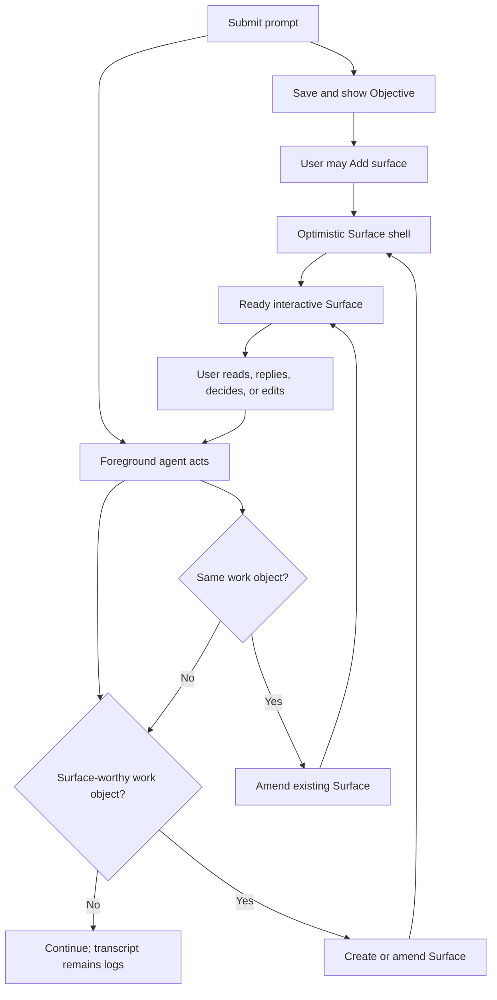
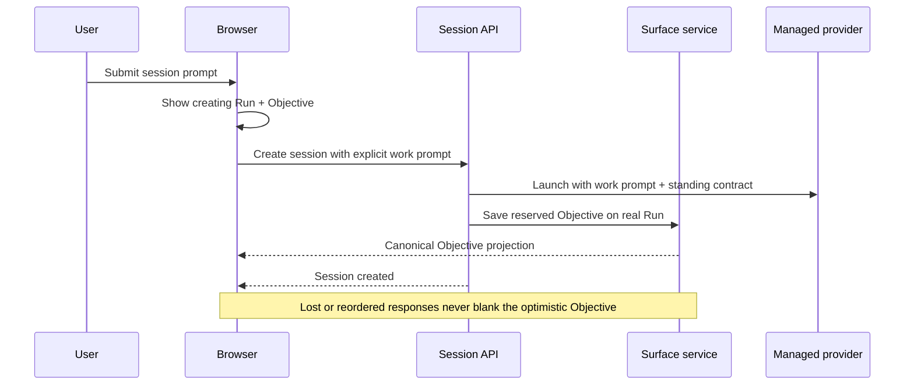
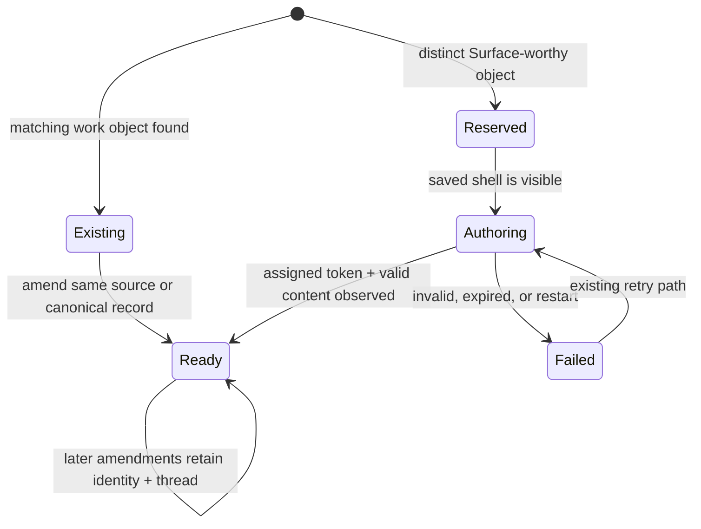

# Slate-First Live Authoring - Plan

## Goal Capsule

- **Objective:** Make the Slate the normal place to understand and interact with a managed session by turning the launch prompt into its Objective and having the foreground agent maintain useful Surfaces while it works.
- **Product authority:** This plan owns live Surface authoring and the initial Surface-worthiness envelope. Reliable Add surface creation remains owned by `docs/plans/2026-08-07-001-feat-reliable-slate-bootstrap-plan.md`, and synchronization after source drift remains owned by `docs/plans/2026-08-05-001-feat-trusted-atomic-surface-refresh-plan.md`.
- **Open blockers:** None. The middle of the Surface-worthiness envelope is intentionally judgment-based and should be tuned from use rather than fully prescribed before implementation.

---

## Product Contract

### Summary

A submitted prompt becomes the session Objective, and the foreground agent begins acting on it while maintaining the Slate as the primary human workspace.
Users and agents create or amend Surfaces when the work produces something with standalone value, while conversation turns and raw activity remain in the transcript as logs.

### Problem Frame

Reliable creation solves the Slate's entry-point failure but does not make the Slate primary by itself.
Managed agents currently have no standing obligation to put their work on Surfaces, so a user still starts in the transcript and must repeatedly ask for visible artifacts.

Guidance alone risks being forgotten, while mechanically projecting every turn would recreate the transcript as cards.
The product needs a small set of hard rails around a deliberately flexible middle so different kinds of work can produce useful Surfaces without card spam.

### Key Decisions

- **The launch prompt becomes the Objective.** (session-settled: user-directed — chosen over a universal Run Brief or fixed dashboard: the prompt already supplies the only object every session shares.) Governs R1-R3.
- **Surfaces represent work objects, not turns.** (session-settled: user-directed — chosen over one Surface per turn: turn-shaped cards would recreate the transcript as tiles.) Governs R8-R10.
- **Use hard rails around an agent-judged middle.** (session-settled: user-approved — chosen over a fixed Surface taxonomy or unconstrained discretion: obvious inclusions and exclusions are stable, while a new work style needs room to learn.) Governs R5-R7.
- **The live-authoring obligation is automatic.** (session-settled: user-directed — chosen over optional guidance that users must repeat: Slate-first behavior must be present without reminders.) Governs R4, R15.
- **Refresh remains the synchronization engine.** (session-settled: user-directed — chosen over redesigning refresh around live authoring: recipes already own reconciliation after source drift, while this plan owns foreground creation and amendment.) Governs R13-R14.
- **Keep the resizable side-by-side workspace.** (session-settled: user-directed — chosen over flipping the transcript behind the Slate before the Slate UX is proven: the pane ratio can express priority without hiding either surface.)

The live-authoring path is semantic rather than chronological:

### Actors

- A1. **Human collaborator:** Starts the session, creates Surfaces directly, and interacts with agent-authored Surfaces without needing the transcript for normal orientation.
- A2. **Foreground agent:** Acts on the Objective and creates or amends Surfaces during its existing turns.
- A3. **Tinstar host:** Creates the Objective and optimistic Surface shells, supplies the standing authoring contract, preserves Surface identity, and routes interactions.

### Requirements

**Objective-first bootstrap**

- R1. Submitting the launch prompt creates or sets the run's visible Objective as part of starting the managed session.
- R2. The Objective appears optimistically so the Slate has a meaningful starting object before agent-authored content is ready.
- R3. The launch prompt still reaches the foreground agent as work to perform; making it visible as the Objective does not turn it into a passive note.
- R4. Every supported managed-agent path receives a standing Slate-first live-authoring contract automatically, and that obligation survives the session mechanisms that otherwise make user guidance easy to lose.

Here, **supported** means a managed provider adapter that implements the standing-instruction capability. In this plan that is Claude, Codex, and Cursor; the arbitrary generic terminal adapter remains available for historical sessions but does not claim Slate-first support.

**Surface-worthiness envelope**

- R5. The agent always creates or updates a Surface for an explicitly requested Surface, an item awaiting user action, a primary result needed to judge the Objective, or a blocker that stops progress and needs user intervention.
- R6. The agent never creates a Surface solely for a conversational turn, raw tool or terminal output, a transient working pulse, a microscopic completed step, private chain-of-thought, or content already owned by another Surface.
- R7. For evolving plans, progress, research, comparisons, explainers, risks, assumptions, and side threads, the agent uses prose guidance: favor a Surface when the thing is understandable outside the conversation, likely to be revisited, meaningfully evolves in place, supports user action or evaluation, or prevents transcript inspection.

**Creation, identity, and interaction**

- R8. Surface count has no prescribed relationship to turn count; a long exchange may amend one Surface, and one turn may create several genuinely distinct work objects.
- R9. When new information belongs to an existing work object, the agent amends that Surface under the same identity rather than creating a new card.
- R10. When a distinct work object earns a Surface, the agent creates it promptly enough that the user can follow the work from the Slate rather than reconstructing it from the transcript.
- R11. User-created and agent-created Surfaces use the same visible lifecycle principle: the card appears as soon as creation is accepted or committed, then becomes ready or failed in place.
- R12. Replies, choices, edits, and other Surface interactions return to the foreground collaboration path and lead to an amendment of the same Surface unless the interaction introduces a distinct work object.

**Authority and accountability**

- R13. Foreground live authoring creates and amends Surfaces as part of ordinary work; it does not wait for a refresh recipe to notice missing content.
- R14. Existing refresh recipes remain responsible for synchronizing an existing Surface after source drift and retain their current human-intent, budget, deduplication, and atomic-replacement rules.
- R15. The live-authoring contract cannot depend on the user reminding the agent to use the Slate, and omission of an always-in item must be observable during product verification rather than accepted as normal behavior.

### Key Flows

- F1. Objective-first session start
  - **Trigger:** A1 submits a prompt to start a managed session.
  - **Actors:** A1, A2, A3
  - **Steps:** A3 saves and shows the prompt as the Objective, starts A2 with the same work, and supplies the live-authoring contract.
  - **Outcome:** A1 can begin from the Slate while A2 acts on the visible Objective.
  - **Covers:** R1-R4.
- F2. Agent-authored work object
  - **Trigger:** A2's work produces a candidate that passes R5 or the R7 judgment test.
  - **Actors:** A2, A3
  - **Steps:** A2 first looks for the Surface that already owns the subject, amends it if found, or creates one visible card for the distinct object.
  - **Outcome:** The Slate gains or updates a reusable work surface without gaining a turn receipt.
  - **Covers:** R5-R11, R13.
- F3. User-authored Surface
  - **Trigger:** A1 uses Add surface or asks A2 to create a named Surface.
  - **Actors:** A1, A2, A3
  - **Steps:** A3 shows the optimistic shell, A2 authors into that identity when generation is needed, and the same card settles ready or failed.
  - **Outcome:** Manual creation and conversational creation are both visible and accountable.
  - **Covers:** R5, R11.
- F4. Interaction with an existing Surface
  - **Trigger:** A1 replies, chooses, edits, or otherwise acts on a Surface.
  - **Actors:** A1, A2, A3
  - **Steps:** A3 routes the interaction to A2, which continues the work and updates the owning Surface or creates a new one only for a new work object.
  - **Outcome:** Collaboration remains on the Slate while the transcript records the underlying exchange.
  - **Covers:** R8-R10, R12.
- F5. Existing Surface drifts
  - **Trigger:** A source event, deadline, or witness marks an existing Surface dirty.
  - **Actors:** A1, A2, A3
  - **Steps:** The existing refresh contract checks or reconciles the Surface according to its recipe and authority class.
  - **Outcome:** Live authoring does not create a second synchronization system or reopen autonomous model refresh.
  - **Covers:** R13-R14.

### Acceptance Examples

- AE1. **Covers R1-R4.** Given a user starts a session with a substantive prompt, when the run appears, then the prompt is already visible as the Objective and the foreground agent is acting on it with the live-authoring contract present.
- AE2. **Covers R5, R10-R12.** Given the agent needs the user to choose between approaches, when the choice is ready, then an interactive Surface appears and the eventual answer amends that work object instead of existing only in the transcript.
- AE3. **Covers R6, R8-R9.** Given ten conversational turns refine one analysis, when the analysis changes, then its existing Surface is amended and the Slate does not gain ten turn-summary cards.
- AE4. **Covers R7, R9-R10.** Given a long investigation has evolving findings that the user would otherwise need the transcript to understand, when those findings become coherent enough to stand alone, then the agent creates or updates one research Surface and continues revising it in place.
- AE5. **Covers R5, R11.** Given the user selects Add surface, when Tinstar accepts the request, then the optimistic card is immediately visible and later settles ready or failed under the same identity.
- AE6. **Covers R5, R15.** Given the foreground agent reaches a blocker that requires user intervention, when progress stops, then the blocker is visible and actionable on the Slate without the user first discovering it in the transcript.
- AE7. **Covers R13-R14.** Given an existing agent-written Surface becomes dirty while Tinstar is unattended, when invalidation arrives, then the refresh contract marks or checks it without live authoring spawning a second agent or autonomous model loop.

### Success Criteria

- On representative managed-session tasks, the user can identify the Objective, every item awaiting them, and the primary result from the Slate without reading the transcript.
- Supported managed-agent paths exhibit Slate-first authoring without a user reminder after launch, restart, or ordinary context loss.
- Agent-created Surface count tracks distinct work objects rather than conversation length, with no recurring working-pulse or turn-summary cards.
- Existing work objects retain one identity and thread as they evolve.
- Live authoring creates no autonomous refresh workers and does not weaken the existing refresh authority contract.

### Scope Boundaries

- Google Keep-style multi-column layout and card reflow remain a later work area.
- Flipping, hiding, or replacing the resizable transcript pane is not part of this work.
- This work does not introduce a universal Run Brief, fixed Progress / Decisions / Results dashboard, or required Surface taxonomy.
- This work does not create one Surface per turn or automatically project transcript messages into cards.
- This work does not redesign refresh recipes, claims, witnesses, atomic replacement, freshness, provider budgets, or human-intent gates.
- This work does not require a broader authoring-provider redesign beyond what is needed to deliver the standing contract across supported managed-agent paths.

<!-- ce-section: work-relationships -->
### How This Work Fits Together

This plan owns Stage 2, live Surface-first authoring. The surrounding areas are current context rather than a committed roadmap.

- **Depends on** `docs/plans/2026-08-07-001-feat-reliable-slate-bootstrap-plan.md`: accepted creation must already produce a durable optimistic card instead of failing silently.
- **Shares boundaries with** `docs/plans/2026-08-05-001-feat-trusted-atomic-surface-refresh-plan.md`: live authoring owns foreground creation and amendment, while refresh owns later synchronization after drift.
- **Enables** a later Keep-style reflow area: denser multi-column layout becomes valuable once Surfaces reliably carry the collaboration.
- **Can proceed independently of** flipping the transcript behind the Slate because the existing horizontal resize already lets the user change the visual ratio.

### Dependencies and Assumptions

- The Objective remains one durable, visible run-scoped object even when its initial value comes from the launch prompt.
- Supported managed-agent paths can receive a standing product contract without requiring the user to install or invoke an optional skill.
- The existing Surface identity, optimistic creation, thread, and interaction paths can support both user-initiated and agent-initiated authoring.
- The Surface-worthiness middle will need observation and prose tuning after real use; this is expected product learning rather than an unresolved planning blocker.

### Sources and Research

- `docs/essays/out-of-your-brain-onto-the-pane.md` establishes the product principle that human-relevant state belongs on visible surfaces rather than in text meant for agents.
- `docs/VISION.md` establishes observable artifacts as the coordination boundary and keeps the product agent-agnostic.
- `docs/plans/2026-08-07-001-feat-reliable-slate-bootstrap-plan.md` owns optimistic durable creation and the unchanged resizable workspace.
- `docs/plans/2026-08-05-001-feat-trusted-atomic-surface-refresh-plan.md` owns refresh authority and the prohibition on ambient LLM refresh.
- `docs/solutions/conventions/agent-prompt-delivery-and-surface-refresh.md` records the existing distinction between delivered agent guidance and Surface refresh behavior.
- `docs/solutions/tooling-decisions/per-session-mcp-config-outside-the-repo.md` establishes that Tinstar-generated per-session agent configuration belongs in session state, never the user's worktree.
- `docs/solutions/conventions/widget-to-agent-answer-back.md` establishes persist-first, best-effort prompt delivery for interactive Surface answers.
- OpenAI's official [Codex configuration reference](https://developers.openai.com/codex/config-reference) documents `developer_instructions` as the supported session instruction field; the existing Codex adapter already injects one-off values through `--config`.
- Cursor's official [CLI rules documentation](https://docs.cursor.com/en/cli/using), [rules reference](https://docs.cursor.com/context/rules), and [plugin announcement](https://cursor.com/blog/marketplace) establish that CLI sessions load persistent rules and that plugins package system-level rules. The installed CLI's `--help` additionally confirms the local `--plugin-dir` launch seam; implementation must retain an empirical capability probe because that local-plugin detail is version-sensitive.

---

## Planning Contract

- **Product contract preservation:** Implement the full accepted Stage 2 contract above. Do not replace its judgment-based Surface-worthiness envelope with a fixed taxonomy or mechanically derive cards from turns.
- **Implementation boundary:** Extend the existing session-launch, canonical Surface, Slate file-ingress, and prompt-delivery seams. A narrow provider capability for standing instructions is in scope; a general provider rewrite is not.
- **Compatibility boundary:** Existing Add surface, direct `.tinstar/slate` authoring, Surface refresh, horizontal workspace resize, and transcript behavior remain valid. New foreground authoring uses the reliable reservation path by default without invalidating old files.
- **Rollout boundary:** New sessions receive the contract at launch. Existing stopped sessions receive it when Tinstar next starts them. Already-running sessions are not interrupted by a rollout prompt.
- **Testing boundary:** Prove optimistic browser state, durable server state, provider-specific launch assembly, agent reservation and amendment, interaction routing, restart behavior, and the absence of refresh fan-out. Behavioral acceptance must inspect the resulting Slate, not only the injected instruction string.
- **Documentation boundary:** Keep this file as the decision and implementation record. On shipment, update the lasting Slate authoring documentation and glossary, then seal this plan rather than copying its implementation checklist into another planning artifact.

## How the Implementation Works

### One prompt, two simultaneous outcomes

The human-authored launch prompt has two jobs and neither replaces the other:

1. The browser immediately projects the exact trimmed prompt as the optimistic Objective on the creating Run.
2. The server delivers the same prompt to the foreground agent as its initial work.

The server persists the Objective under the existing reserved `objective` identity after the real Run exists and before launch registration is considered complete. The originating browser keeps its optimistic Objective until the canonical Objective arrives, including across an SSE snapshot that contains the backend Run slightly before its Surface projection. A failed session launch remains inspectable with its Objective and failure state instead of disappearing.

Only an explicit caller work prompt is Objective material. A resolved hand persona, generated introduction, Marshal boot message, parent-channel instructions, and other host-authored launch prose are delivery machinery, not the user's goal. Session creation therefore carries `initialPrompt` and `objective` as separate values even when they contain the same user text on the normal path.

The Objective keeps the exact trimmed prompt rather than an agent summary. Replace the current Objective-only 600-character ceiling with one shared 32 KiB character limit for both a session's explicit work prompt and later Objective edits. Validate it before optimistic creation and before backend provisioning. This adds a generous safety boundary without truncating or silently changing accepted text; the Objective card remains scrollable/editable when the prompt is long.

### A standing contract, delivered by each provider

Create one concise, versioned Slate-first contract owned by the host. It contains the accepted always-in, always-out, and judgment tests; says that work objects rather than turns own Surface identity; instructs the agent to reserve a visible card before authoring a new Surface; explains how to amend the same Surface; and preserves the boundary between foreground authoring and later refresh.

The contract is not an optional skill and is not prefixed to the user's task as ordinary prose. Add a provider-owned `managedInstructions` launch capability so each supported provider decides how durable standing instructions reach its model:

- **Claude:** combine the Slate-first contract with any hand/persona instructions and inject the result once through Claude's append-system-prompt mechanism.
- **Codex:** combine the same inputs and inject them through Codex's `developer_instructions` configuration. Never pass Claude's append-system-prompt flag to a Codex command.
- **Cursor:** promote the built-in Cursor template from the generic adapter to a first-class Cursor adapter. Generate a private per-session local plugin outside the worktree containing an always-applied rule, then load it with Cursor's local plugin directory option on create and resume.
- **Generic terminal CLI:** keep the adapter available for existing sessions, but do not claim it is Slate-first. New generic-template creation that cannot supply the standing contract fails validation explicitly before worktree or process creation. Existing generic sessions may still resume with their historical behavior and a reported unsupported capability rather than being stranded by the upgrade.

Generated Cursor rules follow the existing per-session-config convention: they live under the session's Tinstar-owned directory, never in `.cursor/rules`, `AGENTS.md`, or any other file in the user's repository. Launch assembly probes or validates the selected capability before provisioning. Provider-specific syntax remains inside provider adapters; shared session code only asks for the managed-instruction artifact and launch flags.

The host regenerates the current contract on every managed start/resume instead of persisting a stale copy of the prose. Persist only enough delivery metadata to report which contract version and provider mechanism a session received. This lets old stopped Claude, Codex, and Cursor sessions adopt the current contract on their next start while avoiding a prompt blast into sessions already running during rollout.

### Reliable live authoring reuses the saved-card lifecycle

Add a run-scoped agent reservation primitive beside the existing user composer. It accepts a human-readable label and a stable idempotency/work-object key, calls the existing `reserveComposition` service path, and returns the host-assigned file, local Surface id, attempt token, canonical identity, and deadline. It does **not** deliver a compose prompt: the foreground agent making the call is already the author.

The foreground flow is:

1. Inspect the current Slate and decide whether the information belongs to an existing work object.
2. If it does, amend that object's current file or canonical content under the same identity.
3. If it is distinct and Surface-worthy, reserve one card with a stable work-object key.
4. Atomically write valid A2UI content only to the assigned file/id/token.
5. Continue amending that same source while the work object evolves.

The first successful reservation is the durable visible receipt. Lost HTTP responses replay through the idempotency key. Invalid content, deadline expiry, backend restart, and stale attempt output settle through the existing composition coordinator and token checks, so the card becomes failed or ready in place. A later amendment uses the accepted source binding and does not re-enter the creation lifecycle.

Direct unreserved `.tinstar/slate` files remain backward compatible for scripts and older skills, but they retain their existing limitation: an invalid first write may have no saved shell to display. Standing guidance and the updated Slate skill must use reservation-first authoring for every new foreground work object where visible accountability is required.

### Surface interactions point back to their owner

Replies and control answers already persist before best-effort delivery. Preserve that ordering, but enrich the delivered note with the owning canonical Surface identity and its current authoring target:

- a source-bound Surface names the assigned Slate file and local id to rewrite;
- a canonical-direct Surface names the revision-gated content endpoint;
- every note says to amend this Surface after acting unless the answer introduces a genuinely distinct work object.

This removes guesswork from the standing guidance: the agent does not need to reconstruct ownership from a local point id or create a new card just because a reply arrived. Thread replies remain valid collaboration and are preserved through every content amendment. Delivery failure still does not roll back the user's persisted interaction.

### Refresh remains downstream synchronization

Do not modify recipe authority, witness execution, dirty/refreshing state, lookup budgets, deduplication, or atomic replacement. Live authoring writes foreground work promptly; refresh later reconciles an already-authored Surface after drift.

The standing contract explicitly forbids spawning refresh workers or treating every invalidation as a reason to author another Surface. Regression tests pin the existing rules: agent recipes still require deliberate human intent and use the existing foreground owner, host recipes remain bounded machine checks, and dirty content remains visible as last-known information.

## Key Technical Decisions

### KTD1 — Separate objective intent from delivered launch prose

Add an explicit Objective value to shared session creation rather than deriving it from the final assembled initial prompt. (session-settled: user-approved — chosen over treating every delivered startup sentence as the Objective: persona and channel boilerplate are host machinery, not the user's goal.) The normal human path passes the same trimmed text to both fields; hand and Marshal resolution may add persona/intro text only to delivery. This preserves the Objective's meaning and prevents host boilerplate from masquerading as user intent. Governs R1-R4.

### KTD2 — Preserve exact prompt text behind one shared bound

Use the exact trimmed prompt for the Objective and the agent task, with a shared 32 KiB character limit enforced by both client and server. Reject before provisioning rather than truncate, summarize, or create a session whose visible Objective differs from the work delivered to the agent.

### KTD3 — Make standing instructions a provider capability

Extend the provider lifecycle contract once. (session-settled: user-approved — chosen over best-effort ordinary prompts or repeated user reminders: the Slate-first obligation must survive through each supported provider's standing-instruction mechanism.) Claude, Codex, and Cursor each implement their supported mechanism; shared command assembly never branches on provider ids or emits foreign flags. A launch-preparation phase may create private provider artifacts and returns opaque flags to the existing pure command builder; command assembly itself never writes files. The generic adapter explicitly lacks the capability. This is the narrow provider work required by the product guarantee, not a general provider architecture project. Governs R4, R15.

### KTD4 — Keep generated instruction artifacts outside repositories

Any per-session Cursor plugin/rule is generated under Tinstar's session state and passed explicitly at launch. Do not write or symlink agent instructions into the managed worktree. This follows the established per-session MCP configuration rule and prevents Tinstar behavior from polluting user diffs or overriding repository-owned instructions.

### KTD5 — Reuse composition reservation for agent creation

Agent live authoring reserves the same canonical compose-card lifecycle as Add surface, with a different admission endpoint that returns the destination without dispatching an author. Do not build a second optimistic state machine and do not call the user compose endpoint from the agent, which would prompt the foreground agent to tell itself to work.

### KTD6 — Stable work-object identity is the idempotency boundary

The agent supplies a stable key for one distinct work object and reuses the returned source thereafter. A repeat reservation with the same key replays; a later content change is an amendment, not another reservation. The attempt token continues to protect retries from stale output but is not the work object's public identity or a credential.

### KTD7 — Delivery metadata is observable; semantic compliance is verified behaviorally

Record the contract version and provider delivery mechanism so tests and diagnostics can prove the standing contract reached a managed launch. Do not claim that metadata proves the model followed it. Product verification must run representative tasks and inspect whether required action items/results appeared, whether raw activity stayed out, and whether repeated turns amended rather than multiplied cards.

### KTD8 — Existing live sessions adopt on restart, not by surprise injection

Do not inject the contract into every currently running session during deployment. (session-settled: user-approved — chosen over a rollout-wide foreground prompt blast: surprise mid-task instructions would recreate the interruption problem the Slate note guardrail already avoids.) Recompute and deliver it on the next managed start/resume. This avoids mid-task derailment while ensuring stopped and newly created supported sessions converge without a migration of copied prompt text. Governs R4, R15.

### KTD9 — Give the agent run-scoped context before asking it to judge identity

Reservation is not enough if the agent cannot see what already owns the subject. Add a run-scoped authoring-context read that projects the Objective and visible Surfaces with local/canonical identity, content authority, current source or revision target, creation state, and capabilities. The standing contract tells the agent to read this context before reserving. This supplies context parity without exposing a workflow endpoint that decides Surface-worthiness for the model. Governs R8-R12.

The agent-only context and reservation endpoints require a session principal whose id matches the target Run. This is an ownership-consistency check in Tinstar's trusted-local model, not an authentication boundary: local actor headers remain routing identity and can be spoofed by local processes.

## System-Wide Impact

- **Session lifecycle:** Creation carries distinct work-prompt and Objective inputs. Managed starts/resumes request provider-owned standing instructions and expose delivery metadata. Rollback must remove a partially created Objective with the Run if later provisioning fails.
- **Provider registry:** Adds managed-instruction support and a Cursor adapter; default Cursor templates identify as Cursor instead of generic. Claude persona behavior remains compatible while Codex stops receiving Claude-only flags.
- **Domain limits:** The Objective and explicit session work prompt share one exported maximum used by client and server. Existing user edits and launch creation cannot drift on accepted length.
- **Run projection:** The optimistic Run includes an Objective Surface. Merge logic retains it until the canonical reserved Objective is visible, even when server events arrive out of order.
- **Surface API:** Adds a thin run-scoped reservation adapter over the existing service. Canonical service validation, persistence, source reconciliation, retry, and recovery remain the single mutation path.
- **Agent context:** Adds a run-scoped read projection over canonical Surface aliases so the foreground agent sees the same Objective, identities, ownership, lifecycle, and available actions the Slate presents to the user.
- **Prompt delivery:** Reply/answer notes carry the current Surface authoring target and an amend-in-place reminder. Persist-first, generation leases, and best-effort delivery semantics remain unchanged.
- **Agent documentation:** The Slate skill changes from optional file-only guidance to the detailed operating manual for a standing product contract, including reservation-first creation and source-aware amendment.
- **Refresh:** No production behavior change. Tests guard against accidentally turning live authoring into a refresh scheduler or autonomous model fan-out.

### Failure and recovery rules

- Reject a blank or oversized explicit work prompt before reserving session resources; the browser leaves the attempted Run visible with an actionable creation failure.
- If backend launch succeeds but canonical Objective persistence fails, compensate through the existing provisioning rollback so Tinstar never reports a successful Slate-first session without its required bootstrap object.
- If the client loses the create response, backend and canonical Surface deltas replace the optimistic projection without losing the Objective or creating a duplicate.
- If a provider cannot prepare its managed-instruction mechanism, reject new creation before worktree/session/process side effects. Do not silently fall back to an ordinary user prompt.
- If Cursor's local plugin format or CLI flag is unavailable, report the Cursor capability error rather than write a project rule as a workaround.
- If an agent reservation response is lost, retrying the stable idempotency key returns the original destination.
- If the author writes invalid content or misses its deadline, the saved card fails in place and the existing Retry action creates a new attempt token on the same identity.
- If a user interaction cannot be delivered, keep the persisted thread/answer and report `delivered:false`; a later agent can recover it from the Surface context.
- If a session is already running when this ships, leave it uninterrupted; it receives the contract when managed startup next reconstructs its provider command.

## Implementation Units

### U1 — Bootstrap the Objective optimistically and durably

**Outcome:** A human-submitted work prompt is visible as the exact Objective from the first creating frame and persists under the canonical reserved identity without changing what the foreground agent receives.

**Covers:** F1; AE1; R1-R4.

**Primary areas:**

- `src/domain/types.ts` and client type mirrors for the shared work-prompt/Objective bound.
- `src/components/optimisticSession.ts`, `src/components/CreateSessionDialog.tsx`, and optimistic merge tests for immediate Objective projection and out-of-order server reconciliation.
- `src/components/RunWorkspaceWidget/ObjectiveSurface.tsx` and its component tests for usable display and editing at the shared bound.
- `src/server/api/routes.ts` session creation inputs and the shared `createSessionInternal` / `createReservedSession` path.
- `src/server/surfaces/run-slate-bridge.ts` / `SurfaceService` usage for canonical Objective creation.

**Approach:**

- Add a pure shared helper that builds the reserved Objective projection from trimmed human text for both optimistic tests and server expectations.
- Validate blank/oversized explicit work prompts before optimistic admission and before any server provisioning side effects.
- Carry `objective` separately from `prompt` through shared creation. Direct human creation and task-session creation set it from the caller's explicit prompt; hand resolution may change only the delivered prompt. Marshal boot and generated hand intros do not synthesize user Objectives.
- Include the Objective in `buildOptimisticSessionRun` with reserved id/order, user authorship, and the existing objective presentation kind.
- After the real Run is upserted, create/claim the Objective through `RunSlateBridge.upsertUserPoint`. Treat failure as provisioning failure and reuse full rollback.
- Reconcile server-backed Runs with the optimistic Objective until the canonical objective alias arrives; remove the optimistic copy only when the server projection owns it.
- Preserve the failed optimistic Run plus Objective when the create request is rejected.

**Verification:**

- Extend `src/components/__tests__/optimisticSession.test.ts` for exact text, blank prompt, canonical replacement, early backend delta, lost response, and visible failure.
- Extend `src/components/RunWorkspaceWidget/__tests__/ObjectiveSurface.test.tsx` with a long Objective that remains bounded and scrollable in display mode and fully editable up to the shared limit.
- Extend `src/server/api/__tests__/sessions-create-route.test.ts` for direct prompt, hand + caller prompt, hand intro without caller prompt, task-session creation, oversized rejection before launch, Objective persistence failure rollback, and response-loss/idempotent projection behavior.
- Assert the agent's initial prompt remains byte-for-byte the accepted work text on the normal path.

### U2 — Deliver one standing Slate-first contract across managed providers

**Outcome:** Every new or restarted Claude, Codex, or Cursor managed session receives the same versioned Slate-first contract through its provider's durable instruction mechanism, while unsupported generic templates fail honestly.

**Covers:** F1; AE1, AE6; R4-R7, R13-R15.

**Primary areas:**

- A new React-free contract module under `src/slate/` containing the canonical prose, version, and composition helper.
- `src/server/providers/lifecycle.ts` and provider lifecycle tests for the managed-instruction capability and Cursor adapter.
- `src/server/sessions/config.ts`, `src/server/sessions/session.ts`, and `src/server/sessions/backends/tmux.ts` for template identity, per-session artifacts, launch flags, and observable delivery metadata.
- All launch/resume call sites in `src/server/api/routes.ts`, including direct/task creation, Marshal creation, hand spawn, `/start`, and Graveyard revive.

**Approach:**

- Write the contract once in concise prose: Slate is primary; Objective already exists; always-in/out/judgment tests; reserve distinct work objects; amend existing objects; keep turn receipts/logs out; update the owner after interaction; refresh remains sync and never spawns ambient workers.
- Add a provider capability that can validate and prepare standing instructions plus return launch flags/artifacts and a diagnostic mechanism label.
- Keep provider artifact preparation in the launch lifecycle and command assembly pure: prepare any Cursor plugin before building the command, then pass only its validated path/flags into the builder.
- Compose the product contract with a hand/persona once, preserving the distinction between persistent standing instructions and the one-shot initial task.
- Implement Claude append-system-prompt, Codex `developer_instructions`, and a Tinstar-owned Cursor local plugin/rule. Quote opaque content through existing shell-safe builders.
- Register Cursor separately and move only the built-in Cursor template to it. Keep custom generic templates generic.
- Recompute contract content on every create/resume/revive; persist version/mechanism receipt, not a copy of mutable contract prose.
- Validate capability before worktree/session/process creation for new sessions. Preserve best-effort compatibility for resuming a pre-existing generic session, with an explicit unsupported receipt/log.
- Remove the current assumption that every `appendSystemPrompt` consumer is Claude-shaped; provider syntax must not leak into shared assembly.

**Verification:**

- Extend `src/server/providers/__tests__/lifecycle.test.ts` for capability declaration, Cursor resolution, and generic unsupported behavior.
- Extend `src/server/sessions/backends/__tests__/buildAgentCommand.test.ts` with create/resume cases for all three providers, persona composition exactly once, hostile quoting, user template placeholders, Cursor artifact location, and proof that Claude-only flags never enter Codex/Cursor commands.
- Extend session route tests across direct creation, task creation, Marshal, spawned hand, stop/start, and revive to prove the contract version/mechanism is present without changing the one-shot user prompt.
- Add an empirical Cursor fixture/probe that launches the installed CLI against a private test plugin when credentials/environment permit; keep deterministic manifest/command tests in the normal suite and fail capability validation if the installed CLI lacks the required option.

### U3 — Give foreground agents a reliable reservation-first authoring primitive

**Outcome:** The foreground agent can inspect the Run's existing work objects, amend an owner it finds, or reserve one visible saved card for a distinct Surface-worthy object before writing content.

**Covers:** F2, F3; AE2, AE4-AE6; R5-R11, R13, R15.

**Primary areas:**

- `src/server/api/routes.ts` or a focused Slate authoring route module for run-scoped context and reservation endpoints.
- `src/server/surfaces/run-slate-bridge.ts`, `surface-service.ts`, and `surface-compose-coordinator.ts` only where the existing composition lifecycle needs a caller-neutral reservation seam.
- `src/server/api/openapi.ts` and route/service tests for the new agent primitive.
- `agent-skills/skills/slate-surface/SKILL.md` for operational use.

**Approach:**

- Expose a read-only authoring context for one Run by projecting its canonical aliases into the Objective, visible work objects, identity/authority, source-or-revision target, creation state, and effective capabilities. Do not duplicate content into a second store.
- Expose a thin reserve-only endpoint that resolves the calling session principal, stable idempotency key, run worktree, label/request, and deadline, then delegates to the existing composition reservation.
- Require the caller to identify as the target Run's session. Reject absent, non-session, or mismatched actor identity before reading authoring context or reserving a card; document that this prevents accidental cross-Run writes but is not local-process authentication.
- Return the exact file, local id, canonical Surface id, current attempt token, deadline, and replay status. Do not dispatch a worker or deliver a prompt.
- Require a bounded label/request and idempotency key suitable for a stable work-object identity. Repeating it returns the existing reservation; choosing a new key means a genuinely distinct card.
- Keep source reconciliation and the coordinator as the only success/failure settlement path. The agent writes atomically to the assigned file and token; invalid or late content cannot replace a newer retry.
- Confirm that ready-card rewrites with the same local identity amend content and preserve thread/lifecycle without reopening authoring.
- Leave direct files valid, but change standing and skill guidance to reserve first for new interactive foreground work.

**Verification:**

- Add route tests for context parity across file-owned, canonical-direct, authoring, failed, and ready Surfaces; hidden/deleted records must follow existing visibility/capability rules.
- Add route tests for successful reserve, visible canonical projection, replay after lost response, two distinct keys, missing Run/worktree, invalid/oversized input, absent/non-session/mismatched actor identity, and absence of self-prompt dispatch.
- Add an agent-native decision test: when context already contains the work object, the fixture amends its returned target; only a missing distinct object proceeds to reserve.
- Extend coordinator/reconciler tests for assigned agent output, invalid content, timeout, restart recovery, stale attempt after retry, and ready-state amendment.
- Verify the response gives enough information for a local agent to complete the write without reading server internals.

### U4 — Route Surface interaction back into the same work object

**Outcome:** A reply, choice, or edit tells the foreground agent exactly which Surface owns the interaction and how to amend it, reducing duplicate cards after user input.

**Covers:** F4; AE2, AE3; R8-R12.

**Primary areas:**

- `src/slate/slatePrompt.ts` and its tests.
- Slate reply/answer routes in `src/server/api/routes.ts`.
- Canonical Surface context/projection helpers needed to resolve alias, authority, revision, and source locator.
- Slate skill examples for source-bound and canonical-direct amendment.

**Approach:**

- Resolve the canonical owner after persisting the interaction and before building the delivery note.
- Include canonical/local identity plus the current file target or revision-gated canonical target; sanitize user-authored text with the existing guardrail rules.
- Tell the agent to act, then amend the same Surface unless the interaction creates a separate work object. Keep the thread reply curl and note-not-command guardrail.
- For a source-bound Surface, direct the agent to rewrite the exact existing file/id. For canonical-direct content, direct it to read the current revision and use the existing content mutation API.
- Keep delivery best-effort and generation-leased. An unreachable agent changes only the delivery receipt, never the already persisted reply/answer.

**Verification:**

- Extend `src/slate/__tests__/slatePrompt.test.ts` for both authority types, hostile text, missing source context, bounded thread history, and the amend-in-place instruction.
- Extend Slate route tests to prove persist-before-deliver, canonical target resolution, no self-loop for agent replies, unreachable-session durability, and same-thread preservation after content amendment.

### U5 — Prove Slate-first behavior and preserve the contract as lasting guidance

**Outcome:** The feature is verifiable from the user's workspace: the Objective, required decisions/blockers, and primary result appear on the Slate; turns and raw activity do not become cards; refresh behavior is unchanged.

**Covers:** F1-F5; AE1-AE7; R1-R15.

**Primary areas:**

- A browser scenario beside the existing Slate compose bootstrap coverage.
- Managed-agent behavioral fixtures/scripts that can exercise configured Claude, Codex, and Cursor sessions when credentials are available.
- `agent-skills/skills/slate-surface/SKILL.md`, `CONCEPTS.md`, and a lasting Slate-first feature/authoring document under the repository's docs structure.
- This plan's status header after shipment.

**Approach:**

- Add a browser flow that creates a prompted session, sees the Objective immediately, observes canonical reconciliation, reserves an agent Surface, settles it ready, interacts with it, and sees the same card amended.
- Assert card count follows work objects across repeated turns/interactions and that no transient working/log cards appear.
- Build a small behavior matrix with tasks that force each hard rail: a user decision, a blocker, a primary result, verbose tool output, and several turns refining one analysis. Inspect the Slate projection and identity history rather than grading transcript wording.
- Run the matrix against supported configured providers as a credentialed/dogfood gate; deterministic CI separately proves contract delivery, reservation, lifecycle, and projections without depending on model output.
- Add regression coverage that live authoring never invokes the refresh coordinator and that existing agent refresh still requires a human intent and foreground owner.
- Rewrite outdated file-only Slate skill claims, document the reservation-first workflow and provider support boundary, and reconcile the Objective glossary entry with launch bootstrap plus later editable re-alignment.
- When the implementation ships, extract timeless behavior into the Slate feature documentation and seal this decision-bearing plan with the PR reference. Do not delete it or create a duplicate shipped plan.

**Verification:**

- Run the focused unit/route/component suites for every touched boundary.
- Run the new browser scenario with screenshots showing optimistic Objective, authoring shell, ready Surface, and in-place post-interaction amendment.
- Run the credentialed provider behavior matrix where available and record provider/version receipts; a skipped provider is reported, not counted as passed.
- Confirm the final docs describe what users and agents do now, while this plan remains the historical why/implementation record.

## Verification Contract

### Focused checks during implementation

- `npm run typecheck`
- Targeted Vitest files for optimistic sessions, session creation, provider lifecycle, command assembly, Slate prompts/routes, Surface service, source reconciliation, and compose coordination.
- Targeted browser test for the end-to-end Slate-first journey, using the repository's existing browser-test conventions and mandatory screenshots.
- Local CLI help/capability probes for the installed Claude, Codex, and Cursor versions used by managed-session tests.

### Required quality gates

- `npm run lint`
- `npm run test:unit`
- `npm run test:e2e` or the repository-supported affected-browser subset followed by the full suite before PR handoff.
- A code review focused on provider flag isolation, rollback ordering, optimistic/canonical race handling, path containment for generated Cursor artifacts, idempotency, and accidental refresh activation.
- A documentation hygiene pass that updates lasting guidance and seals this plan only after shipment.

### Acceptance proof

- **Objective-first start:** A newly submitted prompt is visible as the Objective before agent-authored content, remains identical to the work prompt, and survives reload/canonical reconciliation.
- **Automatic contract:** Claude, Codex, and Cursor launch receipts name the current contract version and correct provider mechanism on create and resume, without user reminders.
- **Reliable agent creation:** A foreground reservation paints one authoring card immediately; success, invalid output, timeout, retry, and restart all settle on that same identity.
- **Context and action parity:** Before creating, the agent can read the Run's Objective and current Surface owners with the exact file/API action available for each; user and agent changes converge on the same canonical records.
- **Work object, not turn:** Several turns refining one result produce one evolving Surface; one turn producing two independent required decisions may produce two.
- **Interaction loop:** A user answer is durable before delivery and leads to the owning Surface being amended rather than a reply-shaped duplicate.
- **Logs stay logs:** Verbose commands/tool output do not appear as Surfaces unless their synthesized result independently passes the Surface-worthiness envelope.
- **Refresh stays sync:** No ambient worker is spawned, no agent recipe runs without human intent, and last-known dirty content remains visible.
- **Unsupported is honest:** A new arbitrary generic session cannot claim Slate-first support; failure occurs before provisioning side effects and explains the missing capability.

## Risks and Guardrails

- **Instruction compliance is probabilistic.** Delivery receipts prove the contract reached the model, not that it obeyed it. Keep hard rails concise, give the agent a reliable primitive, and retain behavioral dogfood as the product-level test.
- **Card spam can still emerge in the judgment zone.** Do not add more mandatory categories in this implementation. Measure repeated-card patterns and tune the prose after use; work-object identity and always-out rules are the first defense.
- **Long launch prompts weaken glanceability.** Preserve exactness and make the Objective body usable at the shared bound; do not silently summarize. Revisit only if real sessions routinely use document-sized launch prompts.
- **Cursor plugin behavior may drift.** Keep the mechanism isolated in the Cursor adapter, verify the installed CLI, and fail closed for new unsupported launches. Never fall back to writing repository rules.
- **Provider/persona composition can duplicate or demote instructions.** Assemble once, test create/resume and placeholder templates, and keep the user's one-shot task separate from standing text.
- **Optimistic and canonical events can race.** Reconcile by reserved Objective identity and backend authority, never timestamp alone. The optimistic Objective must not disappear before the canonical one exists.
- **Reservation misuse could create duplicates.** Stable work-object keys and replay semantics are required guidance; the endpoint must make replays explicit and preserve one assigned destination.
- **A creation tool without context would still duplicate work.** Make the run-scoped authoring context the first documented step and verify file-owned and canonical-direct targets; do not ask the API to decide semantic sameness for the agent.
- **New authoring must not become a second refresh engine.** The reserve endpoint performs no prompt dispatch or refresh scheduling; all refresh code remains outside its call graph and is guarded by regression tests.

## Definition of Done

- The exact accepted human work prompt appears immediately and durably as the run Objective and still reaches the foreground agent.
- Internal hand/Marshal/persona prose never becomes a user Objective.
- Claude, Codex, and Cursor receive the same versioned standing contract through provider-native mechanisms on create and managed resume.
- New unsupported generic sessions fail honestly before provisioning; existing generic sessions are not stranded.
- Foreground agents can reserve a saved card without self-prompting, then make it ready or failed through the existing token/recovery lifecycle.
- Agent-only context and reservation calls are accepted only for the calling session's own Run, without treating trusted-local routing headers as authentication.
- Foreground agents can inspect the Objective and existing Surface owners with enough authority/source context to amend before deciding to reserve.
- Existing work objects amend under one identity and retain their threads; Surface interactions identify the same owner and authoring target.
- The accepted Surface-worthiness rails are present in standing guidance and the detailed agent skill, with no fixed dashboard or card-per-turn rule introduced.
- Refresh recipes, authority gates, budgets, deduplication, and atomic replacement behave exactly as before.
- Focused and full quality gates pass, browser screenshots prove the visible journey, and available managed providers pass the behavior matrix with explicit receipts.
- Lasting Slate documentation and `CONCEPTS.md` match shipped behavior, and this plan is sealed with its shipping PR rather than deleted or duplicated.
