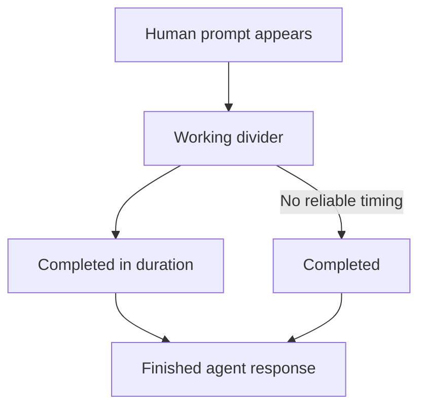
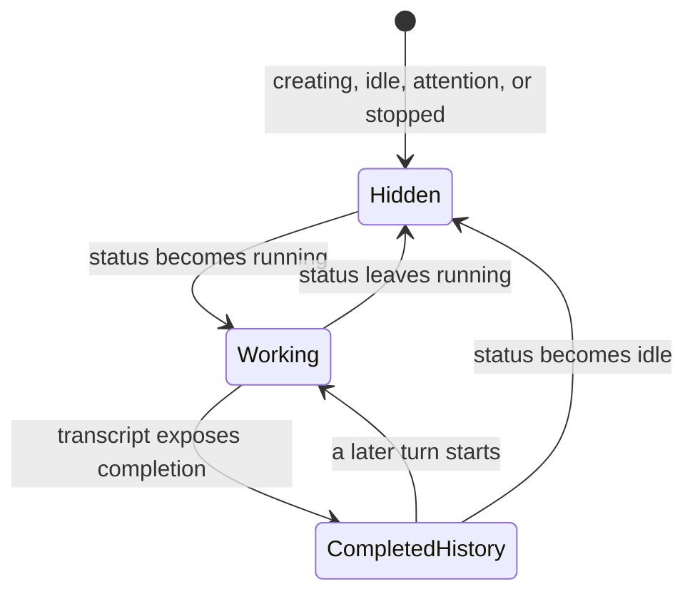

# Live Recap Timeline - Plan

## Goal Capsule

- **Objective:** Make Recap a trustworthy default view of a live managed session by showing the human side of the conversation, unmistakable work state, and durable turn-completion timing.
- **Product authority:** This contract owns Recap timeline behavior across providers and the Codex-specific human-prompt gap. Terminal behavior and the broader workspace layout remain outside active scope.
- **Open blockers:** None.
- **Execution profile:** Standard behavior change across transcript ingestion, persisted run projection, and Recap rendering. Protect each seam with characterization and integration tests before browser verification.
- **Tail ownership:** LFG owns implementation, review, browser testing, PR creation, and CI watch.

---

## Product Contract

### Summary

Recap becomes a live turn timeline. Human prompts appear immediately, a timeline divider shows that the agent is working, and that divider becomes a permanent completion event before the finished response.

### Problem Frame

New sessions can open on an empty Recap while the agent is already working, leaving a black pane that looks broken. The workspace header and prompt composer carry status hints, but the conversation area itself gives no explanation for the absence of an answer.

Codex compounds the ambiguity because its current human-prompt records are not represented in Recap even though completed agent responses are. The result is an agent-only history that omits the instructions driving each turn and cannot explain what the current work is responding to.

### Actors

- A1. The operator who starts, prompts, monitors, and revisits managed sessions through Recap.
- A2. The managed agent whose provider transcript supplies human turns, lifecycle evidence, and completed responses.

### Key Decisions

- **Keep Recap as the default session view.** (session-settled: user-directed — chosen over opening new sessions in Terminal: Recap should become useful enough that the operator does not need raw terminal output to understand a new session.) Governs R1.
- **Represent active work as a timeline divider.** (session-settled: user-directed — chosen over a pending-response placeholder and a sticky banner: work state belongs in the chronology of the turn.) Governs R4, R5.
- **Preserve completion as a historical event.** (session-settled: user-directed — chosen over removing the divider or moving duration onto the response: the timeline should retain when each turn finished.) Governs R6, R7.
- **Use provider-neutral lifecycle behavior with provider-specific prompt coverage.** (session-settled: user-approved — chosen over limiting the whole improvement to Codex: every Recap needs clear work state, while only Codex needs the identified prompt repair.) Governs R2, R4, R8.
- **Make replay idempotent.** (session-settled: user-approved — chosen over a narrow append-only change: permanent timeline events must not multiply across service or browser restarts.) Governs R9.

### Requirements

**Conversation completeness**

- R1. A newly opened managed session keeps Recap as its initial session view unless the operator explicitly selects Terminal.
- R2. A human-authored prompt appears in Recap as soon as the provider exposes it, without waiting for the agent to finish or for the browser to refresh.
- R3. Recap preserves human prompts and completed agent responses in chronological turn order while excluding host instructions, environment context, private reasoning, and tool payloads.

**Turn lifecycle**

- R4. While a turn is active, Recap places a live working divider after that turn's human prompt.
- R5. The working divider is visually distinct from both conversation messages and the workspace header status, and remains understandable when it is the only content in Recap.
- R6. When the turn completes, its working divider becomes a permanent completion event and the finished agent response follows it.
- R7. A completion event shows the elapsed turn duration when the provider exposes reliable start and completion times; otherwise it says only that the turn completed.
- R8. Working and completion events follow the managed session lifecycle for every transcript-backed provider and never claim active work while the session is idle, waiting for attention, or stopped.

**Integrity and compatibility**

- R9. Re-reading, reconnecting, or restarting against the same transcript does not duplicate human prompts, completion events, or agent responses in Recap.
- R10. Codex Recap recognizes supported historical and current human-prompt record shapes without changing which internal or non-human records are excluded.
- R11. Existing Terminal behavior and completed-response rendering remain unchanged except where necessary to place the new timeline events in order.

The selected timeline shape is:



### Key Flows

- F1. New-session turn
  - **Trigger:** A1 starts a managed session with an initial prompt.
  - **Actors:** A1, A2
  - **Steps:** Recap shows the prompt; a working divider follows it; completion changes the divider into a historical event; the completed response appears after the event.
  - **Outcome:** A1 can understand what the new session is doing without opening Terminal or refreshing the browser.
  - **Covered by:** R1-R8.
- F2. Follow-up turn
  - **Trigger:** A1 submits another prompt to an existing session.
  - **Actors:** A1, A2
  - **Steps:** The new prompt is appended after prior turns and receives its own working, completion, and response sequence.
  - **Outcome:** Recap remains a readable multi-turn conversation rather than an agent-only answer list.
  - **Covered by:** R2-R8.
- F3. Timeline rehydration
  - **Trigger:** The browser reconnects or the standalone backend restarts while a transcript already contains one or more turns.
  - **Actors:** A1, A2
  - **Steps:** Recap reconstructs the known timeline, identifies any active turn, and coalesces replayed records with their existing logical events.
  - **Outcome:** Each prompt, completion event, and response appears once with correct current work state.
  - **Covered by:** R8-R10.

### Acceptance Examples

- AE1. **Covers R1, R2, R4, R5.** Given a new Codex session starts with a human prompt, when Recap first renders before any response completes, then the prompt and a working divider are visible without a refresh.
- AE2. **Covers R3, R10.** Given a Codex rollout contains human prompts alongside developer instructions, environment context, and tool records, when Recap reads it, then only the human-authored prompts appear as user messages.
- AE3. **Covers R6, R7.** Given a working turn has reliable start and completion times, when the agent finishes, then the divider remains between the prompt and response as a completion event with elapsed duration.
- AE4. **Covers R7.** Given a turn completes without reliable start timing, when Recap records completion, then the event says the turn completed and does not invent a duration.
- AE5. **Covers R8.** Given a session needs attention or becomes idle without an active turn, when Recap renders, then it does not show a working divider.
- AE6. **Covers R9.** Given Recap has already stored a complete turn, when the same transcript is replayed after a backend restart, then the prompt, completion event, and response still appear exactly once.
- AE7. **Covers R11.** Given an operator switches from Recap to Terminal and back, when both views render, then Terminal behavior is unchanged and the Recap timeline retains its place and entries.

### Scope Boundaries

- Streaming partial assistant responses, private reasoning, and tool-by-tool activity are not part of Recap.
- Changing Terminal startup, ttyd behavior, terminal resizing, or the Recap/Terminal toggle layout is not part of this work.
- Recap remains a derived session history rather than an agent-authored status surface.

### Dependencies and Assumptions

- Transcript-backed providers expose enough lifecycle evidence to distinguish an active turn from idle or attention states.
- Duration is optional evidence, not a prerequisite for a trustworthy completion event.
- Provider-specific transcript differences may require separate ingestion rules while preserving one user-facing timeline contract.

### Sources and Research

- `src/components/PromptComposer/PromptComposer.tsx` — current Recap message rendering, status-message presentation, and composer status hints.
- `src/components/RunWorkspaceWidget/RunWorkspaceHeader.tsx` — provider-neutral managed-session status presentation.
- `src/server/sessions/codex-transcript.ts` — current Codex recap extraction and rollout lifecycle evidence.
- `src/server/providers/lifecycle.ts` and `src/server/sessions/status-watcher.ts` — provider transcript capabilities and recap polling lifecycle.
- `src/server/capability-fixtures/__tests__/codex-rollout.test.ts` — frozen Codex rollout coverage and current recap-parser expectations.

**Product Contract preservation:** Product Contract unchanged.

---

## Planning Contract

### Key Technical Decisions

- KTD1. **Normalize only user-visible conversation records.** Codex recap parsing accepts historical `event_msg/user_message` records and current `response_item` messages with `role: user`, extracts only text input blocks, and rejects known host-owned wrappers such as `environment_context`. Developer messages, reasoning, tool calls, tool outputs, and partial assistant messages remain outside Recap. This extends the existing final-response-only parser instead of introducing a second Codex history reader. Governs R2, R3, R10.
- KTD2. **Poll recap independently of idle transitions without publishing partial answers.** (session-settled: user-approved — chosen over limiting the whole improvement to Codex: every Recap needs clear work state, while only Codex needs the identified prompt repair.) The shared status watcher asks every transcript adapter for incremental recap entries whenever it has a live transcript, including while the session is running, and supplies the observed lifecycle state. Provider adapters emit human prompts immediately, retain per-session turn assembly across polls, and publish completion plus the final agent response only when native lifecycle evidence closes the turn. Governs R2-R4, R8.
- KTD3. **Split transient activity from durable history.** The renderer derives the live working divider from the managed session's current `running` state. Provider parsers persist a structured completion entry immediately before the final agent response. This prevents a restart from reviving a stale working event while retaining completion history. Governs R4-R8.
- KTD4. **Use stable source identities plus a store-level idempotency guard.** (session-settled: user-approved — chosen over a narrow append-only change: permanent timeline events must not multiply across service or browser restarts.) New prompt, completion, and response entries derive stable IDs from native record or turn identity, with deterministic fallback for historical formats. The document store rejects repeated IDs and coalesces exact legacy semantic duplicates during load and append while preserving the first occurrence and chronology. Governs R9, R10.
- KTD5. **Make Recap the unconditional initial session tab.** (session-settled: user-directed — chosen over opening new sessions in Terminal: Recap should become useful enough that the operator does not need raw terminal output to understand a new session.) A mounted Run Workspace starts on Recap whether or not its ttyd port is already available; explicit operator tab changes remain local UI state. Governs R1, R11.

### High-Level Technical Design

The transcript adapters own durable conversation facts. The watcher owns when those facts are requested. The renderer combines persisted facts with the current run status to produce the live timeline.

```mermaid
sequenceDiagram
  participant T as Provider transcript
  participant A as Transcript adapter
  participant W as Status watcher
  participant S as Document store
  participant R as Recap renderer
  T->>A: Human prompt record
  W->>A: Incremental recap read while running
  A->>S: Stable user entry
  S-->>R: Persisted recap projection
  W-->>R: Run status = running
  R->>R: Render transient Working divider
  T->>A: Native completion + final response
  A->>S: Stable Completed entry, then agent entry
  W-->>R: Run status = idle
  R->>R: Remove Working; retain Completed history
```

The visible divider follows a small state machine. Durable completion never substitutes for current status, and current status never rewrites history.



### Assumptions

- Managed-session `running` is the authoritative provider-neutral signal for the transient divider; `creating`, `idle`, `needs_attention`, and `stopped` suppress it.
- Provider envelope timestamps are reliable enough to measure a Claude turn from its accepted human prompt to its final assistant response. Codex uses native `duration_ms` or start/completion fields when present.
- A current Codex `response_item` with `role: user` is human-authored unless its text is wholly contained in a recognized host-owned wrapper. Multiple genuine user messages within one native turn remain separate Recap prompts.
- Exact legacy duplicates can be identified from their type, content, timestamp, and status metadata without collapsing distinct turns that merely contain the same text.

### Sequencing

U1 defines the durable entry contract and idempotency boundary. U2 then updates both provider parsers and the shared watcher against that contract. U3 renders the resulting history together with transient lifecycle state and makes Recap the initial view.

---

## Implementation Units

### U1. Define durable timeline entries and replay idempotency

- **Goal:** Give completion events a structured persisted shape and make replayed recap records no-ops across append, reconnect, and restart paths.
- **Requirements:** R6, R7, R9, R11; F3; AE3, AE4, AE6.
- **Dependencies:** None.
- **Files:**
  - `src/domain/types.ts`
  - `src/server/stores/document-store.ts`
  - `src/server/stores/__tests__/document-store-recap.test.ts`
- **Approach:**
  1. Extend status recap entries with explicit completion kind and optional duration metadata while retaining compatibility with existing generic status entries.
  2. Add one recap-normalization helper at the document-store boundary that preserves order, rejects stable-ID repeats, and recognizes exact legacy semantic duplicates.
  3. Apply normalization both when persisted runs load and when new entries append so an existing duplicate history is repaired on restart and future replay does not emit SSE or schedule persistence.
- **Patterns to follow:** The no-op mutator contract and boot-rehydrate correction patterns in `src/server/stores/document-store.ts`; persistence round-trip tests under `src/server/stores/__tests__/`.
- **Test scenarios:**
  1. Covers AE6. Adding the same stable prompt, completion, and agent IDs twice leaves one copy of each and emits no second change.
  2. Loading a persisted run with legacy random IDs but identical type, content, timestamp, and completion metadata keeps the first logical entry once and preserves chronology.
  3. Two identical prompt texts with different timestamps or native identities remain distinct turns.
  4. A completion entry round-trips through document-store persistence with and without duration metadata.
- **Verification:** Store tests prove idempotency, migration-safe load behavior, ordering, and persistence without changing unrelated run data.

### U2. Ingest live prompts and permanent completion events

- **Goal:** Populate the durable turn timeline while providers are active, including current Codex human-message records and provider-specific completion timing.
- **Requirements:** R2-R10; F1-F3; AE1-AE6; KTD1-KTD4.
- **Dependencies:** U1.
- **Files:**
  - `src/server/providers/lifecycle.ts`
  - `src/server/sessions/status-watcher.ts`
  - `src/server/sessions/codex-transcript.ts`
  - `src/server/sessions/transcript-parser.ts`
  - `src/server/capability-fixtures/codex/rollout-current-user-message.jsonl`
  - `src/server/capability-fixtures/index.ts`
  - `src/server/capability-fixtures/__tests__/codex-rollout.test.ts`
  - `src/server/sessions/__tests__/transcript-parser.test.ts`
  - `src/server/sessions/__tests__/status-watcher-provider.test.ts`
- **Execution note:** Start with failing characterization coverage for the current Codex record shape, live-running polling, completion ordering, and replay before changing the parsers.
- **Approach:**
  1. Preserve incomplete JSONL carry and pending per-session turn assembly between incremental reads, and clear both through each adapter's existing offset-reset path.
  2. Parse current Codex user-role message records by native message and turn identity, filter host-owned wrappers, and retain the historical event shape as a fallback without double-emitting a prompt when both representations exist.
  3. Convert native completion evidence into a structured completion entry followed by the existing final agent response. Use reliable native duration first and omit duration rather than infer from invalid or missing timestamps.
  4. Extend the Claude parser to emit human prompts during a running turn while retaining intermediate assistant text and tool-use counts in per-session assembly. When the observed lifecycle becomes idle, emit the same completion shape before the final assistant response and use accepted-human and final-assistant timestamps when valid.
  5. Make the watcher request incremental recap entries whenever a transcript is available, regardless of whether the current status observation changed or is running or idle, and pass the normalized observation into the adapter. Keep provider-specific parsing and status debounce inside existing adapter boundaries.
- **Patterns to follow:** Chunked carry handling in `src/server/sessions/transcript-parser.ts`; provider-owned capabilities in `src/server/providers/lifecycle.ts`; frozen native evidence under `src/server/capability-fixtures/`.
- **Test scenarios:**
  1. Covers AE1 / AE2. A running current-format Codex rollout emits only human `input_text` messages and excludes developer instructions, `environment_context`, reasoning, and tool records before completion.
  2. A rollout containing both historical and current representations of one prompt emits one user entry.
  3. Covers AE3. A Codex `task_complete` with reliable native timing emits `user → completed(duration) → agent` using stable IDs.
  4. Covers AE4. A completion with missing or invalid timing emits `completed` without a duration and still precedes the final response.
  5. A JSONL record split across two polling reads appears exactly once after its newline arrives.
  6. A running Claude turn emits its user prompt but no intermediate assistant text; after idle evidence it emits `completed(duration) → agent`, with all turn tool-use counts attached only to the agent entry.
  7. Covers AE5. The watcher parses new entries while running, but attention, idle, and stopped status semantics are not rewritten by recap polling.
  8. Covers AE6. Resetting parser offsets and replaying an unchanged transcript produces stable logical identities that U1 coalesces.
- **Verification:** Provider fixtures, parser tests, and watcher tests prove live timing, filtering, chronology, optional duration, and replay behavior through the real adapters.

### U3. Render the live Recap timeline and keep Recap as the default

- **Goal:** Make the current turn understandable in Recap before a response exists and preserve completion history without changing Terminal behavior.
- **Requirements:** R1, R4-R8, R11; F1-F3; AE1, AE3-AE5, AE7; KTD3, KTD5.
- **Dependencies:** U1, U2.
- **Files:**
  - `src/components/RunWorkspaceWidget/index.tsx`
  - `src/components/PromptComposer/PromptComposer.tsx`
  - `src/components/RunWorkspaceWidget/__tests__/RunSessionPanel.composer.test.tsx`
  - `src/components/PromptComposer/__tests__/PromptComposer.recapMarkdown.test.tsx`
- **Approach:**
  1. Initialize every Run Workspace on Recap without changing explicit Recap/Terminal switching or terminal mounting behavior.
  2. Render one transient working divider after persisted entries only while the run status is `running`; this also covers the empty-timeline startup state.
  3. Render completed status entries as static timeline history with a non-pulsing completion treatment. Format valid durations compactly and omit the duration suffix when absent.
  4. Keep user and final agent markdown rendering unchanged, preserve auto-scroll behavior as entries or lifecycle state change, and expose stable selectors or accessible text for browser verification.
- **Patterns to follow:** Existing `StatusMessage`, `UserMessage`, and `AgentMessage` presentation in `src/components/PromptComposer/PromptComposer.tsx`; controlled tab state in `src/components/RunWorkspaceWidget/index.tsx`.
- **Test scenarios:**
  1. Covers AE1. An empty running Recap shows a working divider, then shows the human prompt ahead of the same divider when the entry arrives.
  2. Covers AE3. A completion entry with 72 seconds renders as permanent `Completed in 1m 12s` between the prompt and final response without a pulse.
  3. Covers AE4. A completion entry without duration renders `Completed` with no invented time.
  4. Covers AE5. Idle, attention, stopped, and creating sessions do not render the transient working divider.
  5. Covers AE7. A workspace whose ttyd port already exists still initializes on Recap; selecting Terminal renders the same terminal wrapper behavior as before and switching back retains entries.
  6. Existing user and agent markdown cases remain unchanged when completion entries are interleaved.
- **Verification:** Component tests prove tab default, lifecycle visibility, status styling, duration formatting, ordering, and Terminal compatibility; pipeline browser testing confirms the live layout at workspace scale.

---

## Verification Contract

| Gate | Applies to | Command or evidence | Done signal |
|---|---|---|---|
| Codex native-shape characterization | U2 | `npx vitest run src/server/capability-fixtures/__tests__/codex-rollout.test.ts` | Current and historical prompts, filtering, completion ordering, duration, incremental carry, and replay cases pass. |
| Shared parser and watcher behavior | U1, U2 | `npx vitest run src/server/sessions/__tests__/transcript-parser.test.ts src/server/sessions/__tests__/status-watcher-provider.test.ts src/server/stores/__tests__/document-store-recap.test.ts` | Provider-neutral polling and durable idempotency cases pass. |
| Recap component behavior | U3 | `npx vitest run src/components/RunWorkspaceWidget/__tests__/RunSessionPanel.composer.test.tsx src/components/PromptComposer/__tests__/PromptComposer.recapMarkdown.test.tsx` | Working and completed dividers, duration, initial Recap, and Terminal compatibility pass. |
| Static quality | U1-U3 | `npm run typecheck` and `npm run lint` | TypeScript and ESLint finish with no errors. |
| Production build | U1-U3 | `npm run build:all` | Standalone client and server bundles build successfully. |
| Browser behavior | U3 | `ce-test-browser` pipeline evidence for a running and completed session | Recap first paint, live prompt, working divider, completed divider, and Terminal switch are visible without refresh. |

---

## Definition of Done

- U1 is complete when recap entries have a backward-compatible structured completion shape, persisted legacy duplicates are normalized, and repeated stable entries are no-ops.
- U2 is complete when current and historical Codex prompts appear during active work, internal records stay excluded, Claude and Codex emit ordered completion history, and parser replay is stable.
- U3 is complete when Recap is the initial tab, live work is visible only for running sessions, completed events render permanently with optional duration, and Terminal behavior is unchanged.
- Every acceptance example is represented by an automated test or the browser evidence named in the Verification Contract.
- Targeted tests, typecheck, lint, production build, and pipeline browser verification pass.
- The final diff contains no abandoned parser branches, duplicate timeline mechanisms, stale fixtures, debug logging, or unrelated ttyd/layout changes.
