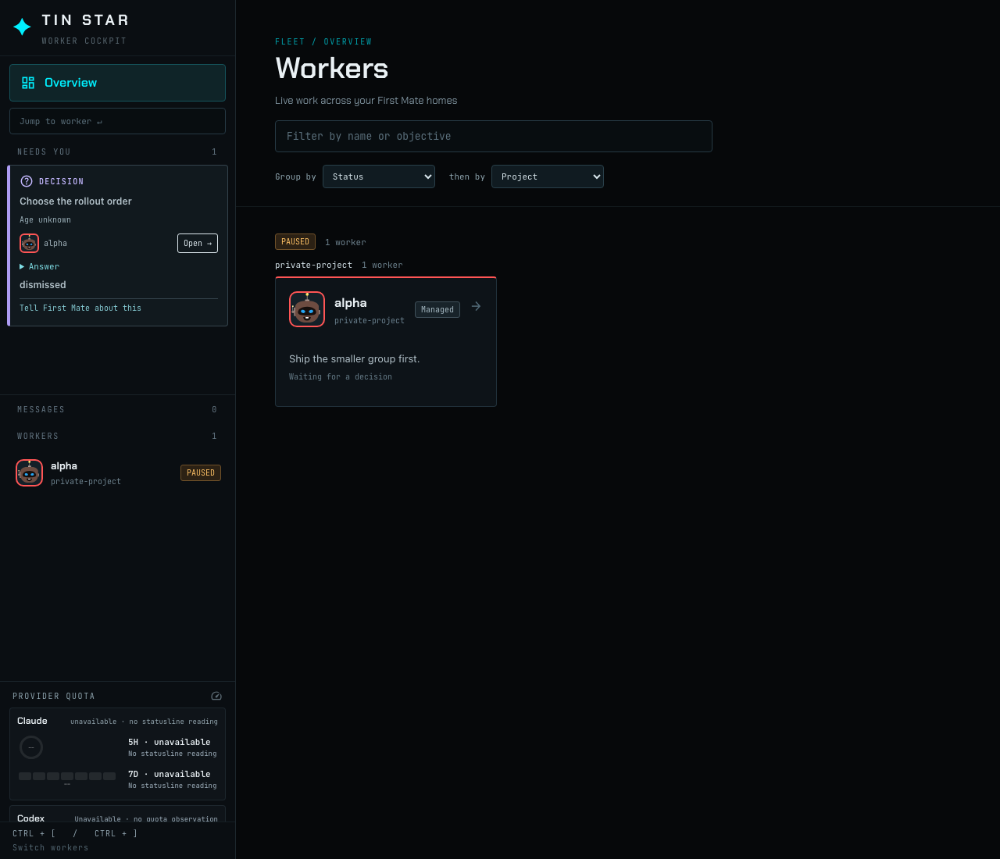

# Decision dismiss

An isolated home shows one open decision, Choose the rollout order, on worker alpha. The card has a horizontal slide control.

The same control stays on the card when the rail is narrow.

Sliding a keyed decision to the end runs that home's `fm-send.sh --resolve-key`. The card reads dismissed as soon as the script exits 0. No inbox note is saved. A captain-held backlog task is answered with `fm-captain-hold.sh` instead, with `--release` when the hold is on a live worker's own task. A blocked card has no slider. If the script fails, the card shows the script's error and the slider stays for a retry.

An unclassified decision still sends one inbox answer. The card reads dismissing while that answer is open, and the note is saved under Messages.

When that decision leaves the snapshot, the card leaves the rail. The worker remains. The dismiss answer is then marked done and leaves Messages.

