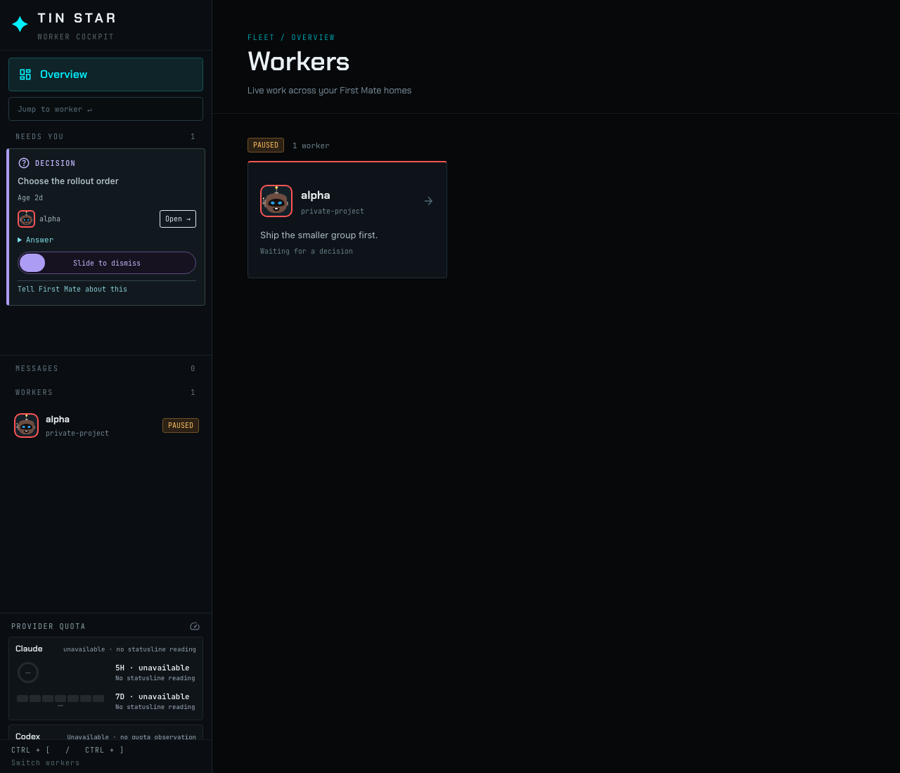
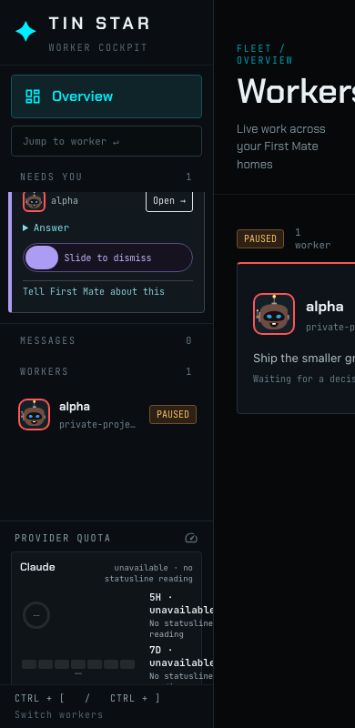
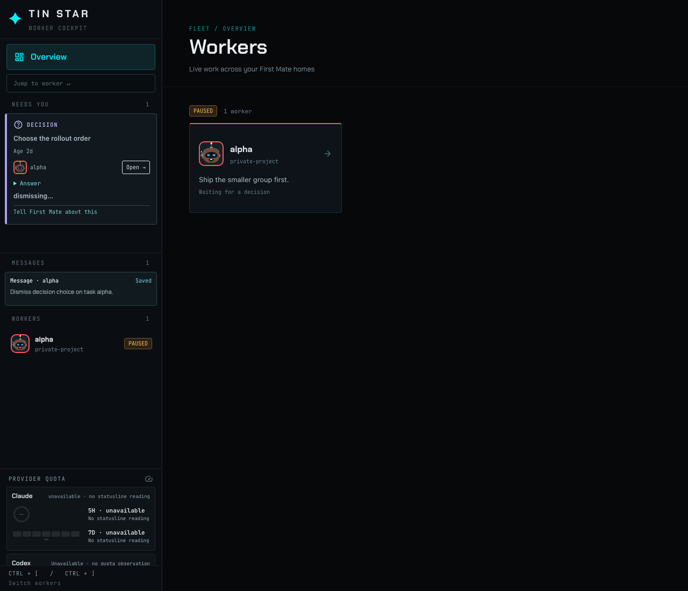
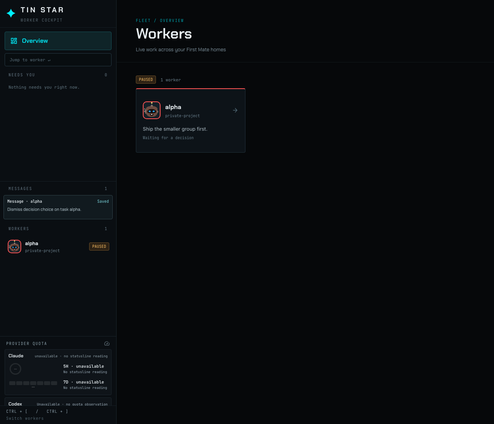

# Decision dismiss

An isolated home shows one open decision, Choose the rollout order, on worker alpha. The card has a horizontal slide control.

The same control stays on the card when the rail is narrow.

Sliding the control to the end sends one inbox note naming task alpha and decision choice. The card reads dismissing, and the note is saved under Messages.

When that decision leaves the snapshot, the card leaves the rail. The worker remains, and the saved note stays under Messages.

