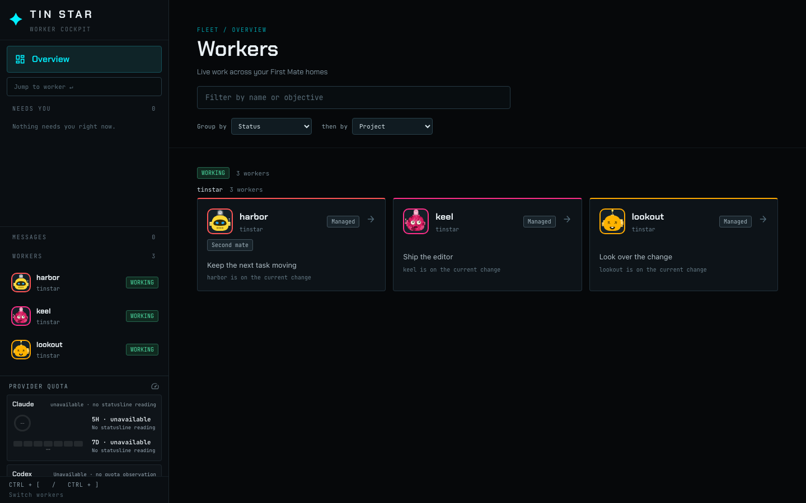
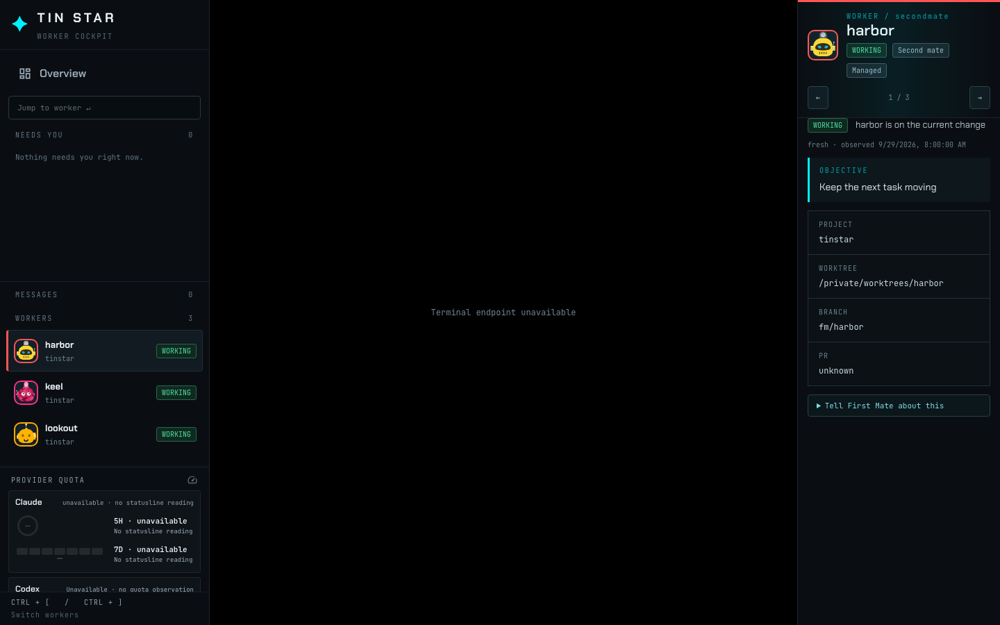
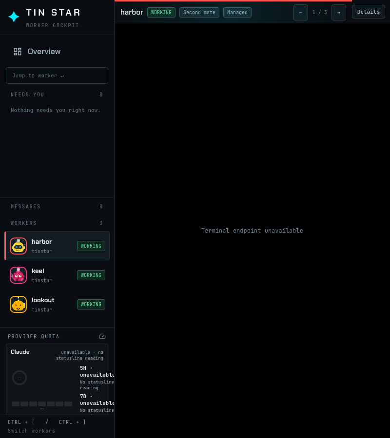

# Second mate badge

An isolated home shows three workers in one project. Harbor's snapshot kind is `secondmate`. Keel is a ship worker and lookout is a scout. Only harbor has a Second mate badge on its overview card. Grouping is unchanged.

The same badge is in the detail rail, with the state chip and the Direct or Managed control.

When the detail rail collapses to a slim header, the badge stays on that line while the name still fits.

`e2e/cockpit-mate-badge.spec.ts` runs this home on a private tmux socket. Below 760px the header line cannot hold the badge with the name, state, and Direct control, so the badge is shown in the details body instead.
