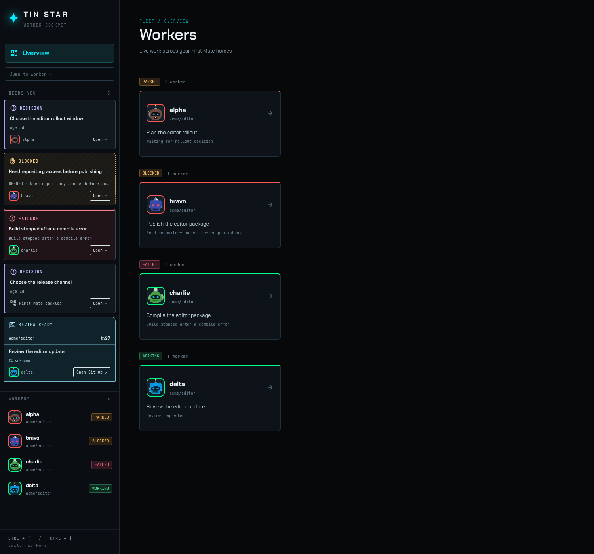
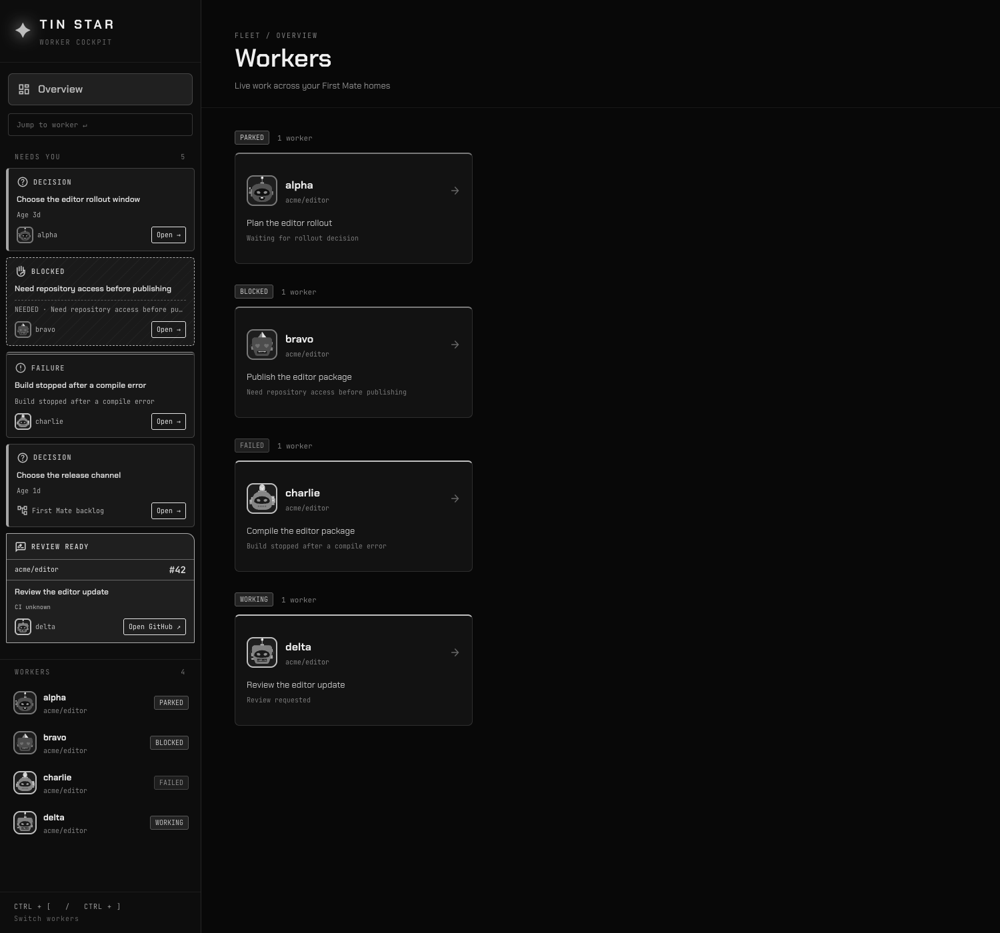
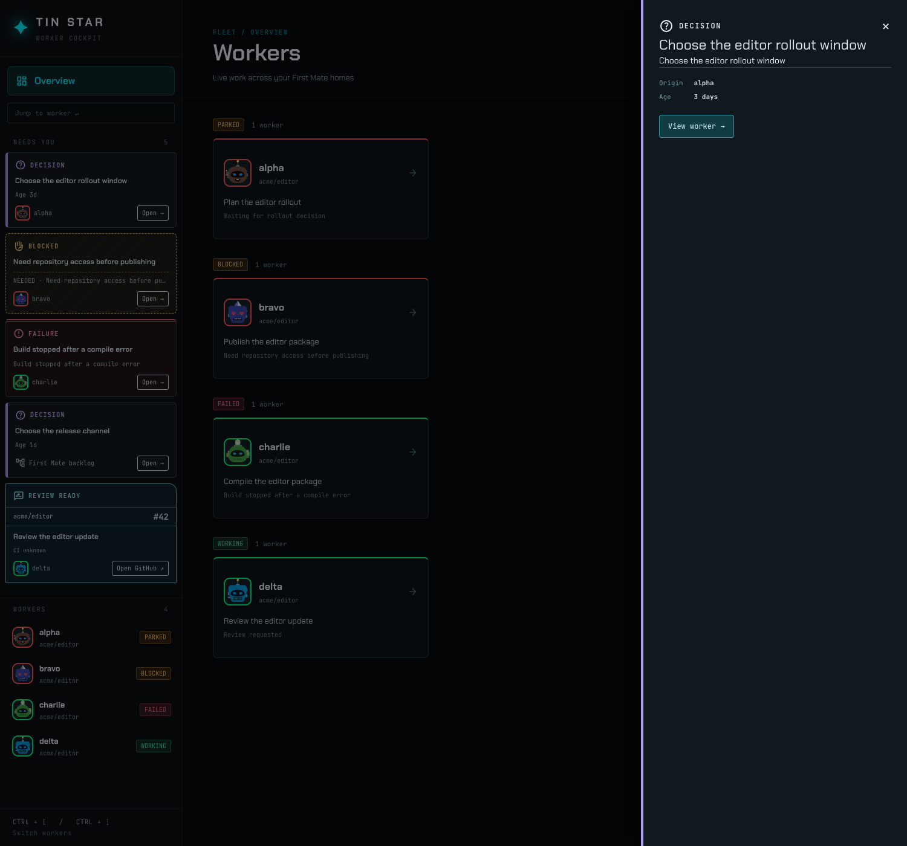
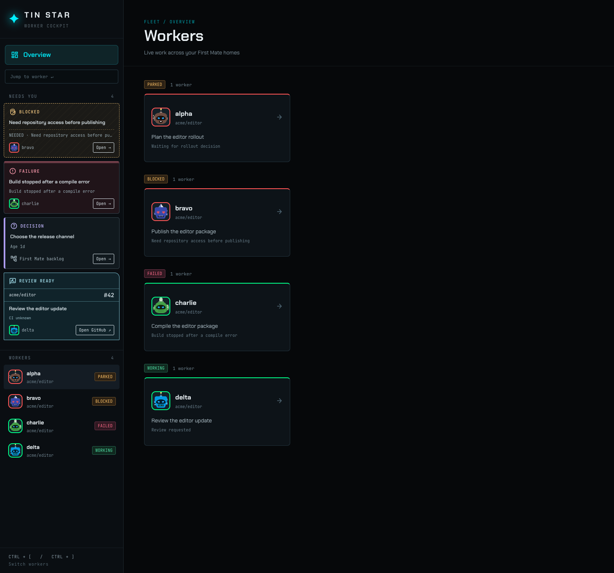

# Needs You visual proof

The isolated First Mate home presents two decisions, one blocker, one failure, and one open pull request. A keyed decision and its matching backlog hold appear as one card.

The four card types remain distinct without colour: their labels, icons, borders, and review reference layout differ.

Opening a decision shows its detail and origin without changing the source. After that call was closed in the isolated home, it left the rail on the next refresh.

The review card's link opened `https://github.com/acme/editor/pull/42` in a new tab.

At the live observation on 2026-09-28 at 17:35 EDT, the read-only server showed five keyed decisions, once each. The live home had no current captain holds, blocked workers, failed workers, or unmerged pull requests at that point. Three PR URLs retained by the snapshot were confirmed merged on GitHub and did not create review cards. An independent blind screenshot inspection found the live decision cards readable and the four isolated card types distinguishable in grayscale. The live screenshot is held outside this public repository.
