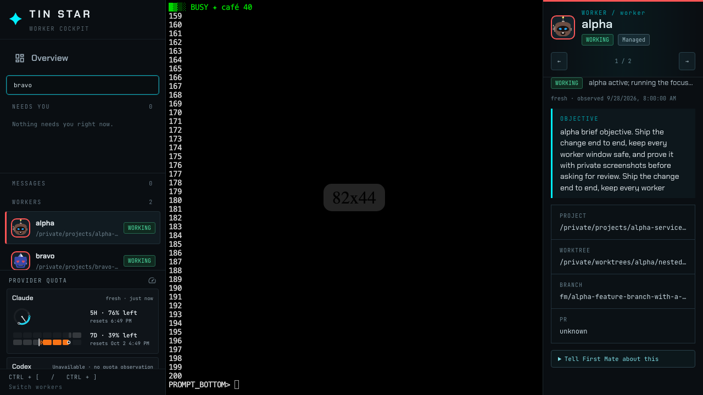
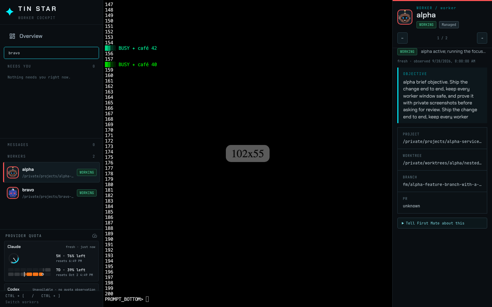
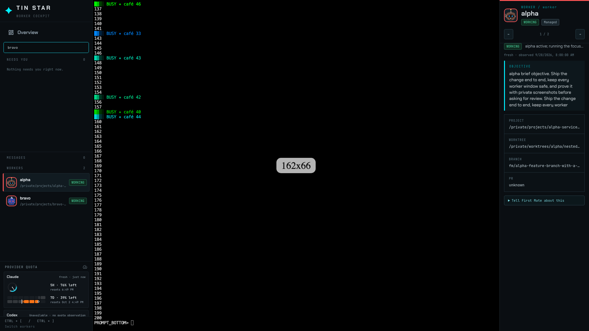
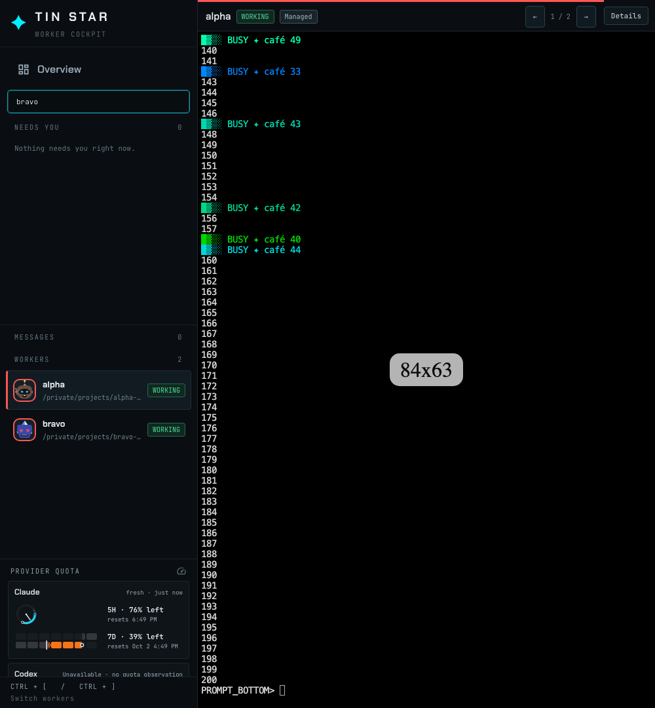
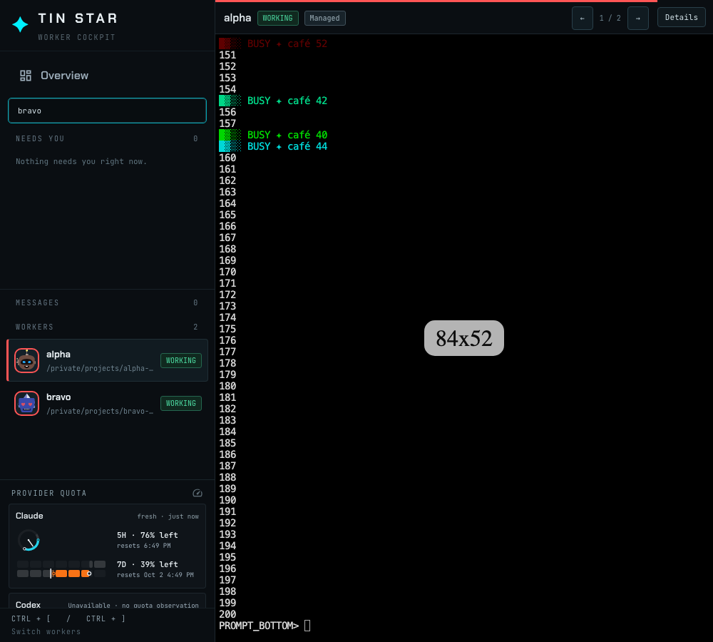
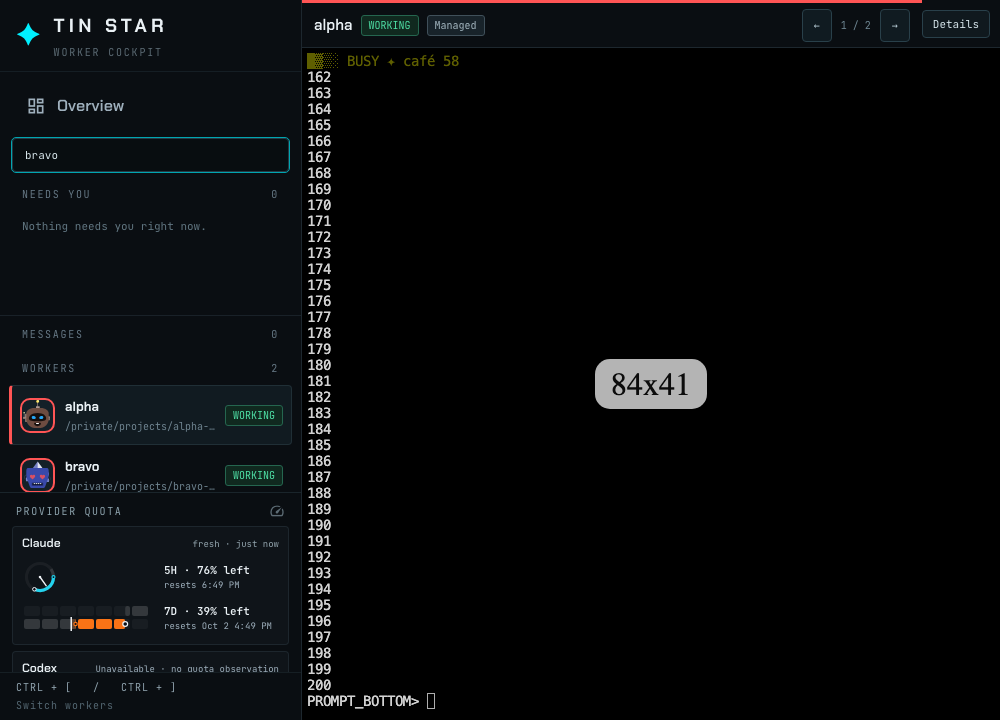

# Terminal fit

Isolated home. The worker terminal keeps a 14px font and lets xterm fit the stage, so the columns and rows follow the space on screen and the linked tmux window follows that grid. The detail rail stays beside the terminal above 1200px and collapses to a slim header below that.

`e2e/cockpit-regression.spec.ts` checks the same edges, including these sizes, on a private tmux socket. The font stays 14px, the grid fills the stage, and the tmux window matches the grid.
