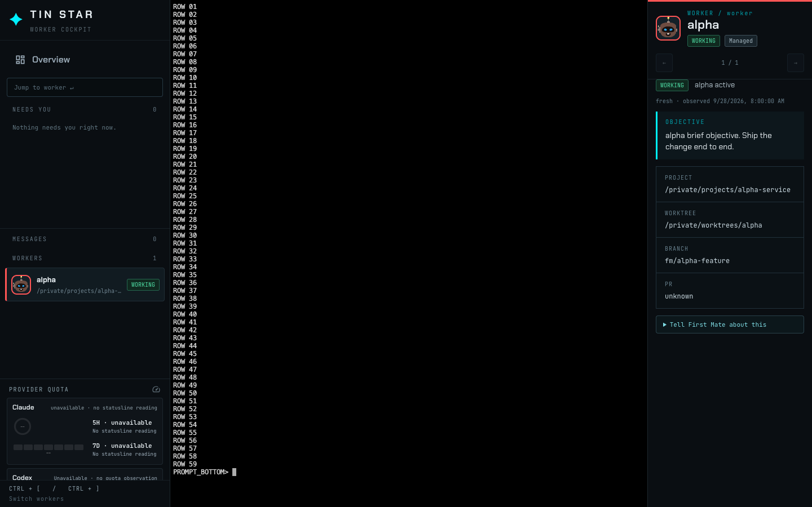
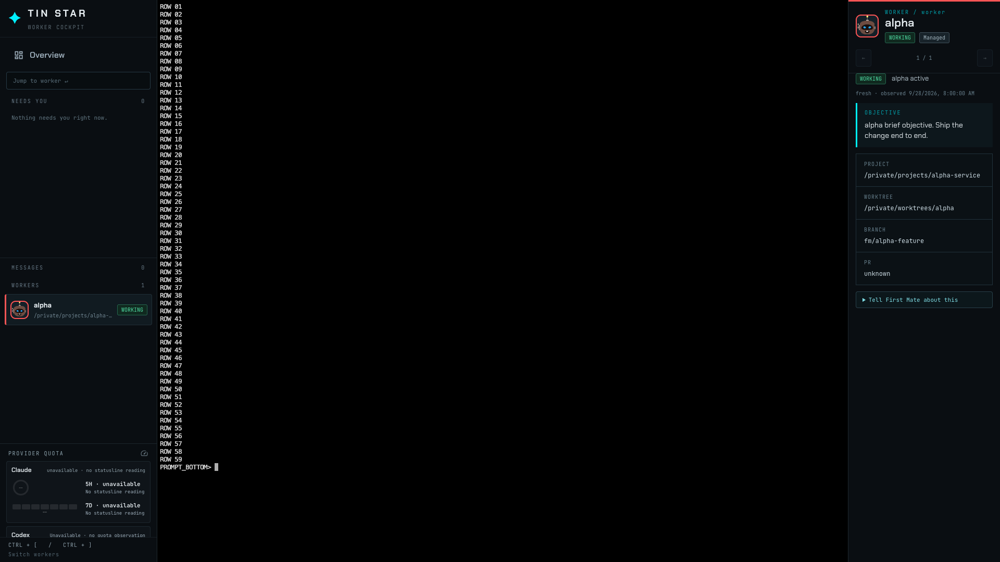
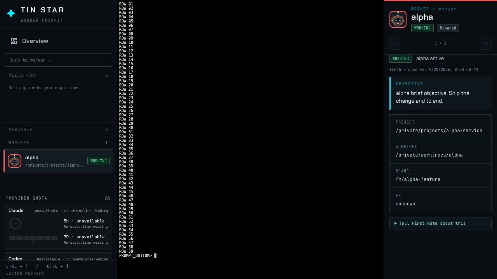
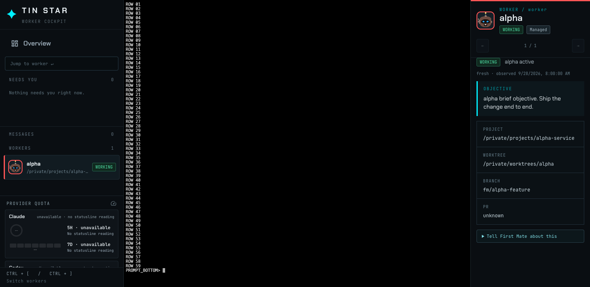
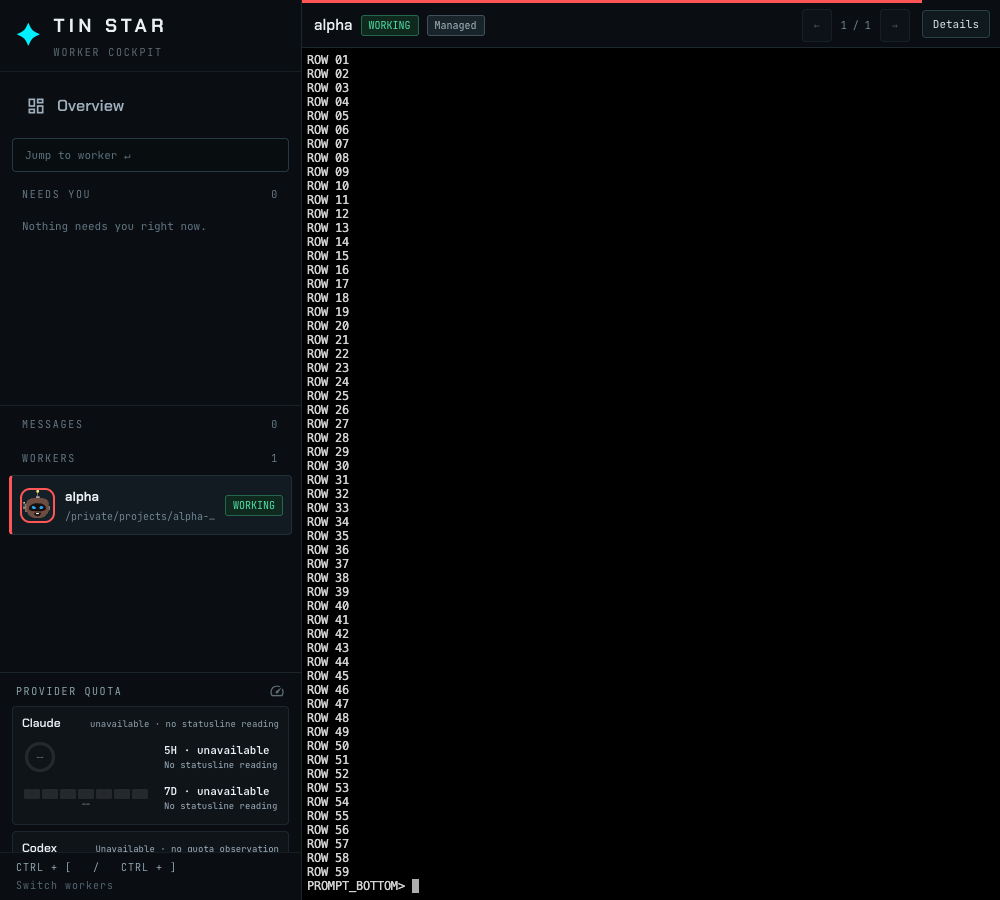
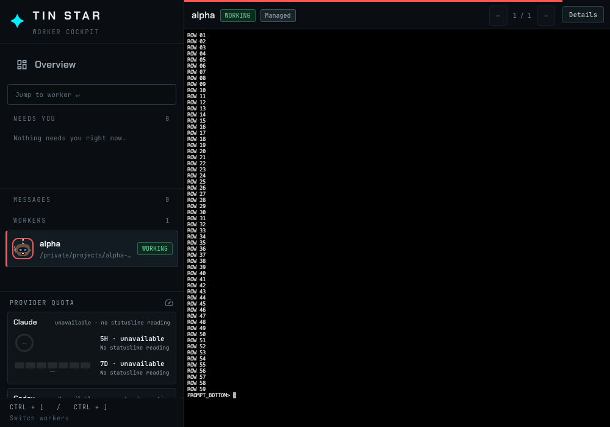

# Terminal height

Isolated home, one worker, a 220 by 60 window. The cockpit keeps that grid and lowers the font when the stage is shorter than the grid, so row 01 and the bottom prompt are both on screen. The detail rail stays beside the terminal above 1200px and collapses to a slim header below that.

`e2e/cockpit-regression.spec.ts` checks the same edges, including these sizes, on a private tmux socket.
