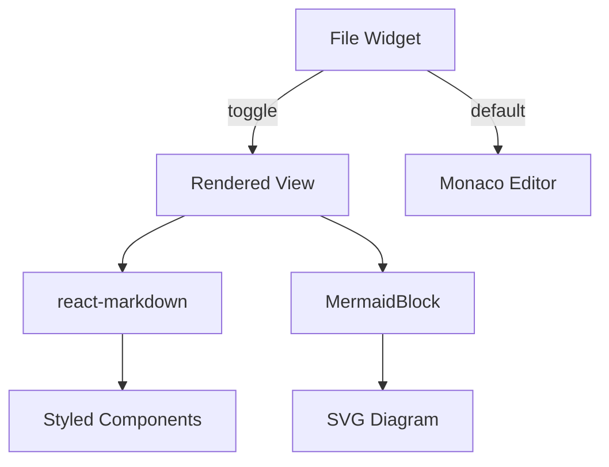
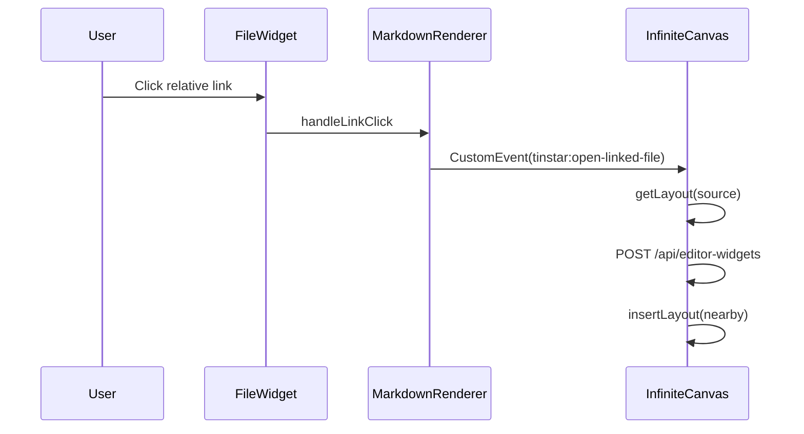

# Markdown Renderer Test

This file tests the rendered markdown view in the file editor widget.

## Features

### Text Formatting

Regular paragraph with **bold**, *italic*, and `inline code`.

### Links

- External: [Anthropic](https://anthropic.com)
- Relative markdown: [Design Spec](superpowers/specs/2026-04-17-markdown-renderer-design.md)
- Anchor: [Jump to Mermaid](#mermaid-diagram)

### Task List

- [x] Install dependencies
- [x] Create MarkdownRenderer
- [x] Add MermaidBlock
- [ ] Wire into FileEditorWidget
- [ ] Smoke test

### Table

| Feature | Status | Notes |
|---------|--------|-------|
| Headings | Done | Chakra Petch font |
| Code blocks | Done | Surface panel bg |
| Mermaid | Done | Lazy loaded |

### Blockquote

> This is a blockquote with primary border styling.

### Code Block

```typescript
function greet(name: string): string {
  return `Hello, ${name}!`
}
```

### Mermaid Diagram



### Sequence Diagram


